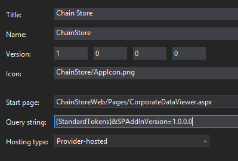
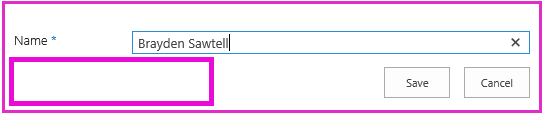
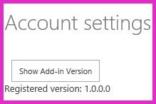

# Add first-run logic to the provider-hosted add-in

This is the eighth in a series of articles about the basics of developing provider-hosted SharePoint Add-ins. You should first be familiar with [SharePoint Add-ins](sharepoint-add-ins.md) and the previous articles in this series, which you can find at [Get started creating provider-hosted SharePoint Add-ins](get-started-creating-provider-hosted-sharepoint-add-ins.md#SP15createprovider_nextsteps). 

> [!NOTE]
> If you have been working through this series about provider-hosted add-ins, you have a Visual Studio solution that you can use to continue with this topic. You can also download the repository at [SharePoint_Provider-hosted_Add-Ins_Tutorials](https://github.com/OfficeDev/SharePoint_Provider-hosted_Add-ins_Tutorials) and open the BeforeFirstRunLogic.sln file.

In this article, you add code to the start page of the Chain Store SharePoint Add-in that checks to see if the current instance of the add-in is being run for the first time. If it is the first time, your code deploys the **Local Employees** list and the custom ribbon button.

## Create the basic class for deploying SharePoint components

> [!NOTE]
> The settings for Startup Projects in Visual Studio tend to revert to defaults whenever the solution is reopened. Always take these steps immediately after reopening the sample solution in this series of articles: 
> 1. Right-click the solution node at the top of **Solution Explorer**, and then select **Set startup projects**.  
> 2. Ensure that all three projects are set to **Start** in the **Action** column.

1. In the **ChainStoreWeb** project in **Solution Explorer**, right-click the **Utilities** folder, and then select **Add** > **Existing Item**.
    
2. In **File Explorer**, go to the solution folder, the **ChainStoreWeb** folder, and then open the **Utilities** folder.

3. Select SharePointComponentDeployer.cs, and then select **Add**.

4. Open the file SharePointComponentDeployer.cs. It has a static class and two static methods that get and set the add-in's version in the **Tenants** table of the corporate database. We won't discuss these methods because this series of articles is not intended to teach ASP.NET or SQL Server/Azure programming.

5. Add the following **using** statements to the top of the file.
    
    ```csharp
      using System.Web;
      using System.Linq;
      using System.Collections.Generic;
      using Microsoft.SharePoint.Client;
    ```

6. At the top of the `SharePointComponentDeployer` class, add the following two static fields. Both of these are initialized in the **Page_Load** method of the add-in's start page (you add that code in a later step). 

    ```csharp
      internal static SharePointContext sPContext;
      internal static Version localVersion;
    ```

   Note the following about this code:
   
   - The first field holds the `SharePointContext` object that is needed to make CRUD operations on SharePoint. 
   
   - The second field holds the version number of the add-in that is installed on the host web. This value is initially different from the default value (**0000.0000.0000.0000**) that is recorded in the corporate **Tenants** table when the installation handler registers the tenant. For example, the first version of the add-in will be **1.0.0.0**.

7. Create the following static property to hold the version of the add-in that is currently recorded in the corporate **Tenants** table. It uses the two methods that were already in the file to get and set this value.
    
    ```csharp
      internal static Version RemoteTenantVersion
    {
        get
        {
            return GetTenantVersion();
        }
        set
        {
            SetTenantVersion(value);
        }
    }
    ```

8. Now create the following `IsDeployed` property. 

    ```csharp
      public static bool IsDeployed
    {
        get
        {
            if (RemoteTenantVersion < localVersion)
                return false; 
            else
                return true; 
        }
    }
    ```

   Note the following about this code:

   - The **Page_Load** method of the add-in's start page uses the value of this property to determine whether the add-in is running for the first time. A **false** value signals that the add-in has not run before on the current host web, so its components need to be deployed.

   - The criterion is whether the version number registered in the **Tenants** table is lower than the version actually installed. The first time the add-in runs, it is lower. Code that you write in a later step sets the version in the **Tenants** table to the same version as is actually installed, so when the add-in runs again, `IsDeployed` returns **true** and the deployment logic does not execute again.
 
9. Add the following method to the `SharePointComponentDeployer` class. Note that the last thing the method does is update the registered tenant version in the corporate database (**0000.0000.0000.0000**) to match the actual version of the add-in on the host web (**1.0.0.0**). You will complete this method in a later step.
    
    ```csharp
      internal static void DeployChainStoreComponentsToHostWeb(HttpRequest request)
    {
        // TODO4: Deployment code goes here.

        RemoteTenantVersion = localVersion;
    }
    ```

> [!NOTE]
> You may wonder now why the add-in uses version numbers and a "less than" test to determine the answer to a simple yes/no question: "Is the add-in running for the first time?" We could just as well have a simple string field in the **Tenants** table that is set to *not-yet-run* in the installation handler, and then changed to *already-run-once* by the first-run logic after the SharePoint components are deployed. 

> For the Chain Store add-in, a simple test would work. However, it is generally a good practice to use version numbers because a production add-in is likely to be updated-in-place in the future; that is, updated after it is already installed. When that time comes, your add-in logic needs to be sensitive to more than the two possibilities *not-yet-run* and *already-run-once*. 

> Suppose, for example, that you want to add an additional list to the host web in the upgrade from version 1.0.0.0 to 2.0.0.0. You could do this in an update event handler, or in first-run-after-update logic. Either way, your deployment logic needs to deploy new components, but it also needs to avoid trying to redeploy components that were deployed in a previous version of the add-in. A version number of 1.0.0.0 signals that the components of version 1.0.0.0 have been deployed, but that the first-run-after-update logic has not yet run.

## Add the basic startup logic

The SharePoint host web needs to tell the remote web application what version of the add-in it has installed. We use a query parameter to do this. 

1. Open the AppManifest.xml file in the **ChainStore** project. In the designer, you see the placeholder *{StandardTokens}* as the value of the **Query string** box. Add the string `"&amp;SPAddInVersion=1.0.0.0"` to the end. 

   The manifest designer should look similar to the following. *Notice that the version number you pass in the query string has to match the value in the __Version__ box of the designer.* If you ever update the add-in, one of your tasks is to raise these two values and keep them the same.

   *Figure 1. General tab of the manifest designer*

   

2. Open the CorporateDataViewer.aspx.cs file and add the following code to the **Page_Load** method, just under the line that initializes the `spContext` object. 

    ```csharp
     SharePointComponentDeployer.sPContext = spContext;
     SharePointComponentDeployer.localVersion = new Version(Request.QueryString["SPAddInVersion"]);

     if (!SharePointComponentDeployer.IsDeployed)
     {
         SharePointComponentDeployer.DeployChainStoreComponentsToHostWeb(Request);
     }
    ```

   Note the following about this code:

   - It begins by setting the two static fields in the static `SharePointComponentDeployer` class. It passes the **SharePointContext** object because the code in the `SharePointComponentDeployer` calls into SharePoint, and it uses the query parameter that you added to set the `localVersion` property.  

   - It does nothing if `IsDeployed` is true; that is, if the first-run logic has already run. Otherwise, it calls the deployment method and passes the ASP.NET **Request** object.

## Programmatically deploy a SharePoint list

1. In the SharePointComponentDeployer.cs file, replace the `TODO4` with the following line (you create this method in the next step).
    
    ```csharp
      CreateLocalEmployeesList();
    ```

2. Add the following method to the `SharePointComponentDeployer` class. 

    ```csharp
      private static void CreateLocalEmployeesList()
    {
        using (var clientContext = sPContext.CreateUserClientContextForSPHost())
        {
            var query = from list in clientContext.Web.Lists
                        where list.Title == "Local Employees"
                        select list;
            IEnumerable<List> matchingLists = clientContext.LoadQuery(query);
            clientContext.ExecuteQuery();

            if (matchingLists.Count() == 0)
            {
               // TODO5: Create the list 

               // TODO6: Rename the Title field on the list 

               // TODO7: Add "Added to Corporate DB" field to the list 

               clientContext.ExecuteQuery();
            }
        }
    }
    ```

   Note the following about this code:

   - It has two calls of **ExecuteQuery**. The first is needed to determine if the list already exists. The second does the work of creating the list.

   - The **ClientContext.LoadQuery** method is similar to the **ClientContext.Load** method except that instead of bringing an entity such as a list down to the client, it brings down the enumerable results of a query.

3. Replace `TODO5` with the following code. 

    ```csharp
      ListCreationInformation listInfo = new ListCreationInformation();
      listInfo.Title = "Local Employees";
      listInfo.TemplateType = (int)ListTemplateType.GenericList;
      listInfo.Url = "Lists/Local Employees";
      List localEmployeesList = clientContext.Web.Lists.Add(listInfo);
    ```

   Note the following about this code:

   - The **ListCreationInformation** class is similar to the **ListItemCreationInformation** class that you saw in an earlier article in this series. It is a lightweight class more suitable for sending information from the web application to SharePoint than the full **List** class.

   - There are many types of list templates, such as the Tasks type for a "to do" list and the Events type for a calendar. The **Local Employees** list is based on the simplest: the Generic type.

   - The **ListCreationInformation.Url** property holds the URL of the list *relative* to the host web. By specifying `"Lists/LocalEmployees"`, the code is setting the full URL of the list to `https://{SharePointDomain}/hongkong/_layouts/15/start.aspx#/Lists/Local%20Employees`.

4. Replace `TODO6` with the following code, which changes the public name of the "Title" field (column) from "Title" to "Name." This is what you did on the **List Settings** page when you created the list manually.
    
    ```csharp
      Field field = localEmployeesList.Fields.GetByInternalNameOrTitle("Title");
      field.Title = "Name";
      field.Update();
    ```

5. You also manually created a field named **Added to Corporate DB**. To do that programmatically, add the following code in place of  `TODO7`. 

    ```csharp
          localEmployeesList.Fields.AddFieldAsXml("<Field DisplayName='Added to Corporate DB'"
                                                 +"Type='Boolean'>"
                                                 + "<Default>FALSE</Default></Field>",
                                                 true,
                                                 AddFieldOptions.DefaultValue);
    ```

   Note the following about this code:

   - The key properties of the field are specified with an XML blob. This is a legacy of SharePoint's architecture, where websites, lists, fields, content types, and most other kinds of SharePoint components are defined as XML. In this case, we specify the display name, data type, and default value of the field.

   - The second parameter determines whether the field is visible in the default view of the list. We set it to **true**. 

   - The third parameter determines what content types the field is added to. Passing **DefaultValue** means that it is only added to the list's default content type.


6. Recall that the **Added to Corporate DB** is **No** (that is, false) by default, but the custom ribbon button in the add-in sets it to **Yes** after it adds the employee to the corporate database. This system works best only if users cannot manually change the value of the field. To ensure that they don't, make the field invisible in the forms for creating and editing items on the **Local Employees** list. We do this by adding two more attributes to the first parameter, as shown in the following code.
    
     ```csharp
       localEmployeesList.Fields.AddFieldAsXml("<Field DisplayName='Added to Corporate DB'" 
                                              + " Type='Boolean'"  
                                              + " ShowInEditForm='FALSE' "
                                              + " ShowInNewForm='FALSE'>"
                                              + "<Default>FALSE</Default></Field>",
                                              true,
                                              AddFieldOptions.DefaultValue);
     ```
     
     
7. The entire `CreateLocalEmployeesList` should now look like the following.

    ```csharp
           private static void CreateLocalEmployeesList()
         {
             using (var clientContext = sPContext.CreateUserClientContextForSPHost())
             {
                 var query = from list in clientContext.Web.Lists
                             where list.Title == "Local Employees"
                             select list;
                 IEnumerable<List> matchingLists = clientContext.LoadQuery(query);
                 clientContext.ExecuteQuery();

                 if (matchingLists.Count() == 0)
                 {
                     ListCreationInformation listInfo = new ListCreationInformation();
                     listInfo.Title = "Local Employees";
                     listInfo.TemplateType = (int)ListTemplateType.GenericList;
                     listInfo.Url = "LocalEmployees";
                     List localEmployeesList = clientContext.Web.Lists.Add(listInfo);

                     Field field = localEmployeesList.Fields.GetByInternalNameOrTitle("Title");
                     field.Title = "Name";
                     field.Update();

                     localEmployeesList.Fields.AddFieldAsXml("<Field DisplayName='Added to Corporate DB'" 
                                                             + " Type='Boolean'"  
                                                            + " ShowInEditForm='FALSE' "
                                                            + " ShowInNewForm='FALSE'>"
                                                            + "<Default>FALSE</Default></Field>",
                                                             true,
                                                             AddFieldOptions.DefaultValue);
                     clientContext.ExecuteQuery();
                 }
             }
         }
    ```

## Temporarily remove the custom button from the project

For technical reasons that we'll discuss in the next article, the custom button we created cannot be installed without modification when it is being put on the ribbon of a list that is programmatically deployed. We'll remove it temporarily from the project so that we can test our first-run logic. We'll bring it back in the next article.

- In **Solution Explorer**, in the **ChainStore** project, right-click the **AddEmployeeToCorpDB** node, and then select **Exclude from Project**.

## Request permission to manage lists on the host web

Because the add-in now adds a list to the host web, not just items to an existing list, we need to escalate the permissions that the add-in requests from Write to Manage:

1. In **Solution Explorer**, open the AppManifest.xml file in the **ChainStore** project.

2. On the **Permissions** tab, leave the **Scope** value at Web, but in the **Permission** field, select **Manage** from the drop-down.
 
3. Save the file.

## Run the add-in and test the first-run logic

1. Open the **Site Contents** page of the Hong Kong store's website, and then remove the **Local Employees** list. 

2. Use the F5 key to deploy and run your add-in. Visual Studio hosts the remote web application in IIS Express and hosts the SQL database in SQL Express. It also makes a temporary installation of the add-in on your test SharePoint site and immediately runs the add-in. You are prompted to grant permissions to the add-in before its start page opens.

3. When the add-in's start page opens, select the **Back to Site** link on the chrome control at the top.

4. Go to the **Site Contents** page. The **Local Employees** list is present because your first-run logic added it.
    
   > [!NOTE]
   > If the list is not there or you have other indications that the first-run code is not executing, it may be that the **Tenants** table is not being reverted to an empty state when you select F5. The most common cause of this is that the **ChainCorporateDB** project is no longer set as a startup project in Visual Studio. See the [note near the top of this article](#create-the-basic-class-for-deploying-sharepoint-components) for how to fix this. Also be sure that you've configured the database to be rebuilt as described in [Configure Visual Studio to rebuild the corporate database with each debugging session](give-your-provider-hosted-add-in-the-sharepoint-look-and-feel.md#Rebuild).

5. Open the list and add an item. Note that on the new item form, the **Added to Corporate DB** field is no longer present, so it cannot be manually set. This is true of the edit item form as well.
    
   *Figure 2. New item form for the Local Employees list*

   

6. Use the browser's back button to go back to the add-in's start page.

7. Select the gear icon on the chrome control at the top, and then select **Account settings**.

8. On the **Account settings** page, select the **Show Add-in Version** button. The version shows as **1.0.0.0** because the first-run logic changed it.
  
   *Figure 3. Account settings page*

   

9. To end the debugging session, close the browser window or stop debugging in Visual Studio. Each time you select F5, Visual Studio retracts the previous version of the add-in and installs the latest one.

10. You will work with this add-in and Visual Studio solution in other articles, and it's a good practice to retract the add-in one last time when you are done working with it for a while. Right-click the project in **Solution Explorer** and select **Retract**.

## Next steps
<a name="Nextsteps"> </a>

In the next article, you'll see how to get the custom button for the **Local Employee** ribbon back into the add-in now that the list is being deployed programmatically: [Programmatically deploy a custom button in the provider-hosted add-in](programmatically-deploy-a-custom-button-in-the-provider-hosted-add-in.md).
 

 

