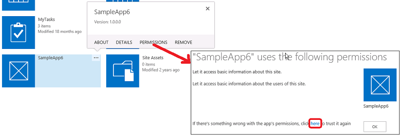

# Add-in permissions in SharePoint

Before you read this article, you should first be familiar with the topic [Authorization and authentication of SharePoint Add-ins](authorization-and-authentication-of-sharepoint-add-ins.md). 

A SharePoint Add-in requests the permissions that it needs during installation from the user who is installing it. The developer of an add-in must request, through the add-in manifest file, the permissions that the particular add-in needs to be able to run. (Device and web apps that access SharePoint, but are not installed to SharePoint websites, must be granted permissions at runtime by the user who is executing the add-in. For more information, see [Get an overview of add-ins that request access permission from SharePoint on the fly](authorization-code-oauth-flow-for-sharepoint-add-ins.md#Overview).)

Users can grant only the permissions that they have. The user must grant all the permissions that an add-in requests or not grant any permission. Selective grants are not possible. (For add-ins that request permissions on the fly, only a user with Manage permissions to the SharePoint resources that the add-in seeks to access can run the add-in, even if the add-in is asking only for lesser permissions, such as Read.)

The permissions that the add-in has been granted are also stored in the content database of the SharePoint farm or SharePoint Online tenancy. They are not stored with a secure token service, such as Microsoft Azure Access Control Service (ACS). When a user first grants an add-in permissions, SharePoint obtains information about the add-in from ACS. SharePoint then stores the basic information about the add-in in the add-in management service and the content database along with the add-in's permissions. For more information about ACS, see [Creating SharePoint Add-ins that use low-trust authorization](creating-sharepoint-add-ins-that-use-low-trust-authorization.md).

If an object to which an add-in was granted permission is deleted, the corresponding grants are also deleted. When an object to which an add-in was granted permission is recycled, SharePoint does not modify the corresponding grant. This is so that if the object is restored from the Recycle Bin, the grant is still intact.

When an add-in is removed, all the permissions granted to that add-in at the scope from which it was removed are revoked. This is to ensure that the add-in can't use its credentials to continue accessing protected SharePoint resources remotely after a user removes the add-in from SharePoint.
 
<a name="Perm_types"> </a>
 
## Types of add-in permissions and permission scopes

A SharePoint Add-in uses permission requests to specify the permissions that it needs to function correctly. The permission requests specify both the rights that an add-in needs and the scope at which it needs the rights. These permissions are requested as part of the add-in manifest.

> [!NOTE] 
> The scopes described in this section apply to list content and library content only. For information about scopes for other features, see the [Types of add-in permissions and permission scopes](#Perm_types) section in this article.

Permission request scopes indicate the location in the SharePoint hierarchy where a permission request applies.
 
> [!NOTE] 
> A SharePoint Add-in has its own identity and is a security principal, called an add-in principal. Like users and groups, an add-in principal has certain permissions or rights. The add-in principal has full control rights to the add-in web, so it only needs to request permissions to SharePoint resources in the host web or other locations outside the add-in web. For more information about the add-in web, see [Important aspects of the SharePoint Add-in architecture and development landscape](important-aspects-of-the-sharepoint-add-in-architecture-and-development-landscap.md) and [Host webs, add-in webs, and SharePoint components in SharePoint](host-webs-add-in-webs-and-sharepoint-components-in-sharepoint.md).

SharePoint supports four different permission scopes within the content database and tenancy, as shown in Table 1. Permission scopes are named with URIs, including an "http:" prefix, but they are not URLs and they contain no placeholders. The permission scopes in this table and this article are literal strings.

**Table 1. SharePoint add-in permission request scope URIs and descriptions**

|**Scope**|**Scope URI**|**Description**|
|:-----|:-----|:-----|
|Tenancy| http://sharepoint/content/tenant |The tenancy where the add-in is installed. Includes all children of this scope.|
|Site Collection| http://sharepoint/content/sitecollection |The site collection where the add-in is installed. Includes all children of this scope.|
|Website| http://sharepoint/content/sitecollection/web |The website where the add-in is installed. Includes all children of this scope.|
|List| http://sharepoint/content/sitecollection/web/list |A single list in the website where the add-in is installed.<br/><br/>When the user who installs the add-in is prompted to grant permissions, the dialog enables the user to select one list to which the add-in is granted permissions.<br/><br/>If the add-in needs permission to more than one list, it must request permission to web scope.<br/><br/>Also, since you, the developer, have no way to control which list the user chooses or to tell the user which one to choose, you must use web scope if there is a list to which your add-in *must*  have permission (but there is a way to narrow the user's choice to certain subsets of lists; see [Permission request scope with associated properties](#AssociatedProperties).) |

If an add-in is granted permission to one of the scopes, the permission applies to all children of the scope. For example, if an add-in is granted permission to a website, the add-in is also granted permission to each list that is contained in the website, and all list items that are in each list.

Because permission requests are made without information about the topology of the site collection where the add-in is installed, the scope is expressed as a type instead of as the URL of a specific instance. These scope types are expressed as URIs. Permissions to resources that are stored in the SharePoint content database are organized under the following URI: `http://sharepoint/content`.

<a name="Perm_diff"> </a>

## Differences between add-in permission rights and user rights

Permissions indicate the activities that an add-in is permitted to do within the requested scope. SharePoint supports four rights levels in the content database. For each scope, an add-in can have the following rights:

- Read
- Write
- Manage
- FullControl


> [!NOTE] 
> For more information about what Read, Write, Manage, and FullControl rights include, see [Plan add-in permissions management](https://technet.microsoft.com/library/eebac7af-f3e4-4e71-ad57-4c5ff3a58f30(v=office.16).aspx).
 
> [!NOTE] 
> These rights correspond to the default user permission levels of SharePoint: Reader, Contributor, Designer, and Full Control. For more information about user permission levels, see [User permissions and permission levels](https://technet.microsoft.com/en-us/library/cc288074.aspx).The add-ins rights names do not match SharePoint user roles rights names, to avoid confusion between user roles rights and add-in rights. Because customizing the permissions that are associated with SharePoint user roles does not affect add-in permission request levels, the add-in rights names do not match the corresponding SharePoint user roles, except Full Control, which can't be customized through the permissions management user interface.
 
In addition:

- For Search only, an add-in can have the Query right.

- For some Microsoft Project Server 2013 scopes, there is also the SubmitStatus right or the Elevate right. For most scopes for Project Server 2013, only Read and Write are available. For more information, see the [Understand the types of add-in permissions and permission scopes](#Perm_types) section in this article.

- For taxonomy, only rights for Read and Write are available.
    
> [!NOTE] 
> Office Store apps have some restrictions as to what type of rights an add-in can request. For more information, see the  [Types of add-in permissions and permission scopes](#Perm_types) section earlier in this article.

Unlike SharePoint user roles, these rights levels are not customizable. This is to ensure that when an add-in is granted a permission request, the add-in is guaranteed a predictable set of capabilities, and it does not have to account for the possibility of being granted less permission than it expects.

A user cannot grant an add-in permissions that the user himself or herself does not have. If a user attempts to install an add-in that requests more permissions than the user has, an error message displays to the user informing them that they don't have sufficient permissions to grant the add-in its request.

Permissions that are not known to SharePoint are ignored. This means that, if an add-in requests a permission that SharePoint does not recognize, the add-in can still be installed, but the user is not prompted to grant the permission, and the permission is not granted to the add-in.

<a name="Perm_rightlist"> </a>

## Available scopes and permissions, and restrictions on Office Store apps permissions

Different scopes have different sets of rights that are available for an add-in to request. This section describes the sets of rights that are available for each scope. Also, it highlights the restrictions for SharePoint Add-ins that are sold through the Office Store.

### Office Store apps' rights

Only Read, Write, and Manage rights are allowed for Office Store apps. If you try to submit an app to the Office Store that requires FullControl rights, your app is blocked from submission. Because the block is in the Office Store submission pipeline, apps that request more than Manage permissions can still be deployed through the add-in catalog.

<a name="PermissionsForLists"> </a>

### Permission request scopes for list content and library content

Table 2 shows the permission request scope for list and library content, and lists the rights that can be specified for each scope URI.

> [!NOTE] 
> The URIs used in Table 2 are literal values.

**Table 2. SharePoint add-in permission scope URIs and available rights**

|**Scope URI**|**Available rights**|
|:-----|:-----|
|http://sharepoint/content/sitecollection|Read, Write, Manage, FullControl|
|http://sharepoint/content/sitecollection/web|Read, Write, Manage, FullControl|
|http://sharepoint/content/sitecollection/web/list|Read, Write, Manage, FullControl|
|http://sharepoint/content/tenant|Read, Write, Manage, FullControl|


The following code shows how you use permission scopes and rights in the AppManifest.xml file. In the first example, an add-in is asking for Write access to the list scope.

```XML
  <?xml version="1.0" encoding="utf-8" ?>
  <App xmlns="http://schemas.microsoft.com/sharepoint/2012/app/manifest"
      ProductID="{4a07f3bd-803d-45f2-a710-b9e944c3396e}"
      Version="1.0.0.0"
      SharePointMinVersion="15.0.0.0"
      Name="MySampleAddIn"
  >
    <Properties>
      <Title>My Sample Add-in</Title>
      <StartPage>~remoteAppUrl/Home.aspx?{StandardTokens}</StartPage>
    </Properties>

    <AppPrincipal>
      <RemoteWebApplication ClientId="1ee82b34-7c1b-471b-b27e-ff272accd564" />
    </AppPrincipal>

    <AppPermissionRequests>
      <AppPermissionRequest Scope="http://sharepoint/content/sitecollection/web/list" Right="Write"/>
    </AppPermissionRequests>
  </App>
```

<br/>

The following code shows an add-in that is asking for Read access to the web scope and Write access to the list scope.

```XML
  <?xml version="1.0" encoding="utf-8" ?>
  <App xmlns="http://schemas.microsoft.com/sharepoint/2012/app/manifest"
      ProductID="{4a07f3bd-803d-45f2-a710-b9e944c3396e}"
      Version="1.0.0.0"
      SharePointMinVersion="15.0.0.0"
      Name="MySampleAddIn"
  >
    <Properties>
      <Title>My Sample Add-in</Title>
      <StartPage>~remoteAppUrl/Home.aspx?{StandardTokens}</StartPage>
    </Properties>

    <AppPrincipal>
      <RemoteWebApplication ClientId="6daebfdd-6516-4506-a7a9-168862921986" />
    </AppPrincipal>

    <AppPermissionRequests>
      <AppPermissionRequest Scope="http://sharepoint/content/sitecollection/web" Right="Read"/>
      <AppPermissionRequest Scope="http://sharepoint/content/sitecollection/web/list" Right="Write"/>
    </AppPermissionRequests>
  </App>
```

<br/>

<a name="PermissionsForLists"> </a>

### Permission request scopes for other SharePoint features

The permission request scope for other SharePoint features are listed in the following tables. 
 
> [!NOTE] 
> The URIs used in the tables are literal values.
 
Table 3 shows the permission request scope for Business Connectivity Services (BCS). It also lists the rights that can be specified for that scope URI.

**Table 3. BCS add-in permission request scope URIs and available rights**

|**Scope URI**|**Available rights**|
|:-----|:-----|
|http://sharepoint/bcs/connection |Read |

> [!NOTE] 
> For more information about the BCS add-in permission request scope, see [Business Connectivity Services in SharePoint](../general-development/business-connectivity-services-in-sharepoint.md).

<br/>

Table 4 shows the permission request scope for Search. It also lists the rights that can be specified for that scope URI.

**Table 4. Search add-in permission request scope URIs and available rights**

|**Scope URI**|**Available rights**|
|:-----|:-----|
|http://sharepoint/search|QueryAsUserIgnoreAppPrincipal|

> [!NOTE] 
> For more information about the Search add-in permission request scope, see [Search in SharePoint](../general-development/search-in-sharepoint.md).
 
<br/>
 
Table 5 shows the permission request scope for Project Server 2013. It also lists the rights that can be specified for each scope URI.
 
> [!NOTE] 
> An add-in that uses Project Server 2013 features and services should be tested in an environment that has the required Project Server features and services. The Project Server 2013 permission provider assembly that knows about Project Server 2013 permission scopes is not installed by default with SharePoint Server. For more information, see the Project Server 2013 developer documentation.

**Table 5. Project Server add-in permission request scope URIs and available rights**

|**Scope**|**Available rights**|
|:-----|:-----|
|http://sharepoint/projectserver |Manage|
|http://sharepoint/projectserver/projects |Read, Write|
|http://sharepoint/projectserver/projects/project |Read, Write|
|http://sharepoint/projectserver/enterpriseresources |Read, Write|
|http://sharepoint/projectserver/statusing |SubmitStatus|
|http://sharepoint/projectserver/reporting |Read|
|http://sharepoint/projectserver/workflow |Elevate|

 
<br/>
 
Table 6 shows the permission request scope for social features. It also lists the rights that can be specified for each scope URI.

**Table 6. Social features add-in permission request scope URIs and available rights**

|**Scope URI**|**Available rights**|
|:-----|:-----|
|http://sharepoint/social/tenant |Read, Write, Manage, FullControl|
|http://sharepoint/social/core |Read, Write, Manage, FullControl|
|http://sharepoint/social/microfeed |Read, Write, Manage, FullControl|

> [!NOTE] 
> For more information about social features add-in permission request scope, see [Add-in permission requests for accessing social features](../general-development/get-started-developing-with-social-features-in-sharepoint.md#app-permission-requests-for-accessing-social-features-in-sharepoint-add-ins).
 
<br/>

Table 7 shows the permission request scope for taxonomy. It also lists the rights that can be specified for that scope URI.

**Table 7. Taxonomy add-in permission request scope URIs and available rights**

|**Scope URI**|**Available rights**|
|:-----|:-----|
|http://sharepoint/taxonomy |Read, Write|

> [!NOTE] 
> For more information about the taxonomy add-in permission request scope, see [Add SharePoint capabilities](../general-development/add-sharepoint-capabilities.md).
 
<a name="AssociatedProperties"> </a>

### Permission request scope with associated properties

The list permission request scope has an additional optional property. The list scope can take a property with the name **BaseTemplateId**, and an integer value corresponding with a list base template, as shown in the following markup sample. Without a base template ID, the user who installs the add-in has the choice of granting it permission to *one list* from among all lists in the web. Specifying a base template ID limits the user's choice to the set of lists that match what is specified by the **BaseTemplateId** property.

The **BaseTemplateId** property is a child element, not an attribute of the **AppPermissionRequest** element. The following code shows how to use the **BaseTemplateId** property.

```XML
  <AppPermissionRequest Scope="http://sharepoint/content/sitecollection/web/list" Right="Write">
    <Property Name="BaseTemplateId" Value="101"/>
  </AppPermissionRequest>
```

<br/>

**Table 8. Permission request scope with associated properties**

|**Scope URI**|**Property**|**Type**|
|:-----|:-----|:-----|
|http://sharepoint/content/sitecollection/web/list |**BaseTemplateId** |Integer  |

> [!NOTE] 
> For more information about **BaseTemplateId** and the corresponding integer value for the list base template, see the **Type** attribute of the [List Element (List)](https://msdn.microsoft.com/library/b2b26fee-eb45-48ac-99f1-65f725da293f(Office.15).aspx).

<a name="Perm_manage"> </a>

## Managing and troubleshooting add-in permissions

SharePoint Add-ins that are installed to SharePoint are granted permissions when they are installed. Add-ins that are installed on other platforms but access SharePoint are granted permissions at runtime by the user who is running the add-in. Occasionally, the first kind of add-in may lose its permissions. You can regrant permissions to an add-in by using the following steps:

1. On the **Site Contents** page of the website where the add-in seems to have lost permissions, select the **???** button on the add-in's tile. This opens a callout with either a **PERMISSIONS** link or another **???** button.
 
2. Select the **PERMISSIONS** link if it is there and skip the next step, or select the **???** button.

3. Select the **Permissions** link.
 
4. On the page that opens, select the **here** link in the last sentence. This regrants the add-in its permissions and redirects the browser back to the **Site Contents** page.


 
When you are developing an add-in or troubleshooting an add-in, there may be occasions when you want to change, or regrant, the permissions of an add-in that has already been installed. You can do so with these steps:

1. Go to `http://<SharePointWebSite>/_layouts/15/AppInv.aspx`, where  _<SharePointWebSite>_ is the URL of the website where the add-in is installed. Be careful not to add any query parameters on the URL. The form you need only appears on this page if the URL is exactly as shown.

2. Enter the add-in's ID, also called the client ID, in the **Add-in Id** box, and then select **Lookup**. The other boxes on the form are then populated with information about the add-in.

3. Fill in the **Permission Request XML** box with permission requests exactly as you would enter them in an add-in manifest. For examples, see [Permission request scopes for list content and library content](#PermissionsForLists). For complete syntax information, see [AppPermissionRequest Element](https://msdn.microsoft.com/library/4ad90fb0-33b2-aee5-69c2-5b97ca5334f8(Office.15).aspx).

4. Select **Create**. 

An add-in's permissions for a specific scope are revoked when it is removed from that scope.
 
<a name="CannotBeHidden"> </a>
 
## Why add-ins cannot be hidden from users

Any user with browse rights to a SharePoint website can launch any SharePoint Add-in installed on the site. Whether the user can do anything with the add-in depends on the user's other permissions and what [authorization policy type](add-in-authorization-policy-types-in-sharepoint.md) is being used by the add-in. If the user tries to do something with the add-in that the user does not have permission to do, and the call to SharePoint is using the user+add-in policy, the call fails.

## See also
<a name="Filename_AdditionalResources"> </a>

- [Set up an on-premises development environment for SharePoint Add-ins](set-up-an-on-premises-development-environment-for-sharepoint-add-ins.md)
- [Get started creating provider-hosted SharePoint Add-ins](get-started-creating-provider-hosted-sharepoint-add-ins.md)
- [Get started creating SharePoint-hosted SharePoint Add-ins](get-started-creating-sharepoint-hosted-sharepoint-add-ins.md)
- [Authorization and authentication of SharePoint Add-ins](authorization-and-authentication-of-sharepoint-add-ins.md)
    
 
