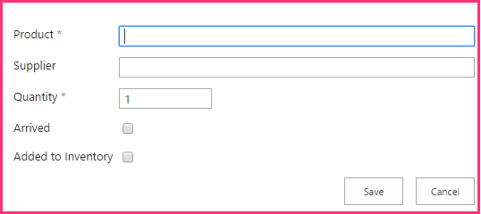
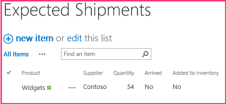

# Add SharePoint write operations to the provider-hosted add-in

This is the fifth in a series of articles about the basics of developing provider-hosted SharePoint Add-ins. You should first be familiar with [SharePoint Add-ins](sharepoint-add-ins.md) and the previous articles in this series, which you can find at [Get started creating provider-hosted SharePoint Add-ins](get-started-creating-provider-hosted-sharepoint-add-ins.md#SP15createprovider_nextsteps). 

> [!NOTE]
> If you have been working through this series about provider-hosted add-ins, you have a Visual Studio solution that you can use to continue with this topic. You can also download the repository at [SharePoint_Provider-hosted_Add-Ins_Tutorials](https://github.com/OfficeDev/SharePoint_Provider-hosted_Add-ins_Tutorials) and open the BeforeSharePointWriteOps.sln file.

In this article, we get back to coding by adding some functions that write data to the Chain Store SharePoint Add-in.

## Change a column value on a SharePoint list item

Our add-in has a custom ribbon button that adds an employee from the Hong Kong store's **Local Employees** list to the corporate database. But the user has to remember to manually change the value of the **Added to Corporate DB** field to **Yes**. Let's add code to do that automatically.

> [!NOTE]
> The settings for Startup Projects in Visual Studio tend to revert to defaults whenever the solution is reopened. Always take these steps immediately after reopening the sample solution in this series of articles: 

> 1. Right-click the solution node at the top of **Solution Explorer**, and then select **Set startup projects**.  
> 2. Ensure that all three projects are set to **Start** in the **Action** column.

1. In **Solution Explorer**, open the EmployeeAdder.cs file.

2. Add the following line to the **Page_Load** method between the call of `AddLocalEmployeeToCorpDB` and the call of `Response.Redirect`. In the next step, you create the **SetLocalEmployeeSyncStatus** method.
    
    ```csharp
       // Write to SharePoint 
     SetLocalEmployeeSyncStatus();
    ```

3. Add the following new method to the `EmployeeAdder` class. 

    ```csharp
       private void SetLocalEmployeeSyncStatus()
     {
         using (var clientContext = spContext.CreateUserClientContextForSPHost())
         {
             List localEmployeesList = clientContext.Web.Lists.GetByTitle("Local Employees");
             ListItem selectedLocalEmployee = localEmployeesList.GetItemById(listItemID);
             selectedLocalEmployee["Added_x0020_to_x0020_Corporate_x"] = true;
             selectedLocalEmployee.Update();
             clientContext.ExecuteQuery();
         }
     }
    ```

   Note the following about this code:
    
   - The internal name for the **Added to Corporate DB** field is odd-looking. Internal field names cannot contain spaces, so when a user creates a field with spaces in its display name, SharePoint substitutes the string "_x0020_" for each space when it sets the internal name. This turns "Added to Employee DB" into "Added_x0020_to_x0020_Corporate_x0020_DB". Internal names cannot be more than 32 characters, so the name is truncated to just "Added_x0020_to_x0020_Corporate_x".

   - Although the **Added to Corporate DB** column is called a **Yes/No** field in the SharePoint UI, it is really a boolean, so its value is set to **true**, not **Yes**.

   - The **Update** method of the **ListItem** class must be called to commit the changes to SharePoint's content database. It is a general, but not quite universal, rule that when you change a property value of an object that is stored in the SharePoint databases, you must call the object's **Update** method.

## Request permission to write to the host web list

Because the add-in is now writing to the list as well as reading it, we need to escalate the permissions that the add-in requests from Read to Write. Follow these steps.

1. In **Solution Explorer**, open the AppManifest.xml file in the **ChainStore** project.

2. Open the **Permissions** tab, and in the **Permission** field, select **Write** from the drop-down.

3. Save the file. 

## Run the add-in and test the button

1. Use the F5 key to deploy and run your add-in. Visual Studio hosts the remote web application in IIS Express and hosts the SQL database in SQL Express. It also makes a temporary installation of the add-in on your test SharePoint site and immediately runs the add-in. You are prompted to grant permissions to the add-in before its start page opens. 

2. On the permission form, select **Local Employees** from the list, and then select **Trust it**.

3. When the add-in's start page opens, click **Back to Site** on the chrome control at the top.

4. From the website's home page, go to **Site Contents** > **Local Employees**. The list view page opens.

5. If there are no employees on the list with **No** in the **Added to Corporate DB** column, add an employee to the list, and *do not select the __Added to Corporate DB__ check box.* 

6. On the ribbon, open the **Items** tab. In the **Actions** section of the tab is the custom button **Add to Corporate DB**.

7. Select an employee on the list that has **No** in the **Added to Corporate DB** column.

8. Select the **Add to Corporate DB** button. (You must select an item first.)

9. The page seems to reload because the **Page_Load** method of the EmployeeAdder page redirects back to it. The value of the **Added to Corporate DB** field for the employee changes to **Yes**.
    
   > [!NOTE]
   > What prevents a user from manually changing the value **Added to Corporate DB** in a way that makes the list and the corporate database inconsistent? Nothing does at the moment. You'll get the solution to this problem in a later article of this series.

10. To end the debugging session, close the browser window or stop debugging in Visual Studio. Each time you select F5, Visual Studio retracts the previous version of the add-in and installs the latest one.

11. Right-click the project in **Solution Explorer** and select **Retract**.

## Create a new custom list on the host website

The next improvement to the Chain Store add-in is to create new items in a list, instead of merely changing a field in an existing item. Specifically, when a new order is placed at the corporate level, an item is automatically created in a SharePoint list that alerts local employees to expect a shipment. The list is called **Expected Shipments** and you create it with the following steps. In a later article in this series, you'll learn how to programmatically add a custom list to a host website, but for now you'll add this one manually.

1. From the home page of the Fabrikam Hong Kong Store, go to **Site Contents** > **Add an add-in** > **Custom List**. 

2. In the **Adding Custom List** dialog, specify **Expected Shipments** as the name, and then select **Create**. 

3. On the **Site Contents** page, open the **Expected Shipments** list.

4. On the **List** tab on the ribbon, select **List Settings**.

5. In the **Columns** section of the **List Settings** page, select the **Title** column.

6. In the **Edit Column** form, change the **Column name** from **Title** to **Product**, and then select **OK**.

7. On the **Settings** page, select **Create column**.

8. In a previous article of this series, you learned how to create custom columns for a list. For the **Expected Shipments** list, add four columns, using the values in the following table. Leave all other settings at their defaults.

   |**Column name**|**Type**|**Required?**|**Default value**|
   |:-----|:-----|:-----|:-----|
   |Supplier|**Single line of text**|Not required|None|
   |Quantity|**Number**|Required|1|
   |Arrived|**Yes/No**|Not required|No|
   |Added to Inventory|**Yes/No**|Not required|No|

9. After you have created the columns, on the list settings page, select **Site Contents** to open the **Site Contents** page. Open the **Expected Shipments** list.

10. Select **new item**. The item creation form should look exactly like the following, including the two asterisks that indicate required fields.

   *Figure 1. Item creation form for the Expected Shipments list*

   

11. We don't want to manually create items in this list, so click **Cancel**.

## Insert an item into a SharePoint list

Now you add a function to the add-in that creates an item in the **Expected Shipments** list whenever an order for the Hong Kong store is placed at the corporate level.

1. In **Solution Explorer**, open the OrderForm.aspx.cs file.

2. Add a **using** statement for **Microsoft.SharePoint.Client** to the top of the file.

3. In the **btnCreateOrder_Click** method, add the following line just under the call to `CreateOrder`. You'll create the **CreateExpectedShipment** method in the next step.
    
    ```csharp
      CreateExpectedShipment(txtBoxSupplier.Text, txtBoxItemName.Text, quantity);
    ```

4. Add the following method to the `OrderForm` class. 

    ```csharp
      private void CreateExpectedShipment(string supplier, string product, UInt16 quantity)
    {
        using (var clientContext = spContext.CreateUserClientContextForSPHost())
        {
            List expectedShipmentsList = clientContext.Web.Lists.GetByTitle("Expected Shipments");
            ListItemCreationInformation itemCreateInfo = new ListItemCreationInformation();
            ListItem newItem = expectedShipmentsList.AddItem(itemCreateInfo);
            newItem["Title"] = product;
            newItem["Supplier"] = supplier;
            newItem["Quantity"] = quantity;
            newItem.Update();
            clientContext.ExecuteQuery();
        }
    }
    ```

   Note the following about this code:

   - A  **ListItem** object is not created with a constructor. This is for performance reasons. A **ListItem** object has many properties (with default values). If a constructor is used, the entire object would be included in the XML message that the **ExecuteQuery** method sends to the server. 
   
   - The **ListItemCreationInformation** object is a lightweight object that only contains the minimal non-default values that the server needs to create a **ListItem** object. It may appear that there is a line that creates a **ListItem** object, but recall that this line only adds some XML markup to a message that is sent to the server. The **ListItem** object is created there on the server.

   - There is no need to bring the **ListItem** object back down to the client, so there is no call to the **ClientContext.Load** method.

   - The code does not need to explicitly set the **Arrived** or **Added to Inventory** fields because they have default values of **No**, which is what we want.

## Check for deleted components

Anyone with list owner privileges for a SharePoint list can delete the list. And if the list is deployed to the host web by an add-in, the website owner of the host web can delete it. That may happen if the owner decides to do without the functionality provided by the list. (It can be restored from the SharePoint Recycle Bin if the owner changes his mind.) 

The **CreateExpectedShipment** method depends on the existence of the **Expected Shipments** list. Suppose a website owner decided to delete the list. Later, when an order is added with the add-in's **Order Form**, the **CreateExpectedShipment** method is called and throws an exception whose message says that there's no **Expected Shipments** list on the SharePoint website.

You might want the method to check the `expectedShipmentsList` for nullity before it does anything with it. When you are working with CSOM, you can *not*  make this check with a simple structure like this:

`if (expectedShipmentsList != null) { ... }`
 
Instead, you need to use a special CSOM class called **ConditionalScope**. The reasons for this are connected to CSOM's batching system, which was mentioned in the previous article in this series (see [Client-side runtime and batching](get-a-quick-overview-of-the-sharepoint-object-model.md#CSOMBatching)). **ConditionalScope** and the batching system are advanced topics that are outside the scope of this getting started series, but you should see MSDN's documentation about them after you have completed this series of tutorials.

An alternative way to check for the existence of a list is as follows: instead of using the **GetByTitle** method to get a reference to the list, you can check to see if a list with the specified name is in the website's "list of lists" with code like the following.

```csharp
var query = from list in clientContext.Web.Lists 
             where list.Title == "Expected Shipments" 
             select list; 
IEnumerable<List> matchingLists = clientContext.LoadQuery(query); 
clientContext.ExecuteQuery(); 
if (matchingLists.Count() != 0) 
{ 
    List expectedShipmentsList = matchingLists.Single(); 
    // Do something with the list. 
}
clientContext.ExecuteQuery(); 
```

The preceding code has the advantage of allowing you to avoid the complications of the **ConditionalScope** class, and we use exactly this code elsewhere in this series of articles. But there is a disadvantage too: this code requires an extra call of **ExecuteQuery** solely to get the value you want to check in the **if** statement. 

If we use this technique in the **CreateExpectedShipment** method to check for the existence of the list, that method will have two calls of **ExecuteQuery**, each of which makes an HTTP request from the remote web server to SharePoint. These requests are the most time-consuming part of any CSOM method, so it is generally a good practice to minimize them.

We will leave the **CreateExpectedShipment** method as is, but in a production add-in, you need to think about how your code is going to work if a component that it references is deleted. Programmatically restoring the list from the Recycle Bin is one option, but that would annoy users who intentionally decided to delete the list. 

You should also consider that doing nothing at all to prevent the exception might be the best choice. An exception from SharePoint would alert users that the deletion of the list has broken part of the add-in, which is something the person who deleted it might not have realized. A user can then decide whether to restore the list from the Recycle Bin or do without the part of the add-in functionality that no longer works.

## Request permission to manage the website

Recall that when an add-in requests Read or Write permission with the scope of List, SharePoint prompts the user to trust the add-in, and the dialog contains a drop-down list where the user selects the list to which the add-in should have access. Only one list can be selected. But the Chain Store add-in now writes to two different lists. To gain access to multiple lists, the add-in has to request permission with the scope of Web. Follow these steps:

1. In **Solution Explorer**, open the AppManifest.xml file in the **ChainStore** project.

2. Open the **Permissions** tab, and in the **Scope** field, select **Web** from the drop-down.

3. In the **Permission** field, select **Write** from the drop-down.

4. Save the file. 

## Run the add-in and test the item creation

1. Use the F5 key to deploy and run your add-in. Visual Studio hosts the remote web application in IIS Express and hosts the SQL database in SQL Express. It also makes a temporary installation of the add-in on your test SharePoint site and immediately runs the add-in. You are prompted to grant permissions to the add-in before its start page opens. 

2. When the add-in's start page opens, select the **Order Form** link at the bottom of the page.

3. Enter some values in the form, and then select **Place Order**.

4. Use the browser's back button to go back to the start page, and then select **Back to Site** on the chrome control at the top.

5. From the home page of the Hong Kong store, go to **Site Contents** and open the **Expected Shipments** list. There is now an item on the list corresponding to the order. The following screenshot is an example.
  
   *Figure 2. Expected Shipments list with a single item*

   

6. To end the debugging session, close the browser window or stop debugging in Visual Studio. Each time that you select F5, Visual Studio retracts the previous version of the add-in and installs the latest one.

7. Right-click the project in **Solution Explorer** and select **Retract**.

## Next steps
<a name="Nextsteps"> </a>

In the next article, you'll learn how to surface the remote Order Form as a Web Part on a SharePoint page: [Include an add-in part in the provider-hosted add-in](include-an-add-in-part-in-the-provider-hosted-add-in.md).
 

 

