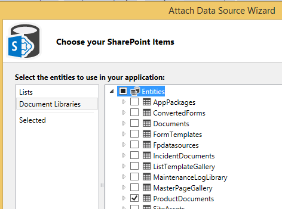
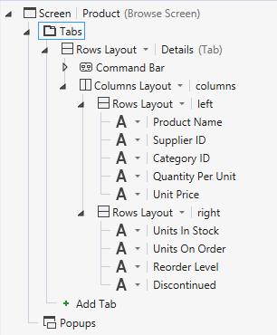
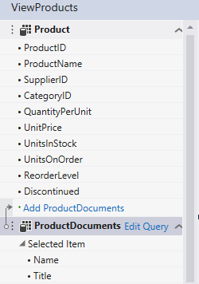
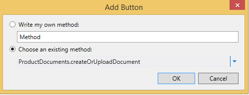

# Associate a document library with an entity
By using the document library feature in SharePoint, you can create or upload documents associated with individual items in a list or entity. For example, you might use a document library to store sales literature and product manuals for each product in a list. In a Cloud Business Add-in, you can associate a document library with an entity by creating a relationship.
 

 **Note**  The name "apps for SharePoint" is changing to "SharePoint Add-ins". During the transition, the documentation and the UI of some SharePoint products and Visual Studio tools might still use the term "apps for SharePoint". For details, see  [New name for apps for Office and SharePoint](new-name-for-apps-for-sharepoint.md#bk_newname).
 

## Associating a Document Library

The process of associating a document library with an entity involves three steps:
 

 

1. Add a SharePoint document library to your project as a data source.
    
     **Important**  You must first create a document library on your SharePoint site. It must contain a custom column that maps to a unique field in your entity.
2. Create a relationship between the document library and an entity.
    
 
3. Add the document library to a screen. The process differs depending on whether you're creating a new screen or adding it to an existing screen.
    
 

### To add a document library

1. In  **Solution Explorer**, open the shortcut menu for the  **Data Sources** node and choose **Add Data Source**.
    
 
2. In the  **Attach Data Source Wizard**, choose the  **SharePoint** icon, and then choose the **Next** button.
    
 
3. On the  **Enter Connection Information** page, in the **Specify the SharePoint site address** text box, enter the URL for your SharePoint developer site, and then choose the **Next** button.
    
 
4. On the  **Choose your SharePoint Items** page, in the left pane, choose the **Document Libraries** list item, and in the right pane, select the checkbox for your document library as shown in Figure 1.
    
    **Figure 1. Selecting the document library**

 

  
 

    Figure 2 shows the document library on the SharePoint site.
    

    **Figure 2. Note the custom ProductName column**

 

  
 

    
     **Important**  The document library must already exist and must contain a custom column that maps to a unique field in your entity.
5. In the  **Specify the name of the data source**, enter a name, and then choose the  **Finish** button.
    
 

### To create a relationship

1. In  **Solution Explorer**, open the document library entity, and then on the  **Perspective** bar, choose the **Server** tab.
    
 
2. On the toolbar, choose  **Relationship**.
    
 
3. In the  **Add New Relationship** dialog box, in the **To** dropdown list, choose the entity that you want to associate, as shown in Figure 3.
    
    **Figure 3. Creating a relationship.**

 

  
 

 

 
4. In the  **Foreign** key dropdown list, choose the custom column from your document library.
    
 
5. In the  **Primary** key dropdown list, choose the field from your entity that maps to the custom column in the document library, and then choose the **OK** button. For example, for a ProductName custom column, choose the ProductName field, as shown in Figure 4.
    
    **Figure 4. Related foreign and primary keys**

 

  
 

    
     **Note**  The field must be of the same data type as the  **Foreign** key field.

### To add a document library to a new screen set

1. In  **Solution Explorer**, open the entity that is associated with a document library, and then on the  **Perspective** bar, choose the **HTMLClient** tab.
    
 
2. On the toolbar, choose  **Screen**.
    
 
3. In the  **Add New Screen** dialog box, in the **Screen Set Name** text box, enter a name for the screen set.
    
 
4. In the  **Screen Data** list, choose your entity.
    
 
5. In the  **Additional Data to Include** list, select the checkbox for your document library, and then choose the **OK** button.
    
    Figure 5 shows a screen set for a Product entity.
    

    **Figure 5. Products screen set**

 

  
 

    The  **View** screen that is created for the entity contains a **Documents** tab with an **Add Document** button. The button displays a Popup for adding or uploading documents.
    
 

### To add a document library to an existing screen

1. In  **Solution Explorer**, open the shortcut menu for the screen that you want to associate with a document library and choose  **Open**.
    
 
2. In the screen designer, choose the  **Tabs** node as shown in Figure 6, and then choose the **Add Tab** node.
    
    **Figure 6. The Tabs node**

 

  
 

 

 
3. In the  **Properties** window, choose the **Display Name** property and enter a meaningful name for the newly added tab. For example,Documents.
    
 
4. In the left pane of the screen designer, choose the  **Add** _DocumentLibraryName_ link as shown in Figure 7, where _DocumentLibraryName_ is the name of your document library.
    
    **Figure 7. The Add ProductDocuments link**

 

  
 

 

 
5. In the center pane, choose the node for the new tab, expand the  **Add** list, and then choose _DocumentLibraryName_.
    
 
6. Expand the  **Command Bar** node for the new tab as shown in Figure 8 and choose **Add**.
    
    **Figure 8. The Command Bar node**

 

  
 

 

 
7. In the  **Add Button** dialog box, accept the default choices and choose the **OK** button.
    
    Figure 9 shows the  **Add Button** dialog box with the default method, **createOrUploadDocument**.
    

    **Figure 9. The Add Button dialog box**

 

  
 

 

 
8. In the  **Properties** window, choose the **Display Name** property and enter a meaningful name for the button. For example,Add Document.
    
    The screen now contains a  **Documents** tab with a button on the command bar. The button displays a Popup for adding or uploading documents.
    
 

## Additional resources

-  [Develop cloud business add-ins](develop-cloud-business-add-ins.md)
    
 
-  [Incident manager: A cloud business add-in tutorial](incident-manager-a-cloud-business-add-in-tutorial.md)
    
 

