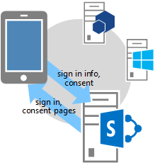
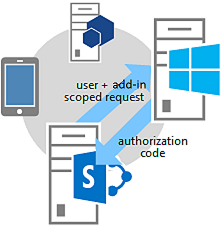

# Authorization Code OAuth flow for SharePoint Add-ins

> [!NOTE]
> This article assumes that you're familiar with [Creating SharePoint Add-ins that use low-trust authorization](creating-sharepoint-add-ins-that-use-low-trust-authorization.md) and with the concepts and principles behind OAuth. For more information about OAuth, see [OAuth.net](http://oauth.net/) and [Web Authorization Protocol (oauth)](http://datatracker.ietf.org/doc/active/#oauth).

> [!IMPORTANT]
> Azure Access Control (ACS), a service of Azure Active Directory (Azure AD), will be retired on November 7, 2018. This retirement doesn't impact the SharePoint Add-in model, which uses the **https://accounts.accesscontrol.windows.net** hostname (which isn't impacted by this retirement). For more information, see [Impact of Azure Access Control retirement for SharePoint Add-ins](https://developer.microsoft.com/office/blogs/impact-of-azure-access-control-deprecation-for-sharepoint-add-ins).

In some scenarios, an add-in can request permission to access SharePoint resources on the fly; that is, an add-in can request permission to access SharePoint resources dynamically at runtime, instead of at add-in installation time. This type of add-in doesn't have to be launched from, or even installed on, SharePoint. For example, it could be a native device add-in, an add-in that is launched from any website, or an Office Add-in launched from an Office application that wants to access resources on SharePoint on the fly.

> [!NOTE]
> This type of add-in can only be run by users who have Manage permissions to the resources the add-in wants to access. For example, if an add-in requests only Read permission to a website, a user who has Read, but not Manage, rights to the website cannot run the add-in.

To be able to call in to SharePoint, this type of add-in must first be registered through the Seller Dashboard or the **AppRegNew.aspx** page. For more information about registering add-ins via the Seller Dashboard or **AppRegNew.aspx**, see [Register SharePoint Add-ins](register-sharepoint-add-ins.md).

After you've registered your add-in, its a *security principal* and has an identity just as users and groups do. This identity is referred to as an add-in principal. Like users and groups, an add-in principal has certain permissions. For more information about add-in principals, see [Register SharePoint Add-ins](register-sharepoint-add-ins.md).

When you register the add-in, you'll get a client ID, client secret, add-in domain, and redirect URI for the add-in principal. This information is registered with the authorization server, Microsoft Azure Access Control Service (ACS).

## Authorization Code OAuth flow for add-ins that request permissions on the fly

This section summarizes the OAuth authentication and authorization flow for a SharePoint add-in requesting permissions on the fly. The flow is called the **Authorization Code flow**. The sequence describes how an add-in that isn't launched from within SharePoint can access resources in SharePoint.

> [!NOTE]
> The flow involves a series of interactions between your add-in, SharePoint, the authorization server (which is ACS), and the end user at runtime. So the flow requires either SharePoint Online or a SharePoint farm that is connected to the Internet, so it can communicate with ACS. SharePoint farms that are not connected to the Internet must use [the high-trust authorization system](creating-sharepoint-add-ins-that-use-high-trust-authorization.md).

There has to be a web application or service that is hosted separately from SharePoint. Even if the add-in is a device add-in, it has to have a web application or service URL that can be registered with ACS, even if the web component is used for nothing else.

For simplicity, this article assumes that the add-in is a web application called Contoso.com. The application uses the SharePoint client object model (CSOM) or the SharePoint REST APIs to make calls to SharePoint. When the application first attempts to access SharePoint, SharePoint requests an authorization code from ACS that it can send to the Contoso.com application. The application then uses the authorization code to request an access token from ACS. After it has the access token, the Contoso.com application includes it in all its requests to SharePoint.

### Detailed example of the flow

Suppose that Contoso provides a photo-printing service online. A user wants to print some photos. The user wants to give consent to a Contoso photo-printing service to access and print photos from a set of photo libraries that the user keeps on a SharePoint Online site `fabrikam.sharepoint.com`.


The photo-printing application is registered, so it has a client ID, client secret, and redirect URI. The redirect URI that Contoso provided when it registered the add-in is `https://contoso.com/RedirectAccept.aspx`. The client ID and client secret information are stored in the photo-printing application's web.config file. The following is an example of how the client ID and client secret are entered in the web.config file.

```XML
<configuration>
  <appSettings>
    <add key="ClientId" value="c78d058c-7f82-44ca-a077-fba855e14d38 "/>
    <add key="ClientSecret" value="SbALAKghPXTjbBiLQZP+GnbmN+vrgeCMMvptbgk7T6w= "/>
  </appSettings>
</configuration>
```

### Authorization Code flow steps

Following are the steps in the Authorization Code flow.

> [!TIP]
> These steps refer to methods in the **TokenHelper.cs** file. This managed code isn't compiled, so there are no reference topics for it. However, the file itself is fully commented with descriptions of every class, member parameter, and return value. Consider having a copy of it open to refer to as you read these steps.

#### Step 1: Client opens an application and then directs it to a SharePoint site for data


A user browses to the Contoso photo-printing website, where the UI indicates that the user can print photos that are kept on any SharePoint Online site.

In this example, the URL is **https://contoso.com/print/home.aspx**

The photo-printing add-in asks the user to enter the URL of the photo collection. The user enters a URL pointing to the SharePoint Online site: **https://fabrikam.sharepoint.com/**

#### Step 2: The add-in redirects to the SharePoint site authorization URL


When the user selects the button to get the photos, the Contoso photo-printing add-in redirects the browser to **https://fabrikam.sharepoint.com/**; this redirect is an HTTP 302 Redirect Response.

If you're using Microsoft .NET, `Response.Redirect` is one of several ways you can do the redirect from your code. Using the **TokenHelper.cs** file in your project, your code can call the overloaded `GetAuthorizationUrl` method (using the overload with three arguments). This method constructs the **OAuthAuthorize.aspx** redirect URL for you. Or, your code can manually construct the URL.

For example, if you choose to call the `GetAuthorizationUrl` method to construct the **OAuthAuthorize.aspx** redirect URL for you, using the **TokenHelper.cs** in your project, the code is as follows:

```csharp
Response.Redirect(
  TokenHelper.GetAuthorizationUrl(
    sharePointSiteUrl.ToString(),
    "Web.Read List.Write",
    "https://contoso.com/RedirectAccept.aspx"
  )
);
```

If you look at the three-parameter overload of the `GetAuthorizationUrl` method in **TokenHelper.cs**, you see that the second parameter is a permission scope parameter, which is a space-delimited list of permissions the add-in requests in shorthand format. For more information about permission scopes, see [Permission scope aliases and the use of the OAuthAuthorize.aspx page](#permission-scope-aliases-and-the-oauthauthorizeaspx-page).

The third parameter must be the same redirect URI that is used when the add-in is registered. For more information about registration, see [Register SharePoint Add-ins](register-sharepoint-add-ins.md). The returned string is a URL including query string parameters. If you prefer, you can manually construct the **OAuthAuthorize.aspx** redirect URL. For example, the URL that the Contoso photo-printing add-in redirects the user to in this case is (*line breaks added for readability*):

```http
https://fabrikam.sharepoint.com/_layouts/15/OAuthAuthorize.aspx?
    client_id=client_GUID
    &scope=app_permissions_list
    &response_type=code
    &redirect_uri=redirect_uri
```

As the example shows, the Contoso photo-printing add-in sends the OAuth client ID and redirect URI to the Fabrikam site as query string parameters. The following is an example of the GET request with sample query string values. The actual target URL is a single line.

```http
GET /_layouts/15/OAuthAuthorize.aspx?client_id=c78d058c-7f82-44ca-a077-fba855e14d38&scope=list.read&response_type=code&redirect_uri=https%3A%2F%2Fcontoso%2Ecom%2Fredirectaccept.aspx HTTP/1.1
Host: fabrikam.sharepoint.com
```

If you want a separate consent pop-up dialog, you can add the query parameter **IsDlg=1** to the URL construct as shown here: `/oauthauthorize.aspx?IsDlg=1&client_id=c78d058c-7f82-44ca-a077-fba855e14d38&scope=list.read&response_type=code&redirect_uri=https%3A%2F%2Fcontoso%2Ecom%2Fredirectaccept.aspx`

#### Step 3: SharePoint displays the consent page so the user can grant the add-in permissions



If the user isn't already signed into the Fabrikam SharePoint Online site, the user is prompted to sign in. When the user is signed in, SharePoint renders an HTML consent page. The consent page prompts the user to grant (or deny) the Contoso photo-printing add-in the permissions that the add-in requests. In this case, the user would be granting the add-in read access to the user's picture library on Fabrikam.

#### Step 4: SharePoint requests a short-lived authorization code from ACS



The Fabrikam SharePoint Online site asks ACS to create a short-lived (approximately 5 minutes) authorization code unique to this combination of user and add-in. ACS sends the authorization code to the Fabrikam site.

#### Step 5: The SharePoint Online site redirects to the app's registered redirect URI, passing the authorization code to the add-in


The Fabrikam SharePoint Online site redirects the browser back to Contoso via HTTP 302 Response. The URL construct for this redirection uses the redirect URI that was specified when the photo-printing add-in was registered. It also includes the authorization code as a query string.

The redirect URL is structured like the following: **https://contoso.com/RedirectAccept.aspx?code=<authcode>**

#### Step 6: The add-in uses the authorization code to request an access token from ACS, which validates the request, invalidates the authorization code, and then sends access and refresh tokens to the add-in


Contoso retrieves the authorization code from the query parameter, and then includes it, along with the client ID and client secret, in a request to ACS for an access token.

If you're using managed code and the SharePoint CSOM, the **TokenHelper.cs** file, the method that makes the request to ACS is **GetClientContextWithAuthorizationCode**. In this case, the code looks similar to the following (where  `authCode` is a variable to which the authorization code has been assigned):

```csharp
TokenHelper.GetClientContextWithAuthorizationCode(
  "https://fabrikam.sharepoint.com/",
  "00000003-0000-0ff1-ce00-000000000000",
  authCode,
  "1ee82b34-7c1b-471b-b27e-ff272accd564",
  new Uri(Request.Url.GetLeftPart(UriPartial.Path))
);
```

If you look at the **TokenHelper.cs** file, the second parameter of the **GetClientContextWithAuthorizationCode** method is the `targetPrincipalName`. This value is always the constant `00000003-0000-0ff1-ce00-000000000000` in an add-in that is accessing SharePoint. If you trace the call hierarchy from **GetClientContextWithAuthorizationCode**, it obtains the client ID and secret from the web.config file.

ACS receives Contoso's request and validates the client ID, client secret, redirect URI, and authorization code. If all are valid, the ACS invalidates the authorization code (it can be used only once) and creates a refresh token and an access token, which it returns to Contoso. The Contoso application can cache this access token for reuse on later requests. By default, access tokens are good for about 12 hours.

Each access token is specific to the user account that is specified in the original request for authorization, and grants access only to the services that are specified in that request. Your add-in should store the access token securely. The Contoso application can also cache the refresh token. By default, refresh tokens are good for six months. The refresh token can be redeemed for a new access token from ACS whenever the access token expires.

For more information about tokens, see [Handle security tokens in provider-hosted low-trust SharePoint Add-ins](handle-security-tokens-in-provider-hosted-low-trust-sharepoint-add-ins.md).

#### Step 7: The add-in can now use the access token to request data from the SharePoint site, which it can display to the user


Contoso includes the access token to make a REST API call or CSOM request to SharePoint, passing the OAuth access token in the HTTP **Authorization** header. SharePoint returns the information that Contoso requested.

For more information about how this request is made, see [Handle security tokens in provider-hosted low-trust SharePoint Add-ins](handle-security-tokens-in-provider-hosted-low-trust-sharepoint-add-ins.md).

## Permission scope aliases and the **OAuthAuthorize.aspx** page

This section assumes that you're familiar with the article [Add-in permissions in SharePoint](add-in-permissions-in-sharepoint.md). Table 1 shows the same add-in permission request scope URIs that are shown in that article, except it has one additional column (**Scope alias**), and the FullControl right isn't available in the **Available rights** column, because an add-in that requests permission to access SharePoint resources on the fly can't request the FullControl right.

The values listed in the **Scope alias** column are shorthand versions of their counterparts in the **Scope URI** column. The aliases can be used only by add-ins that request permission to access SharePoint resources on the fly. (The scope URI values are used in the add-in manifest of add-ins that are launched from SharePoint. These add-ins request permissions during add-in installation.)

The scope aliases are used only in the context of using the **OAuthAuthorize.aspx** redirect page. As shown in [step 2 of the OAuth flow](#step-2-the-add-in-redirects-to-the-sharepoint-site-authorization-url) described in the previous section, when the add-in is using managed code, the aliases are used when you call the `GetAuthorizationUrl` method of **TokenHelper.cs** in your project. The following is another example:

```csharp
Response.Redirect(TokenHelper.GetAuthorizationUrl(
    sharePointSiteUrl.ToString(),
    "Web.Read List.Write ",
    "https://contoso.com/RedirectAccept.aspx ")
);
```

The _scope_ parameter value, `Web.Read List.Write`, is an example of how you would request permissions by using the scope aliases. The _scope_ parameter is a space-delimited set of permission scope and right requests.

If you're not using managed code, the scope aliases are used in the scope field in the redirect URL. For example:

```http
https://fabrikam.sharepoint.com/_layout/15/OAuthAuthorize.aspx?client_id=c78d058c-7f82-44ca-a077-fba855e14d38&scope=list.write&response_type=code&redirect_uri=https%3A%2F%2Fcontoso%2Ecom%2Fredirectaccept.aspx
```

> [!NOTE]
> For a description of the scopes, see [Add-in permissions in SharePoint](add-in-permissions-in-sharepoint.md).

### Table 1. SharePoint add-in permission request scope URIs and their corresponding aliases

|                       Scope URI                        |          Scope alias           |       Available rights        |
| :----------------------------------------------------- | :----------------------------- | :---------------------------- |
| `https://sharepoint/content/sitecollection`            | Site                           | Read, Write, Manage           |
| `https://sharepoint/content/sitecollection/web`        | Web                            | Read, Write, Manage           |
| `https://sharepoint/content/sitecollection/web/list`   | List                           | Read, Write, Manage           |
| `https://sharepoint/content/tenant`                    | AllSites                       | Read, Write, Manage           |
| `https://sharepoint/bcs/connection`                    | None (currently not supported) | Read                          |
| `https://sharepoint/search`                            | Search                         | QueryAsUserIgnoreAppPrincipal |
| `https://sharepoint/projectserver`                     | ProjectAdmin                   | Manage                        |
| `https://sharepoint/projectserver/projects`            | Projects                       | Read, Write                   |
| `https://sharepoint/projectserver/projects/project`    | Project                        | Read, Write                   |
| `https://sharepoint/projectserver/enterpriseresources` | ProjectResources               | Read, Write                   |
| `https://sharepoint/projectserver/statusing`           | ProjectStatusing               | SubmitStatus                  |
| `https://sharepoint/projectserver/reporting`           | ProjectReporting               | Read                          |
| `https://sharepoint/projectserver/workflow`            | ProjectWorkflow                | Elevate                       |
| `https://sharepoint/social/tenant`                     | AllProfiles                    | Read, Write, Manage           |
| `https://sharepoint/social/core`                       | Social                         | Read, Write, Manage           |
| `https://sharepoint/social/microfeed`                  | Microfeed                      | Read, Write, Manage           |
| `https://sharepoint/taxonomy`                          | TermStore                      | Read, Write                   |

## Redirect URIs and a sample redirect page

The redirect URI that is used by add-ins that request permission on the fly is the URI that SharePoint redirects the browser to after consent is granted (with the authorization code included as a query parameter). [Step 2 of the OAuth flow](#step-2-the-add-in-redirects-to-the-sharepoint-site-authorization-url) gives an example where the URI is hardcoded in a call to `GetAuthorizationUrl` method. Alternatively, an ASP.NET add-in can also store the redirect URI in the web.config file as shown in this example:

```XML
<configuration>
  <appSettings>
    <add key="RedirectUri" value="https://contoso.com/RedirectAccept.aspx" />
  </appSettings>
<configuration>
```

The value can be retrieved with a call to `WebConfigurationManager.AppSettings.Get("RedirectUri")`.

The endpoint at the `RedirectUri` gets the authorization code from the query parameter and uses it to get an access token, which can then be used to access SharePoint. Typically, the endpoint is the same page, or controller method, or web method that originally attempted to access SharePoint. However, it can be a page or method that only receives the authorization token and then redirects to another page or method. The special page or method could pass the authorization token or cache it. (It has a lifetime of about 5 minutes.) Alternatively, it could use the authorization token to obtain an access token, which it caches.

> [!IMPORTANT]
> The `RedirectUri` must be the same endpoint as listed when you created the app in the **AppRegNew.aspx** page.

The following is an example of the code-behind of such a page in an ASP.NET application. Note the following about this code:

- It uses the **TokenHelper.cs** file that is generated by the Office Developer Tools for Visual Studio.
- The code assumes that there's a "code" query parameter that holds an authorization code. This is safe because the page is only called by SharePoint and only when its passing an authorization code.
- It uses the CSOM client context object to access SharePoint, but it could also have cached that object on the server and redirected to another page.
- The `GetClientContextWithAuthorizationCode` method uses the authorization code to obtain an access code. It then creates a SharePoint client context object and modifies the object's handler for the `ExecutingWebRequest` event so that the handler includes the access token in all requests to SharePoint. The access token is, in effect, cached inside the object.
- The `GetClientContextWithAuthorizationCode` method sends the redirect URL back to ACS in the `rUrl` parameter, but ACS uses it as a form of identification in case the authorization code has been stolen. ACS doesn't use it to redirect again, so this code doesn't loop endlessly redirecting to itself.
- The code makes no provision for dealing with an expired access token. After the client context object is created, it keeps using the same access token. It doesn't use the refresh token at all. This is an appropriate strategy for add-ins that are used only in sessions that last less than the lifespan of an access token.

For a more complex example that uses the refresh token to get a new access token, see the next section.

```csharp
public partial class RedirectAccept : System.Web.UI.Page
{
  protected void Page_Load(object sender, EventArgs e)
  {
    string authCode = Request.QueryString["code"];
    Uri rUri = new Uri("https://contoso.com/RedirectAccept.aspx");

    using (ClientContext context = TokenHelper.GetClientContextWithAuthorizationCode(
        "https://fabrikam.sharepoint.com/",
        "00000003-0000-0ff1-ce00-000000000000",
        authCode,
        "1ee82b34-7c1b-471b-b27e-ff272accd564".
        rUri))
    {
      context.Load(context.Web);
      context.ExecuteQuery();

      Response.Write("<p>" + context.Web.Title + "</p>");
    }
  }
}
```

## Sample code-behind for a page that accesses SharePoint

The following is code-behind for a Default.aspx page. This page assumes a scenario in which the Default page is the start page for the add-in and is also the registered Redirect URL for the add-in. Note the following about this code:

- The `Page_Load` method first checks for an authorization code in the query string. there's one if the browser was redirected to the page by SharePoint. If there's one, the code uses it to get a new refresh token, which it caches in a durable cache that lasts across sessions.
- The method then checks for a refresh token in the cache.

  - If there isn't one, it gets one by telling SharePoint the permissions it needs (Write permission at Web scope) and asking SharePoint for an authorization code. The user is prompted to grant the permission, and if its granted, SharePoint gets the authorization code from ACS and sends it back as a query parameter on a redirect to this same page.
  - If there's a cached refresh token, the method uses it to obtain an access token directly from ACS. As in the example at the end of the preceding section of this article, the access token is used to create a SharePoint client context object. Using a cached refresh token to get an access token directly from ACS avoids the additional network call to SharePoint on session startup, so users rerunning the add-in within the lifespan of the refresh token cache experience faster startup.

- As in the example at the end of the preceding section, this code makes no provision for dealing with an expired access token. After the client context object is created, it keeps using the same access token. One way to protect against an expired access token is to cache the access token, in addition to the refresh token. You would then modify the following code so that it calls the `GetAccessToken` method only if there isn't an unexpired access token in the cache.

    However, while its acceptable to have the refresh token cached on the client, in a cookie, for example, the access token should only be in a server-side cache for security reasons. The refresh token is encrypted and can only be unencrypted by ACS. But the access token is merely encoded (with Base 64 encoding) and can be easily decoded by a man-in-the-middle attack.

- The `TokenCache` class that is referred to in this code is defined later in this section.

### Code-behind for a Default.aspx page

```csharp
using System;
using System.Collections.Generic;
using System.Linq;
using System.Web;
using System.Web.UI;
using System.Web.UI.WebControls;
using Microsoft.SharePoint.Samples;
using Microsoft.SharePoint.Client;

namespace DynamicAppPermissionRequest
{
  public partial class Default : System.Web.UI.Page
  {
    protected void Page_Load(object sender, EventArgs e)
    {
      Uri sharePointSiteUrl = new Uri("https://fabrikam.sharepoint.com/print/");

      if (Request.QueryString["code"] != null)
      {
        TokenCache.UpdateCacheWithCode(Request, Response, sharePointSiteUrl);
      }

      if (!TokenCache.IsTokenInCache(Request.Cookies))
      {
        Response.Redirect(TokenHelper.GetAuthorizationUrl(sharePointSiteUrl.ToString(), "Web.Write"));
      }
      else
      {
        string refreshToken = TokenCache.GetCachedRefreshToken(Request.Cookies);
        string accessToken =
        TokenHelper.GetAccessToken(
                    refreshToken,
                    "00000003-0000-0ff1-ce00-000000000000",
                    sharePointSiteUrl.Authority,
                    TokenHelper.GetRealmFromTargetUrl(sharePointSiteUrl)).AccessToken;

        using (ClientContext context =
                TokenHelper.GetClientContextWithAccessToken(sharePointSiteUrl.ToString(),
                                                            accessToken))
        {
          context.Load(context.Web);
          context.ExecuteQuery();

          Response.Write("<p>" + context.Web.Title + "</p>");
        }
      }
    }
  }
}
```

The following is a code example for a token cache module that the previous sample code calls. It uses cookies as the cache. There are other caching options. For more information, see [Handle security tokens in provider-hosted low-trust SharePoint Add-ins](handle-security-tokens-in-provider-hosted-low-trust-sharepoint-add-ins.md).

### Code example for a token cache module

```csharp
using System;
using System.Collections.Generic;
using System.Linq;
using System.Web;
using Microsoft.SharePoint.Samples;

namespace DynamicAppPermissionRequest
{
  public static class TokenCache
  {
    private const string REFRESH_TOKEN_COOKIE_NAME = "RefreshToken";

    public static void UpdateCacheWithCode(HttpRequest request,
                                            HttpResponse response,
                                            Uri targetUri)
    {
      string refreshToken =
          TokenHelper.GetAccessToken(
              request.QueryString["code"],
              "00000003-0000-0ff1-ce00-000000000000",
              targetUri.Authority,
              TokenHelper.GetRealmFromTargetUrl(targetUri),
              new Uri(request.Url.GetLeftPart(UriPartial.Path))
          ).RefreshToken;
      SetRefreshTokenCookie(response.Cookies, refreshToken);
      SetRefreshTokenCookie(request.Cookies, refreshToken);
    }

    internal static string GetCachedRefreshToken(HttpCookieCollection requestCookies)
    {
      return GetRefreshTokenFromCookie(requestCookies);
    }

    internal static bool IsTokenInCache(HttpCookieCollection requestCookies)
    {
      return requestCookies[REFRESH_TOKEN_COOKIE_NAME] != null;
    }

    private static string GetRefreshTokenFromCookie(HttpCookieCollection cookies)
    {
      if (cookies[REFRESH_TOKEN_COOKIE_NAME] != null)
      {
        return cookies[REFRESH_TOKEN_COOKIE_NAME].Value;
      }
      else
      {
        return null;
      }
    }

    private static void SetRefreshTokenCookie(HttpCookieCollection cookies, string refreshToken)
    {
      if (cookies[REFRESH_TOKEN_COOKIE_NAME] != null)
      {
        cookies[REFRESH_TOKEN_COOKIE_NAME].Value = refreshToken;
      }
      else
      {
        HttpCookie cookie = new HttpCookie(REFRESH_TOKEN_COOKIE_NAME, refreshToken);
        cookie.Expires = DateTime.Now.AddDays(30);
        cookies.Add(cookie);
      }
    }
  }
}
```

## See also

- [Set up an on-premises development environment for SharePoint Add-ins](set-up-an-on-premises-development-environment-for-sharepoint-add-ins.md)
- [Get started creating provider-hosted SharePoint Add-ins](get-started-creating-provider-hosted-sharepoint-add-ins.md)
- [Creating SharePoint Add-ins that use low-trust authorization](creating-sharepoint-add-ins-that-use-low-trust-authorization.md)
- [Authorization and authentication of SharePoint Add-ins](authorization-and-authentication-of-sharepoint-add-ins.md)
