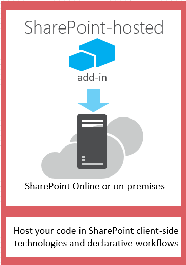
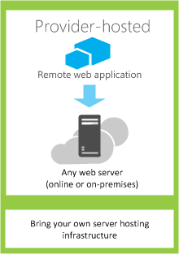
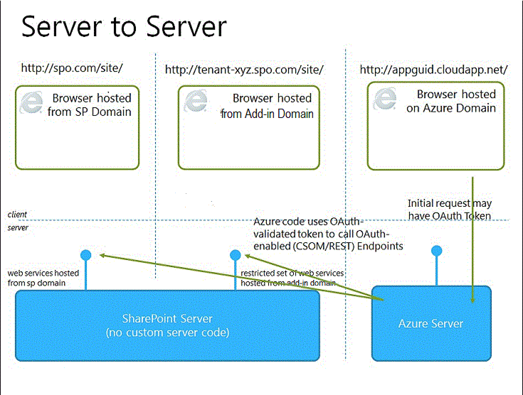

---
title: Choose patterns for developing and hosting your SharePoint Add-in
ms.date: 09/25/2017
ms.prod: sharepoint
---

# Choose patterns for developing and hosting your SharePoint Add-in
Learn about the different ways that you can host the components of SharePoint Add-ins.
 

 **Note**  The name "apps for SharePoint" is changing to "SharePoint Add-ins". During the transition, the documentation and the UI of some SharePoint products and Visual Studio tools might still use the term "apps for SharePoint". For details, see  [New name for apps for Office and SharePoint](new-name-for-apps-for-sharepoint.md#bk_newname).
 

The SharePoint add-in model introduces a wide range of hosting and development patterns. Some of these patterns can be used in combination with each other. For example, your add-ins can mix SharePoint-hosted and remotely hosted components. The most useful way to determine which patterns you'll want to use is to start with your own requirements, technologies, and goals and match them with the options and possibilities that are enabled by SharePoint Add-ins.
 

## What to think about when choosing your development pattern

SharePoint Add-ins widen the range of possible programming languages and technology stacks that you can use when you work with SharePoint resources and services. The precise range of options depends on both the type of add-in and the hosting pattern that you choose. It's also possible to mix patterns.
 

 

### SharePoint-hosted add-ins

Start with the simplest option: SharePoint-hosted add-ins, or add-ins where all components are hosted on either an on-premises or Office 365 SharePoint farm. SharePoint-hosted add-ins are installed on a SharePoint website, called the host web. They have their resources hosted on an isolated subsite of a host web, called the add-in web. It's important to know  [the difference between host webs and add-in webs](host-webs-add-in-webs-and-sharepoint-components-in-sharepoint.md). Figure 1 illustrates the basic architecture of a SharePoint-hosted add-in.
 

 

**Figure 1. SharePoint-hosted add-in architecture**

 

 

 
You can combine a SharePoint-hosted add-in with add-ins that have remotely hosted components, but any add-in or portion of an add-in that runs on an add-in web has the following set of requirements for three key components: where the add-in is hosted, how the add-in gets authorization, and what language it can use.
 

 

|**Component**|**SharePoint-hosted add-in requirement**|
|:-----|:-----|
|Where the add-in components are hosted|In the isolated add-in domain of your SharePoint farm|
|How the add-in gets authorized|The privileges of the signed-in user|
|What language the add-in can use|JavaScript (with the SharePoint JSOM library) + HTML|
This pattern is the easiest to deploy, and you can use the  [Create a basic SharePoint-hosted add-in by using Napa Office 365 Development Tools](create-a-basic-sharepoint-hosted-add-in-by-using-napa-office-365-development-too.md). You'll want to consider the following before deciding to create a SharePoint-hosted add-in.
 

 

|**Get these benefits**|**But consider this**|
|:-----|:-----|
|Reuse common SharePoint items, like lists and Web Parts.|You can use only JavaScript in the add-in—you can't use any server-side code.|
|Relatively easy to create and deploy, so they are good for small team productivity add-ins and business process automation, with lower complexity business rules.|Your add-in has only the authorization privileges of the signed-in user.|
 [Get started creating SharePoint-hosted SharePoint Add-ins](get-started-creating-sharepoint-hosted-sharepoint-add-ins.md)
 

 

### Provider-hosted add-ins

Provider-hosted SharePoint Add-ins include components that are deployed and hosted outside the SharePoint farm. They are installed to the host web, but their remote components are hosted on another server  *that should not be a server in the SharePoint farm*  . Figure 2 illustrates the basic architecture of a provider-hosted add-in.
 

 

**Figure 2. Provider-hosted add-in architecture**

 

 

 
The following table shows how the requirements for hosting location, add-in authorization, and languages are much less fixed for provider-hosted add-ins than they are for SharePoint-hosted add-ins.
 

 

|**Component**|**Provider-hosted add-in requirement**|
|:-----|:-----|
|Where the add-in components are hosted|Any web server or hosting service|
|How the add-in gets authorized|OAuth or the JavaScript cross-domain library|
|What language the add-in can use|Any language supported by your web server or hosting service|
A provider-hosted add-in interacts with a SharePoint site but also uses resources and services that are located on the remote site. You'll want to consider the following before deciding to create a provider-hosted add-in.
 

 

|**Get these benefits**|**But consider this**|
|:-----|:-----|
|Host the add-in on Microsoft Azure or any remote web platform, including non-Microsoft platforms. |You are responsible for creating the installation, upgrade, and uninstallation logic of the remote components.|
|Use one of the SharePoint client object models, the JavaScript cross-domain library, or the SharePoint  [REST/OData-based web service](http://msdn.microsoft.com/magazine/dn198245.aspx) to interact with SharePoint.|Each way of interacting with SharePoint has  [corresponding options for approaches to data access](secure-data-access-and-client-object-models-for-sharepoint-add-ins.md).|
|Gain authorization to SharePoint data using one of  [the three authorization systems](three-authorization-systems-for-sharepoint-add-ins.md).|You need to decide between OAuth and the cross-domain library to authorize your add-in's access to SharePoint.|

## Match your hosting pattern with your development goals

In addition to considering the technical advantages and constraints of each option, you'll also need to think about your development goals when deciding on a hosting pattern. You can use the following table to help sort out which hosting pattern best fits your needs.
 

 

|**Your requirements**|**Recommended Hosting pattern**|**Example**|
|:-----|:-----|:-----|
|Work with and provision new SharePoint entities exclusively|SharePoint-hosted|An add-in that includes a people picker control and that stores information about SharePoint users in a SharePoint list|
|Use existing SharePoint entities and interact with external (non-SharePoint) web services|Provider-hosted|An add-in that gets customer addresses from an existing SharePoint list in the host web and uses a mapping service in a web application to display their locations|
|Provision new SharePoint entities and interact with external web services|Combined SharePoint-hosted and provider-hosted|A mapping add-in that provisions a SharePoint list on the appweb so that it can store latitude and longitude coordinates for addresses that are supplied by the user or pulled from an existing SharePoint list|

## What to think about when choosing your hosting pattern for provider-hosted add-ins

SharePoint-hosted add-ins have a fixed hosting pattern, since they are hosted on the add-in web. Provider-hosted add-ins provide more flexibility for hosting the various components of your add-in, so if you choose to create one, you'll need to match your goals and requirements to the appropriate hosting pattern. 
 

 

### OAuth or the cross-domain library

One of the most important questions you need to ask when considering provider-hosted add-ins and how you'll build them is how the add-in will get authorization to interact with SharePoint. Provider-hosted add-ins give you two choices: the JavaScript cross-domain library and OAuth. 
 

 
The  [cross-domain library](access-sharepoint-data-from-add-ins-using-the-cross-domain-library.md) lets you interact with more than one domain from the remote components of your add-in through a proxy. If client-side code and the permissions of a user who is signed in to SharePoint are sufficient, the cross-domain library is a good option. The cross-domain library is also convenient whenever you are making remote calls through a firewall.
 

 
OAuth is an open protocol for authorization that enables secure authorization from client applications (desktop, web, and mobile applications) in an easily manageable way. If you plan to build a SharePoint Add-in that runs in a remote web application and communicates back to SharePoint, you will often need to use OAuth. OAuth is required whenever you are calling into SharePoint from a remotely hosted web application that can't use client-side code (HTML + JavaScript) exclusively.  [Learn more about how OAuth works in SharePoint Add-ins.](creating-sharepoint-add-ins-that-use-low-trust-authorization.md)
 

 
 [Secure data access and client object models for SharePoint Add-ins](secure-data-access-and-client-object-models-for-sharepoint-add-ins.md) and [Three authorization systems for SharePoint Add-ins](three-authorization-systems-for-sharepoint-add-ins.md) explain the choice between OAuth and the cross-domain library more thoroughly.
 

 

### OAuth with on-premises SharePoint farms

If you are using an on-premises deployment of SharePoint, you can use OAuth, but you will have to choose between creating high-trust add-ins and using an Office 365 tenancy. Office 365 uses Microsoft Azure Access Control Service (ACS) as the trust broker, and if you do not have access to an Office 365 tenancy, you'll need to use  [Create high-trust SharePoint Add-ins](create-high-trust-sharepoint-add-ins.md), which uses certificates to establish trust between your add-in and SharePoint. You can add high trust add-ins to the add-in catalog of your SharePoint farm, but you can't sell them in the Office Store. If you do have access to an Office 365 tenancy, you can link it to your on-premises installation of SharePoint and  [use ACS as the trust broker for add-ins that are installed to your on-premises SharePoint](use-an-office-365-sharepoint-site-to-authorize-provider-hosted-add-ins-on-an-on.md).
 

 
The following table lists all of the possible patterns for hosting both the SharePoint components and the remote components of your add-in, along with the trust brokers that are available to you if you're using OAuth. Note that you'll need access to an Office 365 tenant in order to use ACS to establish trust between SharePoint and a SharePoint Add-in that is installed to an on-premises installation of SharePoint.
 

 

|**SharePoint component location**|**Remote component location**|**Trust broker**|
|:-----|:-----|:-----|
|On premises|In cloud|ACS, certificate|
|On premises|On premises|ACS, certificate|
|Office 365 SharePoint site|In cloud|ACS|
|Office 365 SharePoint site|On premises|ACS|

## Combine provider hosting and SharePoint hosting

You can also build add-ins that include both SharePoint-hosted and cloud-hosted components. For example, you can create a  [cloud-hosted add-in that includes a custom SharePoint list and content type](create-a-provider-hosted-add-in-that-includes-a-custom-sharepoint-list-and-conte.md). If you choose to use this architecture, your design and approach must account for security limitations that are built into the model. You can use only JavaScript in the code components that are hosted by SharePoint, and the remotely hosted components must use either OAuth or the cross-domain library to interact with the SharePoint website. When considering this approach, make sure that you understand how  [add-in authorization works in SharePoint](authorization-and-authentication-of-sharepoint-add-ins.md). Figure 4 shows you how this architecture works if you use Microsoft Azure to host the remote components of your add-in, and you use OAuth.
 

 

**Figure 4. SharePoint add-in server-to-server communication when you use OAuth and Windows Azure**

 

 

 
 [Learn how to create an add-in that combines cloud hosting and SharePoint hosting.](create-a-provider-hosted-add-in-that-includes-a-custom-sharepoint-list-and-conte.md)
 

 
Here are some things to think about when you're considering a combination of provider hosting and SharePoint hosting.
 

 

|**Get these benefits**|**But consider this**|
|:-----|:-----|
|All the benefits of the two approaches.|More complex architecture requires careful planning around server-to-server communication and cross-site scripting restrictions.|

## Provider-hosted add-ins in Azure Web Roles

You can host a provider-hosted SharePoint Add-in on a Microsoft Azure web role instead of a web application (whether the web application is on-premises or a Azure Web Site). An Azure web role is, essentially, a website that's based on Internet Information Services (IIS) and hosted on Azure. You can take advantage of the hosting services and scalability of Azure web roles. You can also enhance the performance and usability of your SharePoint Add-in, especially if the add-in is heavily used or demand for it changes over time. If the SharePoint Add-in ever requires more server resources, Azure can dynamically allocate them to the add-in.
 

 
See the following links for more information about Azure web roles.
 

 

-  [What is a cloud service?](http://www.windowsazure.com/en-us/manage/services/cloud-services/what-is-a-cloud-service/)
    
 
-  [Introducing Microsoft Azure](http://www.windowsazure.com/en-us/develop/net/fundamentals/intro-to-windows-azure/)
    
 
-  [Autoscaling and Microsoft Azure](http://msdn.microsoft.com/en-us/library/hh680945%28v=pandp.50%29.aspx)
    
 
As a prerequisite, you will need the Microsoft Azure SDK for .NET (VS 2012) 1.8.1, which you can install by using the  [Web Platform Installer](http://www.microsoft.com/web/downloads/platform.aspx).
 

 
The way that you use create the project in vsnv depends on whether you start with a SharePoint Add-in project and then add the Azure web role project, or you start with the Azure project and then add the SharePoint project.
 

 

### Add a cloud service to an existing add-in

If you already have a provider-hosted SharePoint Add-in that you want to host on Azure, choose the web application project in the solution for the SharePoint Add-in. On the menu bar, choose  **Project**,  **Add Microsoft Azure Cloud Service Project**. A Azure project, called  _NameOfTheWebAppProject_.Azure, is added to the solution for your SharePoint Add-in. A web role for the web project is also added to the project for the Azure cloud service. The Office Developer Tools for Visual Studio 2012 sets the necessary project properties so that the web role can work with the SharePoint Add-in.
 

 

### Add an add-in to an existing web role

If you already have a web role in an Azure cloud service that you want to use as a host for a provider-hosted SharePoint Add-in, open the Azure cloud project in Visual Studio, and then, in  **Solution Explorer**, choose the web role project. On the menu bar, choose  **Project**,  **Add Add-in for SharePoint Project**. A project for a provider-hosted SharePoint Add-in is created, called  _NameOfTheWebAppProject_.Azure, and added to the solution. Visual Studio references the Azure web role as the web project host for the SharePoint Add-in.
 

 

## Additional resources

For more information, see the following resources:
 

 

-  [Important aspects of the SharePoint Add-in architecture and development landscape](important-aspects-of-the-sharepoint-add-in-architecture-and-development-landscap.md)
    
 
-  [SharePoint Add-ins](sharepoint-add-ins.md)
    
 
-  [Host webs, add-in webs, and SharePoint components in SharePoint](host-webs-add-in-webs-and-sharepoint-components-in-sharepoint.md)
    
 
-  [Authorization and authentication of SharePoint Add-ins](authorization-and-authentication-of-sharepoint-add-ins.md)
    
 
-  [Context Token OAuth flow for SharePoint Add-ins](context-token-oauth-flow-for-sharepoint-add-ins.md)
    
 
-  [Use an Office 365 SharePoint site to authorize provider-hosted add-ins on an on-premises SharePoint site](use-an-office-365-sharepoint-site-to-authorize-provider-hosted-add-ins-on-an-on.md)
    
 
-  [SharePoint Add-ins compared with SharePoint solutions](http://msdn.microsoft.com/library/0e9efadb-aaf2-4c0d-afd5-d6cf25c4e7a8%28Office.15%29.aspx)
    
 
-  [Get started creating provider-hosted SharePoint Add-ins](get-started-creating-provider-hosted-sharepoint-add-ins.md)
    
 
-  [Get started creating SharePoint-hosted SharePoint Add-ins](get-started-creating-sharepoint-hosted-sharepoint-add-ins.md)
    
 
-  [Create a provider-hosted add-in that includes a custom SharePoint list and content type](create-a-provider-hosted-add-in-that-includes-a-custom-sharepoint-list-and-conte.md)
    
 

