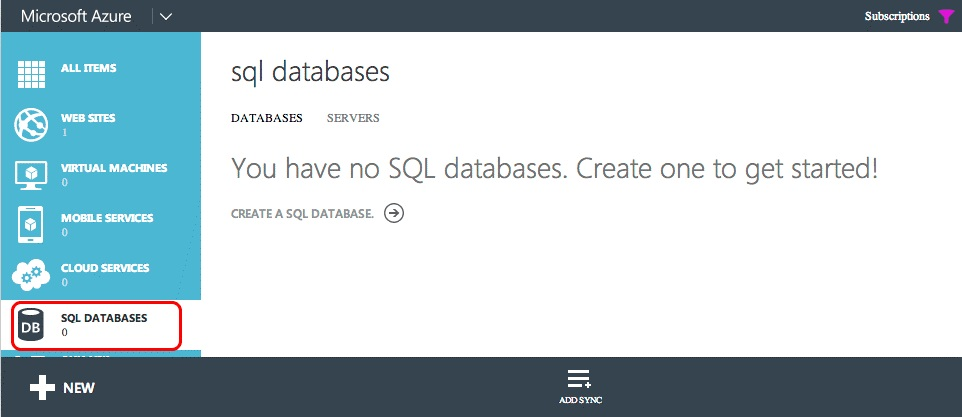
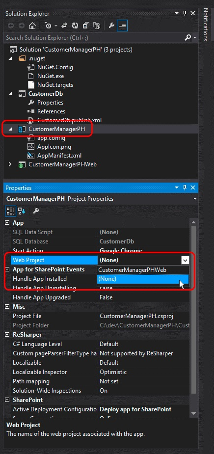

# Convert an autohosted SharePoint Add-in to a provider-hosted add-in
Learn how to convert an autohosted SharePoint Add-in to a provider-hosted add-in.
 

 

Microsoft SharePoint introduced a new approach to extending SharePoint sites in addition to the previous approach of using solution-based customizations. This new extensibility model for SharePoint, called the add-in model, enables developers to create custom implementations that can be deployed to SharePoint environments regardless of whether they are running in an on-premises, SharePoint Online, or hybrid deployment.
 

Developers can build two different types of SharePoint Add-ins. The first type, a SharePoint-hosted add-in, primarily runs in the browser; and all the assets that support it such as HTML, CSS, images and JavaScript are stored and served by SharePoint. The other types of add-ins fall into the Cloud Add-in model (CAM) and primarily run external to SharePoint on another server and communicate with SharePoint using the client-side object model (CSOM) and REST API. They establish an identity using the popular OAuth 2.0 protocol supported by SharePoint.
 

Developers could implement add-ins using the add-in model in one of two ways, either as a provider-hosted add-in or an autohosted add-in. Autohosted add-ins were released as a preview program when SharePoint released, but in May, 2014 Microsoft announced that they would be closing the preview program and would no longer support creating autohosted add-ins. For the announcement, see  [Update on Autohosted Add-ins Preview Program](http://blogs.office.com/2014/05/16/update-on-autohosted-apps-preview-program/).
 
This article explains how to convert and migrate an autohosted add-in to a provider-hosted add-in. However, it is important developers understand some specific differences between the two approaches because this knowledge greatly simplifies the conversion process.
 

## Prerequisites for converting an autohosted add-in to a provider-hosted add-in

- All of the  [prerequisites for developing provider-hosted add-ins](get-started-creating-provider-hosted-sharepoint-add-ins.md).
    
 
- Azure SDK v2.3. Install it from here  [this Download Center page](http://azure.microsoft.com/downloads).
    
 

### Core concepts to know

Before you convert an autohosted add-in to a provider-hosted add-in, you should have a basic understanding of SharePoint Add-ins and the differences among SharePoint-hosted, provider-hosted, and autohosted SharePoint Add-ins. The articles listed in Table 1 should give you that understanding.
 

 

**Table 1. Core concepts for converting an autohosted add-in to a provider-hosted add-in**

|**Article title**|**Description**|
|:-----|:-----|
| [SharePoint Add-ins](sharepoint-add-ins.md)|Learn about the new add-in model in SharePoint that enables you to create add-ins, which are small, easy-to-use solutions for end users.|
| [Important aspects of the SharePoint Add-in architecture and development landscape](important-aspects-of-the-sharepoint-add-in-architecture-and-development-landscap.md)|Learn about aspects of the architecture of SharePoint Add-ins and the model for SharePoint Add-ins, including the add-in hosting options, user interface (UI) options, deployment system, security system, and lifecycle.|
| [Choose patterns for developing and hosting your SharePoint Add-in](choose-patterns-for-developing-and-hosting-your-sharepoint-add-in.md)|Learn about the various ways that you can host SharePoint Add-ins.|
| [Host webs, add-in webs, and SharePoint components in SharePoint](host-webs-add-in-webs-and-sharepoint-components-in-sharepoint.md)|Learn about the distinction between host webs and add-in webs. Also find out which SharePoint components can be included in a SharePoint Add-in, which are deployed to the host web, which are deployed to the add-in web, and how the add-in web is deployed in an isolated domain.|

## Converting the add-in

Converting an autohosted SharePoint Add-in to a provider-hosted add-in involves modifying two or three components.
 

 

- The SharePoint add-in itself
    
 
- The remote web application or services
    
 
- The Microsoft Azure SQL Database, if any, in the add-in
    
 
A SharePoint autohosted add-in deployed the Azure Web Site and Microsoft Azure SQL Database automatically when it was installed, however provider-hosted add-ins can have their remote web application and other services exist in any web platform. This article assumes that the remote components autohosted add-in are going to be remain as Azure services following the conversion to a provider-hosted add-in.
 

 
The following sections walk through the process of converting an autohosted add-in to a provider-hosted add-in. The example autohosted add-in that is used - Customer Manager - is simple, in order to focus on the conversion steps and not the actual add-in. It consists of three projects:
 

 

- CustomersDb: A SQL database project that will generate the necessary *.dacpac. Note there is no schema defined in this project. It is simply used to create a database because the schema is created by the ASP.NET web application.
    
 
- CustomerManagerAH: A SharePoint autohosted add-in that is configured to include the ASP.NET web application project and Azure SQL data-tier application in the resulting SharePoint add-in package.
    
 
- CustomerManagerAHWeb: An ASP.NET MVC web application that uses the Entity Framework Code First with Migrations approach to create the database schema as well as read and write to the database.
    
 
The add-in is an ASP.NET MVC web application that can both show the customers from a table in an Microsoft Azure SQL Database as well as add new customers. This is an anonymous web application that will allow anyone to view or add customers. The Visual Studio solution for the autohosted add-in and associated projects can be downloaded from the following public repository:  [Autohosted-Migration-Code-Samples](https://github.com/OfficeDev/Auto-Hosted-Migration-Code-Samples).
 

 
Converting a SharePoint autohosted add-in to a provider-hosted add-in involves multiple steps. Each is outlined in the following sections.
 

 

1. Deploy the Microsoft Azure SQL Database
    
 
2. Create the Azure Web Site to host the remote web application
    
 
3. Register the add-in with your SharePoint site
    
 
4. Update and deploy the Azure Web Site for the remote web application
    
 
5. Update and deploy the SharePoint provider-hosted add-in
    
 

### Deploy the Azure SQL Database

The first step in converting the autohosted add-in to a provider-hosted add-in is to deploy the Microsoft Azure SQL Database that the ASP.NET web application will rely on. There are many different ways to create a Microsoft Azure SQL Database, some of which are documented on the Microsoft Azure documentation site:  [How to Deploy a Database to Azure](http://azure.microsoft.com/documentation/articles/sql-database-deploy/).
 

 
The approach outlined in the following steps uses the data-tier application deployment model because that is how the database is deployed in a SharePoint autohosted add-in. This involves generating a data-tier application package (*.dacpac) and using it to create the database.
 

 

#### Creating and Deploying the Azure SQL Database

First open the autohosted solution in Visual Studio. Right-click the database project  **CustomerDb** and select **Build**. This will generate the CustomerDb.dacpac file in the  `[..]\bin\[debug | release]` folder.
 

 
The next step is to create a new Microsoft Azure SQL Database. Login to the  **Azure Management Portal** (https://manage.windowsazure.com) and once the dashboard loads, select the SQL DATABASES link in the margin:
 

 

**Azure SQL Database dashboard in the Azure Management Portal**

 

 

 
Click the  **SERVERS** link in the top navigation and then click the **ADD** button in the footer as shown in the following figure:
 

 

**Azure SQL Database dashboard in the Azure Management Portal**

 

 

 
In the  **CREATE SERVER** dialog that appears, select the Azure **SUBSCRIPTION**, the  **LOGIN NAME** and **PASSWORD** for the user who will have rights to the server and select the same **REGION** used when creating the Azure Web Site previously. Make a note of the login name and password as those will be needed in a later step.
 

 

**Creating an Azure SQL Database in the Azure Management Portal**

 

 

 
Once the form is filled out, click the  **check icon** in the lower right to create the database. While the server is now created, the only resource that can access it are other Azure services. Make a note of the name of the Microsoft Azure SQL Database because this will be needed in a later step.
 

 
In order to connect to the Microsoft Azure SQL Database and deploy the database, a firewall rule must be created that allows traffic from the computer that will deploy the database. Otherwise connections to the Microsoft Azure SQL Database will be refused with errors similar to the one in the following figure:
 

 

**Error Connecting to an Azure SQL Database**

 

 

 
To create a firewall rule, within the  **Azure Management Portal**, select the Microsoft Azure SQL Database previously created and then click the  **CONFIGURE** link in the top navigation. Under the **Allowed IP Addresses** section, your IP address is currently shown as shown in the following figure. Click **ADD TO THE ALLOWED IP ADDRESSES** to add a firewall rule. Doing so will allow connections to the Microsoft Azure SQL Database and deployment of the database. Make sure to click the **Save** button in the footer.
 

 

**Creating a firewall rule for an Azure SQL Database in the Azure Management Portal**

 

 

 
The next step is to deploy the database. This can be done from Visual Studio using the Azure SDK v2.3. Install it from  [this Download Center page](http://azure.microsoft.com/downloads). Within Visual Studio, open the  **SQL Server Object Explorer** tool window, right-click the **SQL Server** node and select **Add SQL Server**:
 

 

**Adding an Azure SQL Database in Server Explorer**

 

 

 
In the  **Connect to Server** dialog, enter the **Server Name**, set the  **Authentication** to **SQL Server Authentication** and enter the same **Login** and **Password** defined when creating the Microsoft Azure SQL Database. The server name should be the fully qualified name of the server which is `[server-name].database.windows.net`, as shown in the following figure:
 

 

**Connecting to an Azure SQL Database in Visual Studio**

 

 

 
After connecting to the Microsoft Azure SQL Database, expand the node for the newly added server, right-click on the  **Databases** node and select **Publish Data-tier Application** to bring up the publishing wizard.
 

 
In the section  **Source Data-tier Application (.dacpac)**, use the  **Browse** button to find the *.dacpac file generated from when the database project was built in a previous step and ensure the **Database Name** is set toCustomerDb, then click  **Publish** to publish the CustomerDb in the Microsoft Azure SQL Database.
 

 

**Publishing a Data-tier Application to an Azure SQL Database using Visual Studio**

 

 

 
Refresh the Visual Studio  **SQL Server Object Explorer** tool window to see the CustomerDb listed under the **Databases** node.
 
> [!NOTE] 
> Depending on how the database was created for the autohosted add-in, some extra work might be necessary to deploy it to Azure. Refer to the following articles in MSDN for additional guidance: [Converting between Data-tier Application Projects and Database Projects](http://msdn.microsoft.com/library/40b51f5a-d52c-44ac-8f84-037a0917af33.aspx) [Creating &amp; Managing Data-Tier Application](http://msdn.microsoft.com/library/18907b6c-7678-4182-9304-fe56fdb9f0bd.aspx)
 

#### Post-deployment actions

Once the Microsoft Azure SQL Database has been created, make a copy of the connection string used to establish a connection to the database. This can be obtained two ways. One way is to login to the  **Azure Management Portal** (https://manage.windowsazure.com) and navigate to the Microsoft Azure SQL Database created in the last step: CustomerDb. On the **DASHBOARD** page for the database, click the link **Show Connection Strings** to see a list of connection strings. Make a copy of the **ADO.NET** connection string for later use.
 

 

**Obtaining Azure SQL Database Connection Strings from the Azure Management Portal**

 

 

 
The other way to get the connection string is from within Visual Studio, provided the Azure SDK v2.3 is installed. Within the  **SQL Server Object Explorer** tool window in Visual Studio, select the database **CustomerDb**. Once the database is selected, look at the  **Properties** tool window to see connection string. This is the same value found in the **Azure Management Portal** above.
 

 

**Obtaining Azure SQL Database Connection Strings from Visual Studio via the Azure SDK**

 

 

 

 

 

### Create an Azure Web Site

The next step is to create a new Azure Web Site where the remote web application will reside for the provider-hosted add-in. This has to be done first because the URL of the remote web application is needed before registering the add-in. However, the registration of the add-in in SharePoint should precede the deployment of the files for the ASP.NET web application because there are two outputs from the registration process (the Client ID and Client Secret) that are needed prior to the deployment of the ASP.NET web application files.
 

 
To create a new Azure Web Site, first login to the  **Azure Management Portal** (https://manage.windowsazure.com). When the dashboard loads, click the **WEB SITES** navigation link in the left-hand margin, and then the **NEW** button in the footer as shown in the following figure:
 

 

**Azure Web Site dashboard in the Azure Management Portal**

 

 

 
Next, in the new web site wizard, select  **COMPUTE**,  **WEB SITE**,  **QUICK CREATE** and then specify a **URL** and **WEB HOSTING PLAN**. Finally specify the  **REGION** where the web site should be created. Make sure to remember the region selected because the same region should be used for the Microsoft Azure SQL Database created later. In addition, if a web hosting plan does not already exist or a new one is desired, select the option **Create new web hosting plan**. The following figure shows an example:
 

 

**Creating an Azure Web Site in the Azure Management Portal**

 

 

 
After creating the Azure Web Site, make a note of the URL that is used for the site. In the figures above, the site created is  `http://spahapptoph.azurewebsites.net`. 
 

 

### Register a new add-in

All SharePoint Add-ins created using the add-in model must be registered with the hosting SharePoint farm or tenancy in order to establish a trust between SharePoint and the remote web application. This involves registering a new add-in principal with SharePoint specifying the following values:
 

 

-  **Client ID** - the add-in ID
    
 
-  **Client Secret** - the add-in password
    
 
-  **Title** - the name of the add-in
    
 
-  **Add-in Domain** - the top-level domain of the remote web application
    
 
When an autohosted add-in is installed in SharePoint Online, Office 365 creates the add-in principal automatically. It knows the URL of the remote web application because it creates the site automatically. It also takes the client ID and client secret and adds them to the remote web application's web.config. The web.config is where a class provided by Microsoft (in the TokenHelper.cs or .vb file) will look for them when validating requests and authenticating with SharePoint.
 

 
However, in a provider-hosted add-in, the developer has to manually register the add-in and manually update the web.config in the ASP.NET web project.
 

 
To register a new add-in, browse to the add-in registration page of the SharePoint website's where the add-in will be installed. This page is found at  `http://[SharePoint-site-url]/_layouts/15/appregnew.aspx`. On the add-in registration page, set the  **Add-in Type** to **An add-in running on a web server** and click the two **Generate** buttons to create a new **Client Id** and **Client Secret**. Enter the name of the add-in in the  **Title** field and the URL of the target Azure Web Site created it the previous step in the **Add-in Domain** field. Finally, click the **Create** button.
 

 
After the add-in has been registered, SharePoint will display a summary of the information that was used in the form to create the registration. It is very important that this information is copied for safekeeping, specifically the Client Id and Client Secret, because these are needed in a later step.
 

 

### Remote web application / Azure Web Site configuration changes

The next step is to reconfigure the remote web application so that it can be deployed as a provider-hosted add-in instead of an autohosted add-in. There are multiple ways to deploy an ASP.NET site to an Azure Web Site including deploying it straight from Visual Studio, automatically from source control like Visual Studio Online, or from GitHub, or even by using the tried and true FTP option. In this article Visual Studio is used. However before the web application can be deployed, it first needs a few updates in order to work with the provider-hosted add-in.
 

 

#### Update the remote web application project

The big change that needs to occur in the ASP.NET MVC web application is within the web.config file. Within this file there are three settings found within the  **<appSettings>** node. These are the **ClientId**,  **ClientSecret**, and  **SqlAzureConnectionString**. The first two are used by the Microsoft-provided class, in TokenHelper.cs or .vb, to facilitate authenticating and communicating with SharePoint from the remote web application. The latter,  `SqlAzureConnectionString`, is used by the add-in to connect to the Microsoft Azure SQL Database.
 

 
In a SharePoint autohosted add-in, Office 365 fills in the values for these settings when the Azure Web Site and Microsoft Azure SQL Database are created when the add-in is installed. However in a provider-hosted add-in these must be manually set before the add-in is deployed.
 

 
One option is to paste in the values for the three settings from the steps above, but the disadvantage with this approach is that if they ever need to be changed, the web.config will need to be manually updated and redeployed to the Azure Web Site.
 

 
Another option is to simply clear these settings (leave the settings keys in place, just set the  **value=""** attribute to an empty string) and instead define them in the Azure Web Site settings through the **Azure Management Portal**. This approach means that the settings can be changed without updating the codebase.
 

 
To do this, login to the  **Azure Management Portal** (https://manage.windowsazure.com) and navigate to the Azure Web Site created in the previous steps. On the Azure Web Site dashboard page, click **CONFIGURE** in the top navigation menu and then scroll down to the **add-in settings** section. Add three new add-in settings using the same same setting names from the web.config file. Use the values obtained in the previous steps for ClientId, ClientSecret, and SqlAzureConnectionString.
 

 
Make sure the Microsoft Azure SQL Database connection string is correct and valid because, when the connection string is exposed through the  **Azure Management Portal** and Visual Studio, the password attribute is replaced with a mask. The masked password in the connection string should be changed to use the correct password defined when creating the login for the Microsoft Azure SQL Database.
 

 

#### Deploying the Remote web application to the Azure Web Site

Now the ASP.NET MVC web application files need to be deployed to the Azure Web Site as the remote web application. Within Visual Studio, right-click the web project and select  **Publish**. This will launch the  **Publish Web** wizard dialog. In this dialog select the option **Windows Azure Web Sites** and click **Publish**.
 

 

**Visual Studio's Publish Web Dialog**

 

 

 
In the next step, select the name of the Azure Web Site that was created in a previous step as shown in the following figure, click  **OK**, and ensure the URL of the site is HTTPS.
 

 

**Publishing the ASP.NET web application to an existing Azure Web Site**

 

 

 
In the last step, click the button  **Validate Connection** to ensure the settings and connection is in good working order and finally click **Publish**. This will trigger Visual Studio to deploy the ASP.NET web application to the Azure Web Site. 
 

 
After deploying the website, Visual Studio will launch the default debugging browser and navigate to the Azure Web Site. However the site will render with an error. This is because the ASP.NET MVC controllers are decorated with an attribute (specifically the  `SharePointContextFilter`) that expects SharePoint to send certain values to the controller in the header of an HTTP POST request, but by default the browser launched an HTTP GET request, so this error is expected.
 
> [!NOTE] 
> Refer to the Azure documentation for additional options for deploying ASP.NET web applications to an Azure Web Site:  [How to Deploy a Microsoft Azure Web Site](http://azure.microsoft.com/documentation/articles/web-sites-deploy).
 

#### Post-deployment actions

The next step is to copy the URL of the site.
 

 

#### Custom Domains and SSL Certificates for Azure Web Sites

All Azure Web Sites use the following naming convention:  `http[s]://[site-name].azurewebsites.net`. Microsoft has already added a wildcard SSL certificate to all web sites under the  `*.azurewebsites.net` domain, but customers are free to associate a custom domain with their Azure Web Site as well as use their own SSL certificates for these custom domains.
 

 
For information on using custom domains, refer to the Azure documentation:  [Configure a Custom Domain Name for a Microsoft Azure Web Site](http://azure.microsoft.com/documentation/articles/web-sites-custom-domain-name). For information on adding a custom SSL certificate for your custom domain name, refer to the Azure documentation:  [Enable HTTPS for a Microsoft Azure Web Site](http://azure.microsoft.com/documentation/articles/web-sites-configure-ssl-certificate).
 

 

### Reconfiguring the SharePoint Add-in Project

The last step is to reconfigure the SharePoint add-in project. The Visual Studio project for the SharePoint add-in has the add-in type configured to autohosted. First change this from autohosted to provider-hosted by opening the AppManifest.xml file in the SharePoint add-in project and change the  **Hosting Type** option from **Autohosted** to **Provider-hosted**. 
 

 
In addition, set the  **Start Page** of the add-in to point to the URL of the remote web application's start page which is the URL of the Azure Web Site. Make sure to include the query string value{StandardTokens}, if it isn't already there. This ensures that SharePoint adds the core query string tokens to the URL when it opens the remote web application.
 

 
Next, remove the reference in the SharePoint add-in project to the ASP.NET MVC web application by selecting the SharePoint add-in project in Visual Studio  **Solution Explorer** and within the **Properties** tool window, set the **Web Project** property to **(None)**, as shown in figure 20:
 

 

**Removing the remote web application from the SharePoint add-in package**

 

 

 
The last step requires a manual update to the AppManifest.xml file because some settings are not exposed within the designer. Do this by saving any existing changes to the AppManifest.xml file, and then right-click the same file in  **Solution Explorer** and select **View Code**.
 

 

**Opening the AppManifest.xml file in the code view**

 

 

 
Within the code view of the AppManifest.xml file, remove the two references to the ASP.NET MVC web application project and the SQL data-tier application project as they are not needed within a SharePoint provider-hosted add-in.
 

 
Next, create a new GUID and replace the existing GUID in the  **ProductId** attribute. This will tell SharePoint this is a new add-in, not an update to an existing add-in.
 

 

    
 **Important**  If the existing ProductId was used SharePoint would return the error "The provided add-in differs from another add-in with the same version and product ID" when the converted add-in is installed.
 

Then find the  **<RemoteWebApplication>** element and update the **ClientId** attribute to be the same GUID that was obtained when registering the add-in with SharePoint and that was used in the Azure Web Site's web.config add-in settings.
 

 

**Setting the ClientId for a SharePoint provider-hosted add-in**

 

 

 
After saving all changes to the AppManifest.xml file, the add-in is now ready for testing as a SharePoint provider-hosted add-in. Deploy the add-in to a SharePoint farm or SharePoint Online site to verify the conversion steps were performed correctly.
 

 

## Other resources

For more information on the SharePoint add-in model, SharePoint-hosted add-ins or the add-in model, follow the  [Office Developer Blog](http://blogs.office.com/dev/) for news and updates on development tools, scripts and utilities to assist in creating SharePoint add-ins and migrating from autohosted add-ins to provider-hosted add-ins.
 

 

