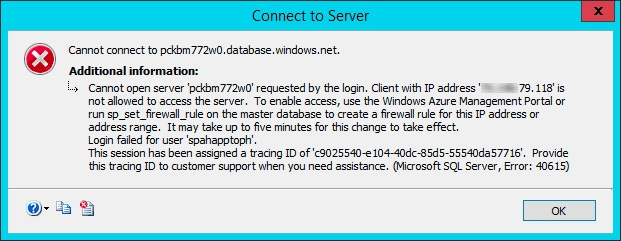
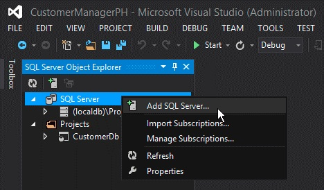
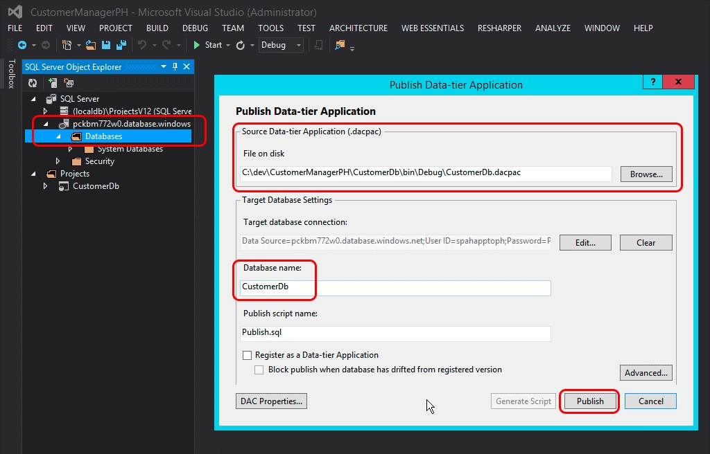
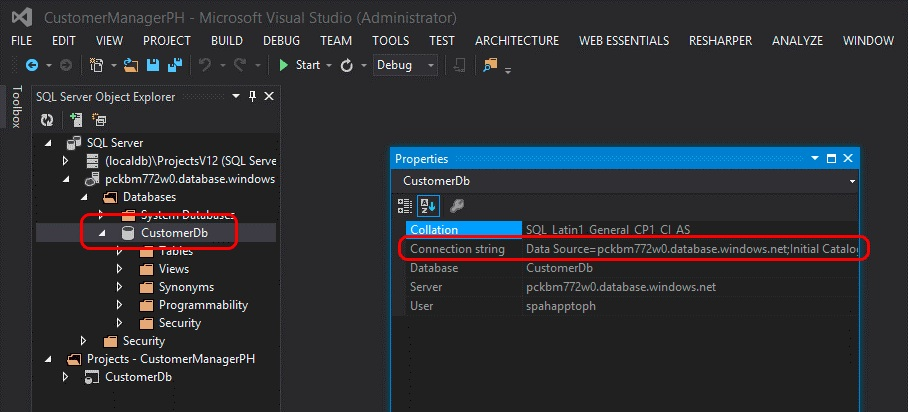

# Convert an autohosted SharePoint Add-in to a provider-hosted add-in

Microsoft SharePoint introduced a new approach to extending SharePoint sites in addition to the previous approach of using solution-based customizations. This new extensibility model for SharePoint, called the add-in model, enables developers to create custom implementations that can be deployed to SharePoint environments regardless of whether they are running in an on-premises, SharePoint Online, or hybrid deployment.
 
Developers can build two different types of SharePoint Add-ins. The first type, a SharePoint-hosted add-in, primarily runs in the browser, and all the assets that support it such as HTML, CSS, images, and JavaScript are stored and served by SharePoint. The other types of add-ins fall into the Cloud Add-in model (CAM) and primarily run external to SharePoint on another server and communicate with SharePoint by using the client-side object model (CSOM) and REST API. They establish an identity using the popular OAuth 2.0 protocol supported by SharePoint.

Developers could implement add-ins by using the add-in model in one of two ways, either as a provider-hosted add-in or an autohosted add-in. Autohosted add-ins were released as a preview program when SharePoint released, but in May 2014, Microsoft announced that they would be closing the preview program and would no longer support creating autohosted add-ins. For the announcement, see [Update on Autohosted Add-ins Preview Program](https://blogs.office.com/en-us/2014/05/16/update-on-autohosted-apps-preview-program/).
 
This article explains how to convert and migrate an autohosted add-in to a provider-hosted add-in. However, it is important developers understand some specific differences between the two approaches because this knowledge greatly simplifies the conversion process.

## Prerequisites for converting an autohosted add-in to a provider-hosted add-in

- All the [prerequisites for developing provider-hosted add-ins](get-started-creating-provider-hosted-sharepoint-add-ins.md)

- [Azure SDK for .NET 2.3](https://azure.microsoft.com/en-us/downloads/dotnet-sdk-23/)
    
 

### Core concepts to know before you convert an autohosted add-in

Before you convert an autohosted add-in to a provider-hosted add-in, you should have a basic understanding of SharePoint Add-ins and the differences among SharePoint-hosted, provider-hosted, and autohosted SharePoint Add-ins. The articles listed in the following table should give you that understanding.

|**Article title**|**Description**|
|:-----|:-----|
| [SharePoint Add-ins](sharepoint-add-ins.md)|Learn about the new add-in model in SharePoint that enables you to create add-ins, which are small, easy-to-use solutions for end users.|
| [Important aspects of the SharePoint Add-in architecture and development landscape](important-aspects-of-the-sharepoint-add-in-architecture-and-development-landscap.md)|Learn about aspects of the architecture of SharePoint Add-ins and the model for SharePoint Add-ins, including the add-in hosting options, user interface (UI) options, deployment system, security system, and lifecycle.|
| [Choose patterns for developing and hosting your SharePoint Add-in](choose-patterns-for-developing-and-hosting-your-sharepoint-add-in.md)|Learn about the various ways that you can host SharePoint Add-ins.|
| [Host webs, add-in webs, and SharePoint components in SharePoint](host-webs-add-in-webs-and-sharepoint-components-in-sharepoint.md)|Learn about the distinction between host webs and add-in webs. Also find out which SharePoint components can be included in a SharePoint Add-in, which are deployed to the host web, which are deployed to the add-in web, and how the add-in web is deployed in an isolated domain.|

### Converting the add-in

Converting an autohosted SharePoint Add-in to a provider-hosted add-in involves modifying two or three components:

- The SharePoint add-in itself
- The remote web application or services
- The Microsoft Azure SQL Database, if any, in the add-in
    

A SharePoint autohosted add-in deployed to the Azure website and Azure SQL Database automatically when it was installed; however, provider-hosted add-ins can have their remote web application and other services exist on any web platform. This article assumes that the remote components in an autohosted add-in will remain as Azure services following the conversion to a provider-hosted add-in.

The following sections walk through the process of converting an autohosted add-in to a provider-hosted add-in. The example autohosted add-in that is used, **Customer Manager**, is simple, in order to focus on the conversion steps and not the actual add-in. It consists of three projects:

- **CustomersDb**: A SQL database project that generates the necessary *.dacpac. Note that there is no schema defined in this project. It is simply used to create a database because the schema is created by the ASP.NET web application.

- **CustomerManagerAH**: A SharePoint autohosted add-in that is configured to include the ASP.NET web application project and Azure SQL data-tier application in the resulting SharePoint add-in package.

- **CustomerManagerAHWeb**: An ASP.NET MVC web application that uses the "Entity Framework Code First with Migrations" approach to create the database schema as well as read and write to the database.
    
The add-in is an ASP.NET MVC web application that can both show the customers from a table in an Azure SQL Database as well as add new customers. This is an anonymous web application that allows anyone to view or add customers. The Visual Studio solution for the autohosted add-in and associated projects can be downloaded from the following public repository:  [Autohosted-Migration-Code-Samples](https://github.com/OfficeDev/Auto-Hosted-Migration-Code-Samples).

Converting a SharePoint autohosted add-in to a provider-hosted add-in involves multiple steps. Each is outlined in the following sections:

1. Deploy the Azure SQL Database

2. Create the Azure website to host the remote web application

3. Register the add-in with your SharePoint site

4. Update and deploy the Azure website for the remote web application

5. Reconfigure the SharePoint Add-in project

## Deploy the Azure SQL Database

The first step in converting the autohosted add-in to a provider-hosted add-in is to deploy the Azure SQL Database that the ASP.NET web application relies on. There are many different ways to create an Azure SQL Database, some of which are documented on the Azure documentation site: [SQL Server database migration to SQL Database in the cloud](https://docs.microsoft.com/en-us/azure/sql-database/sql-database-cloud-migrate).

The approach outlined in the following steps uses the data-tier application deployment model because that is how the database is deployed in a SharePoint autohosted add-in. This involves generating a data-tier application package (*.dacpac) and using it to create the database.

### To create the Azure SQL Database

1. Open the autohosted solution in Visual Studio. 

2. Right-click the database project **CustomerDb**, and then select **Build**. This generates the CustomerDb.dacpac file in the `[..]\bin\[debug | release]` folder.
 
3. Create a new Azure SQL Database. Sign in to the [Azure portal](https://ms.portal.azure.com), and after the dashboard loads, select the **SQL DATABASES** link in the margin.

    

     
 
4. Select the **SERVERS** link in the top navigation, and then select the **ADD** button in the footer as shown in the following figure.

    

     
 
5. In the **CREATE SERVER** dialog that appears, select the Azure **SUBSCRIPTION**, the **LOGIN NAME**, and **PASSWORD** for the user who will have rights to the server, and select the same **REGION** used when creating the Azure website previously. Make a note of the Login name and password because you will need them in a later step.

    

     
 
6. After the form is filled out, select the check icon in the lower-right to create the database. While the server is now created, the only resources that can access it are other Azure services. Make a note of the name of the Azure SQL Database because you will need this in a later step.

### To deploy the Azure SQL Database

1. In order to connect to the Azure SQL Database and deploy the database, a firewall rule must be created that allows traffic from the computer that deploys the database. Otherwise, connections to the Azure SQL Database will be refused with errors similar to the one in the following figure.

    

     
 
2. To create a firewall rule, within the Azure portal, select the Azure SQL Database previously created and then select the **CONFIGURE** link in the top navigation. 

3. Under the **allowed IP addresses** section, your IP address is currently shown as it appears in the following figure. Select **ADD TO THE ALLOWED IP ADDRESSES** to add a firewall rule. Doing so allows connections to the Azure SQL Database and deployment of the database. Select **Save** in the footer.

    

     
 
4. Deploy the database from Visual Studio by using the [Azure SDK for .NET 2.3](https://azure.microsoft.com/en-us/downloads/dotnet-sdk-23/). 

5. Within Visual Studio, open the **SQL Server Object Explorer** tool window, right-click the **SQL Server** node, and then select **Add SQL Server**.

    

     
 
6. In the **Connect to Server** dialog, enter the **Server Name**, set the **Authentication** to **SQL Server Authentication**, and enter the same **Login** and **Password** defined when creating the Azure SQL Database. The server name should be the fully qualified name of the server, which is `[server-name].database.windows.net`, as shown in the following figure.

    

     
 
7. After connecting to the Azure SQL Database, expand the node for the newly added server, right-click the **Databases** node, and then select **Publish Data-tier Application** to bring up the publishing wizard.
 
8. In the section **Source Data-tier Application (.dacpac)**, use the **Browse** button to find the *.dacpac file generated when the database project was built in a previous step, and verify that the **Database name** is set to **CustomerDb**. 

9. Select **Publish** to publish the CustomerDb in the Azure SQL Database.

    

     
 
10. Refresh the Visual Studio **SQL Server Object Explorer** tool window to see the CustomerDb listed under the **Databases** node.
 
> [!NOTE] 
> Depending on how the database was created for the autohosted add-in, some extra work might be necessary to deploy it to Azure. For more information, see [Creating and managing databases and data-tier applications in Visual Studio](https://msdn.microsoft.com/library/40b51f5a-d52c-44ac-8f84-037a0917af33.aspx) [Creating and Managing Data-tier Applications](https://msdn.microsoft.com/library/18907b6c-7678-4182-9304-fe56fdb9f0bd.aspx)

### Post-deployment actions

After the Azure SQL Database has been created, make a copy of the connection string used to establish a connection to the database. This can be obtained in two ways. 

- One way is to sign in to the [Azure portal](https://ms.portal.azure.com) and go to the Azure SQL Database created in the last step: CustomerDb. On the **DASHBOARD** page for the database, select the link **Show Connection Strings** to see a list of connection strings. Make a copy of the **ADO.NET** connection string for later use.

    

     
 
- The other way to get the connection string is from within Visual Studio, provided the Azure SDK v2.3 is installed. Within the **SQL Server Object Explorer** tool window in Visual Studio, select the database **CustomerDb**. After the database is selected, look at the **Properties** tool window to see the connection string. This is the same value found in the Azure portal.

    

     
 
## Create an Azure website

The next step is to create a new Azure website where the remote web application will reside for the provider-hosted add-in. This has to be done first because the URL of the remote web application is needed before registering the add-in. However, the registration of the add-in in SharePoint should precede the deployment of the files for the ASP.NET web application because there are two outputs from the registration process (the Client ID and Client Secret) that are needed prior to the deployment of the ASP.NET web application files.
 
### To create a new Azure website

1. Sign in to the [Azure portal](https://ms.portal.azure.com). When the dashboard loads, click the **websiteS** navigation link in the left margin, and then select the **NEW** button in the footer as shown in the following figure.

    

     
 
2. In the New website Wizard, select **COMPUTE**, **website**, and **QUICK CREATE**, and then specify a **URL** and **WEB HOSTING PLAN**. Finally specify the **REGION** where the website should be created. Make sure to remember the region selected because the same region should be used for the Azure SQL Database created later. 

3. If a web hosting plan does not already exist or a new one is desired, select the option **Create new web hosting plan**. The following figure shows an example.

    

     
 
4. After creating the Azure website, make a note of the URL that is used for the site. In the preceding figures, the site created is `http://spahapptoph.azurewebsites.net`. 

## Register a new add-in

All SharePoint Add-ins created by using the add-in model must be registered with the hosting SharePoint farm or tenancy to establish a trust between SharePoint and the remote web application. This involves registering a new add-in principal with SharePoint specifying the following values:

- **Client ID**: the add-in ID
- **Client Secret**: the add-in password
- **Title**: the name of the add-in
- **Add-in Domain**: the top-level domain of the remote web application

When an autohosted add-in is installed in SharePoint Online, Office 365 creates the add-in principal automatically. It knows the URL of the remote web application because it creates the site automatically. It also takes the Client ID and Client Secret and adds them to the remote web application's web.config. The web.config is where a class provided by Microsoft (in the TokenHelper.cs or .vb file) looks for them when validating requests and authenticating with SharePoint.

However, in a provider-hosted add-in, the developer has to manually register the add-in and manually update the web.config in the ASP.NET web project.

### To register a new add-in

1. Browse to the add-in registration page of the SharePoint website where the add-in will be installed. This page is found at `http://[SharePoint-site-url]/_layouts/15/appregnew.aspx`. 

2. On the add-in registration page, set the **Add-in Type** to **An add-in running on a web server**, and select the two **Generate** buttons to create a new **Client ID** and **Client Secret**. 

3. Enter the name of the add-in in the **Title** field, and enter the URL of the target Azure website created in the previous step in the **Add-in Domain** field. Finally, select the **Create** button.
 
4. After the add-in has been registered, SharePoint displays a summary of the information that was used in the form to create the registration. It is very important that this information is copied for safekeeping, specifically the Client ID and Client Secret, because these are needed in a later step.

## Update and deploy the Azure website for the remote web application

The next step is to reconfigure the remote web application so that it can be deployed as a provider-hosted add-in instead of an autohosted add-in. There are multiple ways to deploy an ASP.NET site to an Azure website, including deploying it straight from Visual Studio, automatically from source control such as [Visual Studio Team Services](https://www.visualstudio.com/vso/), from GitHub, or even by using the tried and true FTP option. In this article, Visual Studio is used. However before the web application can be deployed, it first needs a few updates to work with the provider-hosted add-in.

### To update the remote web application project

The big change that needs to occur in the ASP.NET MVC web application is within the web.config file. Within this file there are three settings found within the **<appSettings>** node. These are the **ClientId**, **ClientSecret**, and **SqlAzureConnectionString**. The first two are used by the Microsoft-provided class, in TokenHelper.cs or .vb, to facilitate authenticating and communicating with SharePoint from the remote web application. The latter,  **SqlAzureConnectionString**, is used by the add-in to connect to the Azure SQL Database.

In a SharePoint autohosted add-in, Office 365 fills in the values for these settings when the Azure website and Azure SQL Database are created when the add-in is installed. However, in a provider-hosted add-in, these must be manually set before the add-in is deployed.

One option is to paste in the values for the three settings from the steps earlier in this article, but the disadvantage with this approach is that if they ever need to be changed, the web.config will need to be manually updated and redeployed to the Azure website.

Another option is to simply clear these settings (leave the settings keys in place, just set the **value=""** attribute to an empty string) and instead define them in the Azure website settings through the Azure portal. This approach means that the settings can be changed without updating the codebase. To do this:

1. Sign in to the [Azure portal](https://ms.portal.azure.com) and go to the Azure website created in the previous steps. 

2. On the Azure website dashboard page, select **CONFIGURE** in the top navigation menu, and then scroll down to the **add-in settings** section. 

3. Add three new add-in settings by using the same setting names from the web.config file. Use the values obtained in the previous steps for **ClientId**, **ClientSecret**, and **SqlAzureConnectionString**.
 
Make sure that the Azure SQL Database connection string is correct and valid because, when the connection string is exposed through the Azure portal and Visual Studio, the password attribute is replaced with a mask. The masked password in the connection string should be changed to use the correct password defined when creating the sign-in for the Azure SQL Database.

### To deploy the remote web application to the Azure website

Now the ASP.NET MVC web application files need to be deployed to the Azure website as the remote web application. 

1. Within Visual Studio, right-click the web project and select **Publish**. This launches the Publish Web Wizard dialog.

2. In this dialog, select **Windows Azure websites**, and then select **Publish**.

    

     
 
3. Select the name of the Azure website that was created in a previous step as shown in the following figure, select **OK**, and ensure that the URL of the site is HTTPS.

    

     
 
4. Select **Validate Connection** to ensure that the settings and connection are in good working order. 

5. Select **Publish**, which triggers Visual Studio to deploy the ASP.NET web application to the Azure website.

6. Copy the URL of the site. 
 
After deploying the website, Visual Studio launches the default debugging browser and navigates to the Azure website. However, the site renders with an error because the ASP.NET MVC controllers are decorated with an attribute (specifically the `SharePointContextFilter`) that expects SharePoint to send certain values to the controller in the header of an HTTP POST request, but by default the browser launched an HTTP GET request, so this error is expected.
 
> [!NOTE] 
> For additional options for deploying ASP.NET web applications to an Azure website, see [Local Git Deployment to Azure App Service](https://docs.microsoft.com/en-us/azure/app-service/app-service-deploy-local-git).

### Custom domains and SSL certificates for Azure websites

All Azure websites use the following naming convention: `http[s]://[site-name].azurewebsites.net`. Microsoft has already added a wildcard SSL certificate to all websites under the `*.azurewebsites.net` domain, but customers are free to associate a custom domain with their Azure website as well as use their own SSL certificates for these custom domains.
 
For information about using custom domains, see [Map an existing custom DNS name to Azure Web Apps](https://docs.microsoft.com/en-us/azure/app-service/app-service-web-tutorial-custom-domain). 

For information about adding a custom SSL certificate for your custom domain name, see [Bind an existing custom SSL certificate to Azure Web Apps](https://docs.microsoft.com/en-us/azure/app-service/app-service-web-tutorial-custom-ssl).

## Reconfigure the SharePoint Add-in project

The last step is to reconfigure the SharePoint Add-in project. The Visual Studio project for the SharePoint Add-in has the add-in type configured to autohosted, which needs to be changed to provider-hosted.

### To reconfigure the SharePoint Add-in project

1. Open the AppManifest.xml file in the SharePoint Add-in project, and change the **Hosting Type** option from **Autohosted** to **Provider-hosted**. 
 
2. Set the **Start Page** of the add-in to point to the URL of the remote web application's start page, which is the URL of the Azure website. Make sure to include the query string value {StandardTokens}, if it isn't already there. This ensures that SharePoint adds the core query string tokens to the URL when it opens the remote web application.
 
3. Remove the reference in the SharePoint Add-in project to the ASP.NET MVC web application by selecting the SharePoint Add-in project in Visual Studio **Solution Explorer**. Within the **Properties** tool window, set the **Web Project** property to **(None)**, as shown in the following figure.

    

     
 
4. This step requires a manual update to the AppManifest.xml file because some settings are not exposed within the designer. Do this by saving any existing changes to the AppManifest.xml file, and then right-click the same file in **Solution Explorer**, and select **View Code**.

    

     
 
5. Within the code view of the AppManifest.xml file, remove the two references to the ASP.NET MVC web application project and the SQL data-tier application project because they are not needed within a SharePoint provider-hosted add-in.
 
6. Create a new GUID and replace the existing GUID in the **ProductId** attribute. This tells SharePoint that this is a new add-in, not an update to an existing add-in.

    > [!IMPORTANT] 
    > If the existing ProductId was used, SharePoint returns the error "The provided add-in differs from another add-in with the same version and product ID" when the converted add-in is installed.
 
7. Find the **<RemoteWebApplication>** element and update the **ClientId** attribute to be the same GUID that was obtained when registering the add-in with SharePoint and that was used in the Azure website's web.config add-in settings.

    

     
 
8. After saving all changes to the AppManifest.xml file, the add-in is now ready for testing as a SharePoint provider-hosted add-in. Deploy the add-in to a SharePoint farm or SharePoint Online site to verify that the conversion steps were performed correctly.

## See also

- [Office Developer Blog](http://blogs.office.com/dev/)
- [Develop SharePoint Add-ins](develop-sharepoint-add-ins.md)

 

 

