# Create a cloud business add-in that uses the SAP Gateway

This article highlights the key steps that the development team at Microsoft used to create a LightSwitch SharePoint provider-hosted add-in that can access SAP data by means of the SAP Gateway for Microsoft. This add-in supports CRUD (create, read, update, and delete) operations on SAP Data, and can be used to view pictures from and upload pictures to a SharePoint picture library.

The purpose of this article is to show the key points of the add-in that might help you build similar add-ins. The code sample is provided and linked to the article so that you can see how the working solution was created, to reinforce your learning.

**Sample download:** [Sample: Developing a cloud business add-in to access SAP Gateway for Microsoft](https://code.msdn.microsoft.com/Developing-a-Cloud-b8bfe0c1) (note that "app" is now "add-in")
 

## Before you begin

The following are prerequisites to the procedures in this article:

- **An Office 365 Developer Site** in an Office 365 domain that is associated with a Microsoft Azure Active Directory (Azure AD) tenancy. See:
   - [Set up a development environment for SharePoint Add-ins on Office 365](set-up-a-development-environment-for-sharepoint-add-ins-on-office-365.md), or
   - [Create a developer site on an existing Office 365 subscription](create-a-developer-site-on-an-existing-office-365-subscription.md)

- **Visual Studio 2013 Update 4** or later, which you can obtain from [Welcome to Visual Studio](http://msdn.microsoft.com/en-us/library/dd831853.aspx).

- **Microsoft Office Developer Tools for Visual Studio.** The version that is included in Update 4 of Visual Studio 2013 or later.

- **SAP Gateway for Microsoft** is deployed and configured in Microsoft Azure. For details, see the documentation for [SAP Gateway for Microsoft](http://go.microsoft.com/fwlink/?LinkId=507635).

-  **An organizational account in Microsoft Azure.** See [Create an organizational user account in Azure AD](http://go.microsoft.com/fwlink/?LinkID=512580).
    
   > [!NOTE]
   > Sign in to your Office 365 account (login.microsoftonline.com) to change the temporary password after the account is created.

- **SAP OData endpoint** with sample data in it. See the documentation for [SAP Gateway for Microsoft](http://go.microsoft.com/fwlink/?LinkId=507635).

- **A basic familiarity with Azure AD.** See:

   - [Getting started with Azure AD](https://docs.microsoft.com/en-us/azure/active-directory/get-started-azure-ad)
   - [What is Azure Active Directory?](https://docs.microsoft.com/en-us/azure/active-directory/active-directory-whatis)

- **A basic familiarity with creating SharePoint Add-ins.** See [Get started creating provider-hosted SharePoint Add-ins](get-started-creating-provider-hosted-sharepoint-add-ins.md).

-  **A basic familiarity with OAuth 2.0 in Azure AD.** See [Authorize access to web applications using OAuth 2.0 and Azure Active Directory](https://docs.microsoft.com/en-us/azure/active-directory/develop/active-directory-protocols-oauth-code) and its child topics.
    

## Solution overview

Contoso Motors is a fictitious auto sales company that represents a real-life business in which an automobile dealership shares information about its inventory of automobiles with sales representatives and other dealerships that it's affiliated with. By using this add-in, sales people can check the current status of their automobile inventory, which the add-in accesses directly from SAP by means of SAP Gateway for Microsoft. All data is stored in SAP, and a picture of each car is stored in a picture library in SharePoint Online. Both the data from SAP and the SharePoint picture library are brought together and displayed by this add-in. Within the add-in, managers and administrators can do standard CRUD (create, read, update, and delete) operations on the detailed data about each car in SAP.

In the example in this article, the SellerDashboard add-in manipulates automobile inventory data from SAP and its picture in the SharePoint picture library. Within this add-in, standard CRUD operations are supported on the detailed information about each car in SAP.

> [!TIP]
> For a video demonstration of this add-in, watch the [Technical Webinar - SAP Gateway for Microsoft &amp; Microsoft Azure Development Model](http://go.microsoft.com/fwlink/?LinkId=517378) video on BrightTalk. The demo of the app's functionality starts at 48:00 minutes on the timeline.
 
The SellerDashboard solution includes eight projects, and as the following image shows, it is divided into two categories:
- [BoxXDataStudio](#boxxdatastudio)
- [SellerDashboardStudio](#sellerdashboardstudio)

*Figure 1. SellerDashboard Code Architecture*

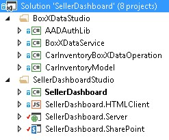
 
### BoxXDataStudio

This studio includes all the components you need to interact with SAP Gateway for Microsoft.

#### AADAuthLib
    
This component is used to carry out the [Azure AD authorization code flow](https://docs.microsoft.com/en-us/azure/active-directory/develop/active-directory-protocols-oauth-code), which uses a Singleton pattern.
    
The following code snippet shows the main function, which the AADAuthLib component provides. For more detail, see the AADAuthLib/AuthUtil.cs sample code helper class.

```C#
  // Use the auth code, acquire the refresh token and access token, and store them in the current session
        public bool AcquireTokenFromAuthCode(string authCode, string redirectUrl = "redirectUrl")
        {
            if (!IsAuthorized &amp;&amp; !string.IsNullOrEmpty(authCode))
            {
                AuthenticationResult authResult = _authContext.AcquireTokenByAuthorizationCode(authCode,
                    new Uri(ConfigurationManager.AppSettings["ida:" + redirectUrl]),
                    _clientCredential,
                    ConfigurationManager.AppSettings["ida:ResourceUrl"]);

                HttpContext.Current.Session["RefreshToken"] = authResult.RefreshToken;
                HttpContext.Current.Session["AccessToken-" + ConfigurationManager.AppSettings["ida:ResourceUrl"]] = new Tuple<string, DateTimeOffset>(authResult.AccessToken, authResult.ExpiresOn);

                return true;
            }

            return false;
  }

 // Provide the access token, which is stored in the current session, if the access token expired, use the refresh token get a new one.
 public string AccessToken
        {
            get
            {
                if (!IsAuthorized) throw new UnauthorizedAccessException();

                var accessToken = HttpContext.Current.Session["AccessToken-" + ConfigurationManager.AppSettings["ida:ResourceUrl"]] as Tuple<string, DateTimeOffset>;

                if (IsAccessTokenValid(accessToken))
                {
                    return accessToken.Item1;
                }

                accessToken = RenewAccessToken();
                HttpContext.Current.Session["AccessToken-" + ConfigurationManager.AppSettings["ida:ResourceUrl"]] = accessToken;

                return accessToken.Item1;
            }
  }
```

#### BoxXDataService
    
This is a WCF RIA service, which is the interface used by the SellerDashboard server-side component hosted in Azure, and which consumes the SAP data source from SAP Gateway for Microsoft.
    
The following code snippet is the CRUD Web method, which the WCF RIA service supports. For more detail, see BoxXDataService/BoxXDataService.cs.

```C#
  [Query(IsDefault = true)]
        public IQueryable<InventoryItem> GetAllCarInventory()
        {
            BoxXDataReader dataReader = BoxXDataReader.Instance;
            IInventoryCollection dataCollection = ModelFactory.CreateInventoryCollection(dataReader.SchemaPropertyNames);
            IInventoryQuery query = QueryFactory.CreateQuery();
            dataReader.GetData(dataCollection, query);

            return dataCollection.Items.Cast<InventoryItem>().AsQueryable();
        }

        [Update]
        public void UpdateCarInventoryItem(InventoryItem carInventoryItem)
        {
            BoxXDataUpdater dataUpdater = BoxXDataUpdater.Instance;
            dataUpdater.UpdateInventoryItem(carInventoryItem);
        }

        [Insert]
        public void InsertCarInventoryItem(InventoryItem carInventoryItem)
        {
            BoxXDataCreater dataCreater = BoxXDataCreater.Instance;
            dataCreater.CreateInventoryItem(carInventoryItem);
        }

        [Delete]
        public void DeleteCarInventoryItem(InventoryItem carInventoryItem)
        {
            BoxXDataDeleter.DeleteInventoryItem(carInventoryItem.ID);
 }
```

#### CarInventoryBoxXDataOperation
    
This is the real CRUD implementation for BoxXDataService. Figure 2 shows the main code architecture of CarInventoryBoxXDataOperation. The CRUD namespace is used to implement the CRUD operations, and the Util namespace is the helper code for the CRUD namespace.

*Figure 2. CarInventoryBoxDataOperation*

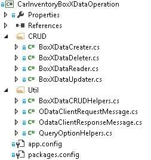

#### CarInventoryModel
    
This is a library project that's used to implement the data model and utilities. The data model definition has to match the metadata of the OData endpoint that's used by SAP Gateway for Microsoft, which is based on the SAP data schema. BoxXDataService and CarInventoryBoxXDataOperation use it to convert the SAP database item into a car inventory instance. Figure 3 shows the main components.
    
*Figure 3. CarInventoryModel*

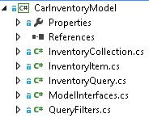

### SellerDashboardStudio

SellerDashboardStudio includes standard LightSwitch SharePoint add-in components.
 

 

-  **SellerDashboard**
    
    SellerDashboard is the StartUp project, and it is used to publish the SellerDashboard add-in to the Azure website and its SharePoint add-in to the SharePoint developer site.
    
 
-  **SellerDashboard.HTMLClient**
    
    This component includes the screens, a custom control, and a photo upload control. The following image shows its main components.
    
 
- 
  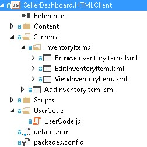
 

    SellerDashboard.HTML.Client includes these four screens:
    
 

      - BrowseInventoryItems is the home screen, used to browse basic information for all inventory items.
    
 
  - ViewInventoryItem is the detail screen, used to display a detailed view for each inventory item.
    
 
  - EditInventoryItem is an edit popup screen, used to edit an inventory item.
    
 
  - AddInventoryItem is an add popup screen, used to add a new inventory item.
    
 

    The UserCode.js file includes the UX custom control code.
    
    The photohelper.js and sharepointauthhelper.js, files, included in the Scripts folder, are based on the guidance provided in the article  [Walkthrough: Creating an Add-in for SharePoint by Using LightSwitch](http://msdn.microsoft.com/en-us/library/jj969621.aspx).
    
 
-  **SellerDashboard.Server**
    
    This component includes the WCF RIA data source, the SharePoint data source, and the photo-upload Web API. The following image shows its main components.
    
  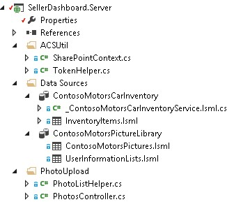
 

    The SharePointContext.cs and TokenHelper.cs are the helper classes that provide the client context to authenticate to SharePoint. This enables the photo upload Web API to be used to upload photos of cars to the picture library. The PhotoListHelper.cs and PhotosController.cs files implement the photo-upload Web API. For more information about how the photo-upload Web API is used by LightSwitch, see the article  [Walkthrough: Creating an Add-in for SharePoint by Using LightSwitch](http://msdn.microsoft.com/en-us/library/jj969621.aspx).
    
 
-  **SellerDashboard.SharePoint**
    
    This component is included after the LightSwitch solution to enable the SharePoint project. You can use this component to configure the SharePoint site used for the picture library and to set the required permission for the add-in. SellerDashboard needs to be granted the Full Control permission level on the SharePoint site that hosts the picture library.
    
 

## Implementation


 

 

### Overview

The following image show the components that comprise the SellerDashboard. The solid line shows the data flow and the dotted line shows the OAuth flow. The green components are related to the SAP data operations, the blue components are related to the SharePoint picture library operation, and the orange components depict the operations of the whole SellerDashboard app.  
 

 
 **SellerDashboard Solution**
 

 

 
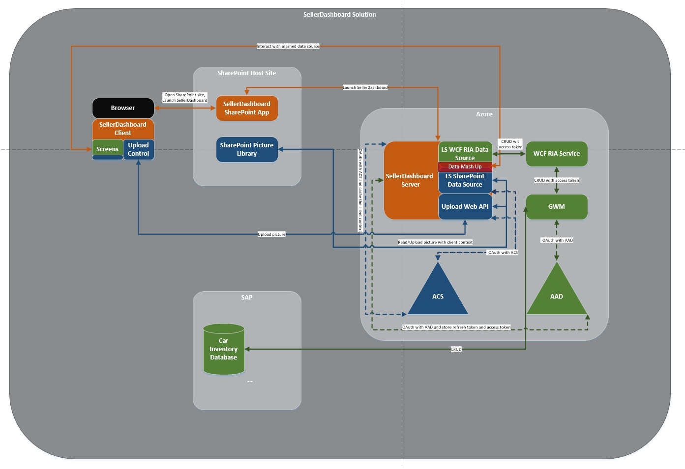
 

 

 

### Data mashup

LightSwitch supports the data mashup by adding a relationship between the two data sources in the designer.
 

 
 **SAP data source**
 

 

-  *Data schema in SAP database* 
    
    The following snippet shows an example of a data schema from SAP Gateway for Microsoft.
    


```XML
  
<?xml version="1.0" encoding="UTF-8"?> 
- <edmx:Edmx xmlns:sap="http://www.sap.com/Protocols/SAPData" xmlns:m="http://schemas.microsoft.com/ado/2007/08/dataservices/metadata" 
xmlns:edmx:"http://schemas.microsoft.com/ado/2007/06/edmx" Version="1.0">
   - <edmx:DataServices m:DataServiceVersion="2.0">
      - <Schema xml:lang="en" xmlns="http://schemas.microsoft.com/ado/2008/09/edm" Namespace="ZCAR_POC_SRV">
         - <EntityType sap:content-version="1" Name="ContosoMotors">
              - <Key>
                     <PropertyRef Name="ID"/>
               </Key>
               <Property Name="ContactPhone" Type="Edm.String"/>
               <Property Name="ContactEmail" Type="Edm.String"/>
               <Property Name="ID" Type="Edm.Int32" Nullable="false"/>
               <Property Name="BuyerEmail" Type="Edm.String" MaxLength="255"/>
               <Property Name="MaxPower" Type="Edm.Int32" Nullable="false"/>
               <Property Name="Engine" Type="Edm.String" Nullable="false" MaxLength="255"/>
               <Property Name="BodyStyle" Type="Edm.String" Nullable="false" MaxLength="255"/>
               <Property Name="Transmission" Type="Edm.String" Nullable="false" MaxLength="255"/>
               <Property Name="Year" Type="Edm.Int32" Nullable="false"/>
               <Property Name="Model" Type="Edm.String" Nullable="false" MaxLength="255"/>
               <Property Name="Brand" Type="Edm.String" Nullable="false" MaxLength="255"/>
               <Property Name="ExtColor" Type="Edm.String" Nullable="false" MaxLength="255"/>
              <Property Name="IntColor" Type="Edm.String" Nullable="false" MaxLength="255"/>
              <Property Name="ContactName" Type="Edm.String" Nullable="false" MaxLength="255"/>
              <Property Name="Price" Type="Edm.String" Nullable="false"/>
              <Property Name="StockNo" Type="Edm.String" Nullable="false"/>
              <Property Name="Arrived_Date" Type="Edm.DateTime" Nullable="false" Precision="0"/>
              <Property Name="Status" Type="Edm.String" Nullable="false" MaxLength="255"/>
      </EntityType>
   - <EntityContainer Name="ZCAR_POC_SRV_Entities" m:IsDefaultEntityContainer="true">
          <EntitySet sap:content-version="1" Name="ContosoMotorsCollection" sap:searchable="true" EntityType="ZCAR_POC_SRV.ContosoMotors"/>
     </EntityContainer>
     <atom:link xmlns:atom="http://www.w3.org/2005/Atom" href="http://contoso.cloudapp.net:8080/perf/sap/opu/odata/sap/ZCAR_POC_SRV/$metadata" rel="self"/>
     <atom:link xmlns:atom="http://www.w3.org/2005/Atom" href="http://contoso.cloudapp.net:8080/perf/sap/opu/odata/sap/ZCAR_POC_SRV/$metadata" rel="latest-version"/>
</Schema>
</edmx:DataServices>
</edms:Edmx>               

```


    This is our test data base, and the Property Type and Nullable value is based on the scenario. The ID is the PropertyRef and the OData CRUD operation is based on ID. The StockNo property is used to mash data with the car picture that is stored in SharePoint picture library.
    
 
-  *Data model defined for RIA service* 
    
```C#
  public interface IInventoryItem
    	{
        IEnumerable<InventoryPropertyName> ValidPropertyNames { get; }
        bool IsValid { get; }

        int ID { get; set; }
        DateTime ArrivedDate { get; set; }
        string BodyStyle { get; set; }
        string Brand { get; set; }
        string BuyerEmail { get; set; }
        string ContactEmail { get; set; }
        string ContactName { get; set; }
        string ContactPhone { get; set; }
        string Engine { get; set; }
        string ExtColor { get; set; }
        IEnumerable<Uri> Images { get; }
        string IntColor { get; set; }
        int MaxPower { get; set; }
        string Model { get; set; }
        decimal Price { get; set; }
        bool Removed { get; }
        string Status { get; set; }
        string StockNo { get; set; }
        string Transmission { get; set; }
        int Year { get; set; }

        void AddImageUrl(Uri url);
        bool CopyFrom(IInventoryItem other);
        object GetPropertyValue(InventoryPropertyName property);
        void MarkAsRemoved();
        void SetPropertyValue(InventoryPropertyName property, object value);
       }

    	public interface IInventoryCollection
       {
        IEnumerable<InventoryPropertyName> QueriedPropertyNames { get; }
        IEnumerable<IInventoryItem> Items { get; }
        bool Valid { get; }

        IInventoryItem this[int id] { get; }
        bool Contains(int id);
        void AddItem(IInventoryItem inventoryItem);
        IInventoryCollection Filter(Predicate<IInventoryItem> match);
        bool CopyFrom(IInventoryCollection other);
}

```


    Any property that isn't included in the SAP database schema can be ignored. For example, the  **Images** property was added here for scalability considerations. This data model is a middle layer between the real SAP database and the SellerDashboard.Server data source. The LightSwitch project has two components: View and Server. When you add an external data source on the Server side, LightSwitch helps you build an abstract data layer that is added to the data source on the Server side.
    
    Most of the properties have the same type as the properties in the SAP database schema, except for StockNo, whose type has been changed from  **int** to **string**. This is because StockNo is used as a way to define the relationship between the SAP data and SharePoint picture library.
    
> [!TIP]
> StockNo must have the type  **string** because the value stored in the SharePoint picture library is **Text**. These two types must match in order to accomplish the data mashup.

    The implementation of the two interfaces is in CarInventoryModel/InventoryItem.cs and CarInventoryModel/InventoryCollection.cs.
    
 
-  *Data source consumed by the LightSwitch server side* 
    
  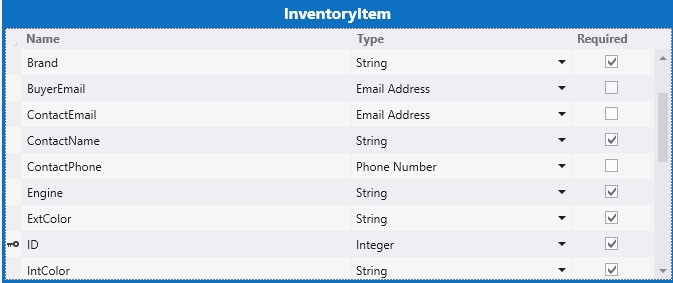
 

    In the SellerDashboard server, when you add the WCF RIA Service (BoxXDataService), the data model that's defined in CarInventoryModel is included, and you get the relevant data table. You can change the type of some of the properties. For example, you can change the  **BuyerEmail** type from **String** to **Email Address**, and LightSwitch will support the email format check on the client side.
    
 
 **SharePoint picture library**
 

 
The picture library in the SharePoint host site is named ContosoMotorsPictureLibrary, and contains three new columns named StockNo, ThumbnailUrl, and FullImageUrl. All of them are configured as  **Text** fields.

> [!TIP]
> The column names are case sensitive.
 

 The StockNo column is used to create a relationship with the SAP data. The ThumbnailUrl and FullImageUrl columns are used to get the URL to the relevant picture in a convenient way.
 

 
 *Data source consumed by the LightSwitch server side* 
 

 
ContosoMotorsPicture is a LightSwitch data source model, which maps to the SharePoint host site picture library on the LightSwitch server side.
 

 

 
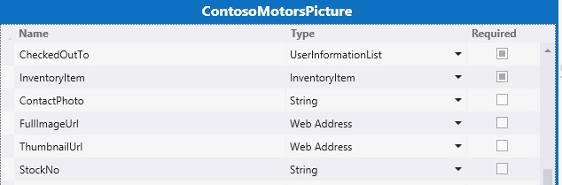
 
 **Data relationship**
 

 
Add a one-to-zero relationship or a one-to-one relationship between the InventoryItem and ContosoMotorsPicture. The following image shows what this looks like, using LightSwitch in Visual Studio
 

 

 
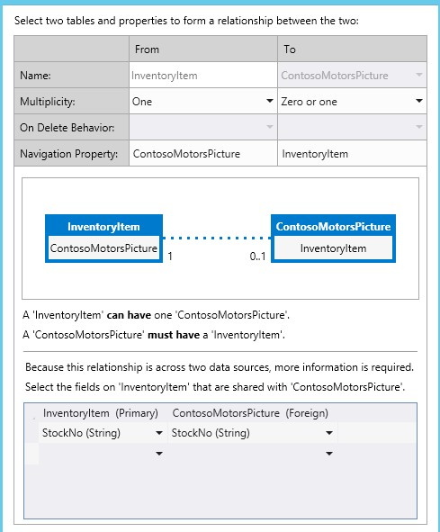
 

 

 

### OAuth with Azure AD &amp; ACS

This section provides an overview of how the add-in implements OAuth in Azure AD and access control services (ACS).
 

 
 **Overview**
 

 
SellerDashboard is a SharePoint provider host add-in that has to operate on both data sources: SharePoint picture library and the SAP data by means of SAP Gateway for Microsoft.
 

 
To access the SharePoint picture library, SellerDashboard needs to authenticate to ACS, and get an access token from it. To access the SAP data, however, the SellerDashboard needs to get a different access token from Azure AD, because SAP Gateway for Microsoft uses Azure AD for Authentication and Authorization.
 

 

 
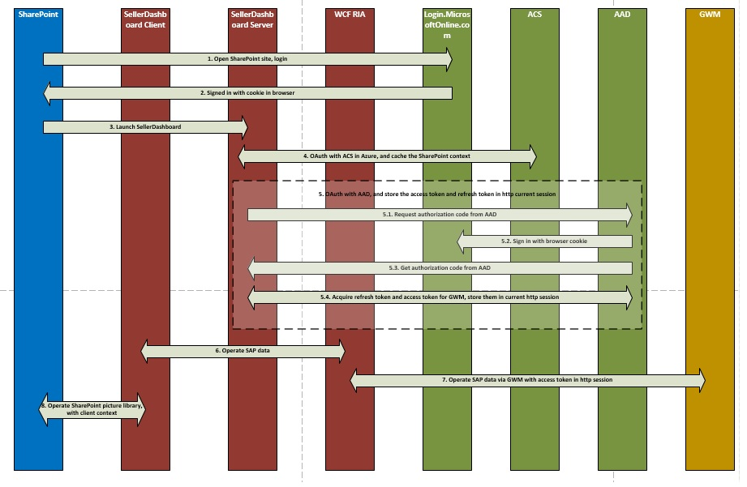
 
 **Implementation**
 

 
SellerDashboard is a SharePoint provider-hosted add-in that supports the picture-upload operation by using the SharePoint client-side object model. The SharePoint context, which is used to create the client context for the SharePoint host, is cached, and the client context is then used by the upload Web API.
 

 
After the OAuth with ACS process is complete, the request for authentication is sent to Azure AD. To accomplish this, the add-in uses a cookie to sign into Login.MicrosoftOnline.com and then complete the Azure AD authorization code flow , which returns a refresh token that the add-in caches for future authentication requests during the session. Here's the code that is used for this process.
 

 


```C#
protected override void Page_Load(object sender, EventArgs e)
{
    if (!IsPostBack)
    {
 SharePointContext spContext = SharePointContextProvider.Current.GetSharePointContext(Context);
        if (spContext != null)
        {
     // Cache the SharePoint Context, which will be used to create Client Context for SharePoint host
            _spContext = spContext;
        }

		
        // Acquire refresh token and access token, and store them in the current session, which will be used do the OAuth with AAD for operating the SAP data
        AuthUtil.Instance.AcquireTokenFromAuthCode(Request.QueryString["code"]);

        if (!AuthUtil.Instance.IsAuthorized)
        {
             Response.Redirect(AuthUtil.Instance.AuthCodeUrl);
        }
     }

     base.Page_Load(sender, e);
 }
```

For more detail, see SellerDashBoard.Server/SharePointLaunch.aspx.cs, and AADAuthLib/AuthUtil.cs in the code sample.
 

 
SellerDashboard.Server includes the SharePointContext.cs and TokenHelper.cs files, which are used to get the app-only client context for the SharePoint host. .These two files are added to your SharePoint project automatically by Visual Studio. (Visual Studio names the project < *yourprojectname*  >Web; for example, SharePointAppWeb.) You can then copy these two files to your SellerDashboard add-in source code and include them in your project.
 

 

### CRUD operations on SAP Data from SAP Gateway for Microsoft

The following code snippets show the main code logic of the CRUD operations. For more details, see the implementation of CarInventoryBoxXDataOperation in the code sample.
 

 
 **BoxXDataCreater**
 

 


```C#

        public void CreateInventoryItem(IInventoryItem inventoryItem)
        {
            if (_model == null)
            {
                _model = BoxXDataCRUDHelpers.GetMetadata(BoxXDataCRUDHelpers.MetadataUrl);
            }

            // Create new entry request generate
            var requestMessage = new ODataClientRequestMessage(new Uri(BoxXDataCRUDHelpers.DataCollectionUrl),
                                                                ODataConstants.MethodPost);
            BoxXDataCRUDHelpers.CreateEntryRequestHeaderSetter(requestMessage, AuthUtil.Instance.AccessToken);
            BoxXDataCRUDHelpers.SetODataRequestContent(requestMessage, _model, inventoryItem);

            // Create new entry request execute
            IODataResponseMessage responseMessage = requestMessage.GetResponse();

        }
BoxXDataReader
 public void GetData(IInventoryCollection dataCollection, IInventoryQuery query)
        {
            GetValueWithoutLocallyFiltering(dataCollection, query);

            if (query.Filters.Any())
            {
                var filteredCollection = dataCollection.Filter(inventoryItem =>
                    query.Filters.Any(filter => filter.Match(inventoryItem)));

                dataCollection.CopyFrom(filteredCollection);
            }
        }
```

 **BoxXDataUpdater**
 

 


```C#
public void UpdateInventoryItem(IInventoryItem inventoryItem)
        {
            if (_model == null)
            {
                _model = BoxXDataCRUDHelpers.GetMetadata(BoxXDataCRUDHelpers.MetadataUrl);
            }

            // Update existing entry request generate
            var requestMessage = new ODataClientRequestMessage(new Uri(BoxXDataCRUDHelpers.DataCollectionUrl + '(' + inventoryItem.ID + ')'),
                                                                ODataConstants.MethodPut);
            BoxXDataCRUDHelpers.UpdateEntryRequestHeaderSetter(requestMessage, AuthUtil.Instance.AccessToken);
            BoxXDataCRUDHelpers.SetODataRequestContent(requestMessage, _model, inventoryItem);

            // Update existing entry request execute
            IODataResponseMessage responseMessage = requestMessage.GetResponse();
        }
BoxXDataDeleter
 public static void DeleteInventoryItem(int ID)
        {
            // Delete existing entry request generate
            var requestMessage = new ODataClientRequestMessage(new Uri(BoxXDataCRUDHelpers.DataCollectionUrl + '(' + ID + ')'),
                                                                ODataConstants.MethodDelete);
            BoxXDataCRUDHelpers.DeleteEntryRequestHeaderSetter(requestMessage, AuthUtil.Instance.AccessToken);

            // Delete existing entry request execute
            IODataResponseMessage responseMessage = requestMessage.GetResponse();
        }
```


### Uploading photos to the SharePoint picture library

The photo-upload control and photo-upload Web API implementation are used to upload photos to the SharePoint picture library, using the following code, which is based on the guidance in the article  [Walkthrough: Creating an Add-in for SharePoint by Using LightSwitch](http://msdn.microsoft.com/en-us/library/jj969621.aspx).
 

 
 **For the photohelper.js changes:**
 

 
A new field is added for the uploadForm, which is used to pass the StockNo to the photo-upload Web API.
 

 


```

uploadForm = $(
             '<form id="uploadForm" method="POST" enctype="multipart/form-data" action="' + API_URL + '"  data-ajax="false" target="uploadTargetIFrame">' +
             '   <input name="fileInput" id="fileInput" type="file" size="30" data-theme="c" accept="image/*" multiple="true"/>' +
             '   <input type="hidden" name=' + screen.InventoryItem.StockNo + '>' +
             '</form>');

```

Add the logic for caching the picture URL, and picture set back logic.
 

 


```
function completeUpload(uploadedFiles) {
            var fullImageUrl = uploadedFiles[0];
            var photoNameWithExt = fullImageUrl.substr(fullImageUrl.lastIndexOf('/') + 1);
            var photoNameWithoutExt = photoNameWithExt.substr(0, photoNameWithExt.lastIndexOf("."));
            var photoPathUri = fullImageUrl.substr(0, fullImageUrl.lastIndexOf('/'));
            var photoExt = photoNameWithExt.substr(photoNameWithExt.lastIndexOf(".") + 1, photoNameWithExt.length);
            var thumbnailUrl = photoPathUri + "/_t/" + photoNameWithoutExt + "_" + photoExt + ".jpg";
            setCacheUrl(screen.InventoryItem.StockNo, fullImageUrl + "*#00#" + thumbnailUrl);
            setDetailsCarPicture(fullImageUrl);
            screen.closePopup();
        }
```

 **For the PhotosController.cs changes:**
 

 
Use the app-only client context for the SharePoint host, which is created by the cached SharePoint Context.
 

 
Do this because the ContosoMotorsPictureLibrary doesn't belong to the SellerDashboard add-in; rather, it belongs to the SharePoint host site. Also, remove the photo delete relevant code.
 

 


```C#

private ClientContext AppWebContext
    {
        get
        {
            if (appWebContext == null)
            {
                appWebContext = SharePointLaunch.getAppWebContext();
            }
            return appWebContext;
        }
    }

```

 **For the PhotoListHelper.cs changes:**
 

 
Add the picture update logic, which will delete the old picture item if one exists and then add a new picture item. Assign the StockNo of the new picture item, and at the same time set the FullImageUrl and ThumbnailUrl values to the new picture item.
 

 


```C#

            // Delete the old picture item
            foreach (ListItem item in items)
            {
                if (!string.IsNullOrEmpty((string)(item["StockNo"])))
                {
                    string tempStockNo = item["StockNo"].ToString();
                    if (tempStockNo.Equals(stockNo))
                    {
                        item.DeleteObject();
                        siteContext.ExecuteQuery();
                        break;
                    }
                }
            }

            // Update the new picture item
            foreach (ListItem item in items)
            {
                string fullImageName = item["FileLeafRef"].ToString();
                string thumbnailName = fullImageName.Replace('.', '_') + ".jpg";

                if (photoUri.Contains(fullImageName))
                {
                    item["StockNo"] = stockNo;
                    item["FullImageUrl"] = photoUri;
                    item["ThumbnailUrl"] = photoUri.Replace(fullImageName, "_t/" + thumbnailName);
                    item.Update();
                    siteContext.ExecuteQuery();
                    break;
                }
            }


```


### User Experience

For the special scenario request, many custom controls are implemented to support the request. You can find the relevant code in the UserCode.js file. You can build a simple user interface quickly by using the LightSwitch designer. The Common Screen Set can meet your test request. Because the user experience isn't the main focus of this document, details are not provided here.
 

 

## Deploying the app

Complete the steps in this section to deploy the add-in. Before you deploy this add-in, ensure that SAP Gateway for Microsoft has been deployed and configured on your Azure tenant.
 

 

### Create your Azure web site


1. Log in to the  [Microsoft Azure Portal](http://go.microsoft.com/fwlink/?LinkID=512959) as a global administrator.
    
 
2. In the left menu, click  **Websites**.
    
> [!NOTE]
> You'll use this web site to host the SharePoint provider-hosted add-in for the SellerDashboard.

3. In the command bar at the bottom of the page, click  **New**.
    
 
4. Select  **Compute > Website > Quick Create**.
    
 
5. In the  **URL** box, enter the first part of the URL you want to use, select a Web Hosting Plan, and then click **Create Website**. Copy this URL because you will need it when you register the add-in later in a later section of this article. For example, use Constoso.azurewebsites.net.
    
 

### Register the SharePoint app

An empty SharePoint add-in is used to grant the SharePoint add-in the read permissions that it needs to retrieve images of cars from the picture library in SharePoint Online. Complete the following steps to register the SharePoint add-in with the SharePoint site that contains this picture library and grant the add-in read access to the site.
 

 

### To register the SharePoint add-in


1. Open the solution in Solution Explorer.
    
 
2. In the properties of the SharePoint add-in, input the  **Site URL** of the SharePoint site that contains the picture library. In the login prompt that appears, log in as a Site Owner.
    
 
3. Set the Read permission in the application's manifest.
    
  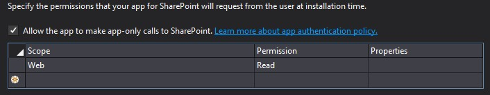
 

 

 
4. Set the add-in as a StartUp project, and run the project. You can find the ClientID and ClientSecret values in the ContosoMotorsCarInventoryWeb/Web.config file. The code should resemble the following:
    
```XML
  <add key="ClientId" value="06af1059-8916-4851-a271-2705e8cf53c6"/>
<add key="ClientSecret" value="LypZu2yVajlHfPLRn5J2hBrwCk5aBOHxE4PtKCjIQkk="/>
```

5. Replace the values of ClientID and ClientSecret at "Hosted add-in configuration" in ContosoMotorsCarInventoryWeb/TokenHelper.cs with above values. The code should resemble the following:
    
```C#
  
private static readonly string ClientId = "06af1059-8916-4851-a271-2705e8cf53c6";
private static readonly string ClientSecret = "LypZu2yVajlHfPLRn5J2hBrwCk5aBOHxE4PtKCjIQkk=";

```


### Register your web application with Azure AD

The steps in this section describe how to register the sample add-in from the Azure Management portal.
 

 

1. Login to the  [Azure Management Portal](http://go.microsoft.com/fwlink/?LinkID=512959) with your Azure service administrator or co-administrator account.
    
 
2. In the left navigation pane, click  **Active Directory**.
    
 
3. On the active directory page, click the directory that was configured for SAP Gateway for Microsoft.
    
   > [!TIP]
   > If you're not sure which one was used, ask your SAP Gateway for Microsoft administrator. Hint: it's the directory that contains the users and groups for SAP Gateway for Microsoft.

4. On the top navigation bar, choose  **APPLICATIONS**.
    
 
5. At the bottom of the page, click  **Add**.
    
 
6. In the dialog box that opens, click  **Add an application my organization is developing**.
    
 
7. In the  **ADD Application** dialog box, name the application. For example, name it "SellerDashboard."
    
 
8. Choose  **Web application and/or web API** as the application type, and then click the right arrow.
    
 
9. In the  **Add properties** dialog box, use the URL of the site you created earlier (in the Create your Azure web site section) as the SIGN-ON URL. For example, use *https://Constoso.azurewebsites.net*  .
    
 
10. For the  **APP ID URI**, give the application a unique URI, such as the application name appended to the end of the  **SIGN-ON URL**; for example, use  *https://Constoso.azurewebsites.net/SellerDashboard*  , where Constoso.azurewebsites.net is the site you created earlier in this article.
    
 
11. Click the checkmark to create the application. 
    
    The Azure dashboard for the application opens and displays a success message.
    
> [!NOTE]
> You must register the add-in with Azure AD twice: Once for debugging purposes, and then again to deploy it for production, as described in step 10.To register the add-in for debugging purposes, use the  **SIGN-ON URL** and **APP ID URI** with the debugging URL of the SellerDashboard.Server project so that you can run the Visual Studio debugger (F5). This URL will be of the form https://localhost. *nnnn*  , where *nnnn*  is a port number. You can find this URL in the Properties pane in Visual Studio.Then, when you are ready to deploy for production, edit the registration to use the correct production URL.
 


### Configure application settings

Configure the settings for the new application that you created in the previous procedure. 
 

 

1. At the top of the application page, click  **Configure**.
    
 
2. Set parameters where required, and make a note of configuration settings as described in the following table.
    

|**Parameter**|**Action**|
|:-----|:-----|
|Client ID|Copy the value that appears in the Client ID field.|
|Client Secret| Generate a new application key: In the Keys section, select the key duration of 1 or 2 years. In the command bar at the bottom of the page, click **Save**.  The key value is now displayed. Copy and save the key value for future use; you cannot retrieve it after you leave the page.|
|App ID URI|Copy the value that appears in the  **Add-in ID URI** field.|

    Remember to keep this information handy, because you'll need it in a later procedure.
    
 
3. In the  **permissions to other applications** section, do the following:
    
      1. Select your SAP Gateway for Microsoft application.
    
 
  2. In the  **Delegated Permissions** column, enable the boxes for the permissions to the SAP Gateway for Microsoft that your SharePoint provider-hosted add-in for the SellerDashboard will need.
    
 
4. In the command bar at the bottom of the page, click  **Save**.
    
 

### Replace the needed configuration for deployment


1. Locate SellerDashboardHTMLClient/UserCode.js, and find the following code placeholder:
    
```C#
  sharePointUrl: "Replace with your SharePoint host site", 
// https://fake_domain.sharepoint.com/sites/Developer
SharePointRootUrl: "Replace with your SharePoint root site"
 // https://fake_domain.sharepoint.com/ 

```


      1. Replace the sharePointUrl value with your SharePoint site, the one to which the add-in will be installed and that also contains the picture library.
    
 
  2. Replace sharePointRootUrl value with the relevant SharePoint root site.
    
 
2. Locate SellerDashboard.Server/Web.config in the SellerDashboard solution and find the following configuration placeholder:
    
```XML
  <add key="ClientSecret" value="MwMp1yxOyy8BGhfD5d9VvuqlRbhaqWESxVNLzgpYNHU=" />
<add key="ClientId" value="ed138b32-c89d-4f22-b74d-7d9d5044b260" />
<add key="Ida:ClientId" value="Replace with Azure register add-in client id" />
<add key="Ida:ClientSecret" value="Replace with Azure register add-in client secret" />
<add key="Ida:TenantId" value="Replace with the SAP Gateway for Microsoft tenant domain, for example <yourDomain>.onmicrosoft.com" />
<add key="Ida:RedirectUrl" value="Replace with the Azure host site, for example https://contoso.azurewebsites.net/SharePointLaunch.aspx" />
<add key="Ida:ResourceUrl" value="Replace with the SAP Gateway for Microsoft instance, for example http://contoso.cloudapp.net/" />
<add key="Ida:ODataServiceBaseUrl" value="Replace with the SAP OData endpoint url, for example https://contoso.cloudapp.net:8081/perf/sap/opu/odata/sap/ZCAR_POC_SRV/" />
<add key="Ida:ODataServiceMetadataUrl" value="Replace with the SAP OData endpoint metadata url, for example https://contoso.cloudapp.net:8081/perf/sap/opu/odata/sap/ZCAR_POC_SRV/$metadata" />
<add key="Ida:DataCollection" value="Replace with OData EntitySet name, for example ContosoMotorsCollection" />
<add key="Ida:ODataFeedOrEntryFormat" value="application/atom+xml" />
<add key="Ida:ODataMetadataFormat" value="application/xml" />
<add key="Ida:ODataContentType" value="application/xml" />
<add key="Ida:ODataVersion" value="2.0" />
<add key="Ida:ODataMaxVersion" value="3.0" />
<add key="Ida:ODataWriterTypeName" value="Replace with the OData EntityType, for example ZCAR_POC_SRV.ContosoMotors" />
<add key="Ida:DefaultID" value="1024" />
<add key="Ida:DefaultStockNo" value="2048" />
<add key="Ida:SPPicLib" value="Replace with you picture library name, for example ContosoMotorsPictureLibrary" />
```


      1. Replace the ClientId and ClientSecret values with the values you got in the previous procedure.
    
 
  2. Replace the Ida:ClientId and Ida:ClientSectet valuse with the values from the Azure AD app.
    
 
  3. Replace the Ida:TenantId value with < *yourDomain*  >.onmicrosoft.com.
    
    For example, if your organizational account is someone@< *yourDomain*  >.onmicrosoft.com, < *yourDomain*  >.onmicrosoft.com is what you need.
    
 
  4. Replace the Ida:RedirectUrl value with the test site you created on Azure, which hosts this add-in.
    
 
  5. Replace the Ida:ResourceUrl value with the SAP Gateway for Microsoft instance that's been deployed and configured in Azure.
    
 
  6. Replace the Ida:ODataServiceBaseUrl value with the SAP Gateway for Microsoft instance OData endpoint URL.
    
 
  7. Replace the Ida:ODataServiceMetadataUrl value with the SAP Gateway for Microsoft instance OData endpoint metadata URL
    
 
  8. Replace the Ida:DataCollection value. You can get this value from the metadata. For example, use the ContosoMotorsCollection.
    
 
  9. Replace the Ida:ODataWriterTypeName value. You can get the correct value from the metadata. 
    
    For example, use the following:
    


```XML
  ZCAR_POC_SRV.ContosoMotors

<EntityContainer Name="ZCAR_POC_SRV_Entities" m:IsDefaultEntityContainer="true">
     <EntitySet sap:content-version="1" Name="ContosoMotorsCollection" sap:searchable="true" EntityType="ZCAR_POC_SRV.ContosoMotors"/>
</EntityContainer>
<atom:link xmlns:atom="http://www.w3.org/2005/Atom" href="http://contoso.cloudapp.net:8080/perf/sap/opu/odata/sap/ZCAR_POC_SRV.ContosoMotors"/>
```

  10. Replace the Ida:SPPicLib value with the picture library name, which you created in the SharePoint host site.
    
 

### Publish the project


1. Locate the SellerDashboard project in the SellerDashboard solution.
    
 
2. Right-click the SellerDashboard to publish the project.
    
 
3. Choose  **Provider-hosted**.
    
 
4. Choose  **Windows Azure**.
    
 
5. Sign in as a global administrator.
    
 
6. Choose the web site you created in Azure.
    
 
7. Indicate that you want to use HTTPS.
    
 
8. Use the default data connections string.
    
 
9. Input the web site that you created in Azure as the host web site; input the ClientId and ClientSecret values, which you get in the previous procedure.
    
 
10. Publish.
    
     You will get a published package.
    
 

### Install the App


1. Log into your SharePoint deployment site, as a site administrator.
    
 
2. On the site home page, click  **New add-in to deploy**.
    
 
3. Choose the package that you get from the publish process.
    
 
4. Deploy it and trust it.
    
 

## External Code List


 

 


|**Web Source**|**Collection**|**Code Location**|**License**|
|:-----|:-----|:-----|:-----|
| [Survey Add-in Tutorial: Developing a SharePoint Application Using LightSwitch](http://code.msdn.microsoft.com/Survey-App-Tutorial-a70d0afd) [Walkthrough: Creating an Add-in for SharePoint by Using LightSwitch](http://msdn.microsoft.com/en-us/library/jj969621.aspx)|**Photo Uploader:**PhotoListHelper.csPhotosController.csGlobal.asax.cs| [Survey Add-in Tutorial: Developing a SharePoint Application Using LightSwitch (C#)](http://www.getcodesamples.com/src/2571E87E/)|Apache License, Version 2.0|
|null|**ACS Auth:**SharePointContext.csTokenHelper.cs|**VS internal Templates:**Visual C#/Office/SharePoint/Apps/AppforSharePoint||

## Additional resources

- [Develop cloud business add-ins](develop-cloud-business-add-ins.md)


