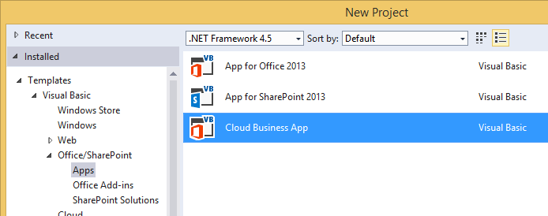
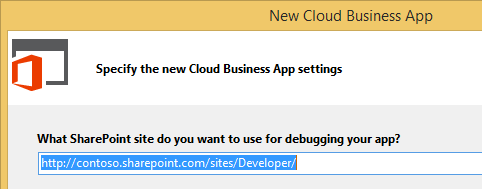
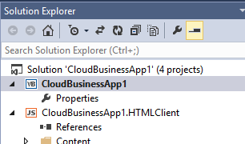
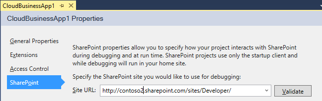

# Create a cloud business add-in

By using the Cloud Business Add-in template in Visual Studio, you can create add-ins that are optimized for adding and managing data that are hosted on SharePoint for Office 365 or SharePoint and based on Visual Studio LightSwitch technologies.

> [!NOTE]
> You can also build a SharePoint Add-in by using the Add-in for SharePoint template.

## To create a cloud business add-in

1. On the menu bar, select **File** > **New** > **Project**.
    
   The **New Project** dialog box opens.

2. In the list of templates, expand the **Visual Basic** or **Visual C#** node, expand the **Office/SharePoint** node, select the **Add-ins** node, and then select **Cloud Business Add-in**, as shown in Figure 1 (note that "app" is now "add-in").
    
   *Figure 1. Cloud Business Add-in template*

   

3. In the **Name** box, enter a name for your project, and then select **OK**.

4. In the New Cloud Business Add-in Wizard, enter the site URL for your SharePoint server or your Office 365 Developer site as shown in Figure 2, and then select **Finish**.
    
   *Figure 2. SharePoint URL*

   
 
   The URL should take the form `https://MySite.sharepoint.com/sites/Developer/`.
    
   A new solution is added to Solution Explorer with four projects: 
   
   - A top-level project
   - An **HTMLClient** project
   - A **Server** project
   - A **SharePoint** project

## To change the site for a cloud business add-in

1. In **Solution Explorer**, open the shortcut menu for the top-level project node, and select **Properties**, as shown in Figure 3.
    
   *Figure 3. The top-level project node*

   
    
2. In the application designer, select the **SharePoint** tab, as shown in Figure 4.
    
   *Figure 4. The SharePoint tab*

   

3. In the **Site URL** list, select an existing URL or enter the site URL for your SharePoint server or your Office 365 Developer site.
    
4. Select **Validate** to verify the URL.

## Additional resources

-  [Develop cloud business add-ins](develop-cloud-business-add-ins.md)
-  [Create cloud business add-ins](create-cloud-business-add-ins.md)
    
