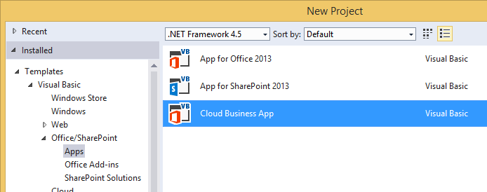
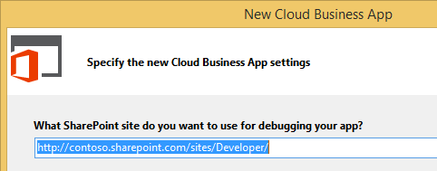

# Create a cloud business add-in
By using the Cloud Business Add-in template in Visual Studio, you can create SharePoint Add-ins 2013 or SharePoint on Office 365 that are optimized for adding and managing data.
 

 **Note**  The name "apps for SharePoint" is changing to "SharePoint Add-ins". During the transition, the documentation and the UI of some SharePoint products and Visual Studio tools might still use the term "apps for SharePoint". For details, see  [New name for apps for Office and SharePoint](new-name-for-apps-for-sharepoint.md#bk_newname).
 

 **Note**  You can also build a SharePoint Add-in by using the Add-in for SharePoint 2013 template.
 

### To create a cloud business add-in

1. On the menu bar, choose  **File**,  **New**,  **Project**.
    
    The  **New Project** dialog box opens.
    
 
2. In the list of templates, expand the  **Visual Basic** or **Visual C#** node, expand the **Office/SharePoint** node, choose the **Add-ins** node, and then choose **Cloud Business Add-in**, as shown in Figure 1.
    
    **Figure 1. Cloud Business Add-in template**

 

     
 

 

 
3. In the  **Name** text box, enter a name for your project, and then choose the **OK** button.
    
    The  **New Cloud Business Add-in** wizard opens.
    
 
4. In the  **New Cloud Business Add-in** wizard, enter the Site URL for your SharePoint server or your Office 365 Developer site as shown in Figure 2, and then choose the **Finish** button.
    
    **Figure 2. SharePoint URL**

 

     
 

    The URL should take the form https://  _MySite_.sharepoint.com/sites/Developer/.
    
    A new solution is added to Solution Explorer with four projects: a top-level project, a  **HTMLClient** project, a **Server** project, and a **SharePoint** project.
    
 

### To change the site for a cloud business add-in

1. In  **Solution Explorer**, open the shortcut menu for the top-level project node and choose  **Properties**, as shown in Figure 3.
    
    **Figure 3. The top-level project node**

 

     
 

    The application designer opens.
    
 
2. In the application designer, choose the  **SharePoint** tab as shown in Figure 4.
    
    **Figure 4. The SharePoint tab**

 

     
 

 

 
3. In the  **Site URL** list, choose an existing URL or enter the Site URL for your SharePoint server or your Office 365 Developer site.
    
 
4. Choose the  **Validate** button to verify the URL.
    
 

## Additional resources

-  [Develop cloud business add-ins](develop-cloud-business-add-ins.md)
    
 
-  [Create cloud business add-ins](create-cloud-business-add-ins.md)
    
 

