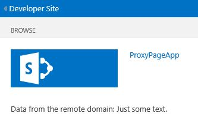

# Create a custom proxy page for the cross-domain library in SharePoint 2013
Learn how to create a custom proxy page to access data in a remote service from a SharePoint webpage by using the cross domain library in SharePoint. 
 

 **Note**  The name "apps for SharePoint" is changing to "SharePoint Add-ins". During the transition, the documentation and the UI of some SharePoint products and Visual Studio tools might still use the term "apps for SharePoint". For details, see  [New name for apps for Office and SharePoint](new-name-for-apps-for-sharepoint.md#bk_newname).
 

When you are building SharePoint Add-ins, you usually have to incorporate data from various sources. However, for security reasons, there are blocking mechanisms that prevent communication with more than one domain at a time.
 

You can use the cross-domain library to access data in your remote add-in if you provide a custom proxy page that is hosted in the remote add-in infrastructure. As the developer, you are responsible for implementing the custom proxy page, and have to deal with custom logic, such as the authentication mechanism to the remote add-in. Use the cross-domain library with a custom proxy page if you want the communication to occur at the client level.
 


## Prerequisites for using the examples in this article
<a name="SP15Createcustomproxypage_Prereq"> </a>

You need a development environment as explained in  [Get started creating provider-hosted SharePoint Add-ins](get-started-creating-provider-hosted-sharepoint-add-ins.md).
 

 

### Core concepts to know before using a custom proxy page with SharePoint Add-ins

The following table lists some useful articles that can help you understand the concepts involved in a cross-domain scenario for SharePoint Add-ins.
 

 

**Table 1. Core concepts for using a custom proxy page**


|**Article title**|**Description**|
|:-----|:-----|
| [SharePoint Add-ins](sharepoint-add-ins.md)|Learn about the new add-in model in SharePoint that enables you to create add-ins, which are small, easy-to-use solutions for end users.|
| [Secure data access and client object models for SharePoint Add-ins](secure-data-access-and-client-object-models-for-sharepoint-add-ins.md)|Learn about data access options in SharePoint Add-ins. This topic provides guidance on the high-level alternatives you have to choose from when working with data in your add-in.|
| [Host webs, add-in webs, and SharePoint components in SharePoint 2013](host-webs-add-in-webs-and-sharepoint-components-in-sharepoint-2013.md)|Learn about the difference between host webs and add-in webs. Find out which SharePoint components can be included in a SharePoint Add-in, which components are deployed to the host web, which components are deployed to the add-in web, and how the add-in web is deployed in an isolated domain.|
| [Client-side Cross-domain Security](http://msdn.microsoft.com/en-us/library/cc709423%28v=vs.85%29.aspx)|Explore cross-domain threats and use cases, and security principles for cross-origin requests, and weigh the risks for developers to enhance cross-domain access from web applications that run in the browser.|

## Code example: Access remote data using a custom proxy page for the cross-domain library
<a name="SP15Createcustomproxypage_Codeexample"> </a>

To read data from the remote service, you must do the following: 
 

 

1. Create a SharePoint Add-in project.
    
 
2. Modify the add-in manifest to allow communication from the remote add-in.
    
 
3. Create the custom proxy page and a content page in the web project.
    
 
4. Create a page that uses the cross-domain library in the SharePoint Add-in project.
    
 

### To create the SharePoint Add-in project


1. Open Visual Studio as administrator. (To do this, right-click the Visual Studio icon on the  **Start** menu, and choose **Run as administrator**.)
    
 
2. Create the provider-hosted SharePoint Add-in as explained in  [Get started creating provider-hosted SharePoint Add-ins](get-started-creating-provider-hosted-sharepoint-add-ins.md) and name itProxyPageApp. 
    
 

### To edit the add-in manifest file


1. In  **Solution Explorer**, right-click the  **AppManifest.xml** file, and choose **View code**.
    
 
2. Replace the entire  **AppPrincipal** element with the following.
    
```XML
  <AppPrincipal>
    <Internal AllowedRemoteHostUrl="~remoteAppUrl"/>
</AppPrincipal>
```


     **Note**  The  **AllowedRemoteHostUrl** attribute is used to specify the remote domain. The **~remoteAppUrl** resolves to the remote add-in URL. For more information about tokens, see [Explore the app manifest structure and the package of a SharePoint Add-in](explore-the-app-manifest-structure-and-the-package-of-a-sharepoint-add-in.md).

### To create a custom proxy page


1. After the Visual Studio solution has been created, right-click the web application project (not the SharePoint Add-in project) and add a new Web Form by choosing  **Add** > **New Item** > **Web** > **Web Form**. Name the form Proxy.aspx.
    
 
2. In the Proxy.aspx file, replace the entire html element and it's children with the following HTML code. Leave all the markup above the html element as it is. The HTML code contains markup and JavaScript that performs the following tasks:
    
      - Provides a placeholder for the cross-domain library JavaScript file.
    
 
  - Extracts the add-in web URL from the referrer.
    
 
  - Dynamically loads the cross-domain library JavaScript file into the placeholder.
    
 
  - Provides settings for the  **RequestExecutorMessageProcessor** object.
    
 
  - Initializes the  **RequestExecutorMessageProcessor** object.
    
 

```HTML
  <html xmlns="http://www.w3.org/1999/xhtml">
<head runat="server">
    <meta http-equiv="X-UA-Compatible" content="IE=8" /> 
    <title>Custom Proxy Host Page</title>
    <script 
        src="http://ajax.aspnetcdn.com/ajax/4.0/1/MicrosoftAjax.js" 
        type="text/javascript">
    </script>
    <script 
        type="text/javascript" 
        src="http://ajax.aspnetcdn.com/ajax/jQuery/jquery-1.7.2.min.js">
    </script>

    <!-- Script to load the cross-domain library js file -->
    <script type="text/javascript">
        var hostweburl;

        $(document).ready(function(){
            //Get the URI decoded host web URL.
            hostweburl =
                decodeURIComponent(
                    getQueryStringParameter("SPHostUrl")
            );

            // The cross-domain js file is in a URL in the form:
            // host_web_url/_layouts/15/SP.RequestExecutor.js
            var scriptbase = hostweburl + "/_layouts/15/";

            // Load the js file 
            $.getScript(scriptbase + "SP.RequestExecutor.js", initCustomProxy);
        });

        //Function to initialize the custom proxy page
        //  must set the appropriate settings and implement
        //  proper authentication mechanism
        function initCustomProxy() {
            var settings =
            {
                originAuthorityValidator: function (messageOriginAuthority) {
                    // This page must implement the authentication for the
                    //   remote add-in.
                       // You should validate if messageOriginAuthority is
                       //  an approved domain to receive calls from.
                    return true;
                }
            };
            SP.RequestExecutorMessageProcessor.init(settings);
        }

        // Function to retrieve a query string value.
        // For production purposes you may want to use
        //  a library to handle the query string.
        function getQueryStringParameter(paramToRetrieve) {
            var params =
                document.URL.split("?")[1].split("&amp;");
            var strParams = "";
            for (var i = 0; i < params.length; i = i + 1) {
                var singleParam = params[i].split("=");
                if (singleParam[0] == paramToRetrieve)
                    return singleParam[1];
            }
        }
    </script>
</head>
<body>
    
</body>
</html>


```


     **Important**  In a production SharePoint Add-in, you must provide the authorization logic and return the appropriate value in the  **originAuthorityValidator** object in settings.

### To create a content page


1. Right-click the web application project in  **Solution Explorer** and add a new Web Form by choosing **Add** > **New Item** > **Web** > **Web Form**. Name the form Content.aspx..
    
 
2. Copy the following code and paste it in the  **Page_Load** method in the code-behind file. The code performs the following tasks:
    
      - Sets the output  **content-type** to **text/plain**.
    
 
  - Writes the content to the output buffer.
    
 
  - Ends the connection.
    
 

```C#
  string content;
content = "Just some text.";
Response.ContentType="text/plain";
Response.Write(content);
Response.End();

```


### To create a SharePoint webpage that uses the cross-domain library


1. Right-click the SharePoint Add-in project, and choose  **Add** > **New Item** > **Office/SharePoint** > **Module**.
    
 
2. Name the module Pages, and then choose  **Add**.
    
 
3. Right-click the  **Pages** folder and choose **Add** > **New Item**>  **Office/SharePoint** > **Page**. 
    
 
4. Name the page Home.aspx and then choose **Add**.
    
 
5. Open the  **Home.aspx** page if it isn't opened automatically.
    
 
6. Copy the following code and paste it in the  **PlaceHolderMain** content tag.
    
```
  <!-- The page dynamically loads the cross-domain library's
    js file, rescript acts as the placeholder. -->
<script 
    type="text/javascript"
    id="rescript"
    src="../_layouts/15/SP.RequestExecutor.js">
</script>
    Data from the remote domain: <span id="TextData"></span>

    <!-- Main script to retrieve the host web's title -->
    <script type="text/javascript">
    (function () {
        var executor;
        var hostweburl;
        var remotedomain;

        remotedomain = "<your_remote_add-in_domain>";

        //Get the URI decoded host web URL.
        hostweburl =
            decodeURIComponent(
                getQueryStringParameter("SPHostUrl")
        );

        // Initialize the RequestExecutor with the custom proxy URL.
        executor = new SP.RequestExecutor(remotedomain);
        executor.iFrameSourceUrl = "Proxy.aspx?SPHostUrl=" + hostweburl;

        // Issue the call against the remote endpoint.
        // The response formats the data in plain text.
        // The functions successHandler and errorHandler attend the
        //      sucess and error events respectively.
        executor.executeAsync(
            {
                url:
                    remotedomain + "Content.aspx",
                method: "GET",
                headers: { "Accept": "text/plain" },
                success: successHandler,
                error: errorHandler
            }
        );
    })();

    // Function to handle the success event.
    // Prints the data to the placeholder.
    function successHandler(data) {
        document.getElementById("TextData").innerText =
            data.body;
    }

    // Function to handle the error event.
    // Prints the error message to the page.
    function errorHandler(data, errorCode, errorMessage) {
        document.getElementById("TextData").innerText =
            "Could not complete cross-domain call: " + errorMessage;
    }

    // Function to retrieve a query string value.
    // For production purposes you may want to use
    //  a library to handle the query string.
    function getQueryStringParameter(paramToRetrieve) {
        var params =
            document.URL.split("?")[1].split("&amp;");
        var strParams = "";
        for (var i = 0; i < params.length; i = i + 1) {
            var singleParam = params[i].split("=");
            if (singleParam[0] == paramToRetrieve)
                return singleParam[1];
        }
    }
    </script>

```

7. In the preceding code that you pasted, find the line  `remotedomain = "<your_remote_add-in_domain>";`, and replace the placeholder  _<your_remote_add-in_domain>_ with the "localhost" URL that your web application uses when you are running the add-in with F5 in Visual Studio. To find this value, select the web application project in **Solution Explorer**. The  **URL** property will be in the **Properties** pane. Use the entire value, including the protocol, the port, and the closing slash; for example "http://localhost:45072".
    
 
8. Save and close the file.
    
 
9. Open the appmanifest.xml file, and set the  **Start page** value to **ProxyPageApp/Pages/Home.aspx**.
    
 

### To build and run the solution


1. Make sure that the SharePoint Add-in project is set as the startup project.
    
 
2. Press the F5 key.
    
     **Note**  When you press F5, Visual Studio builds the solution, deploys the add-in, and opens the permissions page for the add-in.
3. Choose the  **Trust It** button.
    
    The Home page will open and it should look like the following. It may take a few seconds for the phrase "Just some text" to appear because it is being fetched from the remote domain's Content.aspx page.
    

    **Data from the remote service in a SharePoint webpage**

 

     
 

 

 

**Table 2. Troubleshooting the solution**


|**Problem**|**Solution**|
|:-----|:-----|
|Visual Studio does not open the browser after you press the F5 key.|Set the SharePoint Add-in project as the startup project.|
|Unhandled exception  **SP is undefined**.|Make sure that you can access the SP.RequestExecutor.js file in a browser window.|

## Next steps
<a name="SP15Createcustomproxypage_Nextsteps"> </a>

This article demonstrated how to access remote data by using a custom proxy page for the cross-domain library in SharePoint. As a next step, you can learn about other data access options available in SharePoint Add-ins. To learn more, see the following:
 

 

-  [Code sample: Get data by using a proxy page for the cross-domain library](http://code.msdn.microsoft.com/SharePoint-2013-Get-data-10039ff1)
    
 
-  [Access SharePoint 2013 data from add-ins using the cross-domain library](access-sharepoint-2013-data-from-add-ins-using-the-cross-domain-library.md)
    
 
-  [Query a remote service using the web proxy in SharePoint 2013](query-a-remote-service-using-the-web-proxy-in-sharepoint-2013.md)
    
 

## Additional resources
<a name="SP15Createcustomproxypage_Addresources"> </a>


-  [Set up an on-premises development environment for SharePoint Add-ins](set-up-an-on-premises-development-environment-for-sharepoint-add-ins.md)
    
 
-  [Work with external data in SharePoint 2013](work-with-external-data-in-sharepoint-2013.md)
    
 
-  [Secure data access and client object models for SharePoint Add-ins](secure-data-access-and-client-object-models-for-sharepoint-add-ins.md)
    
 
-  [Authorization and authentication of SharePoint Add-ins](authorization-and-authentication-of-sharepoint-add-ins.md)
    
 
-  [Use OData query operations in SharePoint REST requests](use-odata-query-operations-in-sharepoint-rest-requests.md)
    
 
-  [Three ways to think about design options for SharePoint Add-ins](three-ways-to-think-about-design-options-for-sharepoint-add-ins.md)
    
 
-  [Important aspects of the SharePoint Add-in architecture and development landscape](important-aspects-of-the-sharepoint-add-in-architecture-and-development-landscape.md)
    
 
-  [Data storage in SharePoint Add-ins](important-aspects-of-the-sharepoint-add-in-architecture-and-development-landscape.md#Data)
    
 

