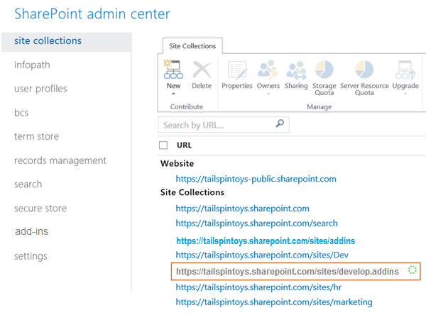

# Create a developer site on an existing Office 365 subscription
An Office 365 Developer Site makes it easier to get set up and start creating, testing, and deploying your Office and SharePoint Add-ins more quickly. Many Office 365 Business, Enterprise, Education, and Government subscriptions include a site template you can use to create a Developer Site.
 

 **Note**  The name "apps for SharePoint" is changing to "SharePoint Add-ins". During the transition, the documentation and the UI of some SharePoint products and Visual Studio tools might still use the term "apps for SharePoint". For details, see  [New name for apps for Office and SharePoint](new-name-for-apps-for-sharepoint.md#bk_newname).
 

 **Before you start**
 

-  **Be sure you have an Office 365 subscription that supports a Developer Site.** If you have one of the following Office 365 subscription plans, you can create a Developer Site within your existing subscription:
    
    - Office 365 Midsize Business
    
 
- Office 365 Enterprise E1, E3, E4, E5, or K1
    
 
- Office 365 Education A2, A3, or A4
    
 
- Office 365 Government G1, G3, G4, or K1
    
 
-  **If you have an Office 365 Small Business subscription,** it supports only a single site collection, and so you can't create a Developer Site collection. If you would like to learn more about Office 365 plans for your business, see [SharePoint Online: software boundaries and limits](http://office.microsoft.com/en-us/office365-sharepoint-online-enterprise-help/sharepoint-online-software-boundaries-and-limits-HA102694293.aspx).
    
 
- For more information about the Office 365 Enterprise offerings, see  [Plans &amp; Pricing](http://products.office.com/en-us/business/office-365-enterprise-e1-business-software ).
    
 

## Create a Developer Site

1. Sign in to Office 365 as a Global or SharePoint Online admin.
    
     **You must sign in as a Global or SharePoint Online admin to create new site collections,** such as a Developer Site. Only admins can see Admin options when signing into Office 365. If you're not an admin, contact an admin in your company and have them do one of the following:
    
      - Grant you admin rights, so you can create the Developer Site yourself.
    
 
  - Create the Developer Site for you, and specify you as an admin for the site collection.
    
 
2. Click the App Launcher button on the far left of the navigation bar at top.
    
 
3. Click the  **Admin** tile.
    
 
4. In the navigation tree on the left, expand  **Admin**, and select  **SharePoint**.
    
 
5. In the  **SharePoint admin center**, on the **Site Collections** tab, click **New > Private Site Collection**.
    
  
 

 

 
6. In the  **New Site Collection** dialog box, provide information about your Developer Site.
    
|**Field**|**Value**|
|:-----|:-----|
|**Title**|The name you want to give your Developer Site.|
|**Public Website Address** list|A domain name and a URL path—either  **/sites/** or **/teams/**—and then type a URL name for the site collection.|
|**Select a language** list in the **Template Selection** section|A primary language to use for your Developer Site. **Be sure to select the appropriate language for the Developer Site site collection, because once you choose it, it can't be changed.**Selecting a language for your Developer Site does not affect the languages you can make available in your Office and SharePoint Add-ins.You can enable the SharePoint multiple language interface on your sites, but the primary language for the site collection is the one you choose here.|
|**Template Selection** section, on the **Collaboration** tab under **Select a template**|Choose  **Developer Site.**|
|**Time Zone**|Time zone that's appropriate for the locale of your Developer Site.|
|**Administrator**|The user name of your site collection administrator.|
|**Storage Quota**|Number of megabytes (MB) you want to allocate to this Developer Site site collection.|
|**Server Resource Quota**|The amount of resources to allocate to the site collection. This number is a combination of performance metrics (such as processor time and unhandled exceptions) that pertain to code in sandboxed solutions. When the level exceeds a daily quota, the sandbox is turned off for this site collection.|
7. Click  **OK**.
    
    You'll see the new developer site URL in the  **Site Collections** list. When the site creation is finished, you can navigate to the URL to open your Developer Site.
    
  
 

 

 

## Additional resources

-  [SharePoint Add-ins](sharepoint-add-ins.md)
    
 
-  [Create or delete a site collection](http://office.microsoft.com/en-us/office365-sharepoint-online-enterprise-help/create-or-delete-a-site-collection-HA102772354.aspx?CTT=1)
    
 

