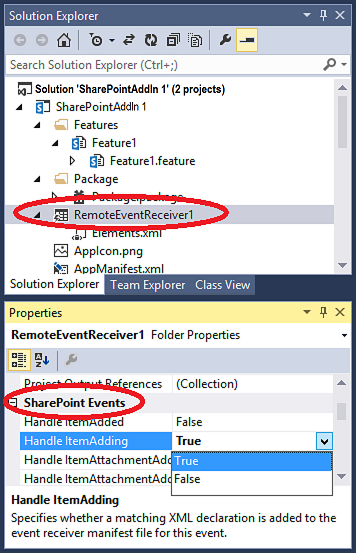

# Create a remote event receiver in SharePoint Add-ins
Create a remote event receiver (RER) that handles list and list item events in a SharePoint Add-in.
 

 **Note**  The name "apps for SharePoint" is changing to "SharePoint Add-ins". During the transition, the documentation and the UI of some SharePoint products and Visual Studio tools might still use the term "apps for SharePoint". For details, see  [New name for apps for Office and SharePoint](new-name-for-apps-for-sharepoint.md#bk_newname).
 


## Prerequisites
<a name="SP15appevent_prereq"> </a>

It is helpful if you first have an understanding of provider-hosted SharePoint Add-ins, and for you to have developed a few that go a least a little beyond the "Hello World" level. Also, you should be familiar with  [Handle events in SharePoint Add-ins](handle-events-in-sharepoint-add-ins.md). 
 

 

## Create a remote event receiver
<a name="MakeRER"> </a>

This article shows how you extend a SharePoint Add-in by adding a remote event receiver (RER) that handles the ItemAdded event for a custom list in the add-in web. The RER is registered with the add-in web using declarative markup. RERs are registered with the  *host web*  programmatically. For a code sample that does so, see [OfficeDev/PnP/Samples/Core.EventReceivers](https://github.com/OfficeDev/PnP/tree/master/Samples/Core.EventReceivers).
 

 
An RER must be a SOAP web service. The continuing example implements this as a Windows Communication Foundation (WCF) service; but it is possible in principle to implement an RER on a non-Microsoft stack.
 

 
To follow along with this article and enter the code yourself, download the sample from  [SharePoint-Add-in-CSOM-BasicDataOperations](https://github.com/OfficeDev/SharePoint-Add-in-CSOM-BasicDataOperations), and then open the sample in Visual Studio.
 

 

 **Note**  This sample use a TokenHelper.cs file that is generated by Office Developer Tools for Visual Studio. It was the current version when the sample was created, but may not be the most recent version when you read this. The sample is still great for creating your first RER. But when you are ready to move beyond that, you should look at the samples listed in the Next Steps section below. They are more likely to be kept up-to-date.
 


### To register a remote event receiver


1. Open the SharePoint Add-in project in Visual Studio. 
    
 
2.  In **Solution Explorer**, choose the add-in project's node.
    
 
3. On the menu bar, choose  **Project**,  **Add New Item**.
    
 
4. In the  **Installed Templates** pane, choose the **Office/ SharePoint** node.
    
 
5. In the  **Templates** pane, choose the **Remote Event Receiver** template.
    
 
6. In the  **Name** box, keep the default name (RemoteEventReceiver1), and then choose the  **Add** button.
    
 
7. In the  **What type of event receiver do you want?** list, choose **List Item Events**.
    
 
8. In the  **What item should be the event source?** list, choose **Custom List**.
    
    The continuing example uses a custom generic list. But an RER can also handle events that occur in standard SharePoint lists, such as  **Announcements** or **Contacts**.
    
 
9. In the  **Handle the following events** list, choose **An item is being added**, and then choose the  **Finish** button.
    
    A web service is added to the web application to handle the remote event that you specified. A remote event receiver is added to the SharePoint Add-in and the list item event is referenced in the receiver's Elements.xml file that is itself contained in the add-in web Feature.
    
 

### To create the list


1. In  **Solution Explorer** select the add-in project's node.
    
 
2. On the menu bar, choose  **Project**,  **Add New Item**.
    
 
3. In the  **Installed Templates** pane, choose the **Office SharePoint** node.
    
 
4. In the  **Templates** pane, choose the **List** template.
    
 
5. In the  **Name** box, leave the default name (List1), and then choose the  **Add** button.
    
 
6. Choose the  **Create a list instance based on an existing list template** option button, choose **Custom List** in the list, and then choose the **Finish** button.
    
 

### To add functionality to the remote event receiver


1. If your test SharePoint farm is not on the same computer that is running Visual Studio, (or you are using an SharePoint Online tenancy as your test SharePoint site), configure the project for debugging using the Microsoft Azure Service Bus. For more information, see the  [Debug and troubleshoot a remote event receiver in a SharePoint Add-in](debug-and-troubleshoot-a-remote-event-receiver-in-a-sharepoint-add-in.md). 
    
 
2. In the code file for the service of the remote event receiver (that is, RemoteEventReceiver1.svc.cs), replace the contents with the following code.
    
    This code performs the following tasks.
    
      - Gets a valid client context object. 
    
 
  - If a list that's named  **EventLog** doesn't already exist, creates one to contain the names of the remote events that occur.
    
 
  - Adds an entry to the list for the event, including a time and date stamp.
    
 

     **Note**  At the time this article was written the Office Developer Tools for Visual Studio add references to all the needed assemblies when the receiver is created, but later versions of the tools may not. If you get compiler errors, simply add the missing references; for example, you may need to add references to System.ServiceModel or System.ComponentModel.DataAnnotations.


```C#
  using System;
using System.Collections.Generic;
using System.Linq;
using System.Net;
using System.Text;
using Microsoft.SharePoint.Client;
using Microsoft.SharePoint.Client.EventReceivers;
using System.Runtime.Serialization;
using System.ServiceModel;
using System.ServiceModel.Channels;


namespace BasicDataOperationsWeb.Services
{
    public class RemoteEventReceiver1 : IRemoteEventService
    {
        public SPRemoteEventResult ProcessEvent(SPRemoteEventProperties properties)
        {
            // When a "before" event occurs (such as ItemAdding), call the event 
            // receiver code.
            ListRemoteEventReceiver(properties);
            return new SPRemoteEventResult();
        }

        public void ProcessOneWayEvent(SPRemoteEventProperties properties)
        {
            // When an "after" event occurs (such as ItemAdded), call the event 
            // receiver code.            
        }

        public static void ListRemoteEventReceiver(SPRemoteEventProperties properties)
        {
            string logListTitle = "EventLog";

            // Return if the event is from the EventLog list itself. Otherwise, it may go into
            // an infinite loop.
            if (string.Equals(properties.ItemEventProperties.ListTitle, logListTitle, 
                  StringComparison.OrdinalIgnoreCase))
                return;

            // Get the token from the request header.
            HttpRequestMessageProperty requestProperty = 
                  (HttpRequestMessageProperty)OperationContext
                   .Current.IncomingMessageProperties[HttpRequestMessageProperty.Name];
            string contextTokenString = requestProperty.Headers["X-SP-ContextToken"];

            // If there is a valid token, continue.
            if (contextTokenString != null)
            {
                SharePointContextToken contextToken =
                    TokenHelper.ReadAndValidateContextToken(contextTokenString, 
                         requestProperty.Headers[HttpRequestHeader.Host]);

                Uri sharepointUrl = new Uri(properties.ItemEventProperties.WebUrl);
                string accessToken = TokenHelper.GetAccessToken(contextToken, 
                                                      sharepointUrl.Authority).AccessToken;
                bool exists = false;

                // Retrieve the log list "EventLog" and add the name of the event that occurred
                // to it with a date/time stamp.
                using (ClientContext clientContext = 
                     TokenHelper.GetClientContextWithAccessToken(sharepointUrl.ToString(), 
                                                                                                         accessToken))
                {
                    clientContext.Load(clientContext.Web);
                    clientContext.ExecuteQuery();
                    List logList = clientContext.Web.Lists.GetByTitle(logListTitle);

                    try
                    {
                        clientContext.Load(logList);
                        clientContext.ExecuteQuery();
                        exists = true;
                    }

                    catch (Microsoft.SharePoint.Client.ServerUnauthorizedAccessException)
                    {
                        // If the user doesn't have permissions to access the server that's 
                        // running SharePoint, return.
                        return;
                    }

                    catch (Microsoft.SharePoint.Client.ServerException)
                    {
                        // If an error occurs on the server that's running SharePoint, return.
                        exists = false;
                    }

                    // Create a log list called "EventLog" if it doesn't already exist.
                    if (!exists)
                    {
                        ListCreationInformation listInfo = new ListCreationInformation();
                        listInfo.Title = logListTitle;
                        // Create a generic custom list.
                        listInfo.TemplateType = 100;
                        clientContext.Web.Lists.Add(listInfo);
                        clientContext.Web.Context.ExecuteQuery();
                    }

                    // Add the event entry to the EventLog list.
                    string itemTitle = "Event: " + properties.EventType.ToString() + 
                          " occurred on: " + 
                          DateTime.Now.ToString(" yyyy/MM/dd/HH:mm:ss:fffffff");
                    ListCollection lists = clientContext.Web.Lists;
                    List selectedList = lists.GetByTitle(logListTitle);
                    clientContext.Load<ListCollection>(lists);
                    clientContext.Load<List>(selectedList);
                    ListItemCreationInformation listItemCreationInfo = 
                          new ListItemCreationInformation();
                    var listItem = selectedList.AddItem(listItemCreationInfo);
                    listItem["Title"] = itemTitle;
                    listItem.Update();
                    clientContext.ExecuteQuery();
                }
            }
        }
    }
}
```

3. In Home.aspx.cs, change all instances of  `SPHostUrl` to `SPAppWebUrl`.
    
    For example,  `sharepointUrl = new Uri(Request.QueryString["SPHostUrl"]);` should be changed to `sharepointUrl = new Uri(Request.QueryString["SPAppWebUrl"]);`. 
    
 

## Run and test the event handler
<a name="RunAndTest"> </a>

Test your handler with the following procedure.
 

 

1. Press  **F5** key to run the project.
    
 
2. Trust the add-in when prompted to do so.
    
    Your SharePoint Add-in runs, and a table of available lists appears and includes  **List1**.
    
 
3. Choose the ID of  **List1**.
    
    That ID is copied to the  **Retrieve List Items** box.
    
 
4. Choose the  **Retrieve List Items** button.
    
     **List1** appears with no items in it.
    
 
5. In the  **Add Item** box, specifyFirst Item, and then choose the  **Add Item** button.
    
    A list item that's named  **First Item** is added to **List1**, which causes the remote event receiver to fire and add an entry to the EventLog list.
    
 
6. Choose the  **Refresh Lists** button to return to the table of lists.
    
    In the table, a new list that's named  **EventLog** appears.
    
 
7. Choose the  **ListID** GUID value for **EventLog**, and then choose the  **Retrieve List Items** button.
    
    A table for  **EventLog** appears with an entry for the **Handle ItemAdding** event that occurred when you added the item to **List1**.
    
 

## Add or remove event handlers using Visual Studio
<a name="Handle"> </a>


1. In  **Solution Explorer**, choose the project node for the remote event receiver.
    
 
2. In the  **Properties** pane, set the properties for the events that you want to handle to **True**.
    
    For example, if you want to respond whenever a user adds a list item, set the value of the  **Handle ItemAdding** property to **True**. If you don't want to handle that event, set the value of that property to  **False**.
    

    **Figure 1. SharePoint remote events in Visual Studio**

 

  
 

 

 
3. If you added an event, add the event-handling code to the code file for the web service as you did with previous events.
    
    To handle a different type of event, add another remote event receiver to the SharePoint Add-in. For example, if a remote event receiver handles list item events, you can add another list item event to it. But you must add another remote event receiver if you want to handle list events. 
    
 

## URL and hosting restrictions for production remote event receivers
<a name="Handle"> </a>

The remote event receiver can be hosted in the cloud or in an on-premise server that is not also being used as a SharePoint server. The URL of a production receiver cannot specify a particular port. This means that you must use either port 443 for HTTPS, which we recommend, or port 80 for HTTP. If you are using HTTPS and the receiver service is hosted on-premise, but the add-in is on Microsoft SharePoint Online, then the hosting server must have a publically trusted certificate from a certificate authority. (A self-signed certificate works only if the add-in is in an on-premise SharePoint farm.)
 

 

## Next Steps
<a name="Handle"> </a>

Use the following code samples to improve your understanding of RERs:
 

 

-  [OfficeDev/PnP/Samples/Core.EventReceivers](https://github.com/OfficeDev/PnP/tree/master/Samples/Core.EventReceivers)
    
 
-  [OfficeDev/PnP/Samples/Provisioning.ReR](
https://github.com/OfficeDev/PnP/tree/master/Samples/Provisioning.ReR)
    
 
-  [OfficeDev/PnP/Scenarios/ECM.AutoTagging](https://github.com/OfficeDev/PnP/tree/master/Samples/ECM.AutoTagging)
    
 

## Additional resources
<a name="Additional"> </a>


-  [Handle events in SharePoint Add-ins](handle-events-in-sharepoint-add-ins.md)
    
 
-  [Debug and troubleshoot a remote event receiver in a SharePoint Add-in](debug-and-troubleshoot-a-remote-event-receiver-in-a-sharepoint-add-in.md)
    
 
-  [Remote Event Receivers FAQ](handle-events-in-sharepoint-add-ins.md#RERFAQ)
    
 

