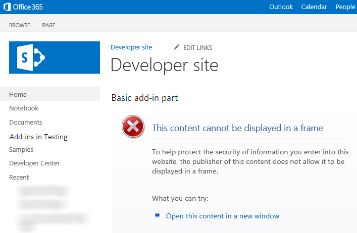

# Create add-in parts to install with your SharePoint Add-in

With add-in parts, you can show your add-in user experience right in the SharePoint website pages. An add-in part displays the webpage (which is typically an interactive form or a dynamic display of data) that you specify by using an **IFrame** (also referred to as a frame) in a page in the [host web](host-webs-add-in-webs-and-sharepoint-components-in-sharepoint.md). 

For more background about add-in parts, see the following articles:

-  [Accessing the add-in from the UI](important-aspects-of-the-sharepoint-add-in-architecture-and-development-landscap.md#AccessingApp)
-  [UX design for SharePoint Add-ins](ux-design-for-sharepoint-add-ins.md)
-  [Extending SharePoint UI in add-ins](sharepoint-add-ins-ux-design-guidelines.md#UXGuide_Extending)
    
The following figure shows how the add-in part content is displayed in a SharePoint page.

**Add-in part content displayed in a SharePoint page**


<br/>
 
An add-in part is implemented with the **ClientWebPart** class, and like all Web Parts it is a available in the Web Part gallery after a user installs the SharePoint Add-in that includes it. Your users can further customize the add-in part by using the properties that you provide. (For an example of configurable properties in an add-in part, see the figure **SharePoint page hosting a basic add-in part** later in this article.)
 
The example in this article uses a webpage that is hosted on a remote server, not on SharePoint, as the content page. Keep in mind that you can also use SharePoint pages to host the add-in part content, as described in the  [Other common scenarios add-in parts](#SP15Createappparts_Nextsteps) section later in this article.
 
<a name="SP15Createappparts_Prereq"> </a>

## Prerequisites for using the example in this article

To follow the steps in this example, you need the following:

- Visual Studio
- Microsoft Office Developer Tools for Visual Studio
- A SharePoint development environment. If you need help setting up a development environment, see [Get started creating provider-hosted SharePoint Add-ins](get-started-creating-provider-hosted-sharepoint-add-ins.md).

<a name="SP15Createappparts_Codeexample"> </a>

## Create an add-in part to install on the host web

There are several tasks required to create and install your add-in part to the host web:

1. Create the SharePoint Add-in and remote web projects.
2. Add a form for the add-in part content.
3. Add the add-in part to the SharePoint Add-in project.
    
After completing the tasks, your add-in part should look similar to the following figure when the add-in part is in edit mode. Here we can see (1) the add-in content displayed in a SharePoint page, and (2) the add-in part custom properties.

**SharePoint page hosting a basic add-in part**


 
<br/>

### Add a form for the add-in part content

1. Create a provider-hosted SharePoint Add-in as described in [Get started creating provider-hosted SharePoint Add-ins](get-started-creating-provider-hosted-sharepoint-add-ins.md), but name the project **TestAppPart**.
    
2. After the Visual Studio solution has been created, right-click the web application project (not the SharePoint Add-in project) and add a new Web Form by selecting **Add** > **New Item** > **Web** > **Web Form**. Name the form **AppPartContent.aspx**.

3. In the AppPartContent.aspx file, replace the entire HTML element and its children with the following HTML code. Leave all the markup above the HTML element as it is. The HTML code contains JavaScript that performs the following tasks:
    
    - Extracts the default property values from the query string
    - Renders the property values
    
    Note that the code expects some parameters in the query string. The add-in part provides its custom properties through the query string so the webpage can use them. The next task explains how to declare custom properties and how to make them available to the add-in webpage.
    
    ```HTML
    <html>
        <body>
            <div id="content">
                <!-- Placeholders for properties -->
                String property: <span id="strProp"></span><br />
                Integer property: <span id="intProp"></span><br />
                Boolean property: <span id="boolProp"></span><br />
                Enumeration property: <span id="enumProp"></span><br />
            </div>

        <!-- Main JavaScript function, controls the rendering
            logic based on the custom property values -->
        <script lang="javascript">
            "use strict";

            var params = document.URL.split("?")[1].split("&amp;");
            var strProp;
            var intProp;
            var boolProp;
            var enumProp;

            // Extracts the property values from the query string.
            for (var i = 0; i < params.length; i = i + 1) {
                var param = params[i].split("=");
                if (param[0] == "strProp")
                    strProp = decodeURIComponent(param[1]);
                else if (param[0] == "intProp")
                    intProp = parseInt(param[1]);
                else if (param[0] == "boolProp")
                    boolProp = (param[1] == "true");
                else if (param[0] == "enumProp")
                    enumProp = decodeURIComponent(param[1]);
            }

            document.getElementById("strProp").innerText = strProp;
            document.getElementById("intProp").innerText = intProp;
            document.getElementById("boolProp").innerText = boolProp;
            document.getElementById("enumProp").innerText = enumProp;
        </script>
        </body>
    </html>
    ```

    <br/>

4. Save and close the file.

### Add the add-in part to the SharePoint Add-in project

1. Right-click the SharePoint Add-in project (not the web application project), and then select **Add** > **New Item** > **Office/SharePoint** > **Client Web Part (Host Web)**. ("Client Web Part" is another name for "add-in part".)

2. Name the part **Basic add-in part**.

3. In the **Specify the client web part page** dialog box, select **Select or enter a URL for an existing web page**. Select the **TestAppWebPart/AppPartContent.aspx** page in the drop-down list. (After you've made your choice, the page URL may appear in the box with "TestAppWebPart" replaced by **~remoteAppUrl** and with **{StandardTokens }** added for the query parameters.)

4. Select **Finish**.

5. Right-click **Basic add-in part** in **Solution Explorer**, and select **Properties**.

6. In the **Properties** pane, select **Custom properties** and select the callout (**...**) button.

7. Use the **Custom Properties** dialog to add four custom properties to the add-in part. You have to set five attributes of each of the four custom properties. The attribute names and values are listed in Table 1. Create the properties using the following procedure.
    
    1. Select **Add**.
 
    2. In the attribute list, select the first attribute from Table 1: **DefaultValue**. 
 
    3. Set the value, for example, String default value.
 
    4. Select the next attribute, **Name**, and set its value, for example, strProp.
 
    5. Continue with the **Type**, **WebCategory**, and **WebDisplayName** attributes.
    
    6. Select **Add** again and repeat the process for all four rows of Table 1. Do *not* close the dialog box.
    
        **Table 1. Attributes for the add-in part's custom properties**

        |**DefaultValue**|**Name**|**Type**|**WebCategory**|**WebDisplayName**|
        |:-----|:-----|:-----|:-----|:-----|
        |String default value|strProp|string|Basic add-in part category|A property of type string|
        |0|intProp|int|Basic add-in part category|A property of type integer|
        |false|boolProp|boolean|Basic add-in part category|A property of type boolean|
        |1st|enumProp|enum|Basic add-in part category|A property of type enumeration|

        At this point the dialog should look like the following:
    
        **Custom Properties dialog for ClientWebPart**

        

        <br/>

8. Select the **enumProp** property, select the **EnumItems** attribute, and then select the callout ( **...**) button. 
    
9. Use the **ClientWebPartEnumItem Collection Editor** to add three items. You have to set two attributes of each of the three. The attribute names and values are listed in Table 2. Create the properties using the following procedure.
    
    1. Select **Add**.
 
    2. In the attribute list, select the first attribute from Table 2: **Value**. 
 
    3. Set the value of the attribute, for example, 1st.
 
    4. Select the next attribute, **WebDisplayName**, and set its value, for example, First option.
 
    5. Select **Add** again and repeat the process for all rows of Table 2.
    
        **Table 2. Enum items of the enumProp property**

        |**Value**|**WebDisplayName**|
        |:-----|:-----|
        |1st|First option|
        |2nd|Second option|
        |3rd|Third option|

        The dialog should look like the following when you are finished:

        **ClientWebPartEnumItem Collection Editor**

        

        <br/>

    6. Select **OK** to close the dialog, and then select **OK** again to close the **Custom Properties** dialog.
    
10. Visual Studio generates the following XML code in the elements.xml file of the add-in part (line breaks added for clarity). Note that the **Title** attribute of the **ClientWebPart** element is set to "Basic add-in part Title" and the Description is set to "Basic add-in part Description". Delete the word "Title" from the first, and replace the second with a Basic add-in part. 
    
```XML
  <?xml version="1.0" encoding="UTF-8"?>
<Elements xmlns="http://schemas.microsoft.com/sharepoint/">
    <ClientWebPart
        Name="Basic add-in part"
        Title="Basic add-in part Title"
        Description="Basic add-in part Description" >
        
        <!--  The properties are passed through the query string 
                using the following notation: _propertyName_
                in the Src property of the Content element.  
          -->
        <Content
            Src="~remoteAppUrl/AppPartContent.aspx?strProp=_strProp_&amp;amp;intProp=_intProp_&amp;amp;boolProp=_boolProp_&amp;amp;enumProp=_enumProp_"
            Type="html"/>
        <Properties>
            <Property
                Name="strProp"
                Type="string"
                RequiresDesignerPermission="true"
                DefaultValue="String default value"
                WebCategory="Basic add-in part category"
                WebDisplayName="A property of type string.">
            </Property>
            <Property
                Name="intProp"
                Type="int"
                RequiresDesignerPermission="true"
                DefaultValue="0"
                WebCategory="Basic add-in part category"
                WebDisplayName="A property of type integer.">
            </Property>
            <Property
                Name="boolProp"
                Type="boolean"
                RequiresDesignerPermission="true"
                DefaultValue="false"
                WebCategory="Basic add-in part category"
                WebDisplayName="A property of type boolean.">
            </Property>
            <Property
                Name="enumProp"
                Type="enum"
                RequiresDesignerPermission="true"
                DefaultValue="1st"
                WebCategory="Basic add-in part category"
                WebDisplayName="A property of type enum.">
                <EnumItems>
                    <EnumItem WebDisplayName="First option" Value="1st"/>
                    <EnumItem WebDisplayName="Second option" Value="2nd"/>
                    <EnumItem WebDisplayName="Third option" Value="3rd"/>
                </EnumItems>
            </Property>
        </Properties>
    </ClientWebPart>
</Elements>               

```

<br/>

### Set the add-in start page to the host web home page

1. The continuing sample SharePoint Add-in doesn't have any add-in web, and its remote web application exists only to host the form. There isn't any full page, immersive experience for this add-in. So the start page of the add-in should be set to the home page of the host web. 
    
    To begin, select the SharePoint Add-in project (not the web application project) in **Solution Explorer** and copy the value of the **Site URL** property, including the protocol (for example **https://contoso.sharepoint.com**) into the clipboard. 
    
2. Open the add-in manifest, and then paste the URL into the **Start Page** box.
    
3. Optionally, you can delete the Default.aspx page from the web application project, because it is not used in the SharePoint Add-in.

### Build and test the solution

1. Select the F5 key.
    
    > [!NOTE] 
    > When you select F5, Visual Studio builds the solution, installs the add-in, and opens the permissions page for the add-in.

2. Select the **Trust It** button.
 
3. Add the **Basic add-in part** from the Add-in Part gallery. For detailed instructions, see [Add an Add-in Part to a page](https://support.office.com/article/Add-an-App-Part-to-a-page-6f06c0b7-44b8-4c69-b4ad-85197eee8d78).
    
    When the add-in is installed on the host web, the **Basic add-in part** is available in the Add-in Part gallery. It should look a lot like the following figure.
    
    **Add-in part in the Add-in Part gallery**

    

    <br/>
 
4. After you have added the add-in part, select the down arrow to the right of the title **Basic add-in part**, and then select **Edit web part**.
    
    You should see the add-in part in edit mode.
 
5. Open **Basic add-in part category** and change some of the property values.
    
6. Select **OK** to save your changes and verify that the properties have changed in the add-in part.
    
7. When you end the debugging session, and you won't be using F5 again on this project for a while, it is a good practice to retract the SharePoint Add-in one last time to ensure that the test add-in part is removed from your home page. Right-click the SharePoint Add-in project and select **Retract**.

<a name="SP15Createappparts_Codeexample"> </a>

## Troubleshooting

**Table 3. Troubleshooting the solution**


|**Problem**|**Solution**|
|:-----|:-----|
|The add-in part does not display any content. The add-in part displays the following error: **Navigation to the webpage was canceled**. This error occurs because the browser has blocked the content page.| Enable mixed content. The procedure might be different depending on the browser you are using: Internet Explorer 9 and 10 display the following message at the bottom of the page: **Only secure content is displayed**. Select **Show all content** to display the add-in part content.<br/><br/>Internet Explorer 8 shows a dialog box with the following message: **Do you want to view only the webpage content that was delivered securely?** Select **No** to display the add-in part content.<br/><br/>Alternatively, you can enable mixed content in the Internet zone that you are working on. For most developers the Internet zone is **Local intranet**. If this is not the case for you, substitute **Local intranet** for the Internet zone you are working on.<br/><br/>In Internet Explorer, select **Tools** > **Internet Options**. In the **Internet Options** dialog box, on the **Security** tab, select **Local intranet**, and then select the **Custom level** button. In the **Security Settings** dialog box, enable **Display mixed content** in the **Miscellaneous** section. |


## Other common scenarios add-in parts
<a name="SP15Createappparts_Nextsteps"> </a>

This article shows how to create a basic add-in part with custom properties using a remote webpage as the content page. You can also explore the following scenarios and details about add-in parts.

### Use a SharePoint page as the content page

In most cases, a webpage can't be displayed in a frame if it sends an **X-Frame-Options** HTTP header in the response. By default, SharePoint pages include the **X-Frame-Options** header. If you are using a SharePoint webpage hosted on the add-in web, you might run into the following error (shown in the following figure): **This content cannot be displayed in a frame**.

**Add-in part that can't display its content in a frame**



<br/>

Be aware that certain scenarios are susceptible to [ClickJacking](http://blogs.msdn.com/b/ieinternals/archive/2010/03/30/combating-clickjacking-with-x-frame-options.aspx) attacks when the webpages are displayed in a frame. Carefully evaluate your add-in part scenarios to make sure there is no risk of **ClickJacking** attacks.

If your page hosted on the add-in web is not susceptible to ClickJacking attacks, you can use the **AllowFraming** Web Part to suppress the **X-Frame-Options** header from your page's response. The following code example shows how to use the **AllowFraming** Web Part on a SharePoint page. Copy this markup into the page that is hosted on the add-in web. Put it just above the first **asp:content** element in the page. It should not be a child of any other element.

```XML
<WebPartPages:AllowFraming ID="AllowFraming1" runat="server" />
```

You can download an add-in part code sample [Display add-in web content in the host web using an add-in part](https://code.msdn.microsoft.com/office/SharePoint-2013-Display-be8dac16) that shows how to use a SharePoint page as the content page.

### Resize the add-in part

If you're using dynamic content in your add-in part, the content might change its width and height. Due to the dynamic nature of the content, it may not fit in the frame. You may also be using too much space. With dynamic content, it could be difficult to specify a fixed size in your add-in part declaration. However, you can resize the frame to fit the content's width and height.

You can use POST messages from your content webpage to specify the frame's size. The following JavaScript example shows you how to send a POST message to resize the frame in which your add-in part is hosted. Typically, you would have this in a JavaScript method in a JavaScript file that you call from the page. For example, the page could have a control in which the user specifies the size of the add-in part window. The custom method is then called from **onchange** handler of the control. 

For a full sample of an add-in part that dynamically resizes, see [Code sample: Resize add-in parts dynamically in SharePoint Add-ins](https://code.msdn.microsoft.com/office/SharePoint-2013-Resize-app-594acc88). 

```
window.parent.postMessage("<message senderId={SenderId}>resize(120, 300)</message>", {hostweburl});
```

In the example above, the **senderId** value is set on the query string of the page automatically by the add-in part code when the page is rendered. Your page would just need to read the **SenderId** value off of the query string and use it when requesting a resize. You can retrieve the host web URL from the query string by appending the **StandardTokens** or **HostUrl** tokens to the **Src** attribute in your add-in part definition. 

### Use the SharePoint style sheet in your add-in part content

Because your add-in part is hosted within a SharePoint page, you might want to make the add-in part content look like it is part of the page. One way to achieve a similar look and feel is to use the same style classes as the SharePoint page that is hosting the add-in part. You can make the SharePoint website's style sheet available to the add-in part by adding a reference to the **defaultcss.ashx** file from the add-in web.

For an explanation on how to reference the **defaultcss.ashx** file in your SharePoint Add-ins, see [Use a SharePoint website's style sheet in SharePoint Add-ins](use-a-sharepoint-website-s-style-sheet-in-sharepoint-add-ins.md). 

To see an add-in part that references the style sheet, download the [Code sample: Display remote webpage content using the coffeemaker add-in part](https://code.msdn.microsoft.com/office/SharePoint-2013-App-part-9d83703c).

### Detect when the add-in part is in edit mode

Users can edit the add-in part to change its properties. For example, a user might want to change one of the add-in part's **Appearance** or **Layout** properties. If your add-in part is in edit mode, you might want to modify the rendering logic or prevent some unnecessary processing from happening. Consider, for example, an add-in part that calls a backend database whenever the host page reloads. Changing an add-in part property value in edit mode causes a page reload, but you might not want the network call to be triggered in that case. You can use the **_editMode_** token to detect if users are editing your add-in part.

To use the **_editMode_** token, add a query string parameter to the **Src** attribute of the **Content** element in the add-in part declaration.

```XML
<Content Src="content_page_url&amp;amp;editmode=_editMode_">
```

The **_editMode_** token lets your content page determine if the add-in part is in edit mode. If the add-in part is in edit mode, the **_editMode_** token resolves to 1; otherwise, the token resolves to 0.


## See also
<a name="SP15Createappparts_AddResources"> </a>

-  [Code sample: Display remote add-in content in the host web using an add-in part](https://code.msdn.microsoft.com/office/SharePoint-2013-Display-03c28286)
-  [Create UX components in SharePoint](create-ux-components-in-sharepoint.md)