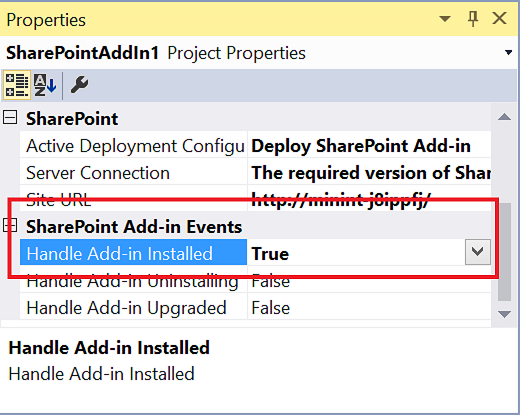

# Create an add-in event receiver in SharePoint Add-ins
Create handlers for the SharePoint Add-in install and uninstall events in SharePoint Add-ins.
 

 **Note**  The name "apps for SharePoint" is changing to "SharePoint Add-ins". During the transition, the documentation and the UI of some SharePoint products and Visual Studio tools might still use the term "apps for SharePoint". For details, see  [New name for apps for Office and SharePoint](new-name-for-apps-for-sharepoint.md#bk_newname).
 


## Prerequisites
<a name="SP15appevent_prereq"> </a>

This article presupposes that you have an understanding of provider-hosted SharePoint Add-ins, and that you have developed a few that go a least a little beyond the "Hello World" level. Also, you should be familiar with  [Handle events in SharePoint Add-ins](handle-events-in-sharepoint-add-ins.md). 
 

 

## Get more code samples
<a name="SP15appevent_prereq"> </a>

If you work through the continuing example in this article, you will have a finished code sample. The following are some other samples. They don't all follow the architecture described in this article. There can be more than one good way to architect an add-in event receiver, and keep in mind also that Microsoft's guidance can evolve over time. 
 

 

-  [OfficeDev/PnP/Samples/Core.AppEvents.HandlerDelegation](https://github.com/OfficeDev/PnP/tree/master/Samples/Core.AppEvents.HandlerDelegation) is a close match to the continuing example in this article.
    
 
-  [OfficeDev/PnP/Samples/Core.AppEvents](https://github.com/OfficeDev/PnP/tree/master/Samples/Core.AppEvents) shows how to do the same task as the preceding sample in scenarios where the handler delegation strategy cannot be used.
    
 
-  [OfficeDev/PnP/Samples/Core.EventReceivers](https://github.com/OfficeDev/PnP/tree/master/Samples/Core.EventReceivers)
    
 
-  [Create a provider-hosted add-in that customizes add-in installation](https://code.msdn.microsoft.com/SharePoint-2013-Create-a-f27752e0)
    
 

## Add an add-in installed event receiver
<a name="SP15appevent_prereq"> </a>


1. In Visual Studio, open the project for the provider-hosted SharePoint Add-in. (If you add an add-in event handler to a SharePoint-hosted add-in, the Office Developer Tools for Visual Studio convert it to a provider-hosted app.)
    
 
2. In  **Solution Explorer**, choose the node for the SharePoint Add-in.
    
 
3. In the  **Properties** window, set the value of **Handle Add-in Installed** to **True**. 
    
    **Figure 1. Add-in events in the properties window**

 

     
 

    The Office Developer Tools for Visual Studio will do the following:
    
 

      - Add a file named AppEventReceiver.svc. that contains some skeletal C# (or VB.NET) code. This is the service that will handle the add-in event.
    
 
  - The following entry is added to the  **Properties** section of the AppManifest.xml file: `<InstalledEventEndpoint>~remoteAppUrl/AppEventReceiver.svc</InstalledEventEndpoint>`. This entry registers the add-in event receiver to SharePoint. (Note that the  **~remoteAppUrl** token is the same one used for the remote web application in the provider-hosted SharePoint Add-in. The Office Developer Tools for Visual Studio assume the domain of the web application and the event handler is the same. In the rare case where it is not, you need to manually replace the token **~remoteAppUrl** with the actual domain of your service.)
    
 
  - If the SharePoint Add-in project doesn't already have a web project, the Office Developer Tools for Visual Studio create one. The tools also ensure that add-in manifest is configured for a provider-hosted add-in. They will also add pages, scripts, CSS files, and other artifacts. (If the only remote component that your add-in needs is the event-handling web service, you can delete these from the project. You also should ensure that the  **StartPage** element in the add-in manifest is not pointing to a page that you have deleted.)
    
 
4. If your test SharePoint farm is not on the same computer that is running Visual Studio, configure the project for debugging using the Microsoft Azure Service Bus. For more information, see  [Debug and troubleshoot a remote event receiver in a SharePoint Add-in](debug-and-troubleshoot-a-remote-event-receiver-in-a-sharepoint-add-in.md). 
    
 
5. If there is a  `ProcessOneWayEvent` method in the AppEventReceiver.svc file, it's implementation should consist of just the line `throw new NotImplementedException();`, because this method cannot be used in an add-in event handler.  *Add-in event handlers have to return an object that tells SharePoint whether to finish or roll back the event and the  `ProcessOneWayEvent` method doesn't return anything.* 
    
 
6. The file will include a  `ProcessEvent` method that looks something like the following. (There may also a block of code that illustrates how to get a client context. Delete it or comment out.)
    
    Note the following about this code:
    
      - The  **SPRemoteEventProperties** object is sent to your handler web service as a SOAP message that contains context information from SharePoint, including an **EventType** property that identifies the event.
    
 
  - The  **SPRemoteEventResult** object that your handler returns contains a **Status** property whose possible values are **SPRemoteEventServiceStatus**. **Continue**,  **SPRemoteEventServiceStatus.CancelNoError**, and  **SPRemoteEventServiceStatus.CancelWithError**. The default value of the  **Status** property is **Continue**, which tells SharePoint to finish the event. The other two values tell SharePoint to:
    
      - Run your handler up to three more times.
    
 
  - If it is still getting a cancel status, cancel the event and roll back anything it has done as part of the event. 
    
 


  ```C#
  public SPRemoteEventResult ProcessEvent(SPRemoteEventProperties properties)
{
    SPRemoteEventResult result = new SPRemoteEventResult();

    return result;
}
  ```

7. Immediately below the line that declares the  `result` variable, add the following switch structure to identify which event is being handled.
    
  ```C#
  switch (properties.EventType)
{
    case SPRemoteEventType.AppInstalled:
        break;
    case SPRemoteEventType.AppUpgraded:
        break;
    case SPRemoteEventType.AppUninstalling:
        break;
}
  ```


     **Note**  The  **AppInstalled**,  **AppUpdated**, and  **AppInstalling** events, if you have handlers for them, will each get their own URL registered in the add-in manifest. So you *can*  have different endpoints for them; but this article (and the Office Developer Tools for Visual Studio) assume they have exactly the same endpoint; that's why the code needs to determine which event called it.
8. As explained in  [Include rollback logic and "already done" logic in your add-in event handlers](handle-events-in-sharepoint-add-ins.md#Rollback), if anything goes wrong in your installation logic, you almost always want the add-in installation canceled, and you want SharePoint to roll back what it has done for the installation, and you want to roll back what your handler has done. One way to accomplish these goals is to add the following code inside the  **case** for the AppInstalled event.
    
  ```C#
  case SPRemoteEventType.AppInstalled:
  try
  {
      // Add-in installed event logic goes here.
  }
  catch (Exception e)
  {
      result.ErrorMessage = e.ErrorMessage;
      result.Status = SPRemoteEventServiceStatus.CancelWithError;

      // Rollback logic goes here.
  }
  break;
  ```


     **Note**  Move installation code that takes more than 30 seconds into the add-in itself. You can add it to "first run" logic that executes the first time the add-in runs. The add-in can display a message saying something like "We're getting things ready for you." Alternatively, the add-in can prompt the user to run the initialization code.If "first run" logic is not feasible for your add-in, another option is to have your event handler start a remote asynchronous process and then immediately return a  **SPRemoteEventResult** object with the **Status** set to **Continue**. A weakness of this strategy is that if the remote process fails, it has no way to tell SharePoint to roll back the add-in installation.
9. As explained in  [Add-in event handler architecture strategies](handle-events-in-sharepoint-add-ins.md#Strategies), the handler delegation strategy is preferred, although not possible in every scenario. In the continuing example, we show you how to implement the handler delegation strategy when adding a list to the host web. (For information on how to create a similar AppInstalled event handler that does not use the handler delegation strategy, see the sample  [OfficeDev/PnP/Samples/Core.AppEvents](https://github.com/OfficeDev/PnP/tree/master/Samples/Core.AppEvents).)
    
    The following is the new version of the AppInstalled  **case** block. Note that initialization logic that applies to all events goes above the **switch** block. Since the same list that is installed will be removed in the AppUninstalling handler, the list is identified there.
    


  ```C#
  SPRemoteEventResult result = new SPRemoteEventResult();
String listTitle = "MyList";

switch (properties.EventType)
{               
    case SPRemoteEventType.AppInstalled:
                    
   try
   {
        string error = TryCreateList(listTitle, properties);
        if (error != String.Empty)
        {
            throw new Exception(error);            
        }
   }
    catch (Exception e)
   {
        // Tell SharePoint to cancel the event.
        result.ErrorMessage = e.Message;
        result.Status = SPRemoteEventServiceStatus.CancelWithError;               
    }
        break;
    case SPRemoteEventType.AppUpgraded:
       break;
    case SPRemoteEventType.AppUninstalling:
       break;
}                      
  ```

10. Add the list creation method to the  **AppEventReceiver** class as a **private** method with the following code. Note that the `TokenHelper` class has a special method that is optimized for getting a client context for an add-in event. Passing **false** for the last parameter ensures that the context is for the host web.
    
  ```C#
  private string TryCreateList(String listTitle, SPRemoteEventProperties properties)
 {    
    string errorMessage = String.Empty;          

    using (ClientContext clientContext =
        TokenHelper.CreateAppEventClientContext(properties, useAppWeb: false))
    {
        if (clientContext != null)
        {
        }
    }
    return errorMessage;
}

  ```

11. Rollback logic is basically exception handling logic and the SharePoint CSOM (Client-side object model) has a  **ExceptionHandlingScope** that enables your web service to delegate exception handling to the SharePoint server. (See also, [How to: Use Exception Handling Scope](http://msdn.microsoft.com/library/103619ef-1ba3-44e3-93e1-5e0685bc616e%28Office.15%29.aspx).) Add the following code to the  **if** block in the preceding snippet.
    
  ```C#
  ExceptionHandlingScope scope = new ExceptionHandlingScope(clientContext); 

using (scope.StartScope()) 
{ 
    using (scope.StartTry()) 
    { 
    }         
    using (scope.StartCatch()) 
    {                                 
    } 
    using (scope.StartFinally()) 
    { 
    } 
} 
 clientContext.ExecuteQuery();

if (scope.HasException)
{
    errorMessage = String.Format("{0}: {1}; {2}; {3}; {4}; {5}", 
        scope.ServerErrorTypeName, scope.ErrorMessage, 
        scope.ServerErrorDetails, scope.ServerErrorValue, 
        scope.ServerStackTrace, scope.ServerErrorCode);
}
  ```

12. There is only one call to SharePoint ( **ExecuteQuery**) in the preceding snippet, but unfortunately we can't quite do with only one. Every object that is going to be referenced in our exception scope has to first be loaded to the client. So add the following code  *above*  the constructor for the **ExceptionHandlingScope**.
    
  ```C#
  ListCollection allLists = clientContext.Web.Lists;
IEnumerable<List> matchingLists =
    clientContext.LoadQuery(allLists.Where(list => list.Title == listTitle));
clientContext.ExecuteQuery();

var foundList = matchingLists.FirstOrDefault();
 List createdList = null;
  ```

13. The code to create a host web list will go into the  **StartTry** block, but the code must first check whether the list has already been added (as explained in [Include rollback logic and "already done" logic in your add-in event handlers](handle-events-in-sharepoint-add-ins.md#Rollback)). If-then-else logic can be delegated to the SharePoint server by using the  **ConditionalScope** class. (See also, [How to: Use Conditional Scope](http://msdn.microsoft.com/library/560112e9-c3ed-4b8f-9cd4-c8bc5d60d63c%28Office.15%29.aspx).) Add the following code inside the  **StartTry** block.
    
  ```C#
  ConditionalScope condScope = new ConditionalScope(clientContext, 
        () => foundList.ServerObjectIsNull.Value == true, true);
using (condScope.StartScope())
{
    ListCreationInformation listInfo = new ListCreationInformation();
    listInfo.Title = listTitle;
    listInfo.TemplateType = (int)ListTemplateType.GenericList;
    listInfo.Url = listTitle;
    createdList = clientContext.Web.Lists.Add(listInfo);                                
}
  ```

14. The  **StartCatch** block should undo the creation of the list, but it needs to first check that the list was created, because an exception might have been thrown in the **StartTry** block before it finished creating the list. Add the following code to the **StartCatch** block.
    
  ```C#
  ConditionalScope condScope = new ConditionalScope(clientContext, 
        () => createdList.ServerObjectIsNull.Value != true, true);
using (condScope.StartScope())
{
    createdList.DeleteObject();
} 
  ```


     **Tip**   **TROUBLESHOOTING:** To test whether your **StartCatch** block is entered when it should be, you need a way to throw a runtime exception on the SharePoint server. Using a **throw** or dividing by zero won't work because they cause *client-side*  exceptions before the client runtime can even bundle up the code and send it to the server (with the **ExecuteQuery** method). Instead, add the following lines to the **StartTry** block. The client-side runtime accepts this, but it causes a server-side exception, which is what you want. `List fakeList = clientContext.Web.Lists.GetByTitle("NoSuchList");`
 
 `clientContext.Load(fakeList);`

    The entire TryCreateList method should look like the following. (The  **StartFinally** block is required even when it is not being used.)
    


  ```C#
  private string TryCreateList(String listTitle, SPRemoteEventProperties properties)
{    
    string errorMessage = String.Empty;  

    using (ClientContext clientContext = 
        TokenHelper.CreateAppEventClientContext(properties, useAppWeb: false))
    {
        if (clientContext != null)
        {
            ListCollection allLists = clientContext.Web.Lists;
            IEnumerable<List> matchingLists = 
                clientContext.LoadQuery(allLists.Where(list => list.Title == listTitle));
            clientContext.ExecuteQuery();
            var foundList = matchingLists.FirstOrDefault();
            List createdList = null;

            ExceptionHandlingScope scope = new ExceptionHandlingScope(clientContext); 
            using (scope.StartScope()) 
            { 
                using (scope.StartTry()) 
                { 
                    ConditionalScope condScope = new ConditionalScope(clientContext, 
                            () => foundList.ServerObjectIsNull.Value == true, true);  
                    using (condScope.StartScope())
                    {
                        ListCreationInformation listInfo = new ListCreationInformation();
                        listInfo.Title = listTitle;
                        listInfo.TemplateType = (int)ListTemplateType.GenericList;
                        listInfo.Url = listTitle;
                        createdList = clientContext.Web.Lists.Add(listInfo);
                    }
                } 
                
                using (scope.StartCatch()) 
                { 
                    ConditionalScope condScope = new ConditionalScope(clientContext, 
                            () => createdList.ServerObjectIsNull.Value != true, true);
                    using (condScope.StartScope())
                    {
                        createdList.DeleteObject();
                    }    
                } 

                using (scope.StartFinally()) 
                { 
                } 
            } 
            clientContext.ExecuteQuery();

            if (scope.HasException)
            {
                    errorMessage = String.Format("{0}: {1}; {2}; {3}; {4}; {5}", 
                    scope.ServerErrorTypeName, scope.ErrorMessage, 
                    scope.ServerErrorDetails, scope.ServerErrorValue, 
                    scope.ServerStackTrace, scope.ServerErrorCode);
            }
        }
    }
    return errorMessage;
}
  ```


     **Tip**   **DEBUGGING:** Regardless of whether you are using the handler delegation strategy, when you are stepping through the code with the debugger, keep in mind that, in any scenario in which your handler returns a cancel status, SharePoint is going to call your handler again, up to three more times. So the debugger will cycle through the code up to four times.

     **Tip**   **CODE ARCHITECTURE:** Since you can install components on the add-in web with declarative markup outside your handler, you usually won't want to use up any of the 30 seconds your handler has available to interact with the add-in web. But if you do, keep in mind that your code requires a separate **ClientContext** object for the add-in web. This means that the add-in web and host web are different components, just as much as an SQL Server database is different from each of them. So a method that calls to the add-in web is in the **try** block of the AppInstalled **case** block, just like the TryCreateList method in the continuing example. However, your handler does *not*  need to roll back actions taken on the add-in web. If it encounters an error, it only needs to cancel the event, because SharePoint will delete the entire add-in web if the event is cancelled.

## Create an add-in uninstalling event receiver
<a name="SP15appevent_prereq"> </a>


1. Set the  **Handle Add-in Uninstalling** property of the project to **True**. The tools do  *not*  create another web service file, if one already exists; but they do add an **UninstallingEventEndpoint** element to the add-in manifest.
    
 
2. Code in the AppUninstalling  **case** block should remove artifacts of the add-in that aren't needed after the add-in is removed from the second stage recycle bin, which is what triggers the event. However, whenever possible you need to "retire" the components rather than totally delete them. This is because, you need to restore them if the uninstalling event has to be rolled back. If that happens, the add-in is still in the second stage recycle bin and a user could restore it and start using it again. Merely recreating a deleted component in your rollback logic might be enough to enable the add-in to work again, but any data or configuration settings in the component would be lost.
    
    This strategy is relatively easy for SharePoint components, since SharePoint has a recycle bin from which things can be restored, and there are CSOM APIs for accessing it. Later steps of this procedure show how. For other platforms, different techniques may be needed. For example, if you want to retire a row in an SQL Server table in your add-in uninstalling handler, a T-SQL stored procedure in the handler can add an IsDeleted column to the table and set it to  **True** for the row. If the procedure encounters an error, the rollback logic resets the value to **False**. If the procedure completes without error, then just before it returns a success flag, it can set a timer job to delete the row later.
    
    Sometimes you want to keep data, such as lists, even after the add-in is deleted; but as an example for this article, the following is an uninstalling event handler that deletes the list that was created with the installed event handler.
    


  ```C#
  case SPRemoteEventType.AppUninstalling:

try
{
    string error = TryRecycleList(listTitle, properties);
    if (error != String.Empty)
    {
        throw new Exception(error);
    }
}
catch (Exception e)
{
    // Tell SharePoint to cancel the event.
    result.ErrorMessage = e.Message;
    result.Status = SPRemoteEventServiceStatus.CancelWithError;
}
break;
  ```

3. Add the helper method for recycling the list. Note the following about this code:
    
      - The code recycles the list, instead of permanently deleting it. This makes it possible to restore it, including its data, if the event fails, which is what the  **StartCatch** block does. So, if the method succeeds and the event completes, the add-in is permanently deleted from the second stage recycle bin, but the list is still in the first stage recycle bin.
    
 
  - The code tests for the existence of the list before it recycles it because a user might have already recycled it in the SharePoint UI. Similiarly, the rollback code checks for the existence of the list in the recycle bin before it restores it, because a user might have already restored it or moved it to the second-stage recycle bin. 
    
 
  - There are two conditional scopes that test for a list's existence by checking to see if a reference to it is  **null**. But both of them have an inner  **if** block that test the very same object for nullity a second time. The outer tests, with conditional scope blocks, run on the server, but the inner nullity tests are also needed. This is because the client runtime moves through the code line-by-line to create the XML message that the **ExecuteQuery** method will send to the server. When the references to the **foundList** and **recycledList** objects are reached, one or another of these lines throws a Null Reference exception unless they are encased inside the inner nullity checks.
    
 

  ```C#
  private string TryRecycleList(String listTitle, SPRemoteEventProperties properties)
{
    string errorMessage = String.Empty;

    using (ClientContext clientContext = 
        TokenHelper.CreateAppEventClientContext(properties, useAppWeb: false))
    {
        if (clientContext != null)
        {
            ListCollection allLists = clientContext.Web.Lists;
            IEnumerable<List> matchingLists = 
                clientContext.LoadQuery(allLists.Where(list => list.Title == listTitle));
            RecycleBinItemCollection bin = clientContext.Web.RecycleBin;
            IEnumerable<RecycleBinItem> matchingRecycleBinItems = 
                clientContext.LoadQuery(bin.Where(item => item.Title == listTitle));        
            clientContext.ExecuteQuery();

            List foundList = matchingLists.FirstOrDefault();
            RecycleBinItem recycledList = matchingRecycleBinItems.FirstOrDefault();    

            ExceptionHandlingScope scope = new ExceptionHandlingScope(clientContext);
            using (scope.StartScope())
            {
                using (scope.StartTry())
                {
                    ConditionalScope condScope = new ConditionalScope(clientContext, 
                        () => foundList.ServerObjectIsNull.Value == false, true);
                    using (condScope.StartScope())
                    {
                        if (foundList != null)
                        {
                            foundList.Recycle();
                        }
                    }
                }
                using (scope.StartCatch())
                {
                    ConditionalScope condScope = new ConditionalScope(clientContext, 
                         () => recycledList.ServerObjectIsNull.Value == false, true);
                    using (condScope.StartScope())
                    {
                        if (recycledList != null)
                        {
                            recycledList.Restore(); 
                        }
                    }
                }
                using (scope.StartFinally())
                {
                }
            }
            clientContext.ExecuteQuery();

            if (scope.HasException)
            {
                errorMessage = String.Format("{0}: {1}; {2}; {3}; {4}; {5}", 
                    scope.ServerErrorTypeName, scope.ErrorMessage, 
                    scope.ServerErrorDetails, scope.ServerErrorValue, 
                    scope.ServerStackTrace, scope.ServerErrorCode);
            }
        }
    }
    return errorMessage;
}
  ```


### To debug and test an add-in uninstalling event receiver


1. Open all of the following pages in separate windows or tabs:
    
      -  **Site Contents**
    
 
  -  **Site Settings - Recycle Bin** (_layouts/15/AdminRecycleBin.aspx?ql=1)
    
 
  -  **Recycle Bin - Second-Stage Recycle Bin** (_layouts/15/AdminRecycleBin.aspxView=2&amp;?ql=1)
    
 
2. Press F5 and trust the add-in when prompted. The add-in's start page opens. If you are only going to test the uninstallation handler, you can close this browser window.  *But if you are debugging the handler, leave it open. Closing it will end the debugging session.* 
    
 
3. Refresh the  **Site Contents** page, and when the add-in appears, remove it.
    
 
4. Refresh the  **Site Settings - Recycle Bin** page. The add-in will appear as the top item. Select the check box beside it and click **Delete Selection**.
    
 
5. Refresh the  **Recycle Bin - Second-Stage Recycle Bin** page. The add-in will appear as the top item. Select the checkbox beside it and click **Delete Selection**. SharePoint will immediately call your add-in uninstalling handler.
    
 

## Create an add-in updated event receiver
<a name="SP15appevent_prereq"> </a>

For details about creating an add-in updated handler, see  [Create a handler for the update event in SharePoint Add-ins](create-a-handler-for-the-update-event-in-sharepoint-add-ins.md).
 

 

## URL and hosting restrictions on production add-in event receivers
<a name="SP15appevent_prereq"> </a>

The add-in event receiver can be hosted in the cloud or in an on-premise server that is not also being used as a SharePoint server. The URL of a production receiver cannot specify a particular port. This means that you must use either port 443 for HTTPS, which we recommend, or port 80 for HTTP. If you are using HTTPS and the receiver service is hosted on-premise, but the add-in is on Microsoft SharePoint Online, then the hosting server must have a publically trusted certificate from a certificate authority. (A self-signed certificate works only if the add-in is in an on-premise SharePoint farm.)
 

 

## Additional resources
<a name="SP15appevent_addlresources"> </a>


-  [Handle events in SharePoint Add-ins](handle-events-in-sharepoint-add-ins.md)
    
 

