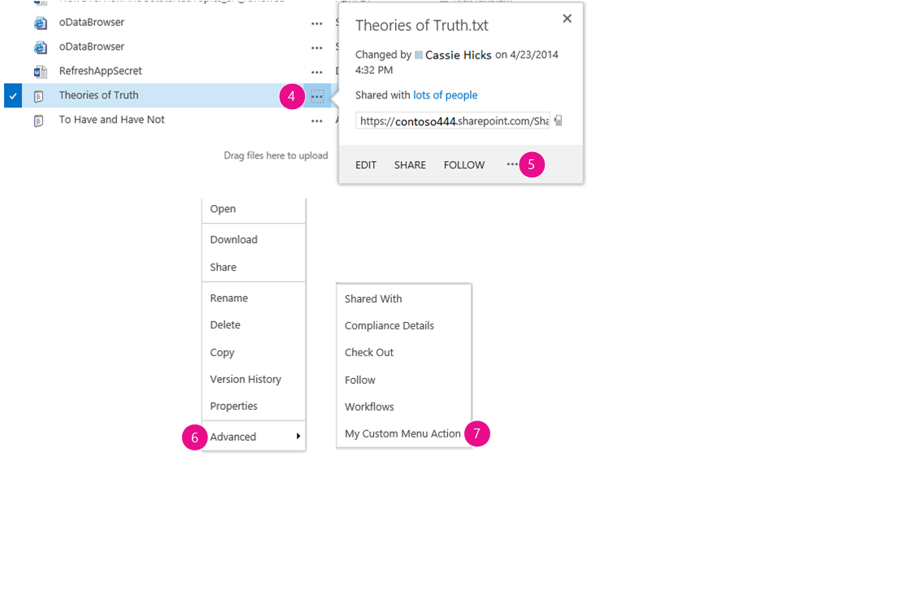

# Create custom actions to deploy with SharePoint Add-ins

When you are creating a SharePoint Add-in, custom actions let you interact with the lists and the ribbon in the host web. A custom action deploys to the host web when end users install your add-in. Custom actions can open a remote webpage and pass information through the query string. 

Two types of custom actions are available for add-ins: **Ribbon** and **Menu Item**.
 
<a name="SP15Createcustomactionsapps_Prereq"> </a>

## Prerequisites for using the examples in this article

You need a development environment as explained in [Get started creating provider-hosted SharePoint Add-ins](get-started-creating-provider-hosted-sharepoint-add-ins.md).

### Core concepts to help you understand custom actions

The following table lists useful articles that can help you understand the concepts and steps that are involved in a custom action scenario.

**Table 1. Core concepts for custom actions**

|**Article**|**Description**|
|:-----|:-----|
| [SharePoint Add-ins](sharepoint-add-ins.md)|Learn about the new add-in model in SharePoint that enables you to create add-ins, which are small, easy-to-use solutions for end users.|
| [UX design for SharePoint Add-ins](ux-design-for-sharepoint-add-ins.md)|Learn about the user experience (UX) options that you have when you are building SharePoint Add-ins.|
| [Host webs, add-in webs, and SharePoint components in SharePoint](host-webs-add-in-webs-and-sharepoint-components-in-sharepoint.md)|Learn about the difference between host webs and add-in webs. Find out which SharePoint components can be included in a SharePoint Add-in, which components are deployed to the host web, which components are deployed to the add-in web, and how the add-in web is deployed in an isolated domain.|

<a name="SP15Createcustomactionsapps_Codeexample"> </a>

## Code example: Create a custom action in the host web document libraries

Following are the steps to create a custom action in the host web document libraries:

1. Create the SharePoint Add-in and remote web projects.

2. Add an add-in webpage for the custom actions.

3. Add a Menu Item custom action to the SharePoint Add-in project.

4. Add a Ribbon custom action to the SharePoint Add-in project.
    
5. Set the add-in start page to the host web home page.

6. Build and run the solution.
    

### To create the SharePoint Add-in and remote web projects

1. Open Visual Studio as administrator. (To do this, right-click the Visual Studio icon on the **Start** menu, and select **Run as administrator**.)   
 
2. Create the provider-hosted SharePoint Add-in as explained in [Get started creating provider-hosted SharePoint Add-ins](get-started-creating-provider-hosted-sharepoint-add-ins.md), and name it **CustomActionsApp**. 

### To add an add-in webpage for the custom actions

1. After the Visual Studio solution has been created, right-click the web application project (not the SharePoint Add-in project) and add a new Web Form by selecting **Add** > **New Item** > **Web** > **Web Form**. Name the form **CustomActionTarget.aspx**. 
 
2. In the CustomActionTarget.aspx file, replace the entire **html** element and its children with the following HTML code. Leave all the markup above the **html** element as it is. The HTML code contains JavaScript that performs the following tasks:
    
    - Provides a placeholder for the query string parameters.
    
    - Extracts the parameters from the query string.
    
    - Renders the parameters in the placeholder.

    > [!IMPORTANT] 
    > The ItemURL and ItemID tokens only get passed when there is an item selected. In a production quality SharePoint Add-in, your code needs to handle situations where no item is selected. In this example, the code alerts the user that no item has been selected. 

    ```HTML
    <html xmlns="http://www.w3.org/1999/xhtml">
    <head>
        <title>Custom action target</title>
    </head>
    <body>
        <h2>Query string parameters passed by the custom action:</h2>

        <!-- Placeholder for query string parameters -->
        <ul id="qsparams"/>

        <!-- Main JavaScript function, renders
            the query string parameters -->
        <script lang="javascript">
            var params = document.URL.split("?")[1].split("&amp;");
            var paramsHTML = "";
        
            // Extracts the parameters from the query string.
            // Parameters are URLencoded, decode for rendering
            // in page.
            for (var i = 0; i < params.length; i = i + 1) {
                params[i] = decodeURIComponent(params[i]);
                paramsHTML += "<li>" + params[i] + "</li>";
            }

            // Alert the user when no item has been selected.
            // (The SPListItemId is the 5th parameter.)
            if (params[5] === undefined) {
                paramsHTML += "<div> <h3> No item has been selected from the list.  Please select an item. </h3> </div> ";
            }

            // Render parameters in the placeholder.
            document.getElementById("qsparams").innerHTML =
                paramsHTML;
        </script>
    </body>
    </html>
    ```

<br/>

### To add a Menu Item custom action to the SharePoint Add-in project

1. Right-click the SharePoint Add-in project, and select **Add** > **New Item** > **Office/SharePoint** > **Menu Item Custom Action**. 

2. Keep the default name, and then select **Add**.

3. The Create Custom Action for Menu Item Wizard asks you a series of questions. Give the answers from the following table:
    
    **Table 2. Menu Item custom action properties**

    |**Property question**|**Answer**|
    |:-----|:-----|
    |Where do you want to expose the custom action?|Select **Host Web**.|
    |Where is the custom action scoped to?|Select **List Template**.|
    |Which particular item is the custom action scoped to?|Select **Document Library**.|
    |What is the text on the menu item?|Enter **My Custom Action**.|
    |Where does the custom action navigate to?|Select the **CustomActionAppWeb\CustomActionTarget.aspx** page.|

4. Select **Finish**.
    
    Visual Studio generates the following markup in the elements.xml file of the menu item custom action feature:

    ```XML
    <?xml version="1.0" encoding="utf-8"?>
    <Elements 
        xmlns="http://schemas.microsoft.com/sharepoint/">
        <!-- RegistrationId attribute is the list type id,
            in this case, a document library (id=101). -->
    <CustomAction 
        Id="65695319-4784-478e-8dcd-4e541cb1d682.CustomAction"
        RegistrationType="List"
        RegistrationId="101"
        Location="EditControlBlock"
        Sequence="10001"
        Title="Invoke custom action">
        <!-- 
        Update the Url below to the page you want the custom action to use.
        Start the URL with the token ~remoteAppUrl if the page is in the
        associated web project, use ~appWebUrl if page is in the add-in project.
        -->
        <UrlAction Url=
    "~remoteAppUrl/CustomActionTarget.aspx?{StandardTokens}&amp;amp;SPListItemId={ItemId}&amp;amp;SPListId={ListId}" />
    </CustomAction>
    </Elements>

    ```

    <br/>

5. Add the following query parameters to the end of the **Url** attribute of the **UrlAction** element:
    
    `&amp;amp;SPSource={Source}&amp;amp;SPListURLDir={ListUrlDir}&amp;amp;SPItemURL={ItemUrl}`
    
    The **UrlAction** element should look like the following:
    
    ` <UrlAction Url= "~remoteAppUrl/CustomActionTarget.aspx?{StandardTokens}&amp;amp;SPListItemId={ItemId}&amp;amp;SPListId={ListId}&amp;amp;SPSource={Source}&amp;amp;SPListURLDir={ListUrlDir}&amp;amp;SPItemURL={ItemUrl}" />`

> [!NOTE] 
> In this example, the remote web page opens in a full window when the user selects the custom action from the menu. Custom menu actions can also open a remote webpage in a dialog box by using the **HostWebDialog** attribute. For more information, see [SharePoint-Add-in-Localization](https://github.com/OfficeDev/SharePoint-Add-in-Localization).

### To add a Ribbon custom action to the SharePoint Add-in project

1. Right-click the SharePoint Add-in project, and select **Add** > **New Item** > **Office/SharePoint** > **Ribbon Custom Action**. 

2. Keep the default name, and then select **Add**.
 
3. The Create Custom Action for Ribbon Wizard asks you a series of questions. Give the answers from the following table:
    
    **Table 3. Ribbon custom action properties**
    
    |**Property question**|**Answer**|
    |:-----|:-----|
    |Where do you want to expose the custom action?|Select **Host Web**.|
    |Where is the custom action scoped to?|Select **List Template**.|
    |Which particular item is the custom action scoped to?|Select **Document Library**.|
    |Where is the control located?|Select **Ribbon.Documents.Manage**.|
    |What is the text on the menu item?|Enter **My Custom Ribbon Button**.|
    |Where does the custom action navigate to?|Select the **CustomActionAppWeb\CustomActionTarget.aspx** page.|

4. Visual Studio generates the following markup in the elements.xml file of the Ribbon custom action feature:
        
    ```XML
    <?xml version="1.0" encoding="utf-8"?>
    <Elements xmlns="http://schemas.microsoft.com/sharepoint/">
    <CustomAction Id="85691508-c076-4f43-93d4-96b4d5253a09.RibbonCustomAction1"
                    RegistrationType="List"
                    RegistrationId="101"
                    Location="CommandUI.Ribbon"
                    Sequence="10001"
                    Title="Invoke &amp;apos;RibbonCustomAction1&amp;apos; action">
        <CommandUIExtension>
        <!-- 
        Update the UI definitions below with the controls and the command actions
        that you want to enable for the custom action.
        -->
        <CommandUIDefinitions>
            <CommandUIDefinition Location="Ribbon.Documents.Manage.Controls._children">
            <Button Id="Ribbon.Documents.Manage.RibbonCustomAction1Button"
                    Alt="My Custom Ribbon Button"
                    Sequence="100"
                    Command="Invoke_RibbonCustomAction1ButtonRequest"
                    LabelText="My Custom Ribbon Button"
                    TemplateAlias="o1"
                    Image32by32="_layouts/15/images/placeholder32x32.png"
                    Image16by16="_layouts/15/images/placeholder16x16.png" />
            </CommandUIDefinition>
        </CommandUIDefinitions>
        <CommandUIHandlers>
            <CommandUIHandler Command="Invoke_RibbonCustomAction1ButtonRequest"
                            CommandAction="~remoteAppUrl/CustomActionTarget.aspx?{StandardTokens}&amp;amp;SPListItemId={SelectedItemId}&amp;amp;SPListId={SelectedListId}"/>
        </CommandUIHandlers>
        </CommandUIExtension >
    </CustomAction>
    </Elements> 

    ```

    <br/>

5. Add the following query parameters to the end of the **CommandAction** attribute of the **CommandUIHandler** element:
    
    `&amp;amp;SPSource={Source}&amp;amp;SPListURLDir={ListUrlDir}`
    
    The **CommandUIHandler** element should look like the following:
    
    ` <CommandUIHandler Command="Invoke_RibbonCustomAction1ButtonRequest" CommandAction="~remoteAppUrl/CustomActionTarget.aspx?{StandardTokens}&amp;amp;SPListItemId={SelectedItemId}&amp;amp;SPListId={SelectedListId}&amp;amp;SPSource={Source}&amp;amp;SPListURLDir={ListUrlDir}" />`
    
    > [!NOTE] 
    > Ribbon custom actions use **SelectedListId** and **SelectedItemId**. **ListId** and **ItemId** work only with menu item custom actions.

### Tp set the add-in start page to the host web home page

1. The continuing sample SharePoint Add-in doesn't have any add-in web, and its remote web application exists only to host the form. So the start page of the add-in should be set to the home page of the host web. 
    
    To begin, select the SharePoint Add-in project (not the web application project) in **Solution Explorer**, and copy the value of the **Site URL** property, including the protocol (for example **https://contoso.sharepoint.com**) into the clipboard. 
    
2. Open the add-in manifest, and then paste the URL into the **Start Page** box.
    
3. Optionally, you can delete the Default.aspx page from the web application project, because it is not used in the SharePoint Add-in.
    
### To build and run the solution

1. Select the F5 key.
    
    > [!NOTE] 
    > When you select F5, Visual Studio builds the solution, deploys the add-in, and opens the permissions page for the add-in.

2. Select the **Trust It** button. The default page of your developer site opens.

3. Navigate to any document library in the host web.
    
   **Launching a custom menu action**

   

4. Select the callout button ( **...**) for any document. The callout opens.

5. Select the callout button ( **...**) on the callout. 

6. Select **Advanced**.

7. Select **My Custom Menu Action** in the context menu. You should see something like the following on the remote webpage that opens:
    
   **Remote webpage with parameters from the custom action**

   

8. Select the **Back** button on your browser to return to the library.
    
   **Launching a custom ribbon action**

   

9. Select any document.

10. Open the **File** tab on the ribbon.

11. Select **My Custom Ribbon Button**. You see the same remote web page.


**Table 4. Troubleshooting the solution**

|**Problem**|**Solution**|
|:-----|:-----|
|Visual Studio does not open the browser after you select the F5 key.|Set the SharePoint Add-in project as the startup project.|
|The tokens in the URL are not resolved after you select the F5 key in Visual Studio.|Go to the **Site Contents** page in the host web, and select the icon for your add-in.|

## See also
<a name="SP15Createcustomactionsapps_AddResources"> </a>

- [Code sample: Open a remote add-in webpage using an ECB custom action](https://code.msdn.microsoft.com/office/SharePoint-2013-Open-a-36d1598d)    
- [Create UX components in SharePoint](create-ux-components-in-sharepoint.md)