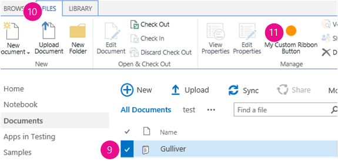

# Create custom actions to deploy with SharePoint Add-ins
Learn how to create a custom action in SharePoint that deploys to the host web when you deploy a SharePoint Add-in.
 

 **Note**  The name "apps for SharePoint" is changing to "SharePoint Add-ins". During the transition, the documentation and the UI of some SharePoint products and Visual Studio tools might still use the term "apps for SharePoint". For details, see  [New name for apps for Office and SharePoint](new-name-for-apps-for-sharepoint.md#bk_newname).
 

When you are creating a SharePoint Add-in, custom actions let you interact with the lists and the ribbon in the host web. A custom action deploys to the host web when end users install your add-in. Custom actions can open a remote webpage and pass information through the query string. There are two types of custom actions available for add-ins: Ribbon andMenu Item custom actions.
 

## Prerequisites for using the examples in this article
<a name="SP15Createcustomactionsapps_Prereq"> </a>

You need a development environment as explained in  [Get started creating provider-hosted SharePoint Add-ins](get-started-creating-provider-hosted-sharepoint-add-ins.md).
 

 

### Core concepts to help you understand custom actions

The following table lists useful articles that can help you understand the concepts and steps that are involved in a custom action scenario.
 

 

**Table 1. Core concepts for custom actions**


|**Article**|**Description**|
|:-----|:-----|
| [SharePoint Add-ins](sharepoint-add-ins.md)|Learn about the new add-in model in SharePoint that enables you to create add-ins, which are small, easy-to-use solutions for end users.|
| [UX design for SharePoint Add-ins](ux-design-for-sharepoint-add-ins.md)|Learn about the user experience (UX) options that you have when you are building SharePoint Add-ins.|
| [Host webs, add-in webs, and SharePoint components in SharePoint](host-webs-add-in-webs-and-sharepoint-components-in-sharepoint-2013.md)|Learn about the difference between host webs and add-in webs. Find out which SharePoint components can be included in a SharePoint Add-in, which components are deployed to the host web, which components are deployed to the add-in web, and how the add-in web is deployed in an isolated domain.|

## Code example: Create a custom action in the host web document libraries
<a name="SP15Createcustomactionsapps_Codeexample"> </a>

Follow these steps to create a custom action in the host web document libraries:
 

 

1. Create the SharePoint Add-in and remote web projects.
    
 
2. Add a custom action feature to the SharePoint Add-in project.
    
 
3. Add an add-in webpage to the web project.
    
 

### To create the SharePoint Add-in and remote web projects


1. Open Visual Studio as administrator. (To do this, right-click the Visual Studio icon on the  **Start** menu, and choose **Run as administrator**.)
    
 
2. Create the provider-hosted SharePoint Add-in as explained in  [Get started creating provider-hosted SharePoint Add-ins](get-started-creating-provider-hosted-sharepoint-add-ins.md) and name itCustomActionsApp. 
    
 

### To add an add-in webpage for the custom actions


1. After the Visual Studio solution has been created, right-click the web application project (not the SharePoint Add-in project) and add a new Web Form by choosing  **Add** > **New Item** > **Web** > **Web Form**. Name the form CustomActionTarget.aspx.
    
 
2. In the CustomActionTarget.aspx file, replace the entire  **html** element and it's children with the following HTML code. Leave all the markup above the **html** element as it is. The HTML code contains JavaScript that performs the following tasks:
    
      - Provides a placeholder for the query string parameters.
    
 
  - Extracts the parameters from the query string.
    
 
  - Renders the parameters in the placeholder.
    
 

     **Important**  The ItemURL and ItemID tokens only get passed when there is an item selected. In a production quality SharePoint Add-in, your code needs to handle situations where no item is selected. In this example the code alerts the user that no item has been selected. 

```HTML
  <html xmlns="http://www.w3.org/1999/xhtml">
<head>
    <title>Custom action target</title>
</head>
<body>
    <h2>Query string parameters passed by the custom action:</h2>

    <!-- Placeholder for query string parameters -->
    <ul id="qsparams"/>

    <!-- Main JavaScript function, renders
         the query string parameters -->
    <script lang="javascript">
        var params = document.URL.split("?")[1].split("&amp;");
        var paramsHTML = "";
      
        // Extracts the parameters from the query string.
        // Parameters are URLencoded, decode for rendering
        // in page.
        for (var i = 0; i < params.length; i = i + 1) {
            params[i] = decodeURIComponent(params[i]);
            paramsHTML += "<li>" + params[i] + "</li>";
        }

         // Alert the user when no item has been selected.
         // (The SPListItemId is the 5th parameter.)
         if (params[5] === undefined) {
            paramsHTML += "<div> <h3> No item has been selected from the list.  Please select an item. </h3> </div> ";
         }

        // Render parameters in the placeholder.
        document.getElementById("qsparams").innerHTML =
            paramsHTML;
    </script>
</body>
</html>
```


### To add a menu item custom action to the SharePoint Add-in project


1. Right-click the SharePoint Add-in project, and choose  **Add** > **New Item** > **Office/SharePoint** > **Menu Item Custom Action**. 
    
 
2. Keep the default name and choose  **Add**.
    
 
3. The  **Create Custom Action for Menu Item** wizard asks you a series of questions. Give the answers from the following table:
    
    **Table 2. Menu Item custom action properties**


|**Property question**|**Answer**|
|:-----|:-----|
|Where do you want to expose the custom action?|Choose  **Host Web**.|
|Where is the custom action scoped to?|Choose  **List Template**.|
|Which particular item is the custom action scoped to?|Choose  **Document Library**.|
|What is the text on the menu item?|Type  **My Custom Action**.|
|Where does the custom action navigate to?|Choose the  **CustomActionAppWeb\CustomActionTarget.aspx** page.|
4. Choose  **Finish**.
    
    Visual Studio generates the following markup in the elements.xml file of the menu item custom action feature:
    


```XML
  <?xml version="1.0" encoding="utf-8"?>
<Elements 
    xmlns="http://schemas.microsoft.com/sharepoint/">
    <!-- RegistrationId attribute is the list type id,
        in this case, a document library (id=101). -->
  <CustomAction 
      Id="65695319-4784-478e-8dcd-4e541cb1d682.CustomAction"
      RegistrationType="List"
      RegistrationId="101"
      Location="EditControlBlock"
      Sequence="10001"
      Title="Invoke custom action">
    <!-- 
    Update the Url below to the page you want the custom action to use.
    Start the URL with the token ~remoteAppUrl if the page is in the
    associated web project, use ~appWebUrl if page is in the add-in project.
    -->
    <UrlAction Url=
"~remoteAppUrl/CustomActionTarget.aspx?{StandardTokens}&amp;amp;SPListItemId={ItemId}&amp;amp;SPListId={ListId}" />
  </CustomAction>
</Elements>

```

5. Add the following query parameters to the end of the  **Url** attribute of the **UrlAction** element:
    
     `&amp;amp;SPSource={Source}&amp;amp;SPListURLDir={ListUrlDir}&amp;amp;SPItemURL={ItemUrl}`
    
    The  **UrlAction** element should look like the following:
    
     ` <UrlAction Url= "~remoteAppUrl/CustomActionTarget.aspx?{StandardTokens}&amp;amp;SPListItemId={ItemId}&amp;amp;SPListId={ListId}&amp;amp;SPSource={Source}&amp;amp;SPListURLDir={ListUrlDir}&amp;amp;SPItemURL={ItemUrl}" />`
    
 

 **Note**  In this example, the remote web page opens in a full window when the user selects the custom action from the menu. Custom menu actions can also open a remote webpage in a dialog box by using the  **HostWebDialog** attribute. For more information, see [SharePoint-Add-in-Localization](https://github.com/OfficeDev/SharePoint-Add-in-Localization).
 


### To add a Ribbon custom action to the SharePoint Add-in project


1. Right-click the SharePoint Add-in project, and choose  **Add** > **New Item** > **Office/SharePoint** > **Ribbon Custom Action**. 
    
 
2. Keep the default name and choose  **Add**.
    
 
3. The  **Create Custom Action for Ribbon** wizard asks you a series of questions. Give the answers from the following table:
    
    **Table 3. Ribbon custom action properties**


|**Property question**|**Answer**|
|:-----|:-----|
|Where do you want to expose the custom action?|Choose  **Host Web**.|
|Where is the custom action scoped to?|Choose  **List Template**.|
|Which particular item is the custom action scoped to?|Choose  **Document Library**.|
|Where is the control located?|Choose  **Ribbon.Documents.Manage**.|
|What is the text on the menu item?|Type  **My Custom Ribbon Button**.|
|Where does the custom action navigate to?|Choose the  **CustomActionAppWeb\CustomActionTarget.aspx** page.|
4. Visual Studio generates the following markup in the elements.xml file of the Ribbon custom action feature:
    
```XML
  <?xml version="1.0" encoding="utf-8"?>
<Elements xmlns="http://schemas.microsoft.com/sharepoint/">
  <CustomAction Id="85691508-c076-4f43-93d4-96b4d5253a09.RibbonCustomAction1"
                RegistrationType="List"
                RegistrationId="101"
                Location="CommandUI.Ribbon"
                Sequence="10001"
                Title="Invoke &amp;apos;RibbonCustomAction1&amp;apos; action">
    <CommandUIExtension>
      <!-- 
      Update the UI definitions below with the controls and the command actions
      that you want to enable for the custom action.
      -->
      <CommandUIDefinitions>
        <CommandUIDefinition Location="Ribbon.Documents.Manage.Controls._children">
          <Button Id="Ribbon.Documents.Manage.RibbonCustomAction1Button"
                  Alt="My Custom Ribbon Button"
                  Sequence="100"
                  Command="Invoke_RibbonCustomAction1ButtonRequest"
                  LabelText="My Custom Ribbon Button"
                  TemplateAlias="o1"
                  Image32by32="_layouts/15/images/placeholder32x32.png"
                  Image16by16="_layouts/15/images/placeholder16x16.png" />
        </CommandUIDefinition>
      </CommandUIDefinitions>
      <CommandUIHandlers>
        <CommandUIHandler Command="Invoke_RibbonCustomAction1ButtonRequest"
                          CommandAction="~remoteAppUrl/CustomActionTarget.aspx?{StandardTokens}&amp;amp;SPListItemId={SelectedItemId}&amp;amp;SPListId={SelectedListId}"/>
      </CommandUIHandlers>
    </CommandUIExtension >
  </CustomAction>
</Elements> 

```

5. Add the following query parameters to the end of the  **CommandAction** attribute of the **CommandUIHandler** element:
    
     `&amp;amp;SPSource={Source}&amp;amp;SPListURLDir={ListUrlDir}`
    
    The  **CommandUIHandler** element should look like the following:
    
     ` <CommandUIHandler Command="Invoke_RibbonCustomAction1ButtonRequest" CommandAction="~remoteAppUrl/CustomActionTarget.aspx?{StandardTokens}&amp;amp;SPListItemId={SelectedItemId}&amp;amp;SPListId={SelectedListId}&amp;amp;SPSource={Source}&amp;amp;SPListURLDir={ListUrlDir}" />`
    
     **Note**  Ribbon custom actions use  **SelectedListId** and **SelectedItemId**.  **ListId** and **ItemId** work only with menu item custom actions.

### Set the add-in start page to the host web home page


1. The continuing sample SharePoint Add-in doesn't have any add-in web and its remote web application exists only to host the form. So the start page of the add-in should be set to the home page of the host web. 
    
    To begin, select the SharePoint Add-in project (not the web application project) in  **Solution Explorer** and copy the value of the **Site URL** property, including the protocol (for example **https://contoso.sharepoint.com**) into the clipboard. 
    
 
2. Open the add-in manifest, and then paste the URL into the  **Start Page** box.
    
 
3. Optionally, you can delete the Default.aspx page from the web application project, because it is not used in the SharePoint Add-in.
    
 

### To build and run the solution


1. Press the F5 key.
    
     **Note**  When you press F5, Visual Studio builds the solution, deploys the add-in, and opens the permissions page for the add-in.
2. Choose the  **Trust It** button. The default page of your developer site opens.
    
 
3. Navigate to any document library in the host web.
    
    **Launching a custom menu action**

 

  
 

 

 
4. Choose the callout button ( **...**) for any document. The callout opens.
    
 
5. Choose the callout button ( **...**) on the callout. 
    
 
6. Choose  **Advanced**.
    
 
7. Choose  **My Custom Menu Action** in the context menu. You should see something like the following on the remote webpage that opens:
    
    **Remote webpage with parameters from the custom action**

 

  
 

 

 
8. Click the  **Back** button on your browser to return to the library.
    
    **Launching a custom ribbon action**

 

  
 

 

 
9. Select any document.
    
 
10. Open the  **File** tab on the ribbon.
    
 
11. Choose  **My Custom Ribbon Button**. You see the same remote web page.
    
 

**Table 4. Troubleshooting the solution**


|**Problem**|**Solution**|
|:-----|:-----|
|Visual Studio does not open the browser after you press the F5 key.|Set the SharePoint Add-in project as the startup project.|
|The tokens in the URL are not resolved after you press the F5 key in Visual Studio.|Go to the  **Site Contents** page in the host web, and click the icon for your add-in.|

## Next steps
<a name="SP15Createcustomactionsapps_Nextsteps"> </a>

This article demonstrated how to create a custom action in a SharePoint Add-in. As a next step, you can learn about other UX components that are available for SharePoint Add-ins. To learn more, see the following:
 

 

-  [Code sample: Open a remote add-in webpage using an ECB custom action](http://code.msdn.microsoft.com/SharePoint-2013-Open-e0ca1826)
    
 
-  [SharePoint-Add-in-Localization](https://github.com/OfficeDev/SharePoint-Add-in-Localization)
    
 
-  [Code sample: Use custom actions and the cross-domain library to order books](http://code.msdn.microsoft.com/SharePoint-2013-Open-a-36d1598d)
    
 
-  [Use a SharePoint website's style sheet in SharePoint Add-ins](use-a-sharepoint-website-s-style-sheet-in-sharepoint-add-ins.md)
    
 
-  [Use the client chrome control in SharePoint Add-ins](use-the-client-chrome-control-in-sharepoint-add-ins.md)
    
 
-  [Create add-in parts to install with your SharePoint Add-in](create-add-in-parts-to-install-with-your-sharepoint-add-in.md)
    
 

## Additional resources
<a name="SP15Createcustomactionsapps_AddResources"> </a>


-  [Set up an on-premises development environment for SharePoint Add-ins](set-up-an-on-premises-development-environment-for-sharepoint-add-ins.md)
    
 
-  [UX design for SharePoint Add-ins](ux-design-for-sharepoint-add-ins.md)
    
 
-  [SharePoint Add-ins UX design guidelines](sharepoint-add-ins-ux-design-guidelines.md)
    
 
-  [Create UX components in SharePoint](create-ux-components-in-sharepoint-2013.md)
    
 
-  [Three ways to think about design options for SharePoint Add-ins](three-ways-to-think-about-design-options-for-sharepoint-add-ins.md)
    
 
-  [Important aspects of the SharePoint Add-in architecture and development landscape](important-aspects-of-the-sharepoint-add-in-architecture-and-development-landscape.md)
    
 

