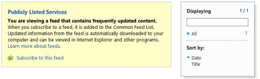

# Debug and troubleshoot a remote event receiver in a SharePoint Add-in
Set up the your development environment to debug remote events in by using Visual Studio.

 

## Configure debugging for a remote SharePoint test site

 **Note**  The procedures in this section apply only when your test SharePoint site is on a different computer from Visual Studio or you are using an SharePoint Online Developer Site as your test site. If SharePoint and Visual Studio are on the same computer, skip this section.
 

When a SharePoint Add-in project in Visual Studio includes a remote event receiver (RER) or an add-in event receiver, you have to do some additional quick configuration in the project properties before you can debug the add-in with (F5). This configuration, in turn, requires that you do some Azure configuration. You do not have to repeat the Azure configuration for every project that has an RER or add-in event. (If the add-in includes an AppInstalled event handler, the add-in won't even run with either F5 or Ctrl-F5 [run without debugging] unless you carry out the configuration in this section.)
 

 

### To configure Azure

1. If you don't already have one, get an Microsoft Azure subscription. One is included as a benefit with an  [MSDN Subscription](http://azure.microsoft.com/en-us/pricing/member-offers/msdn-benefits/).
    
 
2. Carry out the instructions in  [How To: Create or Modify a Service Bus Service Namespace](http://msdn.microsoft.com/library/fa561f70-007c-45aa-b34d-56317dbbfc87.aspx).
    
 

### To configure the SharePoint Add-in project in Visual Studio

1. You should have the latest version of the Office Developer Tools for Visual Studio 2013, so  [run the WebPI installer here](http://aka.ms/OfficeDevToolsForVS2013), or  [installer for Office Developer Tools for Visual Studio 2015](http://aka.ms/OfficeDevToolsForVS2015).
    
 
2. After you add a RER or add-in event handler to a SharePoint Add-in project in Visual Studio, right-click the project in  **Solution Explorer** and select **Properties**.
    
 
3. In the properties pane, open the  **SharePoint** tab and scroll to the bottom.
    
 
4. Select the check box for  **Enable debugging via Microsoft Azure Service Bus**.
    
 
5. Enter the complete connection string in the text box provided. You obtain the string with these steps.
    
      1. Log in to the Azure portal and open the  **Service Bus** tab.
    
 
  2. Open the namespace that you created for RER debugging and navigate to the connection strings. The Azure portal UI changes frequently. See  [Azure portal help](https://msdn.microsoft.com/en-us/library/azure/dn578292.aspx) if you can't find the connection strings.
    
 
  3. Copy the  **SAS** connection string. This is the string you enter in the Visual Studio project properties.
    
 
In the future, when you create SharePoint Add-in projects in Visual Studio, this information is prefilled, so you don't have to open the Azure portal each time.
 

## Test the configuration

Use the procedures in this section to verify that you can debug an RER.
 

 

### To create a remote event receiver project

1. In Visual Studio, create a provider-hosted SharePoint Add-in.
    
    See  [Get started creating provider-hosted SharePoint Add-ins](get-started-creating-provider-hosted-sharepoint-add-ins.md).
    
 
2. In  **Solution Explorer**, choose the add-in project's node.
    
 
3. On the menu bar, choose  **Project**,  **Add New Item**.
    
 
4. In the  **Templates** pane, choose the **List** template, and then choose the **Add** button.
    
 
5. Choose the  **Finish** button to add a default custom list to the add-in project.
    
 
6. Add another item to the add-in project by, in the  **Templates** pane, choosing the **Remote Event Receiver** template.
    
 
7. In the  **Name** box, leave the default name (RemoteEventReceiver1), and then choose the  **Add** button.
    
 
8. In the  **What type of event receiver do you want?** list, choose **List Item Events**. 
    
    Leave the event source as  **List1**, the list that you added in the previous steps.
    
 
9. In the  **Handle the following events** list, choose **An item is being added**, and then choose the  **Finish** button.
    
    A web service is added to the web application to handle the remote event that you specified. A remote event receiver is added to the SharePoint Add-in. The receiver references the web service and the list item event in the event receiver's Elements.xml file.
    
 
10. In the add-in project, open AppManifest.xml.
    
 
11. Change the start page to the list's page:  _AddInProjectName_/Lists/List1.
    
    Replace  _AddInProjectName_ with the name of your add-in project, such asSharePointAddIn4/Lists/List1. For this example, we're setting the start page to the list's page. However, in a typical add-in, you'd likely point to your own UI on the web project page.
    
 

### To run and test event handler debugging

1. If you haven't done so already, complete the  **To configure the SharePoint Add-in project in Visual Studio** procedure earlier in this article.
    
 
2. In the web project, open the remote event receiver service (RemoteEventReceiver1.svc), and then add a breakpoint to any line of code inside the  `ProcessEvent()` method.
    
 
3. Choose the  **F5** key to run the project.
    
 
4. Choose the  **+ New item** button to add an item to the list.
    
 
5. Provide a title for the item, and then choose the  **Save** button.
    
    The breakpoint that you added to the remote event receiver is hit, verifying that you're debugging the remote event receiver.
    
 
6. Choose the  **F5** key to continue to run the project, and then stop debugging when you're done.
    
 

## Turn on/off the notification from Visual Studio that event debugging needs to be configured

If you have a remote event in your project and have not configured remote event debugging, Visual Studio prompts you to configure remote event debugging (see Figure 1). You can change this behavior by clearing the  **Notify me if remote event debugging is not configured** check box on the **SharePoint** tab.
 

 

**Figure 1. Remote event debugging notification**

 

 

 

 

 

## Verify that your service is hosted in the Service Bus

After you press F5 and trust the add-in, go to the Service Bus namespace in your browser; for example http://mynamespace.servicebus.windows.net, and you should see your endpoint listed as a number. Figure 2 shows what the page looks like when a namespace is  *not*  listed; that is, before you press F5.
 

 

**Figure 2. Browsing to the Service Bus namespace**

 

 

 

 

 

## RER does not hit the breakpoint

Depending on the event, the remote event may be synchronous or asynchronous. It might take a few seconds or more to hit your breakpoint if it is asynchronous.
 

 

## Error: "There was no endpoint listening"

You get the following error when your handler runs in production:
 

 
"The remote event receiver callout failed. Details: There was no endpoint listening at https:// _{domain}_: _nnnnn_/ _{path}_/AppEventReceiver.svc that could accept the message. This is often caused by an incorrect address or SOAP action." where  _nnnnn_ is a port.
 

 
SharePoint requires that there be no explicit port in the URL of the handler in production. This means that you must use either port 443 for HTTPS, which we recommend, or port 80 for HTTP. 
 

 

## Error: "Could not establish trust relationship for the SSL/TLS secure channel with authority"

You get the following error when your handler runs in production:
 

 
"The remote event receiver callout failed. Details: Could not establish trust relationship for the SSL/TLS secure channel with authority"
 

 
When the add-in is in Microsoft SharePoint Online, but the remote event receiver service is on-premise, and is using HTTPS as we recommend, the server that is hosting the receiver cannot use a self-signed certificate in production. The server must have a publicly accepted certificate from a certificate authority. If the add-in is in an on-premise SharePoint farm, self-signed certificates are acceptable.
 

 

## Additional resources

-  [Handle events in SharePoint Add-ins](handle-events-in-sharepoint-add-ins.md)
    
 
-  [Debugging SharePoint remote events using Visual Studio 2012](http://blogs.msdn.com/b/officeapps/archive/2013/03/21/update-to-debugging-sharepoint-remote-events-using-visual-studio-2012.aspx)
    
 

