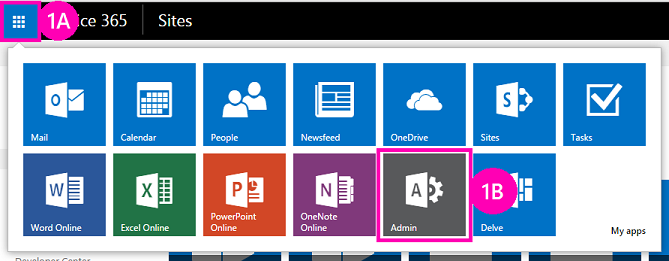

# Deploy and install a SharePoint-hosted SharePoint Add-in

Learn how SharePoint Add-ins are deployed and installed.
 
> [!NOTE]
> The name "apps for SharePoint" is changing to "SharePoint Add-ins." During the transition, the documentation and the UI of some SharePoint products and Visual Studio tools might still use the term "apps for SharePoint." For details, see [New name for apps for SharePoint](new-name-for-apps-for-sharepoint.md).
 
This is the second in a series of articles about the basics of developing SharePoint-hosted SharePoint Add-ins. You should first be familiar with the topic [SharePoint Add-ins](sharepoint-add-ins.md) and the previous article in this series:

-  [Get started creating SharePoint-hosted SharePoint Add-ins](get-started-creating-sharepoint-hosted-sharepoint-add-ins.md)
    
> [!NOTE]
> If you have been working through this series about SharePoint-hosted add-ins, you have a Visual Studio solution that you can use to continue with this topic. You can also download the repository at [SharePoint_SP-hosted_Add-Ins_Tutorials](https://github.com/OfficeDev/SharePoint_SP-hosted_Add-Ins_Tutorials) and open the BeforeColumns.sln file.

You'll find it a lot easier to develop SharePoint-hosted SharePoint Add-ins if you are familiar with how users deploy and install your add-ins. So, in this article, we'll take a brief break from coding to create and use an add-in catalog, and then install the add-in you've been working on.

## Create an add-in catalog

1. Sign in to your Office 365 subscription as an administrator. Select the add-in launcher icon, and then select the **Admin** add-in.
    
   *Figure 1. Office 365 add-in launcher*

   
 
2. In the **Admin Center**, expand the **Admin** node in the task pane, and then select **SharePoint**.
     
3. In the **SharePoint Admin Center**, select **add-ins** in the task pane.
     
4. On the **add-ins** page, select **Add-in Catalog**. (If there is already an add-in catalog site collection in the subscription, it opens and you are finished. You cannot create more than one add-in catalog in a subscription.)    
 
5. On the **Add-in Catalog Site** page, select **OK** to accept the default option and create a new add-in catalog site.    
 
6. In the **Create Add-in Catalog Site Collection** dialog, specify the title and website address of your add-in catalog site. We recommend that you include "catalog" in the title and URL to make it memorable and distinguishable in the **SharePoint Admin Center**.   
 
7. Specify a **Time Zone** and set yourself as the **Administrator**.
    
8. Set the **Storage Quota** to the lowest possible value (currently 110, but that can change), because the add-in packages you upload to this site collection are very small.
    
9. Set the **Server Resource Quota** to 0 (zero), and then select **OK**. (The server resource quota is related to throttling poorly performing sandboxed solutions, but you won't be installing any sandboxed solutions on your add-in catalog site.) 
 
As the site collection is being created, SharePoint takes you back to the **SharePoint Admin Center**. After a few minutes, you'll see that the collection has been created.

## Package the add-in and upload it to the catalog

1. Open the Visual Studio solution, right-click the project node in **Solution Explorer**, and then select **Publish**.
     
2. In the **Publish** pane, select **Package the add-in**. The add-in is packaged and saved as an `*.app` file in the solution's \bin\debug\web.publish\1.0.0.0 folder.  
 
3. Open your add-in catalog site in a browser, and then select **SharePoint Add-ins** in the navigation bar.

4. The **SharePoint Add-ins** catalog is a standard SharePoint asset library. Upload the add-in package to it using any of the methods of uploading files to SharePoint libraries.

## Install the add-in as end users do

1. Navigate to any website in the SharePoint Online subscription and open the **Site Contents** page.

2. Select **add an add-in** to open the **Your Add-ins** page.

3. Find the **Employee Orientation** add-in in the **Add-ins you can add** section, and select its tile.

4. Select **Trust It** in the consent dialog. The **Site Contents** page automatically opens and the add-in appears with a notation that it is installing. After it installs, users can select the tile to run the add-in.

## Remove the add-in

To continue enhancing the same SharePoint Add-in in Visual Studio (see [Next steps](#Nextsteps)), remove the add-in with these steps:

1. In the **Site Contents** page, move the cursor over the add-in so that the callout button **...** appears.

2. Select the callout button, and then select **REMOVE** on the callout.

3. Navigate back to your add-in catalog site and select **SharePoint Add-ins** in the navigation bar.

4. Highlight the add-in and select **manage** on the task bar just above the list, and then select **Delete** on the manage menu.

## Next steps

We strongly recommend that you continue with this series about SharePoint-hosted add-ins before you go on to the more advanced topics. Next we get back to coding in [Add custom columns to a SharePoint-hosted SharePoint Add-in](add-custom-columns-to-a-sharepoint-hosted-sharepoint-add-in.md).
 

 

