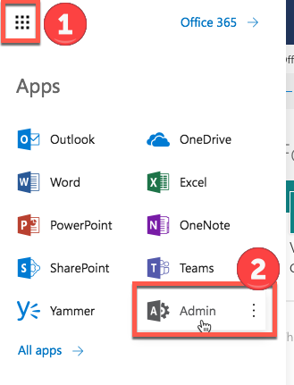

# Deploy and install a SharePoint-hosted SharePoint Add-in

[!INCLUDE [sp-add-in-deprecation](../../includes/snippets/sp-add-in-deprecation.md)]

This is the second in a series of articles about the basics of developing SharePoint-hosted SharePoint Add-ins. You should first be familiar with the topic [SharePoint Add-ins](sharepoint-add-ins.md) and the overview article in this series:

-  [Get started creating SharePoint-hosted SharePoint Add-ins](get-started-creating-sharepoint-hosted-sharepoint-add-ins.md)
    
> [!NOTE]
> If you have been working through this series about SharePoint-hosted add-ins, you have a Visual Studio solution that you can use to continue with this topic. You can also download the repository at [SharePoint_SP-hosted_Add-Ins_Tutorials](https://github.com/OfficeDev/SharePoint_SP-hosted_Add-Ins_Tutorials) and open the **BeforeColumns.sln** file.

You'll find it a lot easier to develop SharePoint-hosted SharePoint Add-ins if you are familiar with how users deploy and install your add-ins. So, in this article, we'll take a brief break from coding to create and use an add-in catalog, and then install the add-in you've been working on.

## Create an add-in catalog

1. Sign in to your Office 365 subscription as an administrator. Select the add-in launcher icon, and then select the **Admin** tile.
    
   *Figure 1. Office 365 add-in launcher*

   
 
1. In the **Admin Center**, expand the **Admin centers** node in the task pane, and then select **SharePoint**.    
1. In the **SharePoint Admin Center**, select **apps** in the task pane.    
1. On the **apps** page, select **App Catalog**. (If there is already an add-in catalog site collection in the subscription, it opens and you are finished. You cannot create more than one add-in catalog in a subscription.)    
1. On the **App Catalog Site** page, select **OK** to accept the default option and create a new app catalog site.    
1. In the **Create App Catalog Site Collection** dialog, specify the title and website address of your app catalog site. We recommend that you include "catalog" in the title and URL to make it memorable and distinguishable in the **SharePoint Admin Center**.   
1. Specify a **Time Zone** and set yourself as the **Administrator**.   
1. Set the **Storage Quota** to the lowest possible value (currently 110, but that can change), because the packages you upload to this site collection are very small.
1. Set the **Server Resource Quota** to 0 (zero), and then select **OK**. (The server resource quota is related to throttling poorly performing sandboxed solutions, but you won't be installing any sandboxed solutions on your add-in catalog site.) 
 
As the site collection is being created, SharePoint takes you back to the **SharePoint Admin Center**. After a few minutes, you'll see that the collection has been created.

## Package the add-in and upload it to the catalog

1. Open the Visual Studio solution, right-click the project node in **Solution Explorer**, and then select **Publish**.    
1. In the **Publish** pane, select **Package the add-in**. The add-in is packaged and saved as an `*.app` file in the solution's \bin\debug\web.publish\1.0.0.0 folder.  
1. Open your add-in catalog site in a browser, and then select **SharePoint Add-ins** in the navigation bar.
1. The **SharePoint Add-ins** catalog is a standard SharePoint asset library. Upload the add-in package to it using any of the methods of uploading files to SharePoint libraries.

## Install the add-in as end users do

1. Navigate to any website in the SharePoint Online subscription and open the **Site Contents** page.
1. Select **add an add-in** to open the **Your Add-ins** page.
1. Find the **Employee Orientation** add-in in the **Add-ins you can add** section, and select its tile.
1. Select **Trust It** in the consent dialog. The **Site Contents** page automatically opens and the add-in appears with a notation that it is installing. After it installs, users can select the tile to run the add-in.

> [!Important]
> It might take up to 24 hours for add-ins to be available for consumption once installed. During that time, users can receive a "The redirect URI specified in the request does not match the redirect URIs configured for the application" AADSTS50011 error. If you need to shortcut that time and you have administrative permissions in your tenant, you can add that URL to the Application mentioned in the error ('00000003-0000-0ff1-ce00-000000000000') 
using [Microsoft Graph Powershell](/powershell/microsoftgraph/overview).
>
> For example: let's assume you get the "AADSTS50011 The redirect URI `https://contoso-79d42f062409ae.sharepoint.com/_forms/default.aspx` specified in the request does not match the redirect URIs configured for the application '00000003-0000-0ff1-ce00-000000000000'." when accessing the add-in.
> 
> Top make the add-in immediately available, an user with admin rights can run the following script in PowerShell:
>
> ```powershell
> Connect-MgGraph -Scopes Application.ReadWrite.All
> $sharepointPrincipal = Get-MgServiceprincipal -Filter "AppId eq '00000003-0000-0ff1-ce00-000000000000'"
> $sharepointPrincipal | fl
> $replyUrls = $sharepointPrincipal.ReplyUrls
> $replyUrls += "https://contoso-79d42f062409ae.sharepoint.com/_forms/default.aspx"
> Update-MgServiceprincipal -ServicePrincipalId $sharepointPrincipal.Id -ReplyUrls $replyUrls
> ```

## Remove the add-in

To continue enhancing the same SharePoint Add-in in Visual Studio (see [Next steps](#Nextsteps)), remove the add-in with these steps:

1. In the **Site Contents** page, move the cursor over the add-in so that the callout button **...** appears.
1. Select the callout button, and then select **REMOVE** on the callout.
1. Navigate back to your add-in catalog site and select **SharePoint Add-ins** in the navigation bar.
1. Highlight the add-in and select **manage** on the task bar just above the list, and then select **Delete** on the manage menu.

## Next steps
<a name="Nextsteps"></a>

We strongly recommend that you continue with this series about SharePoint-hosted add-ins before you go on to the more advanced topics. Next, we get back to coding in [Add custom columns to a SharePoint-hosted SharePoint Add-in](add-custom-columns-to-a-sharepoint-hosted-sharepoint-add-in.md).
 

 

