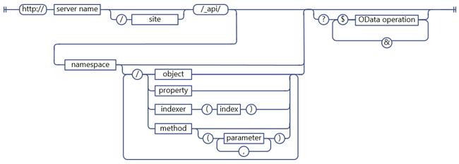
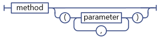
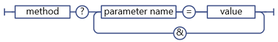

# Determine SharePoint REST service endpoint URIs
Learn general guidelines for determining SharePoint REST endpoint URIs from the signature of the corresponding client object model APIs.
 

 

 **Before you start**
 

-  [Get to know the SharePoint REST service](get-to-know-the-sharepoint-rest-service.md)
    
 
-  [Navigate the SharePoint data structure represented in the REST service](navigate-the-sharepoint-data-structure-represented-in-the-rest-service.md)
    
 
**Next steps**
 

-  [Use OData query operations in SharePoint REST requests](use-odata-query-operations-in-sharepoint-rest-requests.md)
    
 

## SharePoint REST endpoint URI structure

Before you can access a SharePoint resource using the REST service, you first have to figure out the URI endpoint that points to that resource. Whenever possible, the URI for these REST endpoints closely mimics the API signature of the resource in the SharePoint client object model. For example:
 

 
 *Client object model method:* 
 

 
List.GetByTitle(listname).GetItems()
 

 
 *REST endpoint:* 
 

 
 `http://server/site/_api/lists/getbytitle('listname')/items`
 

 
In some cases, however, the endpoint URI differs from the corresponding client object model signature, in order to comply with REST or OData conventions.
 

 
The following figure shows the general syntax structure of SharePoint REST URIs. 
 

 

**SharePoint REST URI syntax structure**

 

 

 
Some endpoints for SharePoint resources deviate from this syntax structure:
 

 

 

- Methods that require complex types as parameters. 
    
    If the corresponding client object model method requires that complex types are passed as parameters, the REST endpoint may deviate from this syntax construction to account for REST limitations.
    
 
- Static methods and properties. 
    
    REST endpoints deviate from this syntax structure for URIs that represent static methods and properties.
    
 

## Determine SharePoint REST service endpoints

To construct a REST endpoint for a SharePoint resource, follow these steps:
 

 

1. Start with the REST service reference:
    
     `http://server/site/_api`
    
 
2. Specify the appropriate entry point. For example:
    
     `http://server/site/_api/web`
    
 
3. Navigate from the entry point to the specific resources you want to access. This includes specifying parameters for endpoints that correspond to methods in the client object model. For example:
    
     `http://server/site/_api/web/lists/getbytitle('listname')`
    
 

### Reference the SharePoint REST service in your endpoint URI

Use  `_api` to denote the SharePoint REST service in your endpoint URIs. The REST service is part of the client.svc web service. However, to make REST URI construction easier and to shorten the base REST URI path, the REST service uses `_api` to abstract away the need to explicitly reference the client.svc web service. The REST service still recognizes and accepts URIs that reference the client.svc web service. For example, you can use `http://server/site/_vti_bin/client.svc/web/lists` instead of `http://server/site/_api/web/lists`. However, using  `_api` is the preferred convention. URLs have a 256 character limit, so using `_api` shortens the base URI, leaving more characters for use in constructing the rest of the URL.
 

 

### Specify entry points for the SharePoint REST service

The main entry points for the REST service represent the site collection and site of the specified context. In this way, these entry points correspond to the  **ClientContext.Site** property and **ClientContext.Web** property in the client object models.
 

 
To access a specific site collection, use the following construction:
 

 
 `http://server/site/_api/site`
 

 
To access a specific site, use the following construction:
 

 
 `http://server/site/_api/web`
 

 
Where  *server*  represents the name of the server, and *site*  represents the name of, or path to, the specific site.
 

 
In addition to  `/site` and `/web`, the REST service includes several other access points that enable developers to navigate to specific functionality. The table below lists some of these access points.
 

 


|**Feature area**|**Access point**|
|:-----|:-----|
|Site|http:// _server/site_/_api/site|
|Web|http:// _server/site_/_api/web|
|User Profile|http:// _server/site_/_api/SP.UserProfiles.PeopleManager|
|Search|http:// _server/site_/_api/search|

### Navigate to the specific resources you want to access

From here, construct more specific REST endpoints by ''walking" the object model, using the names of the APIs from the client object model separated by a forward slash (/). The table below shows examples of client object model calls and the equivalent REST endpoint. 
 

 


|**Client object model API **|**REST endpoint**|
|:-----|:-----|
|ClientContext.Web.Lists|http:// _server_/ _site_/_api/web/lists|
|ClientContext.Web.Lists[guid]|http:// _server_/ _site_/_api/web/lists(' _guid_')|
|ClientContext.Web.Lists.GetByTitle("Title")|http:// _server_/ _site_/_api/web/lists/getbytitle(' _Title_')|
Endpoint URIs are case-insensitive. In the previous table, for example, use  `/getbytitle` to specify the REST equivalent of the **GetByTitle()** method.
 

 

## Specify parameters in REST endpoint URIs

SharePoint extends the OData specification to enable you to use parentheses to specify method parameters and index values. This prevents potential disambiguation issues in URIs that contain multiple parameters with the same name. For example, the following two URIs contain parameters that have the same name:
 

 
 `http://server/site/_api/web/lists/getByTitle('Announcements')/fields/getByTitle('Description')`
 

 
 `http://server/site/_api/web/lists('<guid>')/fields/getById('<guid>')`
 

 
To specify multiple parameters, include the parameter as a name-value pair, and separate the parameters with commas. For example:
 

 
 `http://server/site/_api/web/getAvailableWebTemplates(lcid=1033, includeCrossLanguage=true)`
 

 
The following figure shows the SharePoint REST parameter syntax.
 

 

**SharePoint REST parameter syntax**

 

 

 

### Complex types as parameters for the REST service

Some methods in the client object model require a large payload as a parameter. For REST endpoints to maintain functionality parity with their corresponding client object model APIs, the endpoints must accept a complex type as a parameter. In these cases, the REST service extends the existing OData protocol to enable these REST endpoints to accept a single complex type as a parameter. This applies to  **POST** operations only, and you have to pass the complex type in [Atom](http://www.odata.org/developers/protocols/atom-format#RepresentingComplexTypesProperties) format or [JSON](http://www.odata.org/developers/protocols/json-format#RepresentingComplexTypeProperties) format, according to OData standards.
 

 
For example, the  **ListCollection.Add** method takes a **Microsoft.SharePoint.Client.ListCreationInformation** object as a parameter. To add a list to a specified site, construct the appropriate REST endpoint as follows:
 

 
 `http://server/site/_api/web/lists/add`
 

 
Then, pass the complex type in the request body, formatted here using JSON.
 

 


```
{ "d" : {
   "results": {
     "__metadata": {
       "type": "SP.ListCreationInformation"
     }, 
     "CustomSchemaXml": "…large payload…/", 
     "Description": "desc", 
     "DocumentTemplateType": "1", 
     "TemplateType": "101", 
     "Title": "Announcements"
   }
} 
}

```


### Using parameter aliases in REST service calls

You can use the "parameter aliasing" semantic in OData to pass parameters to a SharePoint REST endpoint. In parameter aliasing, the parameter value is identified with an alias in the parameter call, and the actual value is specified in the query string of the URI. This enables you to support more types of characters and consistent formatting by using the query string.
 

 
For example, the following two REST URIs are equivalent: 
 

 
 *Specify the parameter value directly:* 
 

 
 `http://server/site/_api/web/applyWebTemplate("STS#0")`
 

 
 *Use a parameter alias, and specify the actual parameter value in the query string of the URI:* 
 

 
 `http://server/site/_api/web/applyWebTemplate(title=@template)?@template="STS#0"`
 

 
However, the SharePoint REST service does not support passing complex types via parameter aliasing. For example, the following URI, which contains a complex type in the parameter alias, is not supported:
 

 
 `http://server/site/_api/userProfiles/People(7)/GetWorkplace(@address)?@address={"__metadata":{"type: "ODataDemo.Address"},"Street":"NE 228th", "City":"Sammamish","State":"WA","ZipCode":"98074","Country": "USA"}`
 

 

**SharePoint REST service parameter aliasing syntax**

 

 

 

 

 

### Specifying dictionaries as parameter values

For REST endpoints that correspond to methods that take  `Dictionary<String, String>` dictionaries as parameters, pass the dictionary as a series of comma delimited name-value pairs in the query string.
 

 

**REST service syntax for Dictionary parameters**

 

 

 
A  `Dictionary<String, object>` is represented as a multi-value object, named KeyedPropertyValue, with the following string properties:
 

 

 

-  **Key** The key of the multi-value object.
    
 
-  **Value** The value of the object
    
 
-  **ValueType** The value type of the object. For simple value types that map to existing Entity Data Model (EDM) types, the REST service returns the appropriate EDM type string; for example, "Edm.String." If not, the REST service returns the value type returned by the **Type.ToString** function.
    
 

### Specifying parameter values in the query string

If your REST URI terminates in a method call, you can use query string syntax to specify the parameter values of the method. For example:
 

 
 `http://<server>/<site>/_api/web/applyWebTemplate?template="STS#0"`
 

 
the figure below shows the REST service syntax for parameters in query string.
 

 

**REST service syntax for parameters in query string**

 

 

 

 

 

## Specifying static methods and properties as REST service URIs

To construct URIs that correspond to static methods or properties, use the corresponding API name from the ECMAScript object model, starting with the namespace declaration and using dot notation. For example,  [SP.Utilities.Utility.getImageUrl(imageName)](http://msdn.microsoft.com/en-us/library/ee658947.aspx) in the ECMAScript client object model would have the following REST equivalent:
 

 
 `http://server/site/_api/SP.Utilities.Utility.getImageUrl('imageName')`
 

 
However, static properties can be accessed only directly, and are not allowed as part of a larger URI composition. For example, directly accessing the  **SP.Utility.AssetsLibrary** method in REST is allowable, as follows:
 

 
 `http://server/site/_api/SP.Utility.assetsLibrary/id`
 

 
However, using that resource location as a parameter for a more complex URI, as shown in the following example, is not allowed:
 

 
 `http://server/site/_api/getList(~SP.Utility/assetsLibrary/id)`
 

 
The figure below shows the SharePoint REST service static member syntax.
 

 

**SharePoint REST service static member syntax**

 

 

 

 

 

## Next steps

If you want to select, filter, or order the data you requested from an endpoint, the SharePoint REST service supports a wide range of OData query string operators. 
 

 

## Additional resources
<a name="bk_addresources"> </a>


-  [Get to know the SharePoint REST service](get-to-know-the-sharepoint-rest-service.md)
    
 
-  [Complete basic operations using SharePoint REST endpoints](complete-basic-operations-using-sharepoint-rest-endpoints.md)
    
 
-  [Working with lists and list items with REST](working-with-lists-and-list-items-with-rest.md)
    
 
-  [Working with folders and files with REST](working-with-folders-and-files-with-rest.md)
    
 
-  [Navigate the SharePoint data structure represented in the REST service](navigate-the-sharepoint-data-structure-represented-in-the-rest-service.md)
    
 
-  [Use OData query operations in SharePoint REST requests](use-odata-query-operations-in-sharepoint-rest-requests.md)
    
 
-  [REST API reference and samples](http://msdn.microsoft.com/library/rest-api-reference-and-samples%28Office.15%29.aspx)
    
 
-  [Synchronize SharePoint items using the REST service](synchronize-sharepoint-items-using-the-rest-service.md)
    
 
-  [Use ETag values through the REST service to get document list item versioning](http://msdn.microsoft.com/library/5f7e0579-46b7-44ab-b3b4-cdbc622dcd98%28Office.15%29.aspx)
    
 

 

 

