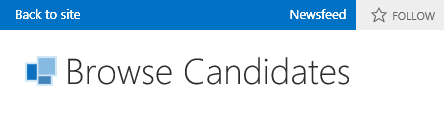

# Enable a newsfeed for a cloud business add-in

Social and collaboration features in SharePoint for Office 365 allow users to track activity on a list and add comments. You can easily create a newsfeed for your cloud business add-in by enabling a few properties.

To host the newsfeed, you'll need a SharePoint Developer site on Office 365, which you can get from [Sign up for an Office 365 Developer Site](set-up-a-development-environment-for-sharepoint-add-ins-on-office-365.md#sign-up-for-an-office-365-developer-site).

## To enable a newsfeed

1. In Solution Explorer, open the entity representing the list where you want to add a newsfeed, and then on the **Perspective** bar, select the **Server** tab.

2. In the Properties window, select the **Post when Created** and/or **Post when Updated** check boxes.
    
   *Figure 1. Social properties*

   
 
   **Post when Created** adds a thread to the newsfeed for each new list item. **Post when Updated** adds a thread when the value for an item in the list is changed. Post triggers determine which fields in the item trigger a post.

3. Select the **Choose post triggers** link.

4. In the **Choose post triggers** dialog box, select the check boxes for all fields that you want to trigger a post, and then select **OK**. A single thread is created for all changes in an item no matter how many fields you select.

## To access a newsfeed

1. On the menu bar, select **Debug** > **Start Debugging** to run the application.

2. In the running application, open the browse screen for the entity representing the list where you added a newsfeed. If you enabled **Post when Created**, add a new item. If you enabled **Post when Updated**, edit the fields that you selected in the **Choose post triggers** dialog box.

3. On the SharePoint chrome bar, select the **Newsfeed** link.

   *Figure 2. The SharePoint chrome bar*

   
 
   The **Newsfeed** page opens in a new browser window with entries for the added and/or updated items. You can select the **Like** link for a post, or you can select the **Reply** link to add a comment.

## Additional resources

-  [Develop cloud business add-ins](develop-cloud-business-add-ins.md)
-  [Social and collaboration features in SharePoint](general-development/social-and-collaboration-features-in-sharepoint.md)
-  [Create a cloud business add-in with a social newsfeed](create-a-cloud-business-add-in-with-a-social-newsfeed.md)
    
