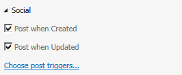

# Enable a newsfeed for a cloud business add-in
Social and collaboration features in SharePoint for Office 365 allow users to track activity on a list and add comments. You can easily create a newsfeed for your Cloud Business Add-in by enabling a couple of properties.
 

 **Note**  The name "apps for SharePoint" is changing to "SharePoint Add-ins". During the transition, the documentation and the UI of some SharePoint products and Visual Studio tools might still use the term "apps for SharePoint". For details, see  [New name for apps for Office and SharePoint](new-name-for-apps-for-sharepoint.md#bk_newname).
 

## Prerequisites

To host the newsfeed, you'll need a SharePoint Developer site on Office 365, which you can get from  [Sign up for an Office 365 Developer Site](http://go.microsoft.com/fwlink/?LinkId=263490).
 

 

## Procedures

### To enable a newsfeed

1. In Solution Explorer, open the entity representing the list where you want to add a newsfeed, and then on the  **Perspective** bar choose the **Server** tab.
    
 
2. In the  **Properties** window, select the **Post when Created** and/or **Post when Updated** check boxes.
    
     
 

     **Post when Created** adds a thread to the newsfeed for each new list item. **Post when Updated** adds a thread when the value for an item in the list is changed. Post triggers determine which fields in the item will trigger a post.
    
 
3. Choose the  **Choose post triggers** link.
    
    The  **Choose post triggers** dialog box appears.
    
 
4. In the  **Choose post triggers** dialog box, select the check boxes for all fields that you want to trigger a post, and then choose the **OK** button.
    
    A single thread will be created for all changes in an item no matter how many fields you choose.
    
 

### To access a newsfeed

1. On the menu bar, choose  **Debug**,  **Start Debugging** to run the application.
    
 
2. In the running application, open the browse screen for the entity representing the list where you added a newsfeed. If you enabled  **Post when Created**, add a new item. If you enabled  **Post when Updated**, edit the fields that you selected in the  **Choose post triggers** dialog box.
    
 
3. On the SharePoint chrome bar, choose the  **Newsfeed** link.
    
     
 

    The  **Newsfeed** page opens in a new browser window with entries for the added and/or updated items. You can choose the **Like** link for a post, or you can choose the **Reply** link to add a comment.
    
 

## Additional resources

-  [Develop cloud business add-ins](develop-cloud-business-add-ins.md)
    
 
-  [Social and collaboration features in SharePoint 2013](http://msdn.microsoft.com/en-us/library/office/jj163280.aspx)
    
 
-  [Create a cloud business add-in with a social newsfeed](create-a-cloud-business-add-in-with-a-social-newsfeed.md)
    
 

