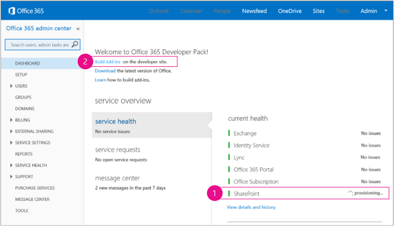
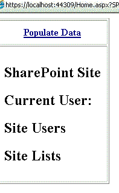

# Get started creating provider-hosted SharePoint Add-ins
Set up a development environment and create your first provider-hosted SharePoint Add-in.
 

 **Note**  The name "apps for SharePoint" is changing to "SharePoint Add-ins". During the transition, the documentation and the UI of some SharePoint products and Visual Studio tools might still use the term "apps for SharePoint". For details, see  [New name for apps for Office and SharePoint](new-name-for-apps-for-sharepoint#bk_newname).
 

Provider-hosted add-ins are one of the two major types of SharePoint Add-ins. For an overview of SharePoint Add-ins and the two different types, see  [SharePoint Add-ins](sharepoint-add-ins). Here's a summary of provider-hosted add-ins:
 

- They include a web application, or service, or database that is hosted externally from the SharePoint farm or SharePoint Online subscription. They may also include SharePoint components. You can host the external components on any web-hosting stack, including the LAMP (Linux, Apache, MySQL, and PHP) stack.
    
 
- The custom business logic in the add-in has to run on either the external components or in JavaScript on custom SharePoint pages.
    
 
- [Step 1 - Set up your dev environment](get-started-creating-provider-hosted-sharepoint-add-ins#Setup) 

- [Step 2 - Create the app project](get-started-creating-provider-hosted-sharepoint-add-ins#Create) 

- [Step 3 - Code your app](get-started-creating-provider-hosted-sharepoint-add-ins#Code)
 
## Set up your dev environment
<a name="Setup"> </a>

There are many ways to set up a development environment for SharePoint Add-ins. This section explains the simplest way. For alternatives, see  [Additional resources](#bk_addresources).
 

 

### Get the tools


- If you don't already have  **Visual Studio** 2013 or later installed, install it using the instructions at [Install Visual Studio](http://msdn.microsoft.com/library/da049020-cfda-40d7-8ff4-7492772b620f.aspx). We recommend using the  [latest version from the Microsoft Download Center](https://www.visualstudio.com/downloads/download-visual-studio-vs).
    
 
- Visual Studio includes the  **Microsoft Office Developer Tools for Visual Studio**. Sometimes a version of the tools is released between updates of Visual Studio. To be sure that you have the latest version of the tools, run the [installer for Office Developer Tools for Visual Studio 2013](http://aka.ms/OfficeDevToolsForVS2013), or the  [installer for Office Developer Tools for Visual Studio 2015](http://aka.ms/OfficeDevToolsForVS2015). 
    
 

### Sign up for an Office 365 Developer Site
<a name="o365_signup"> </a>


 **Note**   You might already have access to an Office 365 Developer Site: **Are you an MSDN subscriber?** Visual Studio Ultimate and Visual Studio Premium with MSDN subscribers receive an Office 365 Developer Subscription as a benefit. [Redeem your benefit today.](https://msdn.microsoft.com/subscriptions/manage/default.aspx) **Do you have one of the following Office 365 subscription plans?** **If so, an administrator of the Office 365 subscription can create a Developer Site** by using the [Office 365 admin center](https://portal.microsoftonline.com/admin/default.aspx). For more info, see  [Create a developer site on an existing Office 365 subscription](create-a-developer-site-on-an-existing-office-365-subscription). 
 

There are three ways to get an Office 365 plan. 
 

 

- Sign up for a free, one year Office 365 developer account through the Office 365 Developer Program.  [Get more information](http://dev.office.com/devprogram), or go straight to  [the sign-up form](https://profile.microsoft.com/RegSysProfileCenter/wizardnp.aspx?wizid=14b845d0-938c-45af-b061-f798fbb4d170). You'll get an e-mail after you sign up for the developer program with a link to sign up for the developer account. Use the instructions below.
    
 
- Start with a  [free 30-day trial](https://portal.microsoftonline.com/Signup/MainSignUp.aspx?OfferId=6881A1CB-F4EB-4db3-9F18-388898DAF510&amp;DL=DEVELOPERPACK) with one user license.
    
 
- Buy an  [Office 365 developer subscription](https://portal.microsoftonline.com/Signup/MainSignUp.aspx?OfferId=C69E7747-2566-4897-8CBA-B998ED3BAB88&amp;DL=DEVELOPERPACK). 
    
 

 **Tip**  Open these links in another window or tab in order to keep the following instructions handy.
 


**Figure 1. Office 365 Developer Site domain name**

 

 

 

 

 

 

1. The first page (not shown) of the signup form is self-explanatory; supply the requested information and then choose  **Next**.
    
 
2. On the second page, shown in Figure 1, specify a user ID for the administrator of the subscription.
    
 
3. Create a subdomain of  **.onmicrosoft.com**; for example, contoso.onmicrosoft.com.
    
    After signup, you use the resulting credentials (in the format  _UserID_@ _yourdomain_.onmicrosoft.com) to sign in to your Office 365 portal site where you administer your account. Your SharePoint Online Developer Site is set up at your new domain:  **http:// _yourdomain_.sharepoint.com**.
    
 
4. Choose  **Next** and fill out the final page of the form. If you choose to provide a telephone number to get a confirmation code, you can provide a mobile or land line telephone number, but *not*  a VoIP (Voice over Internet Protocol) number.
    
 

    
 **Note**  If you're logged on to another Microsoft account when you try to sign up for a developer account, you might see this message: "Sorry, that user ID you entered didn't work. It looks like it's not valid. Be sure you enter the user ID that your organization assigned to you. Your user ID usually looks like  *someone@example.com*  or *someone@example.onmicrosoft.com*  ."If you see that message, log out of the Microsoft account you were using and try again. If you still get the message, clear your browser cache or switch to  **InPrivate Browsing** and then fill out the form.
 

After you finish the signup process, your browser opens the Office 365 installation page. Choose the Admin icon to open the admin center page.
 

 

**Figure 2. Office 365 admin center page**

 

 

 

 

1. Wait for your Developer Site to finish setting up. After provisioning is complete, refresh the admin center page in your browser.
    
 
2. Then, choose the  **Build Add-ins** link in the upper left corner of the page to open your Developer Site. You should see a site that looks like the one in Figure 3. The **Add-ins in Testing** list on the page confirms that the website was made with SharePoint Developer Site template. If you see a regular team site instead, wait a few minutes and then restart your site.
    
 
3. Make a note of the URL of the site; it's used when you create SharePoint Add-ins projects in Visual Studio.
    
 

**Figure 3. Your Developer Site home page with the Add-ins in Testing list**

 

 

 

 

 

## Create the add-in project
<a name="Create"> </a>


1. Start Visual Studio using the  **Run as administrator** option.
    
 
2. In Visual Studio, choose  **File** > **New** > **Project**.
    
 
3. In the  **New Project** dialog box, expand the **Visual C#** node, expand the **Office/SharePoint** node, and then choose **Add-ins** > **SharePoint Add-in**.
    
 
4. Name the project SampleAddIn, and then choose  **OK**.
    
 
5. In the first  **Specify the SharePoint Add-in Settings** dialog box, do the following:
    
      - Provide the full URL of the SharePoint site that you want to use to debug your add-in. This is the URL of the Developer Site. Use HTTPS, not HTTP in the URL. At some point during this procedure, or shortly after it completes, you will be prompted to login to this site. The timing of the prompt varies. Use the administrator credentials. (in the *.onmicrosoft.com domain) that you created when you signed up for your Developer Site; for example MyName@contoso.onmicrosoft.com. 
    
 
  - Under  **How do you want to host your SharePoint Add-in**, choose  **Provider-hosted**.
    
 
  -  Choose **Next**.
    
 
6. On the  **Specify the target SharePoint version** page, choose **SharePoint Online**, and then choose  **Next**.
    
 
7. Under  **Which type of web application project do you want to create?**, choose  **ASP.NET Web Forms Application**. Choose  **Next**.
    
 
8. Under  **How do you want your add-in to authenticate?**, choose  **Use Windows Azure Access Control Service**.
    
 
9. In the wizard, choose  **Finish**.
    
    Much of the configuration is done when the solution opens. Two projects are created in the Visual Studio solution - one for the SharePoint Add-in and the other for the ASP.NET web application.
    
 

## Code your add-in
<a name="Code"> </a>


1. Open the AppManifest.xml file. On the  **Permissions** tab, specify the **Site Collection** scope and the **Read** permission level.
    
 
2. Delete any markup inside the  **<body>** tag of the Pages/Default.aspx file of your web application, and then add the following HTML and ASP.NET controls inside the **<body>**. This sample uses the  [UpdatePanel](http://msdn2.microsoft.com/EN-US/library/bb359258) control to enable partial page rendering.
    
```HTML
  <form id="form1" runat="server">
  <div>
    <asp:ScriptManager ID="ScriptManager1" runat="server"
            EnablePartialRendering="true" />
    <asp:UpdatePanel ID="PopulateData" runat="server" UpdateMode="Conditional">
      <ContentTemplate>      
        <table border="1" cellpadding="10">
         <tr><th><asp:LinkButton ID="CSOM" runat="server" Text="Populate Data" 
                               OnClick="CSOM_Click" /></th></tr>
         <tr><td>

        <h2>SharePoint Site</h2>
        <asp:Label runat="server" ID="WebTitleLabel"/>

        <h2>Current User:</h2>
        <asp:Label runat="server" ID="CurrentUserLabel" />

        <h2>Site Users</h2>
        <asp:ListView ID="UserList" runat="server">     
            <ItemTemplate >
              <asp:Label ID="UserItem" runat="server" 
                                Text="<%# Container.DataItem.ToString()  %>">
              </asp:Label><br />
           </ItemTemplate>
        </asp:ListView>

        <h2>Site Lists</h2>
               <asp:ListView ID="ListList" runat="server">
                   <ItemTemplate >
                     <asp:Label ID="ListItem" runat="server" 
                                Text="<%# Container.DataItem.ToString()  %>">
                    </asp:Label><br />
                  </ItemTemplate>
              </asp:ListView>
            </td>              
          </tr>
         </table>
       </ContentTemplate>
     </asp:UpdatePanel>
  </div>
</form>
```

3. Add the following declarations to the Default.aspx.cs file of your web application.
    
```C#
  using Microsoft.SharePoint.Client;
using Microsoft.IdentityModel.S2S.Tokens;
using System.Net;
using System.IO;
using System.Xml;
```

4. In the Default.aspx.cs file of your web application, add these variables inside the  [Page](http://msdn2.microsoft.com/EN-US/library/dfbt9et1) class.
    
```C#
  SharePointContextToken contextToken;
string accessToken;
Uri sharepointUrl;
string siteName;
string currentUser;
List<string> listOfUsers = new List<string>();
List<string> listOfLists = new List<string>();
```

5. Add the  `RetrieveWithCSOM` method inside the [Page](http://msdn2.microsoft.com/EN-US/library/dfbt9et1) class. This method uses the SharePoint CSOM to retrieve information about your site and display it on the page.
    
```C#
  // This method retrieves information about the host web by using the CSOM.
private void RetrieveWithCSOM(string accessToken)
{

    if (IsPostBack)
    {
        sharepointUrl = new Uri(Request.QueryString["SPHostUrl"]);
    }            

    ClientContext clientContext =
                    TokenHelper.GetClientContextWithAccessToken(
                        sharepointUrl.ToString(), accessToken);

    // Load the properties for the web object.
    Web web = clientContext.Web;
    clientContext.Load(web);
    clientContext.ExecuteQuery();

    // Get the site name.
    siteName = web.Title;

    // Get the current user.
    clientContext.Load(web.CurrentUser);
    clientContext.ExecuteQuery();
    currentUser = clientContext.Web.CurrentUser.LoginName;

    // Load the lists from the Web object.
    ListCollection lists = web.Lists;
    clientContext.Load<ListCollection>(lists);
    clientContext.ExecuteQuery();

    // Load the current users from the Web object.
    UserCollection users = web.SiteUsers;
    clientContext.Load<UserCollection>(users);
    clientContext.ExecuteQuery();

    foreach (User siteUser in users)
    {
        listOfUsers.Add(siteUser.LoginName);
    }


    foreach (List list in lists)
    {
        listOfLists.Add(list.Title);
    }
}
```

6. Add the  `CSOM_Click` method inside the [Page](http://msdn2.microsoft.com/EN-US/library/dfbt9et1) class. This method triggers the event that occurs when the user clicks the **Populate Data** link.
    
```C#
  protected void CSOM_Click(object sender, EventArgs e)
{
    string commandAccessToken = ((LinkButton)sender).CommandArgument;
    RetrieveWithCSOM(commandAccessToken);
    WebTitleLabel.Text = siteName;
    CurrentUserLabel.Text = currentUser;
    UserList.DataSource = listOfUsers;
    UserList.DataBind();
    ListList.DataSource = listOfLists;
    ListList.DataBind();    
 }
```

7. Replace the existing  `Page_Load` method with this one. The `Page_Load` method uses methods in the TokenHelper.cs file to retrieve the context from the `Request` object and get an access token from Microsoft Azure Access Control Service (ACS).
    
```C#
  // The Page_load method fetches the context token and the access token. 
// The access token is used by all of the data retrieval methods.
protected void Page_Load(object sender, EventArgs e)
{
     string contextTokenString = TokenHelper.GetContextTokenFromRequest(Request);

    if (contextTokenString != null)
    {
        contextToken =
            TokenHelper.ReadAndValidateContextToken(contextTokenString, Request.Url.Authority);

        sharepointUrl = new Uri(Request.QueryString["SPHostUrl"]);
        accessToken =
                    TokenHelper.GetAccessToken(contextToken, sharepointUrl.Authority)
                    .AccessToken;

         // For simplicity, this sample assigns the access token to the button's CommandArgument property. 
         // In a production add-in, this would not be secure. The access token should be cached on the server-side.
        CSOM.CommandArgument = accessToken;
    }
    else if (!IsPostBack)
    {
        Response.Write("Could not find a context token.");
        return;
    }
}
```

8. The Default.aspx.cs file should look like this when you're done.
    
```C#
  using System;
using System.Collections.Generic;
using System.Linq;
using System.Web;
using System.Web.UI;
using System.Web.UI.WebControls;

using Microsoft.SharePoint.Client;
using Microsoft.IdentityModel.S2S.Tokens;
using System.Net;
using System.IO;
using System.Xml;

namespace SampleAddInWeb
{
    public partial class Default : System.Web.UI.Page
    {
        SharePointContextToken contextToken;
        string accessToken;
        Uri sharepointUrl;
        string siteName;
        string currentUser;
        List<string> listOfUsers = new List<string>();
        List<string> listOfLists = new List<string>();

        protected void Page_PreInit(object sender, EventArgs e)
        {
            Uri redirectUrl;
            switch (SharePointContextProvider.CheckRedirectionStatus(Context, out redirectUrl))
            {
                case RedirectionStatus.Ok:
                    return;
                case RedirectionStatus.ShouldRedirect:
                    Response.Redirect(redirectUrl.AbsoluteUri, endResponse: true);
                    break;
                case RedirectionStatus.CanNotRedirect:
                    Response.Write("An error occurred while processing your request.");
                    Response.End();
                    break;
            }
        }

        protected void CSOM_Click(object sender, EventArgs e)
        {
            string commandAccessToken = ((LinkButton)sender).CommandArgument;
            RetrieveWithCSOM(commandAccessToken);
            WebTitleLabel.Text = siteName;
            CurrentUserLabel.Text = currentUser;
            UserList.DataSource = listOfUsers;
            UserList.DataBind();
            ListList.DataSource = listOfLists;
            ListList.DataBind();
        }

        // This method retrieves information about the host web by using the CSOM.
        private void RetrieveWithCSOM(string accessToken)
        {

            if (IsPostBack)
            {
                sharepointUrl = new Uri(Request.QueryString["SPHostUrl"]);
            }


            ClientContext clientContext =
                    TokenHelper.GetClientContextWithAccessToken(
                        sharepointUrl.ToString(), accessToken);


            // Load the properties for the web object.
            Web web = clientContext.Web;
            clientContext.Load(web);
            clientContext.ExecuteQuery();

            // Get the site name.
            siteName = web.Title;

            // Get the current user.
            clientContext.Load(web.CurrentUser);
            clientContext.ExecuteQuery();
            currentUser = clientContext.Web.CurrentUser.LoginName;

            // Load the lists from the Web object.
            ListCollection lists = web.Lists;
            clientContext.Load<ListCollection>(lists);
            clientContext.ExecuteQuery();

            // Load the current users from the Web object.
            UserCollection users = web.SiteUsers;
            clientContext.Load<UserCollection>(users);
            clientContext.ExecuteQuery();

            foreach (User siteUser in users)
            {
                listOfUsers.Add(siteUser.LoginName);
            }

            foreach (List list in lists)
            {
                listOfLists.Add(list.Title);
            }
        }

        protected void Page_Load(object sender, EventArgs e)
        {
            string contextTokenString = 
                 TokenHelper.GetContextTokenFromRequest(Request);

            if (contextTokenString != null)
            {
                contextToken =
                    TokenHelper.ReadAndValidateContextToken(contextTokenString, Request.Url.Authority);

                sharepointUrl = new Uri(Request.QueryString["SPHostUrl"]);
                accessToken =
                    TokenHelper.GetAccessToken(contextToken, sharepointUrl.Authority)
                               .AccessToken;
                CSOM.CommandArgument = accessToken;
            }
            else if (!IsPostBack)
            {
                Response.Write("Could not find a context token.");
                return;
            }
        }
    }
}
```

9. Use the F5 key to deploy and run your add-in. If you see a  **Security Alert** window that asks you to trust the self-signed Localhost certificate, choose **Yes**.
    
    Choose  **Trust It** on the consent page to grant permissions to the add-in. Visual Studio will install the web application to IIS Express and then install add-in to your test SharePoint site and launch it. You'll see a page that has the table shown in the following screen shot. Choose **Populate Data** to see summary information about your SharePoint site.
    

    **Launch page of the basic provider-hosted add-in sample**

 

  
 

 

 

## Next steps
<a name="SP15createprovider_nextsteps"> </a>

See  [Give your provider-hosted add-in the SharePoint look-and-feel](give-your-provider-hosted-add-in-the-sharepoint-look-and-feel) to learn how to integrate an add-in into SharePoint's UI scheme.
 

 

## Additional resources
<a name="bk_addresources"> </a>


- For other ways of setting up a development environment, such as an "all on-premise" environment, see the  [Tools](tools-and-environments-for-developing-sharepoint-add-ins) section in the SharePoint Add-ins table of contents.
    
 

