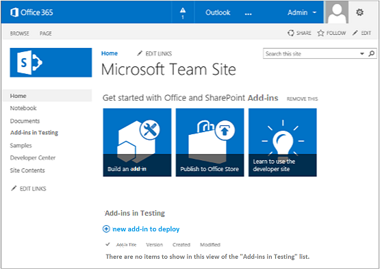
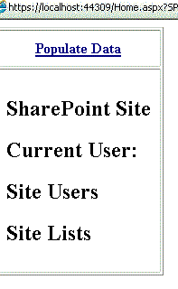

# Get started creating provider-hosted SharePoint Add-ins

Provider-hosted add-ins are one of the two major types of SharePoint Add-ins. For an overview of SharePoint Add-ins and the two different types, see [SharePoint Add-ins](sharepoint-add-ins.md). 

Here's a summary of provider-hosted add-ins:

- They include a web application, service, or database that is hosted externally from the SharePoint farm or SharePoint Online subscription. They may also include SharePoint components. You can host the external components on any web-hosting stack, including the LAMP (Linux, Apache, MySQL, and PHP) stack.
- The custom business logic in the add-in has to run on either the external components or in JavaScript on custom SharePoint pages.

In this article, you'll complete the following steps:

- Set up your dev environment
- Create the add-in project
- Code your add-in

<a name="Setup"> </a>

## Set up your dev environment

There are many ways to set up a development environment for SharePoint Add-ins. This section explains the simplest way. For alternatives, such as setting up an "all on-premises" environment, see [Tools](tools-and-environments-for-developing-sharepoint-add-ins.md).

### Get the tools

- If you don't already have **Visual Studio** 2013 or later installed, install it by using the instructions at [Install Visual Studio](https://docs.microsoft.com/en-us/visualstudio/install/install-visual-studio). We recommend using the [latest version from the Microsoft Download Center](https://www.visualstudio.com/downloads/download-visual-studio-vs).
 
- Visual Studio includes the **Microsoft Office Developer Tools for Visual Studio**. Sometimes a version of the tools is released between updates of Visual Studio. To be sure that you have the latest version of the tools, run the [installer for Office Developer Tools for Visual Studio 2013](http://aka.ms/OfficeDevToolsForVS2013), or the [installer for Office Developer Tools for Visual Studio 2015](http://aka.ms/OfficeDevToolsForVS2015). 

Reference [earlier versions of Visual Studio](http://msdn.microsoft.com/library/da049020-cfda-40d7-8ff4-7492772b620f.aspx) or other [Visual Studio documentation](https://docs.microsoft.com/en-us/visualstudio/).

<a name="o365_signup"> </a>

### Sign up for an Office 365 developer subscription

> [!NOTE]
> You might already have access to an Office 365 developer subscription: 
> - **Are you a Visual Studio (MSDN) subscriber?** Visual Studio Ultimate and Visual Studio Premium with MSDN subscribers receive an Office 365 developer subscription as a benefit. [Redeem your benefit today](https://msdn.microsoft.com/subscriptions/manage/default.aspx). 
> - **Do you have one of the following Office 365 subscription plans?** If so, see [Create a developer site on an existing Office 365 subscription](create-a-developer-site-on-an-existing-office-365-subscription.md). 

To get an Office 365 plan: 

- [Sign up for an Office 365 developer subscription through the Office 365 Developer Program](https://developer.microsoft.com/en-us/office/dev-program).

- See the [Office 365 Developer Program documentation](https://docs.microsoft.com/en-us/office/developer-program/office-365-developer-program) for step-by-step instructions about how to join the Office 365 Developer Program and sign up and configure your subscription.

### Open your developer site 
 
Select the **Build Add-ins** link in the upper-left corner of the page to open your developer site. You should see a site that looks like the one in the following figure. The **Add-ins in Testing** list on the page confirms that the website was made with the SharePoint Developer Site template. If you see a regular team site instead, wait a few minutes and then restart your site.
    
> [!NOTE]
> Make a note of the site's URL; it's used when you create SharePoint Add-in projects in Visual Studio.
    
**Your developer site home page with the Add-ins in Testing list**


 
<a name="Create"> </a>

## Create the add-in project

1. Start Visual Studio by using the **Run as administrator** option.
    
2. In Visual Studio, select **File** > **New** > **New Project**.
    
3. In the **New Project** dialog box, expand the **Visual C#** node, expand the **Office/SharePoint** node, and then select **Add-ins** > **SharePoint Add-in**.
    
4. Name the project **SampleAddIn**, and then select **OK**.
   
5. In the **Specify the SharePoint Add-in Settings** dialog box, do the following:
    
   - Provide the full URL of the SharePoint site that you want to use to debug your add-in. This is the URL of the developer site. Use HTTPS, not HTTP in the URL. At some point during this procedure, or shortly after it completes, you will be prompted to sign in to this site. The timing of the prompt varies. Use the administrator credentials (in the \*.onmicrosoft.com domain) that you created when you signed up for your developer site; for example MyName@contoso.onmicrosoft.com.    

   - Under **How do you want to host your SharePoint Add-in**, select **Provider-hosted**.

   - Select **Next**.  
 
6. On the **Specify the target SharePoint version** page, select **SharePoint Online**, and then select **Next**.

7. Under **Which type of web application project do you want to create?**, select **ASP.NET Web Forms Application**, and then select **Next**.

8. Under **How do you want your add-in to authenticate?**, select **Use Windows Azure Access Control Service**.

9. In the wizard, select **Finish**.
    
   Much of the configuration is done when the solution opens. Two projects are created in the Visual Studio solution: one for the SharePoint Add-in and the other for the ASP.NET web application.

<a name="Code"> </a>
## Code your add-in

1. Open the AppManifest.xml file. On the **Permissions** tab, specify the **Site Collection** scope and the **Read** permission level.

2. Delete any markup inside the `<body>` tag of the Pages/Default.aspx file of your web application, and then add the following HTML and ASP.NET controls inside the `<body>`. This sample uses the [UpdatePanel](http://msdn2.microsoft.com/EN-US/library/bb359258) control to enable partial page rendering.
    
    ```HTML
     <form id="form1" runat="server">
       <div>
         <asp:ScriptManager ID="ScriptManager1" runat="server"
                 EnablePartialRendering="true" />
         <asp:UpdatePanel ID="PopulateData" runat="server" UpdateMode="Conditional">
           <ContentTemplate>      
             <table border="1" cellpadding="10">
              <tr><th><asp:LinkButton ID="CSOM" runat="server" Text="Populate Data" 
                                    OnClick="CSOM_Click" /></th></tr>
              <tr><td>

             <h2>SharePoint Site</h2>
             <asp:Label runat="server" ID="WebTitleLabel"/>

             <h2>Current User:</h2>
             <asp:Label runat="server" ID="CurrentUserLabel" />

             <h2>Site Users</h2>
             <asp:ListView ID="UserList" runat="server">     
                 <ItemTemplate >
                   <asp:Label ID="UserItem" runat="server" 
                                     Text="<%# Container.DataItem.ToString()  %>">
                   </asp:Label><br />
                </ItemTemplate>
             </asp:ListView>

             <h2>Site Lists</h2>
                    <asp:ListView ID="ListList" runat="server">
                        <ItemTemplate >
                          <asp:Label ID="ListItem" runat="server" 
                                     Text="<%# Container.DataItem.ToString()  %>">
                         </asp:Label><br />
                       </ItemTemplate>
                   </asp:ListView>
                 </td>              
               </tr>
              </table>
            </ContentTemplate>
          </asp:UpdatePanel>
       </div>
     </form>
    ```

3. Add the following declarations to the Default.aspx.cs file of your web application.
    
    ```C#
       using Microsoft.SharePoint.Client;
       using Microsoft.IdentityModel.S2S.Tokens;
       using System.Net;
       using System.IO;
       using System.Xml;
    ```

4. In the Default.aspx.cs file of your web application, add these variables inside the [Page](http://msdn2.microsoft.com/EN-US/library/dfbt9et1) class.
    
   ```C#
     SharePointContextToken contextToken;
     string accessToken;
     Uri sharepointUrl;
     string siteName;
     string currentUser;
     List<string> listOfUsers = new List<string>();
     List<string> listOfLists = new List<string>();
   ```

5. Add the `RetrieveWithCSOM` method inside the [Page](http://msdn2.microsoft.com/EN-US/library/dfbt9et1) class. This method uses the SharePoint CSOM to retrieve information about your site and display it on the page.
    
    ```C#
        // This method retrieves information about the host web by using the CSOM.
      private void RetrieveWithCSOM(string accessToken)
      {

          if (IsPostBack)
          {
              sharepointUrl = new Uri(Request.QueryString["SPHostUrl"]);
          }            

          ClientContext clientContext =
                          TokenHelper.GetClientContextWithAccessToken(
                              sharepointUrl.ToString(), accessToken);

          // Load the properties for the web object.
          Web web = clientContext.Web;
          clientContext.Load(web);
          clientContext.ExecuteQuery();

          // Get the site name.
          siteName = web.Title;

          // Get the current user.
          clientContext.Load(web.CurrentUser);
          clientContext.ExecuteQuery();
          currentUser = clientContext.Web.CurrentUser.LoginName;

          // Load the lists from the Web object.
          ListCollection lists = web.Lists;
          clientContext.Load<ListCollection>(lists);
          clientContext.ExecuteQuery();

          // Load the current users from the Web object.
          UserCollection users = web.SiteUsers;
          clientContext.Load<UserCollection>(users);
          clientContext.ExecuteQuery();

          foreach (User siteUser in users)
          {
              listOfUsers.Add(siteUser.LoginName);
          }

          foreach (List list in lists)
          {
              listOfLists.Add(list.Title);
          }
      }
    ```

6. Add the `CSOM_Click` method inside the [Page](http://msdn2.microsoft.com/EN-US/library/dfbt9et1) class. This method triggers the event that occurs when the user clicks the **Populate Data** link.
    
    ```C#
      protected void CSOM_Click(object sender, EventArgs e)
    {
        string commandAccessToken = ((LinkButton)sender).CommandArgument;
        RetrieveWithCSOM(commandAccessToken);
        WebTitleLabel.Text = siteName;
        CurrentUserLabel.Text = currentUser;
        UserList.DataSource = listOfUsers;
        UserList.DataBind();
        ListList.DataSource = listOfLists;
        ListList.DataBind();    
     }
    ```

7. Replace the existing `Page_Load` method with this one. The `Page_Load` method uses methods in the TokenHelper.cs file to retrieve the context from the `Request` object and get an access token from Microsoft Azure Access Control Service (ACS).
    
    ```C#
      // The Page_load method fetches the context token and the access token. 
    // The access token is used by all of the data retrieval methods.
    protected void Page_Load(object sender, EventArgs e)
    {
         string contextTokenString = TokenHelper.GetContextTokenFromRequest(Request);

        if (contextTokenString != null)
        {
            contextToken =
                TokenHelper.ReadAndValidateContextToken(contextTokenString, Request.Url.Authority);

            sharepointUrl = new Uri(Request.QueryString["SPHostUrl"]);
            accessToken =
                        TokenHelper.GetAccessToken(contextToken, sharepointUrl.Authority)
                        .AccessToken;

             // For simplicity, this sample assigns the access token to the button's CommandArgument property. 
             // In a production add-in, this would not be secure. The access token should be cached on the server-side.
            CSOM.CommandArgument = accessToken;
        }
        else if (!IsPostBack)
        {
            Response.Write("Could not find a context token.");
            return;
        }
    }
    ```

8. The Default.aspx.cs file should look like this when you're finished.
    
    ```C#
      using System;
      using System.Collections.Generic;
      using System.Linq;
      using System.Web;
      using System.Web.UI;
      using System.Web.UI.WebControls;

      using Microsoft.SharePoint.Client;
      using Microsoft.IdentityModel.S2S.Tokens;
      using System.Net;
      using System.IO;
      using System.Xml;

      namespace SampleAddInWeb
      {
          public partial class Default : System.Web.UI.Page
          {
              SharePointContextToken contextToken;
              string accessToken;
              Uri sharepointUrl;
              string siteName;
              string currentUser;
              List<string> listOfUsers = new List<string>();
              List<string> listOfLists = new List<string>();

              protected void Page_PreInit(object sender, EventArgs e)
              {
                  Uri redirectUrl;
                  switch (SharePointContextProvider.CheckRedirectionStatus(Context, out redirectUrl))
                  {
                      case RedirectionStatus.Ok:
                          return;
                      case RedirectionStatus.ShouldRedirect:
                          Response.Redirect(redirectUrl.AbsoluteUri, endResponse: true);
                          break;
                      case RedirectionStatus.CanNotRedirect:
                          Response.Write("An error occurred while processing your request.");
                          Response.End();
                          break;
                  }
              }

              protected void CSOM_Click(object sender, EventArgs e)
              {
                  string commandAccessToken = ((LinkButton)sender).CommandArgument;
                  RetrieveWithCSOM(commandAccessToken);
                  WebTitleLabel.Text = siteName;
                  CurrentUserLabel.Text = currentUser;
                  UserList.DataSource = listOfUsers;
                  UserList.DataBind();
                  ListList.DataSource = listOfLists;
                  ListList.DataBind();
              }

              // This method retrieves information about the host web by using the CSOM.
              private void RetrieveWithCSOM(string accessToken)
              {

                  if (IsPostBack)
                  {
                      sharepointUrl = new Uri(Request.QueryString["SPHostUrl"]);
                  }

                  ClientContext clientContext =
                          TokenHelper.GetClientContextWithAccessToken(
                              sharepointUrl.ToString(), accessToken);

                  // Load the properties for the web object.
                  Web web = clientContext.Web;
                  clientContext.Load(web);
                  clientContext.ExecuteQuery();

                  // Get the site name.
                  siteName = web.Title;

                  // Get the current user.
                  clientContext.Load(web.CurrentUser);
                  clientContext.ExecuteQuery();
                  currentUser = clientContext.Web.CurrentUser.LoginName;

                  // Load the lists from the Web object.
                  ListCollection lists = web.Lists;
                  clientContext.Load<ListCollection>(lists);
                  clientContext.ExecuteQuery();

                  // Load the current users from the Web object.
                  UserCollection users = web.SiteUsers;
                  clientContext.Load<UserCollection>(users);
                  clientContext.ExecuteQuery();

                  foreach (User siteUser in users)
                  {
                      listOfUsers.Add(siteUser.LoginName);
                  }

                  foreach (List list in lists)
                  {
                      listOfLists.Add(list.Title);
                  }
              }

              protected void Page_Load(object sender, EventArgs e)
              {
                  string contextTokenString = 
                       TokenHelper.GetContextTokenFromRequest(Request);

                  if (contextTokenString != null)
                  {
                      contextToken =
                          TokenHelper.ReadAndValidateContextToken(contextTokenString, Request.Url.Authority);

                      sharepointUrl = new Uri(Request.QueryString["SPHostUrl"]);
                      accessToken =
                          TokenHelper.GetAccessToken(contextToken, sharepointUrl.Authority)
                                     .AccessToken;
                      CSOM.CommandArgument = accessToken;
                  }
                  else if (!IsPostBack)
                  {
                      Response.Write("Could not find a context token.");
                      return;
                  }
              }
          }
      }
     
    ```

9. Use the F5 key to deploy and run your add-in. If you see a **Security Alert** window that asks you to trust the self-signed Localhost certificate, select **Yes**.
    
10. Select **Trust It** on the consent page to grant permissions to the add-in. Visual Studio will install the web application to IIS Express and then install the add-in to your test SharePoint site and launch it. You'll see a page that has the table shown in the following screen shot. To see summary information about your SharePoint site, select **Populate Data**.

   
 

<a name="SP15createprovider_nextsteps"> </a>    
## Next steps

To create your add-ins, walk through the following steps in this order:
 
1.  [Give your provider-hosted add-in the SharePoint look-and-feel](give-your-provider-hosted-add-in-the-sharepoint-look-and-feel.md)
2.  [Include a custom button in the provider-hosted add-in](include-a-custom-button-in-the-provider-hosted-add-in.md)
3.  [Get a quick overview of the SharePoint object model](get-a-quick-overview-of-the-sharepoint-object-model.md)
4.  [Add SharePoint write operations to the provider-hosted add-in](add-sharepoint-write-operations-to-the-provider-hosted-add-in.md)
5.  [Include an add-in part in the provider-hosted add-in](include-an-add-in-part-in-the-provider-hosted-add-in.md)
6.  [Handle add-in events in the provider-hosted add-in](handle-add-in-events-in-the-provider-hosted-add-in.md)
7.  [Add first-run logic to the provider-hosted add-in](add-first-run-logic-to-the-provider-hosted-add-in.md)
8.  [Programmatically deploy a custom button in the provider-hosted add-in](programmatically-deploy-a-custom-button-in-the-provider-hosted-add-in.md)
9.  [Handle list item events in the provider-hosted add-in](handle-list-item-events-in-the-provider-hosted-add-in.md)


