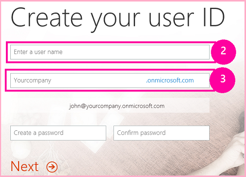
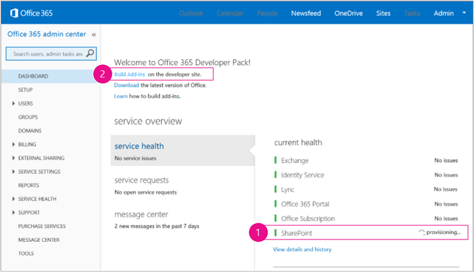
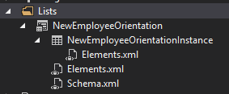
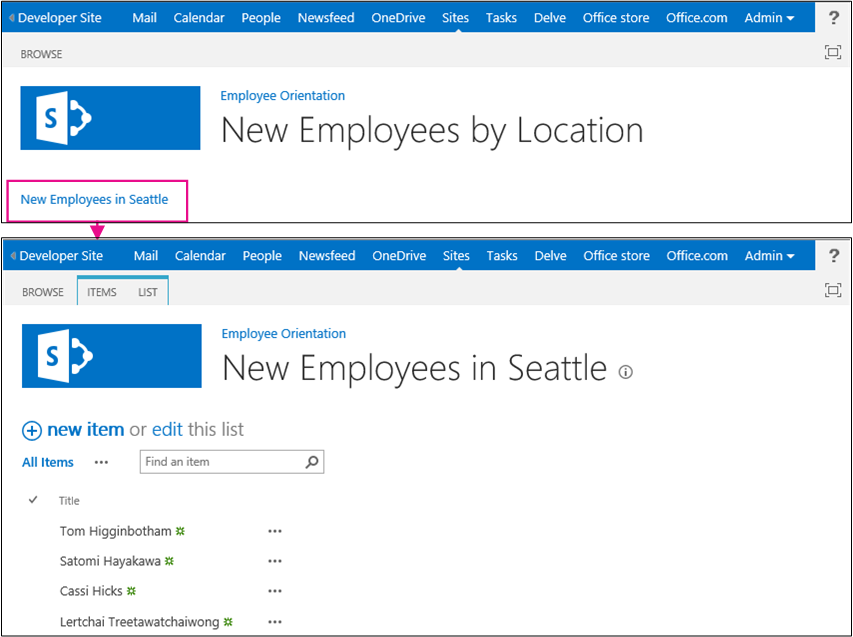

# Get started creating SharePoint-hosted SharePoint Add-ins

Set up a development environment and create your first SharePoint-hosted SharePoint Add-in.
 
> [!NOTE]
> The name "apps for SharePoint" is changing to "SharePoint Add-ins." During the transition, the documentation and the UI of some SharePoint products and Visual Studio tools might still use the term "apps for SharePoint." For details, see [New name for apps for SharePoint](new-name-for-apps-for-sharepoint.md#bk_newname).

SharePoint-hosted add-ins are one of the two major types of SharePoint Add-ins. For an overview of SharePoint Add-ins and the two different types, see [SharePoint Add-ins](sharepoint-add-ins.md). Here's a summary of SharePoint-hosted add-ins:

- They contain SharePoint lists, Web Parts, workflows, custom pages, and other components, all of which are installed on a subweb, called the add-in web, of the SharePoint website where the add-in is installed.

- The only code they have is JavaScript on custom SharePoint pages.

- Step 1 - Set up your dev environment 

- Step 2 - Create the app project 

- Step 3 - Code your app

## Set up your dev environment
<a name="Setup"> </a>

There are many ways to set up a development environment for SharePoint Add-ins. This section explains the simplest way.

### Get the tools

- If you don't already have **Visual Studio** 2013 or later installed, install it using the instructions at [Install Visual Studio](http://msdn.microsoft.com/library/da049020-cfda-40d7-8ff4-7492772b620f.aspx). We recommend using the [latest version from the Microsoft Download Center](https://www.visualstudio.com/downloads/download-visual-studio-vs).

- Visual Studio includes the **Microsoft Office Developer Tools for Visual Studio**. Sometimes a version of the tools is released between updates of Visual Studio. To be sure that you have the latest version of the tools, run the [installer for Office Developer Tools for Visual Studio 2013](http://aka.ms/OfficeDevToolsForVS2013), or the [installer for Office Developer Tools for Visual Studio 2015](http://aka.ms/OfficeDevToolsForVS2015). 

### Sign up for an Office 365 Developer Site
<a name="o365_signup"> </a>

> [!NOTE]
> You might already have access to an Office 365 Developer Site:
> - **Are you an MSDN subscriber?** Visual Studio Ultimate and Visual Studio Premium with MSDN subscribers receive an Office 365 Developer Subscription as a benefit. [Redeem your benefit today.](https://msdn.microsoft.com/subscriptions/manage/default.aspx) 
> - **Do you have one of the following Office 365 subscription plans?** If so, an administrator of the Office 365 subscription can create a Developer Site by using the [Office 365 admin center](https://portal.microsoftonline.com/admin/default.aspx). For more information, see [Create a developer site on an existing Office 365 subscription](create-a-developer-site-on-an-existing-office-365-subscription.md). 

There are three ways to get an Office 365 plan: 

- Start with a  [free 30-day trial](https://portal.microsoftonline.com/Signup/MainSignUp.aspx?OfferId=6881A1CB-F4EB-4db3-9F18-388898DAF510&amp;DL=DEVELOPERPACK) with one user license.

- Buy an [Office 365 developer subscription](https://portal.microsoftonline.com/Signup/MainSignUp.aspx?OfferId=C69E7747-2566-4897-8CBA-B998ED3BAB88&amp;DL=DEVELOPERPACK). 

- Sign up for a free, one-year Office 365 developer account through the Office 365 Developer Program. [Get more information](http://dev.office.com/devprogram), or go straight to [the sign-up form](https://profile.microsoft.com/RegSysProfileCenter/wizardnp.aspx?wizid=14b845d0-938c-45af-b061-f798fbb4d170). You'll get an email after you sign up for the developer program with a link to sign up for the developer account. Use the following instructions.

> [!TIP]
> Open these links in another window or tab to keep the following instructions handy.

1. The first page of the sign-up form is self-explanatory; supply the requested information, and then select **Next**.

2. On the second page, shown in Figure 1, specify a user ID for the administrator of the subscription.
   
   *Figure 1. Office 365 Developer Site domain name*

   
   
3. Create a subdomain of **.onmicrosoft.com**; for example, contoso.onmicrosoft.com.
    
   After you sign up, you use the resulting credentials (in the format _UserID_@ _yourdomain_.onmicrosoft.com) to sign in to your Office 365 portal site where you administer your account. Your SharePoint Online Developer Site is set up at your new domain: **http:// _yourdomain_.sharepoint.com**.
    
4. Select **Next** and fill out the final page of the form. If you choose to provide a telephone number to get a confirmation code, you can provide a mobile or landline number, but *not* a VoIP (Voice over Internet Protocol) number.
    
   > [!NOTE]
   > If you're signed in to another Microsoft account when you try to sign up for a developer account, you might see this message: "Sorry, that user ID you entered didn't work. It looks like it's not valid. Be sure you enter the user ID that your organization assigned to you. Your user ID usually looks like *someone@example.com* or *someone@example.onmicrosoft.com*." 

   > If you see that message, sign out of the Microsoft account you were using and try again. If you still get the message, clear your browser cache or switch to **InPrivate Browsing** and then fill out the form.

   After you finish the sign-up process, your browser opens the Office 365 installation page. Select the Admin icon to open the admin center page.

   *Figure 2. Office 365 admin center page*

   
 
5. Wait for your Developer Site to finish setting up. After provisioning is complete, refresh the admin center page in your browser.

6. Select the **Build Add-ins** link in the upper-left corner of the page to open your Developer Site. You should see a site that looks like the one in Figure 3. The **Add-ins in Testing** list on the page confirms that the website was made with the SharePoint Developer Site template. If you see a regular team site instead, wait a few minutes and then restart your site.

7. Make a note of the site's URL; it's used when you create SharePoint Add-ins projects in Visual Studio.

   *Figure 3. Your Developer Site home page with the Add-ins in Testing list*

   

## Create the add-in project
<a name="Create"> </a>

1. Start Visual Studio by using the **Run as administrator** option.

2. In Visual Studio, select **File** > **New** > **New Project**.
 
3. In the **New Project** dialog box, expand the **Visual C#** node, expand the **Office/SharePoint** node, and then select **Add-ins** > **Add-in for SharePoint**.

4. Name the project **EmployeeOrientation**, and then select **OK**.

5. In the **Specify the Add-in for SharePoint Settings** dialog box, provide the full URL of the SharePoint site that you want to use to debug your add-in. This is the URL of the Developer Site. (Use HTTPS, not HTTP in the URL.) Under **How do you want to host your SharePoint Add-in**, select  **SharePoint-hosted**, and then select **Finish**.

6. You may be prompted to sign in to your Developer Site. If so, use your subscription administrator's credentials.

7. After the project is created, open the file **/Pages/Default.aspx** from the root of the project. Among other things, this generated file loads one or both of two scripts that are hosted on SharePoint: sp.runtime.js and sp.js. The markup for loading these files is in the **Content** control near the top of the file that has the ID **PlaceHolderAdditionalPageHead**. The markup varies depending on the version of **Microsoft Office Developer Tools for Visual Studio** that you are using. This series of tutorials requires that both files be loaded and that they be loaded with ordinary HTML **\<script\>** tags, not **\<SharePoint:ScriptLink\>** tags. 

    Ensure that the following lines are in the **PlaceHolderAdditionalPageHead** control, *just above*  the line `<meta name="WebPartPageExpansion" content="full" />`:
    
    ```
      <script type="text/javascript" src="/_layouts/15/sp.runtime.js"></script> 
      <script type="text/javascript" src="/_layouts/15/sp.js"></script> 
    ```

8. Search the file for any other markup that also loads one or the other of these files and remove the redundant markup. Save and close the file.

## Code your add-in
<a name="Code"> </a>

For your first SharePoint-hosted SharePoint Add-in, we'll include the classic SharePoint extension: a custom list and list instance.

1. In **Solution Explorer**, open the AppManifest.xml file.

2. When the manifest designer opens, add a space between the words in the **Title** field so that it reads **Employee Orientation**. (Do  *not* change the **Name** field.)

3. Save and close the file.

4. Right-click the project in **Solution Explorer** and select **Add** > **New Folder**. Name the folder Lists.

5. Right-click the new folder and select **Add** > **New Item**. The **Add New Item** dialog opens to the **Office/SharePoint** node.

6. Select **List**. Give it the name **NewEmployeeOrientation**, and then select **Add**. 
 
7. On the **Choose List Settings** page of the SharePoint Customization Wizard, leave the list display name at the default **NewEmployeeOrientation**, select the **Create a customizable list template and a list instance of it** option button, select **Default (Custom List)** on the drop-down list, and then select **Finish**.

8. The wizard creates a **NewEmployeeOrientation** list template with a child list instance named **NewEmployeeOrientationInstance**. A list designer may open. It is used in a later step.

9. Expand the **NewEmployeeOrientationInstance** node in **Solution Explorer**, if it isn't already, so that you can clearly distinguish the elements.xml file that is a child of the list *instance* from the elements.xml file that is a child of the list *template*.
    
    *Figure 4. Lists node in Solution Explorer*

    

10. Open the elements.xml child of the **NewEmployeeOrientation** list template.

11. Add spaces to the **DisplayName** attribute (not the **Name** attribute) to make it friendlier: "New Employee Orientation."

12. Set the **Description** attribute to "Orientation information about new employees."

13. Leave all other attributes at their default, save the file, and close it.

14. If the list designer is not open, select the **NewEmployeeOrientation** node in **Solution Explorer**.

15. Open the **List** tab of the designer. This tab is used to set certain values for the list *instance*, not the list *template*, but it has some default values that it inherited from the template.

16. Change the values on the **List** tab to the following:
    
    -  **Title**: New Employees in Seattle
    -  **List URL**: Lists/NewEmployeesInSeattle
    -  **Description**: The new employees in Seattle

17. Leave the check boxes at their default status, save the file, and then close the designer.

18. The list instance may have its old name in **Solution Explorer**. If so, open the shortcut menu for **NewEmployeeOrientationInstance**, select **Rename**, and change the name to **NewEmployeesInSeattle**.

19. Open the schema.xml file.

20. In the **View** element whose **BaseViewID** value is "0", replace the existing **ViewFields** element with the following markup (use exactly this GUID for the **FieldRef** named `Title`). Line breaks may come at odd places in this autogenerated schema.xml file. Be sure you have found the matching begin and end tags for the **ViewFields** element. Add line breaks to improve readability. 

    ```
      <ViewFields>
         <FieldRef Name="Title" ID="{fa564e0f-0c70-4ab9-b863-0177e6ddd247}" DisplayName="Employee" />
      </ViewFields>
    ```

21. Still in the schema.xml file, in the **View** element whose **BaseViewID** value is "1", replace the existing **ViewFields** element with the following markup (use exactly this GUID for the **FieldRef** named `LinkTitle`).
    
    ```
      <ViewFields>
         <FieldRef Name="LinkTitle" ID="{82642ec8-ef9b-478f-acf9-31f7d45fbc31}" DisplayName="Employee" />
      </ViewFields>
    ```

22. Save and close the schema.xml file.

23. Open the elements.xml file that is a child of the list *instance* **NewEmployeesInSeattle** (not the elements.xml that is a child of the list *template* **NewEmployeeOrientation**).

24. In this file, populate the list with some initial data. You do this by adding the following **Data** element markup as a child element of the **ListInstance** element.
    
    ```
      <Data>
      <Rows>
        <Row>
          <Field Name="Title">Tom Higginbotham</Field>
        </Row>
        <Row>
          <Field Name="Title">Satomi Hayakawa</Field>
        </Row>
        <Row>
          <Field Name="Title">Cassi Hicks</Field>
        </Row>
        <Row>
          <Field Name="Title">Lertchai Treetawatchaiwong</Field>
        </Row>
      </Rows>
    </Data>
    ```

25. Save and close the file.

26. In **Solution Explorer**, double-click **Feature1** to open the Feature designer. In the designer, set the **Title** to **New Employee Orientation Components** and set the **Description** to **Lists and other components for getting employees oriented to the company**. Save the file, and then close the designer.

27. If the **Feature1** in **Solution Explorer** has not been automatically renamed, open its shortcut menu, select **Rename**, and rename it to **NewEmployeeOrientationComponents**.

28. Open the Default.aspx file.

29. Find the ASP.NET **Content** element with the ID **PlaceHolderPageTitleInTitleArea**. Replace the default string **Page Title** with **New Employees by Location**.

30. Find the ASP.NET **Content** element with the ID **PlaceHolderMain**. *Replace* its contents with the following markup. The `_spPageContextInfo` is a JavaScript object that SharePoint automatically includes on the page. It's `webAbsoluteUrl` property returns the URL of the add-in web.
    
    ```XML
        <p><asp:HyperLink runat="server" 
        NavigateUrl="JavaScript:window.location = _spPageContextInfo.webAbsoluteUrl + '/Lists/NewEmployeesInSeattle/AllItems.aspx';" 
        Text="New Employees in Seattle" /></p>
    ```

## Run the add-in and test the list
<a name="Code"> </a>

1. Use the F5 key to deploy and run your add-in. Visual Studio makes a temporary installation of the add-in on your test SharePoint site and immediately runs the add-in. (To find out how end users run an installed SharePoint Add-in, see [Next Steps](#Nextsteps).)

2. When the add-in's default page opens, select the **New Employees in Seattle** link to open the custom list instance.
    
    *Figure 5. Default page and list view page*

    

3. Add and delete items from the list.

4. To end the debugging session, close the browser window or stop debugging in Visual Studio. Each time that you press F5, Visual Studio will retract the previous version of the add-in and install the latest one.

5. You will work with this add-in and Visual Studio solution in other articles, and it's a good practice to retract the add-in one last time when you are finished working with it for a while. Right-click the project in **Solution Explorer**, and select **Retract**.

## Next steps
<a name="Nextsteps"> </a>

So far, there isn't much orientation information in the list. We'll add some in later articles in this series. But first, take a brief break from coding to learn about deploying SharePoint Add-ins in [Deploy and install a SharePoint-hosted SharePoint Add-in](deploy-and-install-a-sharepoint-hosted-sharepoint-add-in.md).
 
