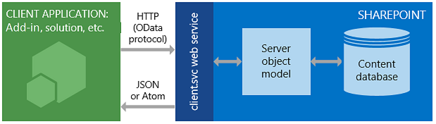

# Get to know the SharePoint REST service

SharePoint introduces a Representational State Transfer (REST) service that is comparable to the existing SharePoint [client object models](http://msdn.microsoft.com/library/88e5e1b9-eab2-4f3b-a3f2-75c96b86f1f4%28Office.15%29.aspx). Now, developers can interact remotely with SharePoint data by using any technology that supports REST web requests. This means that developers can perform **Create**, **Read**, **Update**, and **Delete** (CRUD) operations from their SharePoint Add-ins, solutions, and client applications, using REST web technologies and standard Open Data Protocol (OData) syntax. 

## Prerequisites

This topic assumes you have a basic familiarity with REST and how to construct REST requests.

<a name="bk_how"> </a>

## How the SharePoint REST service works

SharePoint adds the ability for you to remotely interact with SharePoint sites by using REST. Now you can interact directly with SharePoint objects by using any technology that supports standard REST capabilities.

To access SharePoint resources using REST, construct a RESTful HTTP request by using the OData standard, which corresponds to the desired client object model API. For example:

*Client object model method:*<br/> 
`List.GetByTitle(listname)` 

*REST endpoint:*<br/>
`http://server/site/_api/lists/getbytitle('listname')`

The client.svc web service in SharePoint handles the HTTP request, and serves the appropriate response in either Atom or JavaScript Object Notation (JSON) format. Your client application must then parse that response. The following figure shows a high-level view of the SharePoint REST architecture.

**SharePoint REST service architecture**


 
Because of the functionality and ease of use that client object models provide, they remain the primary development option for communicating with SharePoint sites by using .NET Framework managed code, Silverlight, or JavaScript.
 
<a name="bk_usingHTTP"> </a>

### Use HTTP commands with the SharePoint REST service

To use the REST capabilities that are built into SharePoint, you construct a RESTful HTTP request by using the OData standard, which corresponds to the client object model API you want to use. The client.svc web service handles the HTTP request and serves the appropriate response in either Atom or JSON format. The client application must then parse that response.

The endpoints in the SharePoint REST service correspond to the types and members in the SharePoint client object models. By using HTTP requests, you can use these REST endpoints to perform typical CRUD operations against SharePoint entities, such as lists and sites. 

|**If you want to do this to an endpoint**|**Use this HTTP request**|**Keep in mind**|
|:-----|:-----|:-----|
|Read a resource|**GET**||
|Create or update a resource|**POST**|- Use **POST** to create entities such as lists and sites.<br/>- The SharePoint REST service supports sending **POST** commands that include object definitions to endpoints that represent collections.<br/>- For **POST** operations, any properties that are not required are set to their default values.<br/>- If you attempt to set a read-only property as part of a **POST** operation, the service returns an exception.|
|Update or insert a resource |**PUT**|- Use **PUT** and **MERGE** operations to update existing SharePoint objects.<br/>- Any service endpoint that represents an object property **set** operation supports both **PUT** requests and **MERGE** requests.<br/>- For **MERGE** requests, setting properties is optional; any properties that you do not explicitly set retain their current property.<br/>- For **PUT** requests, if you do not specify all required properties in object updates, the REST service returns an exception.<br/>- In addition, any optional properties you do not explicitly set are set to their default properties.|
|Delete a resource|**DELETE**|- Use the HTTP **DELETE** command against the specific endpoint URL to delete the SharePoint object represented by that endpoint.<br/>- In the case of recyclable objects, such as lists, files, and list items, this results in a **Recycle** operation.|

<br/>

<a name="bk_constructURLs"> </a>

### Construct REST URLs to access SharePoint resources

Whenever possible, the URI for these REST endpoints closely mimics the API signature of the resource in the SharePoint client object model. The main entry points for the REST service represent the site collection and site of the specified context. 

To access a specific site collection, use the following construction:

`http://server/site/_api/site`

To access a specific site, use the following construction:

`http://server/site/_api/web`

In each case, *server* represents the name of the server, and *site* represents the name of, or path to, the specific site.

From this starting point, you can then construct more specific REST URIs by "walking" the object model, using the names of the APIs from the client object model separated by a forward slash (/).

This syntax doesn't apply to the SocialFeedManager or SocialFollowingManager REST APIs. For more information, see: 

- [Social feed REST API reference for SharePoint](../general-development/social-feed-rest-api-reference-for-sharepoint.md)
- [Following people and content REST API reference for SharePoint](../general-development/following-people-and-content-rest-api-reference-for-sharepoint.md)

For more guidelines for determining SharePoint REST endpoint URIs from the signature of the corresponding client object model APIs, see [Determine SharePoint REST service endpoint URIs](determine-sharepoint-rest-service-endpoint-uris.md).

<a name="bk_URLexamples"> </a>

## SharePoint REST endpoint examples

The following table contains typical REST endpoint URL examples to get you started working with SharePoint data. Prepend  `http://server/site/_api/` to the URL fragments shown in the table to construct a fully qualified REST URL. Where necessary for **POST** commands, the table contains sample data you must pass in the HTTP request body to create the specified SharePoint item. Items in quotes represent variables that you must replace with your values.

<br/>

|**Description**|**URL endpoint**|**HTTP method**|**Body content**|
|:-----|:-----|:-----|:-----|
|Retrieves the title of a list| `web/title`|GET|Not applicable|
|Retrieves all lists on a site| `lists`|GET|Not applicable|
|Retrieves a single list's metadata| `lists/getbytitle('listname')`|GET|Not applicable|
|Retrieves items within a list| `lists/getbytitle('listname')/items`|GET|Not applicable|
|Retrieves a specific property of a document<br/>(in this case, the document title)| `lists/getbytitle('listname')?select=Title`|GET|Not applicable|
|Creates a list| `lists`|POST|See sample|
|Adds an item to a list| `lists/getbytitle('listname')/items`|POST|See sample|

<br/>

_**Creates a list** sample data_

```
{
  '__metadata':{'type':SP.List},
  'AllowContentTypes': true,
  'BaseTemplate': 104 ,
  'ContentTypesEnabled': true,
  'Description': 'My list description ',
  'Title': 'RestTest '
}
```

<br/>

_**Adds an item to a list** sample data_

```
{
  '__metadata':{'type': SP.Data.'listname'.ListItem},
  'Title': 'MyItem'
}

```

<br/>

<a name="batch"> </a>

## Batch job support

The SharePoint Online (and on-premises SharePoint 2016 or later) REST service supports combining multiple requests into a single call to the service by using the OData `$batch` query option. For details and links to code samples, see [Make batch requests with the REST APIs](make-batch-requests-with-the-rest-apis.md).

<a name="SP15startREST_bk_addlresources"> </a>

## OData resources

-  [Developing Service-Oriented Applications with WCF](https://docs.microsoft.com/en-us/dotnet/framework/wcf/index)
-  [Open Data Protocol](http://www.odata.org/)
-  [OData Protocol URI Conventions](http://www.odata.org/documentation/odata-version-2-0/uri-conventions/)
-  [Addressing Service Operations](http://www.odata.org/documentation/odata-version-2-0/uri-conventions#AddressingServiceOperations)
-  [OData Protocol Operations](http://www.odata.org/documentation/odata-version-2-0/operations/)
-  [Error Conditions](http://www.odata.org/documentation/odata-version-2-0/operations#ErrorConditions)
 

<a name="bk_learnmore"> </a>

## SharePoint REST service topics

To learn more about using the SharePoint REST service, use the following resources.

|**Title**|**Description**|
|:-----|:-----|
| [Complete basic operations using SharePoint REST endpoints](complete-basic-operations-using-sharepoint-rest-endpoints.md)|Perform basic create, read, update, and delete (CRUD) operations with the SharePoint REST interface.|
| [Working with lists and list items with REST](working-with-lists-and-list-items-with-rest.md)|Perform basic CRUD operations on lists and list items with the SharePoint REST interface.|
| [Working with folders and files with REST](working-with-folders-and-files-with-rest.md)|Perform basic CRUD operations on folders and files with the SharePoint REST interface.|
| [Navigate the SharePoint data structure represented in the REST service](navigate-the-sharepoint-data-structure-represented-in-the-rest-service.md)|Start from a REST endpoint for a given SharePoint item, and navigate to and access related items, such as parent sites or the library structure where that item resides.|
| [Determine SharePoint REST service endpoint URIs](determine-sharepoint-rest-service-endpoint-uris.md)|General guidelines for determining SharePoint REST endpoint URIs from the signature of the corresponding client object model APIs.|
| [Use OData query operations in SharePoint REST requests](use-odata-query-operations-in-sharepoint-rest-requests.md)|Use a wide range of OData query string operators to select, filter, and order the data you request from the SharePoint REST service.|
| [Make batch requests with the REST APIs](make-batch-requests-with-the-rest-apis.md)|Combine multiple requests into a single call to the REST service.|
| [Synchronize SharePoint items using the REST service](synchronize-sharepoint-items-using-the-rest-service.md)|Synchronize items between SharePoint and your add-ins or services by using the **GetListItemChangesSinceToken** resource, part of the SharePoint REST service.|
| [Upload a file by using the REST API and jQuery](upload-a-file-by-using-the-rest-api-and-jquery.md) |The code examples in this article use the REST interface and jQuery AJAX requests to add a local file to the Documents library, and then change properties of the list item that represents the uploaded file.|
| [Set custom permissions on a list by using the REST interface](set-custom-permissions-on-a-list-by-using-the-rest-interface.md) |SharePoint sites, lists, and list items are types of SecurableObject, which inherits the permissions of its parent. To set custom permissions for an object, you need to break its inheritance so that it stops inheriting permissions from its parent, and then define new permissions by adding or removing role assignments.|
| [SharePoint workflow fundamentals](../general-development/sharepoint-workflow-fundamentals.md)|Add search functionality to client and mobile applications using the Search REST service in SharePoint Server 2013 and any technology that supports REST web requests.|
| [Social feed REST API reference for SharePoint](../general-development/social-feed-rest-api-reference-for-sharepoint.md)|SharePoint REST endpoints for feed-related tasks.|
| [Following people and content REST API reference for SharePoint](../general-development/following-people-and-content-rest-api-reference-for-sharepoint.md)|SharePoint REST endpoints for following people and content.|
| [Develop SharePoint Add-ins](develop-sharepoint-add-ins.md) | Find in-depth articles and resources to help you build advanced capabilities into your SharePoint Add-ins.|
| [REST API reference and samples](https://msdn.microsoft.com/library) | Comprehensive API reference for working with Microsoft tools, services, and technologies. Whether you're building apps, developing websites, or working with the cloud, you'll find detailed syntax, code snippets, and best practices.|


<!-- Removed these because the first one 404'd and the second one went to Working with lists (already in list).
| [REST API reference and samples](http://msdn.microsoft.com/library/rest-api-reference-and-samples%28Office.15%29.aspx)|This page contains links to all of the REST resources that are available for SharePoint developers on MSDN.| 
| [Use ETag values through the REST service to get document list item versioning](http://msdn.microsoft.com/library/5f7e0579-46b7-44ab-b3b4-cdbc622dcd98%28Office.15%29.aspx)|Learn how to use HTML ETags with the SharePoint REST service for concurrency control of SharePoint lists and list items.|-->

