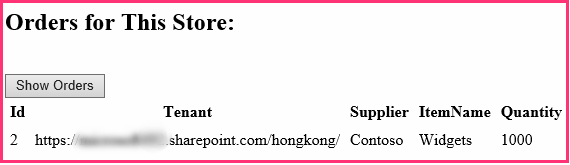

# Give your provider-hosted add-in the SharePoint look-and-feel

Learn how to give your provider-hosted SharePoint Add-ins the look and feel of SharePoint.
 
> [!NOTE]
> The name "apps for SharePoint" is changing to "SharePoint Add-ins." During the transition, the documentation and the UI of some SharePoint products and Visual Studio tools might still use the term "apps for SharePoint." For details, see [New name for apps for SharePoint](new-name-for-apps-for-sharepoint.md#bk_newname).

This is the second in a series of articles about the basics of developing provider-hosted SharePoint Add-ins. You should first be familiar with [SharePoint Add-ins](sharepoint-add-ins.md) and the previous article in this series:

-  [Get started creating provider-hosted SharePoint Add-ins](get-started-creating-provider-hosted-sharepoint-add-ins.md)
    
In the previous article of this series you learned how to set up a development environment and how to use Visual Studio to create a first "Hello World" level add-in that exposes SharePoint data in the add-in's remote web application. 

In this article, we start with a SharePoint Add-in solution that has already been created. It includes an ASP.NET Web Forms application and a SQL Azure database. We've created these for you because this series of articles is intended to focus only on SharePoint Add-ins. You'll be adding more SharePoint functionality and integration to the add-in with each article in this series.

## Get to know the base add-in

We are not going to teach you ASP.NET or T-SQL programming in this series, but you need to know a little about the remote components of the add-in before we can start integrating it into SharePoint. The scenario of the add-in envisions a chain of retail stores, and each store has a team website in the parent company's SharePoint Online subscription. When a store installs the add-in on its team site, the add-in enables them to integrate their SharePoint data and experience with data in the parent company's database. Each instance of the add-in has its own tenancy in the corporate database, and users can only interact with corporate data that is associated with their store.

### Create team sites for two stores in the chain

1. Open the home page of your SharePoint Online site, and then select the **Site Contents** link on the quick launch. On the **Site Contents** page, scroll down until you see the **new subsite** link, and then select it.
 
2. On the **New SharePoint Site** page, fill out the form for a new team site by entering these values (also shown in the following screen shot):

   - **Title**: Fabrikam Hong Kong Store
   - **URL**: hongkong
    
   *Figure 1. Form for creating a new SharePoint subsite*

   

3. Leave all other settings at their defaults, and then select **Create**.

### Explore the add-in

1. Go to [SharePoint_Provider-hosted_Add-Ins_Tutorials](https://github.com/OfficeDev/SharePoint_Provider-hosted_Add-ins_Tutorials) and select the **Download ZIP** button to download the repository to your desktop. Unzip the file.
 
2. Launch Visual Studio *as an administrator*, and then open BeforeSharePointUI.sln. There are three projects in the solution:
    
   - **ChainStore**: the SharePoint Add-in project
   - **ChainStoreWeb**: the remote web application
   - **ChainCorporateDB**: the SQL Azure database

3. Select the **ChainStore** project and, in the **Properties** window, set the **Site URL** property to the full URL of the Hong Kong team site: `https://{YOUR_SHAREPOINT_DOMAIN}/hongkong/`. Be sure to include the "/" character at the end. Select **Save**. *At some point in this process, you will be prompted to sign in to your SharePoint Online subscription.* 
    
4. Right-click the solution node at the top of **Solution Explorer**, and then select **Set startup projects**.
 
5. Ensure that all three projects are set to **Start** in the **Action** column.
    
6. Use the F5 key to deploy and run your add-in. Visual Studio hosts the remote web application in IIS Express and hosts the SQL database in SQL Express. It also makes a temporary installation of the add-in on your test SharePoint site and immediately runs the add-in. You are prompted to grant permissions to the add-in before its start page opens.
    
7. The add-in's start page looks like the one in Figure 2. At the very top is the name of the SharePoint website where the add-in is installed. This is a side effect of some sample code that the Office Developer Tools for Visual Studio generates. You'll change this in a later step. The page has areas where data from the corporate **Inventory**, **Orders**, and **Employees** SQL database tables can be seen. These tables are empty initially.
  
   *Figure 2. Start page of the chain store add-in*

   

8. Select the **Order Form** link at the bottom of the page to open an order form. Enter some values in the form, and then select **Place Order**. The screenshot in Figure 3 shows an example. It won't appear that anything has happened, but the code behind the button passes the values to a parameterized stored procedure in the SQL database. Using parameterized stored procedures protects the database from SQL injection attacks.

   *Figure 3. Order form*

   

9. Use the browser's back button to go back to the start page, and then select the **Show Orders** button. The page refreshes and your order appears on the page similar to the screenshot in Figure 4.

   *Figure 4. Start page for orders*

   
    
   The table has a **Tenant** field with the URL of your test SharePoint website as the value. This does not refer to the SharePoint Online subscription that is sometimes called a tenancy. Instead, each instance of the add-in is a distinct tenant in the corporate database. Because no more than one instance of an add-in can be installed on a specific SharePoint host web, the URL of the host web can be used as a tenant discriminator in the database. (For a refresher on the distinction between host web and add-in web, see [SharePoint Add-ins](sharepoint-add-ins.md).) 
   
   All of the stored procedures in the add-in include the discriminator value when they write or read from the database. This ensures that when a user selects the **Show Orders** (or **Show Employees** or **Show Inventory**.md) button, only the data that is associated with the user's store is retrieved from the database. This design also ensures that users can only place orders and add employees for their own store.
    
   The remote web application obtains the host web URL from a query string parameter that SharePoint adds to the URL of the start page when it launches the add-in. Because SSL is being used, this query string is encrypted as it goes across the Internet to the remote web application. 

10. To end the debugging session, close the browser window or stop debugging in Visual Studio. Each time you select F5, Visual Studio retracts the previous version of the add-in and installs the latest one.   
 
11. By default, the add-in remains installed on the SharePoint host web in between debugging sessions in Visual Studio. To see how end users would launch it after it is installed, open the Fabrikam Hong Kong SharePoint website in your browser and go to the **Site Contents** page. You'll see the tile for the add-in as it is in the following screenshot:

   *Figure 5. Launch tile for the Chain Store add-in*

   
 
> [!NOTE]
> If you select the tile, the start page does not open because Visual Studio closes the IIS Express session when you stop debugging.

## Configure Visual Studio to rebuild the corporate database with each debugging session
<a name="Rebuild"> </a>

By default, Visual Studio will *not*  rebuild the SQL Express database. Therefore, orders and other items that you add to the database in one debugging session are still in the database in later sessions. It is easier to start with an empty database each time you select F5, so take these steps:

1. Right-click the **ChainCorporateDB** project, and select **Properties**.

2. Open the **Debug** tab and enable the **Always re-create database** option.  


## Give the remote web application the look and feel of SharePoint
<a name="Rebuild"> </a>

In some scenarios, you want your remote pages to have their own branding, but in most cases they should mimic the UI of SharePoint so that users feel they are still inside SharePoint.

### Add SharePoint chrome and top bar to the start page

1. In **Solution Explorer**, go to **ChainStoreWeb** > **Pages**, and open the CorporateDataViewer.aspx file (the add-in's start page).

2. In the **head** section, you'll see a script that loads some JavaScript libraries. Add the following additional script under it. This script loads the SP.UI.Controls.js file, which is in every SharePoint website at the /\_layouts/15/ folder. Among other things, this file loads the SharePoint CSS library.
    
    ```
      <script type="text/javascript">
        var hostweburl;

        // Load the SharePoint resources.
        $(document).ready(function () {

            // Get the URI decoded add-in web URL.
            hostweburl =
                decodeURIComponent(
                    getQueryStringParameter("SPHostUrl")
            );

            // The SharePoint js files URL are in the form:
            // web_url/_layouts/15/resource.js
            var scriptbase = hostweburl + "/_layouts/15/";

            // Load the js file and continue to the 
            // success handler.
            $.getScript(scriptbase + "SP.UI.Controls.js")
        });

        // Function to retrieve a query string value.
        function getQueryStringParameter(paramToRetrieve) {
            var params =
                document.URL.split("?")[1].split("&amp;");
            var strParams = "";
            for (var i = 0; i < params.length; i = i + 1) {
                var singleParam = params[i].split("=");
                if (singleParam[0] == paramToRetrieve)
                    return singleParam[1];
            }
        }
    </script>
    ```

3. At the top of the body section of the page, add the following markup. This will insert the SharePoint top bar, called the chrome control, onto the page. The details of this markup will become clearer when we test the revised add-in later in this article (the string "app" appears in some of the property names because add-ins used to be called "apps").
    
    ```
      <!-- Chrome control placeholder. Options are declared inline.  -->
    <div 
        id="chrome_ctrl_container"
        data-ms-control="SP.UI.Controls.Navigation"  
        data-ms-options=
            '{  
                "appHelpPageUrl" : "Help.aspx",
                "appIconUrl" : "/Images/AppIcon.png",
                "appTitle" : "Chain Store",
                "settingsLinks" : [
                    {
                        "linkUrl" : "Account.aspx",
                        "displayName" : "Account settings"
                    },
                    {
                        "linkUrl" : "Contact.aspx",
                        "displayName" : "Contact us"
                    }
                ]
             }'>
    </div>
    ```

4. The **H1** headers and the hyperlink in the body of the page automatically use styles defined in SharePoint's CSS library, so they don't need to be changed. To illustrate how you can use the SharePoint styles, set the column headings in the three **GridView** controls to SharePoint's "all caps" style by adding the **HeaderStyle-CssClass** attribute to each of the controls and setting its value to `ms-uppercase`. The following is an example. Make the same change to all three **GridView** controls.
    
    ```XML
      <asp:GridView ID="ordersGridView" runat="server" CellPadding="5" GridLines="None" 
    HeaderStyle-CssClass="ms-uppercase" />
    ```

5. The chrome control uses the add-in's icon, so we need a second copy of the icon file on the remote web server. In **Solution Explorer**, right-click the AppIcon.png file in the **ChainStore** project, and select **Copy**. 
    
6. Right-click the **Images** folder in the **ChainStoreWeb** project, and select **Paste**.
 
7. Open the CorporateDataViewer.aspx.cs file. 
 
8. The `CorporateDataViewer` class declares a private member of type **SharePointContext**. This class is defined in the SharePointContext.cs file that the Office Developer Tools for Visual Studio generated when the project was created. You can think of it as something like the **HttpContextBase** class of ASP.NET, but with SharePoint contextual information such as the host web's URL added to it.
    
   In the **Page_Load** method, a **using** statement writes the name of the SharePoint host web to the remote start page. This is sample code, so delete the entire **using** statement (but leave the line that initializes the `spContext` variable). The method should now look like the following.

    ```C#
      protected void Page_Load(object sender, EventArgs e)
    {
        spContext = SharePointContextProvider.Current.GetSharePointContext(Context);
    }
    ```

9. There are four other ASP.NET files that need the SharePoint UI: 
    
   - Account.aspx
   - Contact.aspx
   - Help.aspx
   - OrderForm.aspx

   > [!NOTE]
   > The last aspx file in the project, EmployeeAdder.aspx, is never actually rendered, so you don't change its UI. You'll learn more about it in a later article of this series. 

   We don't want the chrome control on these pages. We just want access to the SharePoint CSS library. For each of these four files, add the following markup to the **head** element.

    ```XML
      <link type="text/css" rel="stylesheet" 
    href="<%= spContext.SPHostUrl.ToString() + "_layouts/15/defaultcss.ashx" %>" />
    ```

10. This step and the next one have already been done for the Order Form page and the Account page, so they apply only to the Contact page and Help page. To get the `spContext` object onto each of the pages, open the \*.aspx.cs code behind files for the three aspx pages. In each of them, add the following member to the **Page** class.
    
    ```C#
      protected SharePointContext spContext;
    ```

11. Replace the **Page_Load** method with the following version. The object is being retrieved from the Session cache. It was cached there when it was first created by the **Page_Load** method of the add-in's start page.
    
    ```C#
      protected void Page_Load(object sender, EventArgs e)
    {
        spContext = Session["SPContext"] as SharePointContext;
    }
    ```

12. Open the OrderForm.aspx page. In the top **Label** element, replace the `<b>` element on the phrase **Place Order** with span tags that reference the `ms-accentText` CSS class. The entire **Label** control should look like this when you are finished.
    
    ```XML
      <asp:Label ID="lblOrderPrompt" runat="server"
             Text="Enter a supplier, product, and quantity; and then press <span class='ms-accentText'>Place Order</span>.">
    </asp:Label>
    ```

## Run the add-in and test the new SharePoint UI
<a name="Rebuild"> </a>

1. Use the F5 key to deploy and run your add-in. Visual Studio hosts the remote web application in IIS Express and hosts the SQL database in a SQL Express. It also makes a temporary installation of the add-in on your test SharePoint site and immediately runs the add-in. You are prompted to grant permissions to the add-in before its start page opens.
    
2. When the add-in's start page opens, it now looks like a SharePoint page. Select the **Order Form** link. It also now looks like a SharePoint form.
  
   *Figure 6. The Order Form with Segoe fonts and a highlighted Place Order*

   
 
3. Create an order, and then select **Place Order**.
    
4. Use the browser's back button to go back to the add-in start page, and then select **Show Orders**. The page should now look similar to the following. Note that the column headings are now all caps. 
  
   *Figure 7. The start page with a chrome control*

   

5. Select the **?** icon on the end of the chrome control. A simple help page opens. Select the browser's back button.

6. Select the gear icon on the chrome control. A menu opens with links for an Account and a Contact page. Open the Account page, and use the browser's back button to get back to the start page. Do the same for the Contact page.

7. Select the **Back to Site** button on the chrome control. The home page of the host web, the Hong Kong store team site, opens.

8. Select the gear icon on the top bar, and then select **Change the look**.

9. Follow the prompts to change the site to one of the alternative "looks."

10. Navigate to the **Site Contents** page and launch the Chain Store app from its tile. Your custom pages have taken on the chosen look. The following screenshots show how they appear in the **Nature** composed look.

   *Figure 8. The start page and order form with the Nature composed look* 

   

11. Change the site's look back to the default, which is called **Office**.

12. To end the debugging session, close the browser window or stop debugging in Visual Studio. Each time you select F5, Visual Studio retracts the previous version of the add-in and installs the latest one.

13. You will work with this add-in and Visual Studio solution in other articles, and it's a good practice to retract the add-in one last time when you are done working with it for a while. Right-click the project in **Solution Explorer** and select **Retract**.

## Next steps
<a name="Nextsteps"> </a>

The add-in now looks like SharePoint, but it's still just a web application that doesn't really integrate with SharePoint beyond being launched from a tile in SharePoint. You'll add a custom command, launched from a custom ribbon button in the next article: [Include a custom button in the provider-hosted add-in](include-a-custom-button-in-the-provider-hosted-add-in.md).
 

