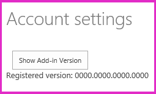

# Handle add-in events in the provider-hosted add-in

Learn how to customize the installation of a provider-hosted SharePoint Add-in.
 
> [!NOTE]
> The name "apps for SharePoint" is changing to "SharePoint Add-ins." During the transition, the documentation and the UI of some SharePoint products and Visual Studio tools might still use the term "apps for SharePoint." For details, see [New name for apps for SharePoint](new-name-for-apps-for-sharepoint.md).

This is the seventh in a series of articles about the basics of developing provider-hosted SharePoint Add-ins. You should first be familiar with [SharePoint Add-ins](sharepoint-add-ins.md) and the previous articles in this series:

-  [Get started creating provider-hosted SharePoint Add-ins](get-started-creating-provider-hosted-sharepoint-add-ins.md)
-  [Give your provider-hosted add-in the SharePoint look-and-feel](give-your-provider-hosted-add-in-the-sharepoint-look-and-feel.md)
-  [Include a custom button in the provider-hosted add-in](include-a-custom-button-in-the-provider-hosted-add-in.md)
-  [Get a quick overview of the SharePoint object model](get-a-quick-overview-of-the-sharepoint-object-model.md)
-  [Add SharePoint write operations to the provider-hosted add-in](add-sharepoint-write-operations-to-the-provider-hosted-add-in.md)
-  [Include an add-in part in the provider-hosted add-in](include-an-add-in-part-in-the-provider-hosted-add-in.md)

> [!NOTE]
> If you have been working through this series about provider-hosted add-ins, you have a Visual Studio solution that you can use to continue with this topic. You can also download the repository at [SharePoint_Provider-hosted_Add-Ins_Tutorials](https://github.com/OfficeDev/SharePoint_Provider-hosted_Add-ins_Tutorials) and open the BeforeAdd-inEventHandlers.sln file.

In this article, we customize the handling of a kind of event in SharePoint called add-in events. Specifically, we create handlers for the add-in installation and uninstallation events. List and list item events can also get custom handling; you'll learn about these in a later article in this series. All of these events are triggered in SharePoint, but your custom code that handles each event is in your remote web application. You configure SharePoint to call your custom handler by registering the handler's URL with the SharePoint event.

## Two places to programmatically deploy SharePoint components

We want our Chain Store add-in to create and deploy the **Local Employees** and **Expected Shipments** lists automatically. An add-in can deploy SharePoint components, such as a custom list, any time. But when an add-in depends on a specific component such as a custom list, the component really should be deployed *before* users start working with the add-in. For such vital components, there are two places where the custom deployment logic can go:

- In a handler for the add-in installation event.
- In "first run" logic that executes the first time the add-in is launched in SharePoint.

Deciding which is best for a given add-in is an advanced topic. In this article, we can only mention a few points of comparison:

- A custom installation handler has to complete in 30 seconds. There is no limit to how long first-run logic can take.

- If anything goes wrong during an add-in installation, SharePoint rolls back everything it has done as part of the installation. A custom installation handler runs *after* SharePoint has done everything it's going to do to install the add-in, so a custom handler can participate in this system. 

   For example, if your custom logic throws an exception, you can tell SharePoint to roll back the entire add-in installation. If something goes wrong in custom first-run logic, however, the add-in remains installed and presumably won't work properly.

- SharePoint doesn't give up if it has to roll back an add-in installation. It immediately tries the installation again. It makes up to four attempts (the 30-second time limit applies on each attempt). Each time it retries, the custom installation handler runs again *from the beginning*. If the handler managed to install, say, a list, before the rollback, it tries to install the same list again on the retry. 

   To prevent this from happening, code in an installation handler has to be written so that it won't take any action (such as deploy a component) unless it first checks to see if that action has already been done. This makes the logic of an installation handler more complex than first-run logic because first-run logic won't retry (unless you specifically code it to do so). Also, checking to see if a component has already been deployed usually requires a time-consuming call over the Internet from the remote handler to SharePoint. A second call is also needed to actually deploy the component (if it has not already been deployed).

For the Chain Store add-in, we combine these strategies. In this article, you create an installation handler that registers the host web as a tenant in the corporate database and then sets a signal that specifies whether the add-in has been run yet on the host web. 

In a later article in this series, you'll put first-run logic in the **Page_Load** method of the add-ins start page. This logic deploys the two custom lists and does some other things, too.

## Configure the solution for event receiver debugging
<a name="RERDebug"> </a>

Debugging of event receivers requires the use of the Azure Service Bus. Follow the instructions at [Debug and troubleshoot a remote event receiver in a SharePoint Add-in](debug-and-troubleshoot-a-remote-event-receiver-in-a-sharepoint-add-in.md). Because you are using a SharePoint Online website as your test site, ensure that you carry out the instructions for a remote test site. The remainder of this series assumes you have configured debugging successfully. 

## Create the installation handler
<a name="RERDebug"> </a>

> [!NOTE]
> The settings for Startup Projects in Visual Studio tend to revert to defaults whenever the solution is reopened. Always take these steps immediately after reopening the sample solution in this series of articles: 
> 1. Right-click the solution node at the top of **Solution Explorer**, and then select **Set startup projects**.  
> 2. Ensure that all three projects are set to **Start** in the **Action** column.

1. In **Solution Explorer**, select the **ChainStore** project so that its properties appear in the **Properties** pane of Visual Studio.

2. Set the value of **Handle Add-in Installed** to **True** (it may still be called **Handle App Installed**). This does two things:
    
   - A folder called **Services** is created in the **ChainStoreWeb** project (not the **ChainStore** project), and two files are added to it: an AppEventReceiver.svc file and its code-behind AppEventReceiver.svc.cs file (the file names begin with the string "App" because add-ins used to be called "apps"; *don't rename these files* because the Office Developer Tools for Visual Studio assumes that the files will keep these names).

   - The handler URL is registered in the add-in manifest. This part of the manifest is not visible in the manifest designer. To see it, right-click the AppManifest.xml file and select **View Code**. A new child of the **Properties** element looks like the following. 
   
      ```XML
        <InstalledEventEndpoint>~remoteAppUrl/Services/AppEventReceiver.svc</InstalledEventEndpoint>
      ``` 
   
     This markup tells SharePoint to call the **ProcessEvent** method of this service when it has finished doing all of its own work related to installing the add-in. The custom handler is the last thing that runs as part of the installation. The string `~remoteAppUrl` is a placeholder that the Office Developer Tools for Visual Studio replaces with the service host URL. When you are debugging, it is an Azure Service Bus URL. When you create the package for deployment to production, it is the production URL.

3. Open the AppEventReceiver.svc.cs file.
    
4. You see that the Office Developer Tools for Visual Studio has created a sample implementation of the **ProcessEvent** method. All implementations of this method begin by initializing an **SPRemoteEventResult** object, and they all end by returning that object to SharePoint. Among other things, this object tells SharePoint whether or not it should roll back the event because the custom handling logic has failed. 

   The tools may also have included a **using** block in this method that creates a **ClientContext** object. The custom handler in the Chain Store add-in isn't going to call back into SharePoint, so delete this block. The method should now look like the following.
    
    ```C#
       public SPRemoteEventResult ProcessEvent(SPRemoteEventProperties properties)
     {
         SPRemoteEventResult result = new SPRemoteEventResult();

         return result;
     }
    ```

5. The event receiver could be called by any of three possible add-in events, so add the following **switch** structure to the **ProcessEvent** method in between the lines that create and return the `result` object (the event names have the string "App" in them because add-ins used to be called "apps").
    
    ```C#
      switch (properties.EventType)
    {
        case SPRemoteEventType.AppInstalled:

            // TODO2: Custom installation logic goes here.

            break;
        case SPRemoteEventType.AppUpgraded:
            // This sample does not implement an add-in upgrade handler.
            break;
        case SPRemoteEventType.AppUninstalling:

            // TODO3: Custom uninstallation logic goes here.         

            break;
    }
    ```

6. Our installation logic is going to call an SQL stored procedure to register the Hong Kong store as a tenant in the remote web application. It is very important that, if this process fails, the handler signals SharePoint to roll back the installation of the add-in, so add the following **try/catch** blocks in place of `TODO2`. 

    ```C#
      try
    {
        CreateTenant(tenantName);
     }
    catch (Exception e)
    {
         // Tell SharePoint to cancel and roll back the event.
        result.ErrorMessage = e.Message;
        result.Status = SPRemoteEventServiceStatus.CancelWithError;
    }
    ```

   Note the following about this code:

   - You create the `tenantName` object and `CreateTenant` method in a later step.
   - The **Status** property of the **SPRemoteEventResult** object can have three possible values: **Continue** (the default), **CancelNoError**, and **CancelWithError**. Either of the latter two tell SharePoint to roll back the event.

7. The host web URL, which is the sample's tenant discriminator, is part of the information that SharePoint passes to the receiver in the **SPRemoteEventProperties** parameter. Add the following line to the **ProcessEvent** method on the line that is just under the initialization of the **SPRemoteEventResult** object.
    
    ```C#
      string tenantName = properties.AppEventProperties.HostWebFullUrl.ToString();
    ```

8. Now our code has to deal with a little quirk of the **AppEventProperties.HostWebFullUrl** property. In most other contexts, SharePoint includes a closing `"/"` character at the end of the host web URL, so the logic of our sample code assumes that this character is present. But SharePoint adds this character at the end of the **HostWebFullUrl** value if, and only if, the host web is the root web of a site collection. Because our Hong Kong website is a subweb in the site collection, we need to add this character to ensure that the same tenant name string is used throughout the sample. 

   Add the following code under the initialization of the `tenantName` object.
    
    ```C#
      if (!tenantName.EndsWith("/"))
    {
        tenantName += "/";
    }
    ```

9. Add the following **using** statements to the top of the file.
    
    ```
      using System.Data.SqlClient;
      using System.Data;
      using ChainStoreWeb.Utilities;
    ```

10. Add the following method to the `AppEventReceiver` class. We don't discuss this in detail because the purpose of this series of articles is to teach SharePoint Add-in programming, not SQL Server/Azure programming.

     ```C#
       private void CreateTenant(string tenantName)
     {
         // Do not catch exceptions. Allow them to bubble up and trigger roll back
         // of installation.

         using (SqlConnection conn = SQLAzureUtilities.GetActiveSqlConnection())
         using (SqlCommand cmd = conn.CreateCommand())
         {
             conn.Open();
             cmd.CommandText = "AddTenant";
             cmd.CommandType = CommandType.StoredProcedure;
             SqlParameter name = cmd.Parameters.Add("@Name", SqlDbType.NVarChar);
             name.Value = tenantName;
             cmd.ExecuteNonQuery();
         }//dispose conn and cmd
     }
     ```

    This method creates a row in a database table called **Tenants**. In addition to the **Name** column, the table also has a **Version** column with a default value set to 0000.0000.0000.0000. In a later article in this series, you will create first-run logic that looks at this value to determine whether the add-in has already been installed on the host web. If the version is 0000.0000.0000.0000, your code deploys the **Local Employees** and **Expected Shipments** lists, and then raises the version number.
    
## Create the uninstallation handler
<a name="RERDebug"> </a>

It is usually a good practice to handle the uninstalling event whenever you are handling the installed event. The basic idea is that the uninstalling handler deletes or recycles things that the installed handler deployed. There are, however, many exceptions, so you really need to understand the use cases of your add-in. For example, a list that is deployed with an add-in and populated with the add-in might still have value even after the add-in itself is uninstalled, in which case you wouldn't want to uninstall the list in the uninstalling event handler. 

The uninstallation event does not run, as you might expect, when a user removes the add-in from the **Site Contents** page. Doing so only moves the add-in to the website's Recycle Bin. A user could restore it, but restoring does not rerun the installed event handler, so you'd want anything that was deployed with the installed event handler to still exist if the add-in is restored. SharePoint components can be moved from the Recycle Bin to the second-stage Recycle Bin. It is only when an add-in is deleted from the second-stage that the uninstalling event happens; when a user does that, the add-in is unrestorable anyway, so we want the Hong Kong store's tenancy to be removed from the corporate database at that point.

1. Set the value of **Handle Add-in Uninstalling** to **True** (it may still be called **Handle App Uninstalling**). This registers the handler in the AppManifest.xml file just as you earlier registered the installation handler. If you look at the file, you see that they have exactly the same URL. The Office Developer Tools for Visual Studio assumes that you are using the same \*.svc file. We are doing that in this sample, and it is a standard practice. 

2. Add the following code in place of `TODO3` in the AppEventReceiver.svc.cs file. 

    ```C#
      try
    {
        DeleteTenant(tenantName);
     }
    catch (Exception e)
    {
         // Tell SharePoint to cancel and roll back the event.
        result.ErrorMessage = e.Message;
        result.Status = SPRemoteEventServiceStatus.CancelWithError;
    }
    ```

   Note the following about this code:

   - The `DeleteTenant` method is added in the next step.
   - Rolling back the uninstallation of the add-in leaves it in the second-stage Recycle Bin, from which it could still be restored.

3. Add the following method to the `AppEventReceiver` class.
    
    ```C#
      private void DeleteTenant(string tenantName)
    {
        // Do not catch exceptions. Allow them to bubble up and trigger roll back
        // of un-installation (removal from 2nd level Recycle Bin).

        using (SqlConnection conn = SQLAzureUtilities.GetActiveSqlConnection())
        using (SqlCommand cmd = conn.CreateCommand())
        {
            conn.Open();
            cmd.CommandText = "RemoveTenant";
            cmd.CommandType = CommandType.StoredProcedure;
            SqlParameter name = cmd.Parameters.Add("@Name", SqlDbType.NVarChar);
            name.Value = tenantName;
            cmd.ExecuteNonQuery();                
        }//dispose conn and cmd
    }
    ```

> [!NOTE]
> In an earlier article in this series, you configured the project to rebuild the corporate database each time you select F5. This empties the **Tenants** table.

## Run the add-in and test the installation handler
<a name="RERDebug"> </a>

1. Use the F5 key to deploy and run your add-in. Visual Studio hosts the remote web application in IIS Express and hosts the SQL database in SQL Express. It also makes a temporary installation of the add-in on your test SharePoint site, runs the installation event handler, and immediately runs the add-in. You are prompted to grant permissions to the add-in before its start page opens. 

2. When the add-in's start page opens, select the gear icon on the chrome control at the top, and then select **Account settings**.

3. On the **Accounts** page, select the **Show Add-in Version** button. The version shows as 0000.0000.0000.0000.
    
   *Figure 1. Accounts page*

   

4. To end the debugging session, close the browser window or stop debugging in Visual Studio. Each time that you select F5, Visual Studio retracts the previous version of the add-in and installs the latest one.

5. You will work with this add-in and Visual Studio solution in other articles, and it's a good practice to retract the add-in one last time when you are done working with it for a while. Right-click the project in **Solution Explorer** and select **Retract**.

## Next steps
<a name="Nextsteps"> </a>

In the next article of the series, you will add first-run logic to the add-in that programmatically deploys the **Local Employees** list and the custom ribbon button: [Add first-run logic to the provider-hosted add-in](add-first-run-logic-to-the-provider-hosted-add-in.md).
 

 

