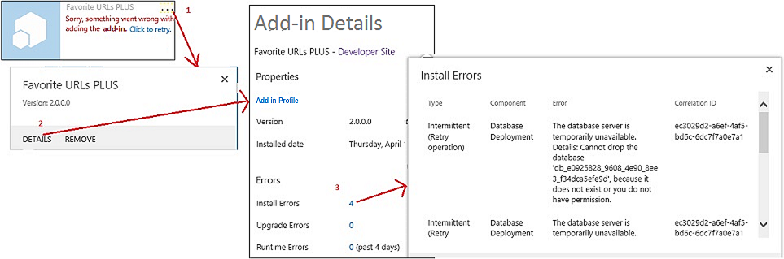
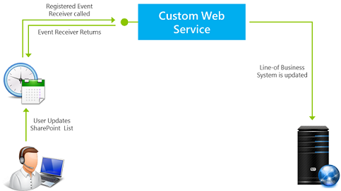

# Handle events in SharePoint Add-ins

 **Note**  The name "apps for SharePoint" is changing to "SharePoint Add-ins". During the transition, the documentation and the UI of some SharePoint products and Visual Studio tools might still use the term "apps for SharePoint". For details, see  [New name for apps for Office and SharePoint](new-name-for-apps-for-sharepoint.md#bk_newname).
 

Your custom code can handle three categories of events in provider-hosted add-ins:
 

-  **List events**, such as the adding or deleting of a list on a website.
    
 
-  **List item events**, such as the editing of an item in a list.
    
 
-  **Add-in events**, such as the installation of an add-in.
    
 
SharePoint-hosted SharePoint Add-ins do not support event handling, but you can turn a workflow into a kind of list or list item event handler by setting an event to trigger the workflow. See  [Workflows in SharePoint 2013](http://msdn.microsoft.com/library/e0602371-ae22-44be-8a7e-9e47e9f046d6%28Office.15%29.aspx). Workflows cannot be triggered by add-in events, so add-in events cannot be handled with a SharePoint-hosted add-in.
 

 **Note**  Website events and site collection events are not supported in SharePoint Add-ins.
 

There are two kinds of events: 
 

-  ** *Before*  events** are triggered before the SharePoint infrastructure does any of it's own handling of the event (including committing changes to the content database). In SharePoint ** custom before event handlers always execute synchronously**. Among other purposes, they can be used to cancel the event. For example, if an add-in has a function for deleting a list, a handler for the list deleting event can cancel the deletion if certain conditions are not met. If the event is part of a sequence of events, cancelling it prevents any of the later events from occurring at all. For example, if your handler for the **ItemAdding** event cancels the event, the **ItemAdded** event, which normally comes later, is not triggered.
    
 
-  ** *After*  events** are triggered after the SharePoint infrastructure does any of it's own handling of the event. In SharePoint, **remote after event handlers, for list and list item events, always execute asynchronously**. (App events are an exception.) Among other purposes, they can be used to log events.
    
 

## Handle list and list item events
<a name="RER"> </a>

To handle list and list item events, you create remote event receivers (RERs), which are web services that run externally to the SharePoint farm or SharePoint Online. The URL of the RER service is registered for the events it handles. There are two ways to register a handler:
 

 

- Events in the host web are registered programmatically with the CSOM (client-side object model) or the SharePoint REST API. This task is typically done in "first run" logic in the add-in or in a handler for an add-in event. (See  [Handling add-in events](#HandlingAppEvents) later in the article for an overview of add-in events.) For a code sample that programmatically registers a list event, see [OfficeDev/PnP/Samples/Core.EventReceivers](https://github.com/OfficeDev/PnP/tree/master/Samples/Core.EventReceivers).
    
 
-  Events in the add-in web are usually registered in a Feature of the add-in web with some simple XML markup. Details of how to create the markup and the service are in [Create a remote event receiver in SharePoint Add-ins](create-a-remote-event-receiver-in-sharepoint-add-ins.md). It is also possible to register add-in web events programmatically.
    
 

 **Note**  RERs have the same purpose as event receivers in farm solutions; but event receivers have custom code that runs on the SharePoint servers, so they cannot be used in SharePoint Add-ins.
 

Your add-in can handle the following list and document library events. Events ending in "ing" are before (synchronous) events and those ending in "ed" are after (asynchronous) events.
 

 

|||
|:-----|:-----|
|ListAdding|ListAdded|
|ListDeleting|ListDeleted|
|FieldAdding|FieldAdded|
|FieldDeleting|FieldDeleted|
|FieldUpdating|FieldUpdated|
The field update events are about changing the properties of a field (column) on a list, such as whether it is sortable, not about changing the data in the field.
 

 
Your add-in can handle the following list item events. 
 

 

|||
|:-----|:-----|
|ItemAdding|ItemAdded|
|ItemUpdating|ItemUpdated|
|ItemDeleting|ItemDeleted|
|ItemCheckingOut|ItemCheckedOut|
|ItemCheckingIn|ItemCheckedIn|
|ItemUncheckingOut|ItemUncheckedOut|
|ItemAttachmentAdding|ItemAttachmentAdded|
|ItemAttachmentDeleting|ItemAtttachmentDeleted|
|ItemFileMoving|ItemFileMoved|
|ItemVersionDeleting*|ItemVersonDeleted*|
||ItemFileConverted|

 **Note**  *These two new events may not be available in the Visual Studio UI. If not, pick ItemDeleting or ItemDeleted and then manually change the names.
 

When you are working in Visual Studio, and you add a RER to a SharePoint Add-in project, the Office Developer Tools for Visual Studio do the following:
 

 

- A web service file, such as RemoteEventReceiver1.svc, is added to the web application to handle the events that you specified when you added the remote event receiver to the SharePoint Add-in. The web service contains a code file to handle the remote events.
    
    After you create the remote event receiver, you add code to the code file for the web application service to handle the events. By default, the code file contains two methods to which you add your handling code: 
    
      -  `ProcessEvent()` handles "before" events (such as those in the left-hand columns in the tables earlier in the article) and it returns an object to SharePoint that reports on whether it should cancel the event or let it proceed.
    
 
  -  `ProcessOneWayEvent()` handles "after" events. It runs asynchronously and does not return anything to SharePoint.
    
 

    When a registered event occurs, SharePoint calls the appropriate method in your service and passes an object that provides some context information for your code. For example, the event type (from one of the two tables earlier in the article) is identified, so that your code can branch to the logic that is appropriate for the event.
    
 
- A project item for the remote event receiver is added to the SharePoint Add-in project. The Elements.xml file for the remote event receiver references the web service in the web application and the remote events that you specified. The following example shows an Elements.xml file that handles the addition or deletion of a list item.
    
  ```XML
  <?xml version="1.0" encoding="utf-8"?>
<Elements xmlns="http://schemas.microsoft.com/sharepoint/">
  <Receivers ListTemplateId="104">
      <Receiver>
        <Name>RemoteEventReceiver1ItemAdding</Name>
        <Type>ItemAdding</Type>
        <SequenceNumber>10000</SequenceNumber>
        <Url>~remoteAppUrl/RemoteEventReceiver1.svc</Url>
      </Receiver>
      <Receiver>
        <Name>RemoteEventReceiver1ItemDeleting</Name>
        <Type>ItemDeleting</Type>
        <SequenceNumber>10000</SequenceNumber>
        <Url>~remoteAppUrl/RemoteEventReceiver1.svc</Url>
      </Receiver>
  </Receivers>
</Elements>
  ```

To change the events that the remote event receiver handles, open  **Solution Explorer**, open the  **Properties** window for the remote event receiver, expand the **SharePoint Events** node, and then set only the events that you want to handle to **True**.
 

 

 **Note**  For additional information about RERs, including some troubleshooting information, see  [Remote Event Receivers FAQ](handle-events-in-sharepoint-add-ins.md#RERFAQ).
 


## Handling add-in events
<a name="HandlingAppEvents"> </a>

Add-in events are also handled by remote web services, but they are configured differently in the add-in package from list and list item RERs, so they are treated as a separate category of component. For an add-in event, the remote web service is registered in the add-in manifest, not in an add-in web Feature. The add-in doesn't even have to have an add-in web. There are three add-in events as described in the next sections.
 

 

### AppInstalled event

The  **AppInstalled** event runs immediately after SharePoint has finished everything that it needs to do when the add-in is installed, but before the user is notified that installation is complete. Although this is an *after*  event, SharePoint runs your handler *synchronously*  . The add-in is not available for use until after your handler has completed and your handler can cancel the installation (which will cause SharePoint to roll back everything it has done as part of the installation). In fact, it is a best practice to catch any errors in your handler and instruct SharePoint to roll back the installation. For more information, see [Include rollback logic and "already done" logic in your add-in event handlers](#Rollback).
 

 

 **Note**  When you install an add-in with  [Tenant scope](tenancies-and-deployment-scopes-for-sharepoint-add-ins.md), it is installed to the add-in catalog site collection and the AppInstalled event runs then and only then. The add-in is visible in multiple web sites in the tenancy, but the event does not run separately for each of these.
 

Besides canceling an add-in installation, this event can be used for many other purposes including:
 

 

- Install SharePoint components to the host web that cannot be declaratively installed with the host web Feature, such as lists or subwebs.
    
 
- Programmatically register list and list item event handlers with the host web or add-in web.
    
 
- Set app-instance-relative initialization settings. For example, your add-in can have an add-in web property bag for holding settings that vary from one instance of the add-in to another. Your AppInstalled handler can write varying values to the property bag, based on, say, the site type of the host web (such as Team Site or Blog site).
    
     **Note**  Checking to see if the host web is an AppCatalog site is a good way to detect whether the add-in has been installed with tenant scope. See  [Tenancies and deployment scopes for SharePoint Add-ins](tenancies-and-deployment-scopes-for-sharepoint-add-ins.md).
- Perform app-instance-relative configuration in the add-in's remote web application, such as adding a table to a database.
    
 

 **Important**  Your implementation of the AppInstalled event must complete within 30 seconds or the SharePoint installation infrastructure will think it has failed. The infrastructure will rerun the event,  *and repeat your code from the beginning*  , up to three additional times. After four timeouts, SharePoint will roll back the entire add-in installation. The full implications of these facts are discussed in [Include rollback logic and "already done" logic in your add-in event handlers](#Rollback).
 


### AppUninstalling event

The  ** AppUninstalling** event does *not*  run when the add-in is removed from the host web. Removal of an add-in only moves the add-in to the user's recycle bin. Two more steps are required before the AppUninstalling event is triggered. First, a user must remove the add-in from the recycle bin, which moves it to the second stage recycle bin. Second, a **user must remove the add-in from the second stage recycle bin. This last task triggers the AppUninstalling event**. The AppUninstalling event is synchronous and you can use it to cancel the uninstallation, which would leave the add-in in the second stage recycle bin.
 

 
The main purpose of a handler for this event is to delete or recycle things that were deployed with a AppInstalled (or an AppUpdated) handler. SharePoint cannot delete these things, or move them to the recycle bin, because it doesn't know about them, at least not as components of the add-in. It is usually a good practice to remove these things. But you don't want to delete things that still have a useful life after the add-in is gone: if a list or website created by your AppInstalled handler is still going to be used, don't delete it in your AppUninstalling handler.
 

 

### AppUpgraded event

The  **AppUpgraded** event runs immediately after SharePoint has finished everything that it needs to do when the add-in is updated to a new version, but before the user is notified that updating is complete. Like the AppInstalled event, it is an after event, but is essentially synchronous and it is a best practice to catch errors and notify SharePoint to roll back the update.
 

 
Some examples of what a handler for this event can do:
 

 

- Add, change, or remove add-in components from the host web.
    
 
- Do things in the add-in web that aren't possible with the declarative update semantics in an add-in web Feature. For example, you cannot delete anything with the declarative update markup, but you can do so programmatically in an AppUpgraded handler.
    
 
- Make changes to app-instance-relative components in the add-in's web application or remote database.
    
 
 *Detailed instructions for creating add-in event handlers is in  [Create an add-in event receiver in SharePoint Add-ins](create-an-add-in-event-receiver-in-sharepoint-add-ins.md)*  .
 

 

### Include rollback logic and "already done" logic in your add-in event handlers
<a name="Rollback"> </a>

If SharePoint encounters an error when processing any of the three add-in events, it will cancel the event and roll back any changes it has made in connection with the event. Your add-in event handlers have to integrate with this system because if the part of the event that you are implementing fails, you want the whole event to roll back, rather than continue and leave things in a possibly corrupt state. Here's what your handler usually has to do:
 

 

- Tell SharePoint that an error has occurred. The SOAP message that your add-in event handling web service returns to SharePoint will have a  **Status** property that can have the values of **Continue**,  **CancelWithError**, or  **CancelWithoutError**. Either  **Cancel*** status tells SharePoint to roll back the event.
    
 
- Roll back what the handler has already done before the handler encounters the error. SharePoint can't usually do this for you because it doesn't know what your handler did. This isn't a universal rule. For example, if an add-in installation is canceled, SharePoint will delete the entire add-in web, so there's no point in an AppInstalled event handler reverting anything it has done to the add-in web. But it usually should roll back things it did to the host web or to remote components of the add-in. 
    
 

 **Note**   **Special note about the AppUninstalling event:** The preceding points apply to the AppUninstalling event as much as to the other two add-in events. For example, if your handler for the uninstalling event deletes a row in a remote database, and then encounters an error, the row needs to be restored. Since your service will be sending a cancel message to SharePoint, the add-in will not be removed from the recycle bin. If it is restored from there and used again, it may fail to work without that database entry.However, your AppUninstalling handler completes  *before*  SharePoint removes the add-in from the recycle bin. So, if SharePoint itself encounters an error and needs to cancel the removal, there is no way for your handler to undo what it has done.
 

If SharePoint doesn't receive a results message from your handler in 30 seconds, it will call the handler again. It gives up entirely, and rolls back the event, after three retries (four tries in all). Each time it calls the handler, your code starts again from the beginning. But you generally don't want your handler to redo things it has already done, such as create a list on the host web, and you can't know if your rollback logic was completed, or even triggered, before the handler timed out. For this reason, your handler logic should not take any action without first checking whether the action has already been done, unless it would be harmless to do it again. 
 

 
Installation and updating errors can be seen in the SharePoint UI, as shown in the following graphic.
 

 

**Figure 1. Getting details for install error.**

 

 

 

#### Add-in event handler architecture strategies
<a name="Strategies"> </a>

Expressed in pseudo-code, your handler should usually be structured something like the following. If an error occurs in the Try section, the Catch and Rollback section should be invoked. (This may happen automatically depending on the language and framework.)
 

 

```
Try
    If X not already done,
        Do X.
Catch
    Send cancel message to SharePoint.
    If X not already undone,
        Undo X.

```

However, implementing your rollback and "already done" logic in your web service can slow down the handler. Both your installation and rollback logic usually make changes to something more-or-less remote from the web service, such as the SharePoint host web or a back end database. If your installation and rollback code is split between the Try and Catch sections, then the service is making separate calls to the remote components, often several such calls in each section. The best practice is usually to implement the installation and rollback logic on the remote component itself in a procedure that can be called from your handler in your Try section. The procedure should return a success or failure message, and if it reports failure, code in your Try section invokes the Catch section (by, say, throwing an exception). The only thing the Catch section does is notify SharePoint. We'll call this the handler delegation strategy. The following pseudo-code illustrates the strategy:
 

 


```
Try
    Call the "Do X" procedure on remote platform.
    If remote platform reports failure, call Catch.
Catch
    Send cancel message to SharePoint.

```

The "Do X" procedure, that executes on the remote system, would itself contain the rollback and "already done" logic like the following.
 

 


```
Try
    If X not already done,
        Do X.
        Set success flag to true.
Catch
    If X was done before error,
        Undo X.
    Set success flag to false.
Send
    Return success flag to the event handler.

```

For example, if your handler needs to take action on an SQL Server database, you can install a stored procedure on the SQL Server that uses a  [TRY-CATCH](http://msdn.microsoft.com/library/248df62a-7334-4bca-8262-235a28f4b07f%28Office.15%29.aspx) block to implement installation-rollback logic. with [IF-ELSE](http://msdn.microsoft.com/library/676c881f-dee1-417a-bc51-55da62398e81%28Office.15%29.aspx) blocks to implement "already done" logic.
 

 
The SharePoint add-in model doesn't provide a way to store custom server-side code on SharePoint and invoke it from the CSOM (client-side object model). But the CSOM does provide a way to bundle try-catch and if-then-else logic and send it to the server for execution. For a detailed example of a add-in event handler that uses the handler delegation strategy to add a list to a host web, see  [Create an add-in event receiver in SharePoint Add-ins](create-an-add-in-event-receiver-in-sharepoint-add-ins.md). For a code sample, see  [OfficeDev/PnP/Samples/Core.AppEvents.HandlerDelegation](https://github.com/OfficeDev/PnP/tree/master/Samples/Core.AppEvents.HandlerDelegation).
 

 
You cannot always use the handler delegation strategy. For example, when your handler is calling out to more than one component, such as to a database and the SharePoint host web, there is a chance that one could complete successfully and then the other fail. In this scenario, the rollback logic for the first component doesn't run if you designed it with the handler delegation strategy. For this reason, if you are calling to the components synchronously only the last one called can use the handler delegation strategy. If they are called asynchronously, you can't use that strategy in any of them. For a sample of an add-in event handler that does not use the handler delegation strategy, see  [OfficeDev/PnP/Samples/Core.AppEvents](https://github.com/OfficeDev/PnP/tree/master/Samples/Core.AppEvents).
 

 

 **Tip**  If the AppInstalled event fails, SharePoint will delete the add-in web, if there is one; and if the AppUpated event fails, SharePoint will restore the add-in web to its pre-update state. For this reason, your handlers never need to rollback actions they take on the add-in web. If you handler performs actions on both the host web and the add-in web, it should deal with the add-in web first. Doing so makes it safe to use the handler delegation strategy for the host web. Even if the add-in web actions succeed and the host web actions fail, there is no rollback logic that goes unexecuted.
 


## Remote Event Receivers in add-ins that support multiple security zones
<a name="HandlingAppEvents"> </a>

There are some restrictions on how you design an add-in that supports multiple security zones and has a remote event receiver. For more information, see Knowledge Base article kb3135876  [You can't add an application from the default SharePoint store when you use provider-hosted add-ins in non-default zones in SharePoint 2013](https://support.microsoft.com/en-us/kb/3135876).
 

 

## Remote Event Receivers FAQ
<a name="RERFAQ"> </a>

The following are common questions you may have when using remote event receivers.
 

 

### How are remote event receivers different from event receivers in SharePoint 2010?
<a name="RER_HowRERDifferentfrom2010"> </a>

In SharePoint 2010, event receivers handle events that occur on SharePoint lists, sites, and other SharePoint objects by running the code on the SharePoint server (either full-trust or in a sandbox). This type of event receiver still exists in SharePoint 2013. However, SharePoint 2013 also supports  *remote*  event receivers in which the code that runs when the event is triggered is hosted by a web service. This means that if you register a remote event receiver, you also need to tell SharePoint which web service to invoke. In Table 1, the code example on the left (SharePoint solutions) implements functionality using an event handler. The example on the right (SharePoint Add-ins) implements the same functionality using a remote event receiver.
 

 

**Table 1. Code examples for event receivers in SharePoint 2010 vs. remote event receivers in add-ins**


|**SharePoint solutions**|**SharePoint Add-ins **|
|:-----|:-----|
|
```C#
// Trigger an event when an item is added to the SharePoint list.
Public class OnPlantUpdated : SPItemEventReceiver
{
Public override void ItemAdding (SPItemEventProperties properties)
{
Properties.After.Properties.ChangedProperties.Add("Image",CreateLink(properties));
Properties.status =SPEventReceiverStatus.Continue;
}

/// When an item updates, run the following.
Public override void ItemUpdating(SPItemEventProperties properties)
{
Properties.AfterProperties.ChangedProperties.Add("Image",CreateLink9properties));
Properties.Status= SPEventReceiverStatus.Continue;
}

```

|
```C#
/* Trigger an event when an item is added to the SharePoint list*/
Public class OnPlantUpdated : IRemoteEventService
{
public SPRemoteEventResult ProcessEvent (SPRemoteEventProperties properties)
{
SPRemoteEventResult result =new SPRemoteEventResult();
If (properties.EventType == SPRemoteEventType.ItemAdding ||  
properties.EventType == SPRemoteEventType.ItemUpdating)
{

// Add code that runs when an item is added or updated.
}

```

|
See  [Add list item properties with a remote event receiver](http://code.msdn.microsoft.com/SharePoint-2013-Add-list-2c6e71e0) for the complete code sample. See [Migrating a SharePoint event receiver to a remote event receiver](http://channel9.msdn.com/Series/Reimagine-SharePoint-Development/Migrating-a-SharePoint-Event-Receiver-to-a-Remote-Event-Receiver) for a detailed demo of the code sample.
 

 

### 
<a name="RER_HowRERDifferentfrom2010"> </a>

For information, see  [SPRemoteEventType enumeration](https://msdn.microsoft.com/en-us/library/microsoft.sharepoint.client.eventreceivers.spremoteeventtype.aspx)
 

 

### How do remote event receivers work?
<a name="RER_HowDoRERWork"> </a>

Figure 1 shows how remote event receivers work:
 

 

- The user performs an action on SharePoint (for example, edits a list item).
    
 
- SharePoint then talks to the registered web service. You could perform some operations—for example, update a list item property, or update a backend system.
    
 
- The web service can also talk to the Access Control Service (ACS) to request its own signed token to do a call back to SharePoint. Using this token, you can perform remote actions from within the web service as a result of the earlier operation on the list item or in the backend system.
    
 

**Figure 2. How remote event receivers work in SharePoint**

 

 

 

 

 

### How do I debug remote event receivers?
<a name="RER_DebugRER"> </a>

See  [Debug and troubleshoot a remote event receiver in a SharePoint Add-in](debug-and-troubleshoot-a-remote-event-receiver-in-a-sharepoint-add-in.md). 
 

 

### Can I run client-side (JavaScript) code from remote event receivers?
<a name="RER_ClientsideCodeFromRER"> </a>

No.
 

 

### Are there any restrictions on where a remote event receiver can be hosted or on its URL?
<a name="RER_ClientsideCodeFromRER"> </a>

The remote event receiver can be hosted in the cloud or in an on-premise server that is not also being used as a SharePoint server. The URL of a production receiver cannot specify a particular port. This means that you must use either port 443 for HTTPS, which we recommend, or port 80 for HTTP. If you are using HTTPS and the receiver service is hosted on-premise, but the add-in is on Microsoft SharePoint Online, then the hosting server must have a publicly trusted certificate from a certificate authority. (A self-signed certificate works only if the add-in is in an on-premise SharePoint farm.)
 

 

### Will a SharePoint 2010 event handler work on SharePoint 2013 after I upgrade?
<a name="RER_Will2020EventHandlerWillWorkOn2013"> </a>

If a SharePoint 2010 solution package containing an event handler is upgraded to SharePoint 2013, depending on your customizations, the solution package may work without any modifications. This will include the event handler too. If the SharePoint 2010 solution is remodeled into a SharePoint Add-in in SharePoint 2013, the event handler should be rewritten as a remote event receiver. (See  [Migrating a SharePoint Event Receiver to a Remote Event Receiver](http://channel9.msdn.com/Series/Reimagine-SharePoint-Development/Migrating-a-SharePoint-Event-Receiver-to-a-Remote-Event-Receiver).)
 

 

## Additional resources
<a name="SP15handleevents_addlresources"> </a>


-  [Create a remote event receiver in SharePoint Add-ins](create-a-remote-event-receiver-in-sharepoint-add-ins.md)
    
 
-  [Create an add-in event receiver in SharePoint Add-ins](create-an-add-in-event-receiver-in-sharepoint-add-ins.md)
    
 
-  [Introducing remote event receivers in SharePoint 2013](http://www.microsoft.com/resources/msdn/en-us/office/media/video/video.mdl?cid=sdc&amp;from=mscomsdc&amp;VideoID=3ef8f7ae-85a7-44c3-967d-d1620e2a019f)
    
 
-  [Migrating a SharePoint Event Receiver to a Remote Event Receiver](http://channel9.msdn.com/Series/Reimagine-SharePoint-Development/Migrating-a-SharePoint-Event-Receiver-to-a-Remote-Event-Receiver)
    
 

