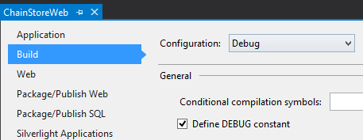
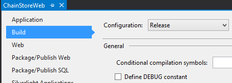
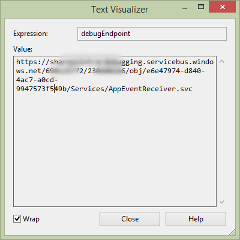

# Handle list item events in the provider-hosted add-in

Learn how to handle list item events in a provider-hosted SharePoint Add-in.
 
> [!NOTE]
> The name "apps for SharePoint" is changing to "SharePoint Add-ins." During the transition, the documentation and the UI of some SharePoint products and Visual Studio tools might still use the term "apps for SharePoint." For details, see [New name for apps for SharePoint](new-name-for-apps-for-sharepoint.md).

This is the tenth in a series of articles about the basics of developing provider-hosted SharePoint Add-ins. You should first be familiar with [SharePoint Add-ins](sharepoint-add-ins.md) and the previous articles in this series:

-  [Get started creating provider-hosted SharePoint Add-ins](get-started-creating-provider-hosted-sharepoint-add-ins.md)
-  [Give your provider-hosted add-in the SharePoint look-and-feel](give-your-provider-hosted-add-in-the-sharepoint-look-and-feel.md)
-  [Include a custom button in the provider-hosted add-in](include-a-custom-button-in-the-provider-hosted-add-in.md)
-  [Get a quick overview of the SharePoint object model](get-a-quick-overview-of-the-sharepoint-object-model.md)
-  [Add SharePoint write operations to the provider-hosted add-in](add-sharepoint-write-operations-to-the-provider-hosted-add-in.md)
-  [Include an add-in part in the provider-hosted add-in](include-an-add-in-part-in-the-provider-hosted-add-in.md)
-  [Handle add-in events in the provider-hosted add-in](handle-add-in-events-in-the-provider-hosted-add-in.md)
-  [Add first-run logic to the provider-hosted add-in](add-first-run-logic-to-the-provider-hosted-add-in.md)
-  [Programmatically deploy a custom button in the provider-hosted add-in](programmatically-deploy-a-custom-button-in-the-provider-hosted-add-in.md)

> [!NOTE]
> If you have been working through this series about provider-hosted add-ins, you have a Visual Studio solution that you can use to continue with this topic. You can also download the repository at [SharePoint_Provider-hosted_Add-Ins_Tutorials](https://github.com/OfficeDev/SharePoint_Provider-hosted_Add-ins_Tutorials) and open the BeforeRER.sln file.

You saw in an earlier article in this series that when an order is placed, it is added to the **Orders** table in the corporate database, and an item for it is automatically added to the **Expected Shipments** list. When it arrives at the local store, a user sets the **Arrived** column to **Yes**. Changing a field value for an item creates an item updated event for which you can add a custom handler. 

In this article, you create a handler for this list item event and then programmatically deploy it in the first-run logic of the SharePoint Add-in. Your handler adds the item into the **Inventory** table in the corporate database. It then sets the **Added to Inventory** column of the **Expected Shipments** list to **Yes**. You also learn how to prevent this second item updated event from setting off an infinite series of item updated events.

## Programmatically deploy the Expected Shipments list

> [!NOTE]
> The settings for Startup Projects in Visual Studio tend to revert to defaults whenever the solution is reopened. Always take these steps immediately after reopening the sample solution in this series of articles: 
> 1. Right-click the solution node at the top of **Solution Explorer**, and then select **Set startup projects**.  
> 2. Ensure that all three projects are set to **Start** in the **Action** column.

1. In **Solution Explorer**, open the Utilities\SharePointComponentDeployer.cs file in the **ChainStoreWeb** project. Add the following method to the `SharePointComponentDeployer` class. 

    ```C#
	  private static void CreateExpectedShipmentsList()
	 {
	    using (var clientContext = sPContext.CreateUserClientContextForSPHost())
	    {
		var query = from list in clientContext.Web.Lists
			    where list.Title == "Expected Shipments"
			    select list;
		IEnumerable<List> matchingLists = clientContext.LoadQuery(query);
		clientContext.ExecuteQuery();

		if (matchingLists.Count() == 0)
		{
			ListCreationInformation listInfo = new ListCreationInformation();
			listInfo.Title = "Expected Shipments";
			listInfo.TemplateType = (int)ListTemplateType.GenericList;
			listInfo.Url = "Lists/ExpectedShipments";
			List expectedShipmentsList = clientContext.Web.Lists.Add(listInfo);

			Field field = expectedShipmentsList.Fields.GetByInternalNameOrTitle("Title");
			field.Title = "Product";
			field.Update();

			expectedShipmentsList.Fields.AddFieldAsXml("<Field DisplayName='Supplier'" 
								    + " Type='Text' />", 
								    true,
								    AddFieldOptions.DefaultValue);
			expectedShipmentsList.Fields.AddFieldAsXml("<Field DisplayName='Quantity'" 
								    + " Type='Number'" 
								    + " Required='TRUE' >" 
								    + "<Default>1</Default></Field>",
								    true, 
								    AddFieldOptions.DefaultValue);
			expectedShipmentsList.Fields.AddFieldAsXml("<Field DisplayName='Arrived'" 
								   + " Type='Boolean'"
								   + " ShowInNewForm='FALSE'>"
								   + "<Default>FALSE</Default></Field>",
								    true, 
								    AddFieldOptions.DefaultValue);
			expectedShipmentsList.Fields.AddFieldAsXml("<Field DisplayName='Added to Inventory'" 
								    + " Type='Boolean'" 
								    + " ShowInNewForm='FALSE'>"
								    + "<Default>FALSE</Default></Field>", 
								    true, 
								    AddFieldOptions.DefaultValue);

			clientContext.ExecuteQuery();
		}
	     }
	 }
    ```


   This code doesn't introduce any functionality that you haven't already seen in a previous article of this series, but note the following:
   
   - It sets the **Required** attribute of the **Quantity** field to **TRUE** so the field must always have a value. It then sets the default value to 1.
   
   - The **Arrived** and **Added to Inventory** fields are hidden on the New Item form.
   
   - Ideally, the **Added to Inventory** field would also be hidden on the Edit Item form because it should only be changed to **Yes** when the item updated event handler has first added the item to the corporate **Inventory** table. For technical reasons that we'll explain in a later step, a field has to be visible in the Edit Item form if we want to programmatically write to it in an item updated event handler.

2. In the **DeployChainStoreComponentsToHostWeb** method, add the following line, just above the line `RemoteTenantVersion = localTenantVersion`.
    
    ```
      CreateExpectedShipmentsList();
    ```

## Create the list item event receiver

> [!NOTE]
> If you have been working through this series of articles, you have already configured your development environment for debugging remote event receivers. If you have not done that, see [Configure the solution for event receiver debugging](handle-add-in-events-in-the-provider-hosted-add-in.md#RERDebug) before you go any further in this topic.

The Office Developer Tools for Visual Studio includes a **Remote Event Receiver** item that can be added to a SharePoint Add-in solution. However, at the time this article was written, this project item assumes that the list (with which the receiver will be registered) is on the add-in web, and consequently the tools create an add-in web and some SharePoint artifacts in it. But the receiver for the Chain Store add-in is going to be registered (in a later step) with the **Expected Shipments** list on the host web, so the add-in does not need an add-in web. (For a reminder of the distinction between add-in webs and host webs, see [SharePoint Add-ins](sharepoint-add-ins.md).)
 
> [!NOTE]
> List and list item event receivers are called remote event receivers (RER) because their code is remote from SharePoint, either in the cloud or in an on-premises server outside the SharePoint farm. However, the events that trigger them are in SharePoint.

1. In **Solution Explorer**, right-click the **Services** folder in the **ChainStoreWeb** project, and select **Add** > **WCF Service**.

2. When prompted, name the service **RemoteEventReceiver1**, and then select **OK**. 

3. The tools create an interface file, an \*.svc file, and a code-behind file. We don't need the interface file IRemoteEventReceiver1.cs, so delete it. (The tools may have opened it automatically; if so, close and delete it.)
    
   > [!NOTE]
   > When you created the add-in event receivers for the installed and uninstalling events in an earlier article in this series, the Office Developer Tools for Visual Studio added their URLs to the app manifest file. List and list item event receivers are not registered in the app manifest. Instead, they are registered (in a provider-hosted add-in) programmatically. You'll do that in a later step.

4. Open the code-behind file RemoteEventReceiver1.svc.cs. Replace its entire contents with the following code. 

    ```C#
	  using System;
	using System.Collections.Generic;
	using Microsoft.SharePoint.Client;
	using Microsoft.SharePoint.Client.EventReceivers;
	using System.Data.SqlClient;
	using System.Data;
	using ChainStoreWeb.Utilities;

	namespace ChainStoreWeb.Services
	{
	    public class RemoteEventReceiver1 : IRemoteEventService
	    {
		/// <summary>
		/// Handles events that occur before an action occurs, 
		/// such as when a user is adding or deleting a list item.
		/// </summary>
		/// <param name="properties">Holds information about the remote event.</param>
		/// <returns>Holds information returned from the remote event.</returns>
		public SPRemoteEventResult ProcessEvent(SPRemoteEventProperties properties)
		{
		    throw new NotImplementedException();
		}

		/// <summary>
		/// Handles events that occur after an action occurs, 
		/// such as after a user adds an item to a list or deletes an item from a list.
		/// </summary>
		/// <param name="properties">Holds information about the remote event.</param>
		public void ProcessOneWayEvent(SPRemoteEventProperties properties)
		{

		}
	    }
	}
    ```

   Note the following about this code:
    
   - The interface `IRemoteEventService` is defined in the **Microsoft.SharePoint.Client.EventReceivers** namespace.
    
   - There won't be any "before" events handled in the Chain Store add-in, but the **ProcessEvent** method is required by the `IRemoteEventService` interface.

5. Add the following code to the **ProcessOneWayEvent** method. Note that the **ItemUpdated** event is the only one that this sample will handle, so we could have used a simple **if** structure instead of a **switch**. But event receivers typically handle multiple events, so we want you to see the pattern you'll most commonly be using in your event handlers as a SharePoint add-in developer.
    
    ```C#
	  switch (properties.EventType)
	{
	    case SPRemoteEventType.ItemUpdated:

		// TODO12: Handle the item updated event.

		break;
	}  
    ```

6. Replace `TODO12` with the following code. Again, here, we are using a **switch** structure when a simple **if** structure would do because we want you to see the common pattern in SharePoint event receivers.
    
    ```C#
	  switch (properties.ItemEventProperties.ListTitle)
	{
	    case "Expected Shipments":

		// TODO13: Handle the arrival of a shipment.

		break;
	}
    ```

7. The code that responds to the arrival of a shipment should do two things:
    
   - Add the item that has arrived at the store into the corporate inventory.
    
   - Set the **Added to Inventory** field on the **Expected Shipments** list to **Yes**. But this should only happen if the item was successfully added to the inventory.
    
   Add the following code in place of `TODO13`. The two methods, `TryUpdateInventory` and `RecordInventoryUpdateLocally` are created in later steps.

    ```C#
	  bool updateComplete = TryUpdateInventory(properties);
	if (updateComplete)
	{
	    RecordInventoryUpdateLocally(properties);
	}
    ```


8. The **ProcessOneWayEvent** method should now look like the following:

    ```C#
	  public void ProcessOneWayEvent(SPRemoteEventProperties properties)
	{
	    switch (properties.EventType)
	    {
		case SPRemoteEventType.ItemUpdated:

		    switch (properties.ItemEventProperties.ListTitle)
		    {
			case "Expected Shipments":
			    bool updateComplete = UpdateInventory(properties);
			    if (updateComplete)
			    {
				RecordInventoryUpdateLocally(properties);
			    }
			    break;
		    }
		    break;
	    }          
	}
    ```

9. Add the following method to the `RemoteEventReceiver1` class.
    
    ```C#
	  private bool TryUpdateInventory(SPRemoteEventProperties properties)
	{
	    bool successFlag = false;

		// TODO14: Test whether the list item is changing because the product has arrived
		// or for some other reason. If the former, add it to the inventory and set the success flag
		// to true.     

	    return successFlag;
	}
    ```

10. There are five columns on the **Expected Shipments** list, but we don't want the handler to react to most kinds of updates to an item. For example, if a user corrects the spelling of a supplier's name, the item updated event is triggered, but our handler should do nothing. The handler should only act when the **Arrived** field has just been set to **Yes**. 
    
    There's another condition that needs to be tested. Suppose **Arrived** is set to **Yes** and the product in the item is added to inventory (and **Added to Inventory** is set to **Yes**). But later a user mistakenly changes the **Arrived** field of a shipment back to **No** and then fixes his mistake by setting it again to **Arrived**. Both the mistake and the fix trigger the item updated event. The handler won't react to the mistake because it only acts when **Arrived** is **Yes**, but it would react to the fix that sets **Arrived** back to **Yes**, so the same product and quantity would get added into the inventory a second time. For this reason, the handler should only act when the **Added to Inventory** value is **No**. 
    
    Therefore, the handler needs to know what the values of these fields are just after the user updates the item. The **SPRemoteEventProperties** object has an **ItemEventProperties** property. And, in turn, it has an indexed **AfterProperties** property that holds the values of the fields in the updated item. The following code uses these properties to test whether the handler should react. Put this in place of `TODO14`.

     ```C#
	  var arrived = Convert.ToBoolean(properties.ItemEventProperties.AfterProperties["Arrived"]);
	var addedToInventory = Convert.ToBoolean(properties.ItemEventProperties.AfterProperties["Added_x0020_to_x0020_Inventory"]);

	if (arrived &amp;&amp; !addedToInventory)
	{

	    // TODO15: Add the item to inventory

	    successFlag = true;
	}
     ```

11. Replace `TODO15` with the following code. 

     ```C#
	  using (SqlConnection conn = SQLAzureUtilities.GetActiveSqlConnection())
	using (SqlCommand cmd = conn.CreateCommand())
	{
	    conn.Open();
	    cmd.CommandText = "UpdateInventory";
	    cmd.CommandType = CommandType.StoredProcedure;
	    SqlParameter tenant = cmd.Parameters.Add("@Tenant", SqlDbType.NVarChar);
	    tenant.Value = properties.ItemEventProperties.WebUrl + "/";
	    SqlParameter product = cmd.Parameters.Add("@ItemName", SqlDbType.NVarChar, 50);
	    product.Value = properties.ItemEventProperties.AfterProperties["Title"]; // not "Product"
	    SqlParameter quantity = cmd.Parameters.Add("@Quantity", SqlDbType.SmallInt);
	    quantity.Value = Convert.ToUInt16(properties.ItemEventProperties.AfterProperties["Quantity"]);
	    cmd.ExecuteNonQuery();
	}
     ```

    This is mainly SQL and ASP.NET programming, so we don't discuss it in detail, but note:
    
    - We use the **ItemEventProperties.WebUrl** property to get the tenant name, which is the host web URL.

    - We use the **AfterProperties** again to get the values of the product name and quantity.
    
    - We refer to the product name field as "Title", even though the display name was changed to "Product" (in the  **CreateExpectedShipmentsList** method) because fields are always referred to by their internal names.
 

12. We are not finished with the **TryUpdateInventory** method yet, but at this point it should look like the following.
    
     ```C#
	  private bool TryUpdateInventory(SPRemoteEventProperties properties)
	{
	    bool successFlag = false;

	    var arrived = Convert.ToBoolean(properties.ItemEventProperties.AfterProperties["Arrived"]);
	    var addedToInventory = Convert.ToBoolean(properties.ItemEventProperties.AfterProperties["Added_x0020_to_x0020_Inventory"]);

	    if (arrived &amp;&amp; !addedToInventory)
	    {
		using (SqlConnection conn = SQLAzureUtilities.GetActiveSqlConnection())
		using (SqlCommand cmd = conn.CreateCommand())
		{
		    conn.Open();
		    cmd.CommandText = "UpdateInventory";
		    cmd.CommandType = CommandType.StoredProcedure;
		    SqlParameter tenant = cmd.Parameters.Add("@Tenant", SqlDbType.NVarChar);
		    tenant.Value = properties.ItemEventProperties.WebUrl + "/";
		    SqlParameter product = cmd.Parameters.Add("@ItemName", SqlDbType.NVarChar, 50);
		    product.Value = properties.ItemEventProperties.AfterProperties["Title"]; // not "Product"
		    SqlParameter quantity = cmd.Parameters.Add("@Quantity", SqlDbType.SmallInt);
		    quantity.Value = Convert.ToUInt16(properties.ItemEventProperties.AfterProperties["Quantity"]);
		    cmd.ExecuteNonQuery();
		}            
		successFlag = true;
	    }  
	    return successFlag;
	}
     ```

13. When the **TryUpdateInventory** method returns **true**, our handler calls a method (not yet written) that updates the same item in the **Expected Shipments** list by setting the **Added to Inventory** field to **Yes**. This is itself an item update event, so the handler is called again. (The fact that the **Added to Inventory** field is now **Yes** prevents the handler from adding the same shipment to inventory a second time, but the handler is still called.) 
    
    SharePoint behaves a little differently when the item updated event is triggered by a programmatic update: *it only includes in the __AfterProperties__ the fields that changed in the update.* So the **Arrived** field won't be present because only the **Added to Inventory** field changed. 
    
    The line...
    
    `var arrived = Convert.ToBoolean(properties.ItemEventProperties.AfterProperties["Arrived"]);`
    
    ...throws a **KeyNotFoundException**. 
    
    There is more than one way to resolve this problem. In this sample we are going to catch the exception and use the **catch** block to ensure that the `successFlag` is set to **false**. Doing this ensures that the item isn't updated a third time.
    
    Put everything in the method that is between the first line `bool successFlag = false;` and the last line `return successFlag;` in a **try** block.
    
14. Add the following **catch** block just under the **try** block.
    
     ```C#
	  catch (KeyNotFoundException)
	{
	    successFlag = false;
	}
     ```

    > [!NOTE]
    > The **KeyNotFoundException** is also the reason why we have to leave the **Added to Inventory** field visible on the Edit Item form. SharePoint does not include fields that are hidden on the Edit Item form in **AfterProperties**.

15. The entire method should now look like the following.

     ```C#
	  private bool TryUpdateInventory(SPRemoteEventProperties properties)
	{
	    bool successFlag = false;

	    try 
	    {
		var arrived = Convert.ToBoolean(properties.ItemEventProperties.AfterProperties["Arrived"]);
		var addedToInventory = Convert.ToBoolean(properties.ItemEventProperties.AfterProperties["Added_x0020_to_x0020_Inventory"]);

		if (arrived &amp;&amp; !addedToInventory)
		{
		    using (SqlConnection conn = SQLAzureUtilities.GetActiveSqlConnection())
		    using (SqlCommand cmd = conn.CreateCommand())
		    {
			conn.Open();
			cmd.CommandText = "UpdateInventory";
			cmd.CommandType = CommandType.StoredProcedure;
			SqlParameter tenant = cmd.Parameters.Add("@Tenant", SqlDbType.NVarChar);
			tenant.Value = properties.ItemEventProperties.WebUrl + "/";
			SqlParameter product = cmd.Parameters.Add("@ItemName", SqlDbType.NVarChar, 50);
			product.Value = properties.ItemEventProperties.AfterProperties["Title"]; // not "Product"
			SqlParameter quantity = cmd.Parameters.Add("@Quantity", SqlDbType.SmallInt);
			quantity.Value = Convert.ToUInt16(properties.ItemEventProperties.AfterProperties["Quantity"]);
			cmd.ExecuteNonQuery();
		    }            
		    successFlag = true;
		}  
	    }
	    catch (KeyNotFoundException)
	    {
		successFlag = false;
	    }
	    return successFlag;
	}
     ```

16. Add the following method to the `RemoteEventReceiver1` class. 

     ```C#
	  private void RecordInventoryUpdateLocally(SPRemoteEventProperties properties)
	{
	    using (ClientContext clientContext = TokenHelper.CreateRemoteEventReceiverClientContext(properties))
	    {
		List expectedShipmentslist = clientContext.Web.Lists.GetByTitle(properties.ItemEventProperties.ListTitle);
		ListItem arrivedItem = expectedShipmentslist.GetItemById(properties.ItemEventProperties.ListItemId);
		arrivedItem["Added_x0020_to_x0020_Inventory"] = true;
		arrivedItem.Update();
		clientContext.ExecuteQuery();
	    }
	}
     ```

    By now this pattern of code is familiar from earlier articles in this series. But note one difference:
    
    - The code gets the **ClientContext** object by calling **TokenHelper.CreateRemoteEventReceiverClientContext** method instead of the **SharePointContext.CreateUserClientContextForSPHost** method as we used in code that called into SharePoint from pages, such as the EmployeeAdder page. 
    
    - The primary reason for having different methods to get a **ClientContext** object is that SharePoint passes the information needed to create such objects differently to event receivers from how it passes it to pages. For event receivers, it passes an **SPRemoteEventProperties** object, but for pages it passes a special field, called a context token, in the body of the request that launches the add-in page.

17. Save and close the receiver code file.
    
## Register the receiver

The final task is to tell SharePoint that we have a custom receiver that we want SharePoint to call whenever an item on the **Expected Shipments** list is updated.

1. Open the SharePointContentDeployer.cs file and add the following line to the **DeployChainStoreComponentsToHostWeb** method, just under the line that creates the **Expected Shipments** list (we'll add this method in the next step). Note that we are passing to the method the **HttpRequest** object that the add-in's start page passed to the **DeployChainStoreComponentsToHostWeb** method.
    
    ```C#
      RegisterExpectedShipmentsEventHandler(request);
    ```

2. Add the following method to the `SharePointComponentDeployer` class.
    
    ```C#
	  private static void RegisterExpectedShipmentsEventHandler(HttpRequest request)
	{
	    using (var clientContext = sPContext.CreateUserClientContextForSPHost())    
	    {
		var query = from list in clientContext.Web.Lists
			    where list.Title == "Expected Shipments"
			    select list;
		IEnumerable<List> matchingLists = clientContext.LoadQuery(query);
		clientContext.ExecuteQuery();

		List expectedShipmentsList = matchingLists.Single();

		// TODO16: Add the event receiver to the list's collection of event receivers.       

		clientContext.ExecuteQuery();
	    }
	}
    ```

3. Replace `TODO16` with the following lines. Note that there is a lightweight **CreationInformation** class for event receivers just as there is for lists and list items.
    
    ```C#
	EventReceiverDefinitionCreationInformation receiver = new EventReceiverDefinitionCreationInformation();
	receiver.ReceiverName = "ExpectedShipmentsItemUpdated";
	receiver.EventType = EventReceiverType.ItemUpdated;

	 // TODO17: Set the URL of the receiver.

	expectedShipmentsList.EventReceivers.Add(receiver);

    ```

4. Now you need to tell SharePoint the URL of the event receiver. In production, it's going to be at the same domain as the remote pages, with the path of /Services/RemoteEventReceiver1.svc. Because the handler is being registered in first-run logic from the add-in's start page, the domain is in the host header of the **HttpRequest** object for the request that called the page. Our code has passed that object from the page to the **DeployChainStoreComponentsToHostWeb** method, which itself passed it to the **RegisterExpectedShipmentsEventHandler** method. So we can set the receiver's URL with the following code.
    
    `receiver.ReceiverUrl = "https://" + request.Headers["Host"] + "/Services/RemoteEventReceiver1.svc";`
    
   Unfortunately, this won't work when you are debugging the add-in from Visual Studio. When you are debugging, the receiver is hosted in the Azure Service Bus, not in the localhost URL where the remote pages are hosted. We need to set distinct URLs for the receiver depending on whether we are debugging or not, so replace `TODO17` with the following structure that uses C# compiler directives. Note that in debug mode the receiver's URL is read from a web.config setting (you will create this setting in a later step). 

    ```C#
	  #if DEBUG
			    receiver.ReceiverUrl = WebConfigurationManager.AppSettings["RERdebuggingServiceBusUrl"].ToString();
	#else
			    receiver.ReceiverUrl = "https://" + request.Headers["Host"] + "/Services/RemoteEventReceiver1.svc"; 
	#endif

    ```


5. The entire **RegisterExpectedShipmentsEventHandler** method should now look like the following.
    
    ```C#
	  private static void RegisterExpectedShipmentsEventHandler(HttpRequest request)
	{    
	    using (var clientContext = sPContext.CreateUserClientContextForSPHost())
	    {
		var query = from list in clientContext.Web.Lists
				    where list.Title == "Expected Shipments"
				    select list;
		IEnumerable<List> matchingLists = clientContext.LoadQuery(query);
		clientContext.ExecuteQuery();

		List expectedShipmentsList = matchingLists.Single();

		EventReceiverDefinitionCreationInformation receiver = new EventReceiverDefinitionCreationInformation();
		receiver.ReceiverName = "ExpectedShipmentsItemUpdated";
		receiver.EventType = EventReceiverType.ItemUpdated;

	#if DEBUG
		receiver.ReceiverUrl = WebConfigurationManager.AppSettings["RERdebuggingServiceBusUrl"].ToString();
	#else
		receiver.ReceiverUrl = "https://" + request.Headers["Host"] + "/Services/RemoteEventReceiver1.svc"; 
	#endif
		expectedShipmentsList.EventReceivers.Add(receiver);
		clientContext.ExecuteQuery();
	    }
	}
    ```

6. Add the following **using** statement to the top of the file.
    
    ```C#
      using System.Web.Configuration;
    ```

7. To ensure that `DEBUG` is true if and only if the add-in is being debugged, carry out the following subprocedure:
    
   1. In **Solution Explorer**, right-click the **ChainStoreWeb** project and select **Properties**.
   2. Open the **Build** tab of the **Properties**, and then select **Debug** from the **Configuration** drop-down at the top.
   3. Ensure that the **Define DEBUG constant** check box is selected (it usually is by default). The following screen shot shows the proper setting.

      *Figure 1. Build sub-tab of the Properties tab in Visual Studio*

      

   4. Change the **Configuration** drop-down to **Release**, and then ensure that the **Define DEBUG constant** check box is *not* selected (it usually is not by default). The following screenshot shows the proper setting.
  
      *Figure 2. Build sub-tab of the Properties tab with check box cleared*

      

   5. If you made any changes, save and then close the **Properties** tab.
    
 
8. Open the web.config file, and add the following markup as a child of the **appSettings** element. We get the value of the setting in the next section.
    
    ```XML
      <add key="RERdebuggingServiceBusUrl" value="" />
    ```

## Get the receiver URL for debugging

The add-in event and list item event receivers are Windows Communication Service (WCF) services, and every WCF service knows its own endpoint and stores it in multiple places, including the **System.ServiceModel.OperationContext.Current.Channel.LocalAddress.Uri** object. 

When you are debugging, the add-in receiver is hosted at an Azure Service Bus endpoint that is almost the same as the endpoint for the list item receiver. The difference is that the URL of the add-in endpoint ends with "AppEventReceiver.svc", but the list item receiver's URL ends with "RemoteEventReceiver1.svc." So we can get the URL of the endpoint in the add-in receiver, make a small change to the end of it, and then use it as the value of our web.config **RERdebuggingServiceBusUrl** setting.

1. Open the AppEventReceiver.svc.cs file in the **Services** folder of the **ChainStoreWeb** project.

2. Add the following as the very first line in the **ProcessEvent** method.
    
    ```C#
      string debugEndpoint = System.ServiceModel.OperationContext.Current.Channel.LocalAddress.Uri.ToString(); 
    ```

3. Add a breakpoint to the very next line of the method.

4. Select F5 to debug the add-in. Because web.config is open and Office Developer Tools for Visual Studio changes a setting in it every time you select F5, you are prompted to reload it. Select **Yes**. 

5. When the breakpoint is hit, hover the cursor over the `debugEndpoint` variable. When the Visual Studio Data Tip appears, select the down arrow, and then select **Text Visualizer**.
  
   *Figure 3. Visual Studio text visualizer with an Azure Service Bus URL*

   

6. Copy the string value from the visualizer and paste it somewhere.

7. Close the visualizer, and then stop debugging in Visual Studio.

8. Delete or comment out the line you added in the second step of this procedure, and then delete the breakpoint as well.

9. In the string you copied, replace the "AppEventReceiver.svc" at the end with "RemoteEventReceiver1.svc".

10. Copy and paste the modified URL as the value of the **RERdebuggingServiceBusUrl** key in the web.config file.

> [!NOTE]
> Manually copying the service bus URL and pasting (a modified version of) it into the web.config is not the only way of dealing with the need for a different URL when debugging a remote event receiver when it is running in production. We could programmatically store the value of **System.ServiceModel.OperationContext.Current.Channel.LocalAddress.Uri** somewhere in SharePoint or the remote database, and then have our first-run code read it and assign it to the `receiver.ReceiverUrl` property. We could register the list item event receiver as part of the add-in installed event handler. We could then programmatically read **System.ServiceModel.OperationContext.Current.Channel.LocalAddress.Uri**, modify it, and assign it to `receiver.ReceiverUrl` without having to store it anywhere. 
>
> This strategy requires that the **Expected Shipments** list also be created in the add-in installed event handler because it would have to exist before the handler could be registered with it. 
>
> Note also that we could combine our add-in event receiver and list item event receiver into a single receiver (that is, the same .svc and .svc.cs files). In that case, no modification of the URL is necessary before using it as the value of `receiver.ReceiverUrl`.

## Run the add-in and test the list item receiver

1. Open the **Site Contents** page of the Hong Kong store's website, and remove the **Expected Shipments** list if there is one. 

2. Use the F5 key to deploy and run your add-in. Visual Studio hosts the remote web application in IIS Express and hosts the SQL database in SQL Express. It also makes a temporary installation of the add-in on your test SharePoint site and immediately runs the add-in. You are prompted to grant permissions to the add-in before its start page opens.

3. When the add-in's start page opens, select the **Back to Site** button on the chrome control at the top.

4. From the home page of the Hong Kong store, go to the **Site Contents** page and open the **Expected Shipments** list.

5. Create an item, and on the new item form, notice that the **Arrived** and **Added to Inventory** fields do not appear.
 
6. After the item is created, reopen it for editing. Select the **Arrived** check box and save the item. This triggers the item updated event. The item is added to inventory and the value of the **Added to Inventory** field changes to **Yes** (you may have to refresh the page to see the change to **Added to Inventory**).

7. Use the browser's back button until you are back at the start page for the Chain Store add-in, and then select the **Show Inventory** button. The item you marked as **Arrived** is now listed.

8. Go back to the **Expected Shipments** list and add another item *with exactly the same product name and supplier name*, but a different quantity.

9. After the item is created, reopen it for editing. Change the value of **Arrived** to **Yes** and save the item.

10. Use the browser's back button until you are back at the start page for the Chain Store add-in, and then select the **Show Inventory** button. There is still just one item for the product name and supplier, but the quantity is now the total of the two items on the **Expected Shipments** list.

11. To end the debugging session, close the browser window or stop debugging in Visual Studio. Each time you select F5, Visual Studio retracts the previous version of the add-in and installs the latest one.

12. You will work with this add-in and Visual Studio solution in other articles, and it's a good practice to retract the add-in one last time when you are done working with it for a while. Right-click the project in **Solution Explorer** and select **Retract**.

## Next steps
<a name="Nextsteps"> </a>

To learn how to publish your add-in to a SharePoint site, see [Deploying and installing SharePoint Add-ins: methods and options](deploying-and-installing-sharepoint-add-ins-methods-and-options.md). You can also pursue advanced work in SharePoint add-in development on the following pages:

-  [Design SharePoint Add-ins](design-sharepoint-add-ins.md)
-  [Develop SharePoint Add-ins](develop-sharepoint-add-ins.md)
-  [Publish SharePoint Add-ins](publish-sharepoint-add-ins.md)
-  [Tools and environments for developing SharePoint Add-ins](tools-and-environments-for-developing-sharepoint-add-ins.md)
    
 

