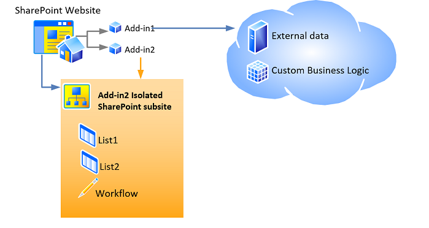

# Host webs, add-in webs, and SharePoint components in SharePoint
Learn about the distinction between host webs and add-in webs. Also find out which SharePoint components can be included in a SharePoint Add-in, which are deployed to the host web, which are deployed to the add-in web, and how the add-in web is deployed in an isolated domain.
 

 **Note**  The name "apps for SharePoint" is changing to "SharePoint Add-ins". During the transition, the documentation and the UI of some SharePoint products and Visual Studio tools might still use the term "apps for SharePoint". For details, see  [New name for apps for Office and SharePoint](new-name-for-apps-for-sharepoint.md#bk_newname).
 


## Host webs, add-in webs, and the isolated domain
<a name="IsolatedDomain"> </a>

When an add-in that includes SharePoint components is installed on a website, it is listed on the  **Site Contents** page from which it can be launched. That listing, which is the launch point of the add-in, is the only required addition to the website, although certain other things can optionally be added, such as a custom action or an add-in part. For information about these options, see [Accessing the add-in from the UI](important-aspects-of-the-sharepoint-add-in-architecture-and-development-landscap.md#AccessingApp). Other than these UI elements, the SharePoint Add-in components and content, such as lists, content types, workflows, and pages, are deployed to a different website in a special isolated domain. This fact is largely hidden from the user. The special website to which the add-in is  *deployed*  is called anadd-in web. The website to which the add-in is  *installed*  is called thehost web. Although the add-in web has its own isolated domain, it is in the same site collection as the host web. (One exception to this rule is when the add-in is installed with tenant scope. In that scenario, the add-in web is in the site collection of the corporate add-in catalog.) 
 

 
Figure 1 shows a host web with two SharePoint Add-ins installed. Add-in 1 has remote components, but no SharePoint components, so it has no add-in web. Add-in 2 has no remote components, but it has two SharePoint lists and a workflow. These have been deployed to an isolated subsite. (a SharePoint Add-in can have both remote and SharePoint-hosted components, although neither add-in in this diagram has both.)
 

 

**Figure 1: Host web with a provider-hosted add-in and a SharePoint-hosted add-in**

 

 

 
For example, suppose that an add-in, with SharePoint components beyond just the UI elements that can be deployed to a host web, is installed on a host website at the following URL:
 

 
 `https://www.fabrikam.com/sites/Marketing`
 

 
The SharePoint Add-in will be deployed to a newly created website with a URL like the following:
 

 
 `http://add-in-bdf2016ea7dacb.fabrikamadd-ins.com/sites/Marketing/Scheduler`
 

 
Note that this URL has the following structure:
 

 
 `https://` _Add-in_Prefix_ `-` _Add-in_ID_ `.` _Add-in_Base_Domain_ `/` _Domain_Relative_URL_of_Host_Web_ `/` _Add-in_Name_
 

 
The placeholders are defined as follows:
 

 

 

-  _Add-in_Prefix_ is any string set by the farm administrator in Central Administration. The default is "default." In this example the administrator has changed this to "add-in."
    
 
-  _Add-in_ID_ is a hexadecimal number generated internally when the add-in is installed.
    
 
-  _Add-in_Base_Domain_ is any string set by the farm administrator in Central Administration or with SharePoint Management Shell. This should *not*  be set to a subdomain of the SharePoint web application or the purpose of add-in isolation is largely defeated. In this example, the administrator has removed the "www." and added "add-ins" to the company name. So `fabrikamadd-ins.com` is the add-in base domain.
    
 
-  _Domain_Relative_URL_of_Host_Web_ is the relative URL of the parent host web, in this case `sites/Marketing`.
    
 
-  _Add-in_Name_ is the value of the **Name** attribute of the **App** element in the appmanifest.xml file.
    
 
There are two primary reasons why SharePoint components are deployed to add-in webs, rather than the host web. Both are related to security.
 

 

 

-  **Enforcement of add-in permissions:** In the model for SharePoint Add-ins, an add-in has its own identity and it has permissions that are not necessarily the same as the permissions of the user who is executing the add-in. These add-in permissions are requested when the add-in is installed and granted by the person who installs the add-in, as long as person has all the permissions that the add-in requests. (If the user who is installing the add-in does not have all the permissions that are requested by the add-in, the user cannot install the add-in.) By giving each add-in its own domain, SharePoint can reliably identify requests made by the add-in and verify the permissions of the add-in. For more information about add-in permissions, see [Add-in permissions](important-aspects-of-the-sharepoint-add-in-architecture-and-development-landscap.md#AppPermissions).
    
 
-  **Cross-domain scripting security:** Modern browsers support a "same origin policy" with regard to JavaScript method calls. By deploying each SharePoint Add-in to its own domain, SharePoint takes advantage of the browser's same origin policy to ensure that JavaScript in the SharePoint Add-in cannot execute any JavaScript from any other domain, including the domain in which, from the end-user's perspective, the add-in is installed.
    
    SharePoint also provides a means of safely overcoming the limits of the policy. Among other things, this enables the remote components of a SharePoint Add-in to query data from any website in the common parent tenancy of the host and add-in webs. For more information, see  [Access SharePoint data from add-ins using the cross-domain library](access-sharepoint-data-from-add-ins-using-the-cross-domain-library.md).
    
 

## Types of SharePoint components that can be in a SharePoint Add-in
<a name="TypesOfSPComponentsInApps"> </a>

In general, a SharePoint Add-in can contain one or more of the components in the following list. With certain exceptions, these components must be deployed in  **Web**-scoped Features that are inside a SharePoint solution package (.wsp) file:
 

 

 **Note**   ***** The components that are marked with an asterisk (*) are discussed in more detail in the section [Caveats for deploying SharePoint components](#SpecialCases) later in this article.
 


- Features ( **Web**-scoped only)
    
 
- Custom actions (including shortcut menu items and ribbon customizations)*
    
 
- Remote event receivers*
    
 
- Markup that references Web Parts, including add-in parts, that are included in SharePoint (but not custom Web Parts)*
    
 
- Custom cascading style sheets (CSS) files for use by SharePoint pages
    
 
- Custom JavaScript files for use by SharePoint pages
    
 
- Modules (sets of files)
    
 
- Pages
    
 
- List templates
    
 
- List and library instances
    
 
- Custom list forms
    
 
- Custom list views
    
 
- Custom content types
    
 
- Fields (of field types that are built into SharePoint)
    
 
- Microsoft Business Connectivity Services (BCS) models ( **Web**-scoped only), external content types based on the model, and external lists that use the content types*
    
 
- Workflows*
    
 
- Property bags
    
 
- Web templates (but not site definitions)*
    
 
No other kind of SharePoint component can be deployed in a SharePoint Add-in. For more information about restrictions on what can be included in a SharePoint Add-in, see  [SharePoint Add-ins compared with SharePoint solutions](http://msdn.microsoft.com/library/0e9efadb-aaf2-4c0d-afd5-d6cf25c4e7a8%28Office.15%29.aspx).
 

 

## Caveats for deploying SharePoint components
<a name="SpecialCases"> </a>

The following are some caveats and details concerning the deployment of certain kinds of SharePoint components in an add-in: 
 

 

-  **Custom actions:** In addition to adding custom actions to the add-in web, you can add them to the host web as well. To add the custom action to the add-in web, you include it in a **Web**-scoped Feature that is inside a .wsp file, just as you would include any other component you add to the add-in web. To add a custom action to the host web, you can include (even in an externally based add-in)  **CustomAction** markup in a Feature that is in the add-in package but outside any .wsp file. Components in such a "loose" Feature apply to the host web, not the add-in web, so this type of Feature is called ahost web Feature. 
    
 
-  **Web Parts:** One kind of Web Part, an add-in part, can be deployed in an add-in, and an add-in part can go to either the add-in web or the host web. All other types of Web Parts can be referenced in add-ins, but not deployed by them. If an add-in part is deployed to the host web, it should be included in a host web Feature.
    
 
-  **Remote event receivers:** These are new in SharePoint. They resemble classic SharePoint event receivers except that the code runs in the cloud. These are not available in a SharePoint-hosted add-in.
    
 
-  **Workflows:** Workflows in SharePoint use the Microsoft Azure-hosted workflow runtime that is new in SharePoint. Coded workflows that use the SharePoint-hosted workflow runtime cannot be included in a SharePoint Add-in. Only declarative workflows or workflows that use the newer runtime are allowed.
    
 
-  **Microsoft Business Connectivity Services (BCS) models, external content types, and external lists:**Business Data Connectivity (BDC) service models typically have a scope that is wider than a site collection. However, when a Business Data Connectivity (BDC) service model is deployed in an add-in, its scope is limited to the add-in web. When a Business Data Connectivity (BDC) service model is included in an add-in, it is not stored in the Business Data Connectivity (BDC) service shared service store. Instead, it is stored as a file in the add-in web.
    
 
-  **Web Templates:** In most cases, you will want the add-in web to instantiate the new built-in site definition configuration **APP#0**, which is optimized for add-in webs. (For more information about it, see  [Accessing the add-in from the UI](important-aspects-of-the-sharepoint-add-in-architecture-and-development-landscap.md#AccessingApp).) SharePoint automatically uses  **APP#0** when the add-in package does not include a [WebTemplate](http://msdn.microsoft.com/library/ff4ba91a-cc5f-47ff-9101-a7651f452185%28Office.15%29.aspx) element.
    
    You can also define a custom site type for the add-in web. There are two major steps to doing this:
    
      - Include a custom  [WebTemplate Element (Web Template)](http://msdn.microsoft.com/library/ff4ba91a-cc5f-47ff-9101-a7651f452185%28Office.15%29.aspx), an onet.xml file, and possibly other associated files, in the add-in web Feature for your add-in. Deploy the web template in the Web-scoped Feature in a .wsp file inside the add-in package as usual.
    
 
  - Add a  [WebTemplate element (PropertiesDefinition complexType) (SharePoint Add-in Manifest)](http://msdn.microsoft.com/library/62302903-e97a-a9a3-a64e-13176a7c4e1e%28Office.15%29.aspx) to the add-in manifest as a child of the **Properties** element and set its **Id** attribute to the GUID of the add-in web Feature and the value of the **Name** attribute of the [WebTemplate Element (Web Template)](http://msdn.microsoft.com/library/ff4ba91a-cc5f-47ff-9101-a7651f452185%28Office.15%29.aspx). Note that GUID must be hyphenated and wrapped in braces "{}", and the GUID and template name are separated by the "#" character. The following is an example:
    
```XML
  <WebTemplate Id="{81dd4ae5-873b-4759-9838-4ad9c3dd2952}#NewSiteType" />
```


     **Note**  The new  [WebTemplate](http://msdn.microsoft.com/library/62302903-e97a-a9a3-a64e-13176a7c4e1e%28Office.15%29.aspx) element for add-in manifests is not the same markup as the [WebTemplate](http://msdn.microsoft.com/library/ff4ba91a-cc5f-47ff-9101-a7651f452185%28Office.15%29.aspx) element that can be included in Features. The **WebTemplate** element that can be included in Features defines a type of site, but the **WebTemplate** element for add-in manifests simply identifies what type of site to use. For more information about the add-in manifest of a SharePoint Add-in, see [Add-in package structure](important-aspects-of-the-sharepoint-add-in-architecture-and-development-landscap.md#SPAppModelArch_Package).

     **Caution**  Do not use the  **WebTemplate** element in the add-in manifest to designate any of the built-in SharePoint site definition configurations as the add-in web's site type. We do not support using any of the built-in site definition configurations, other than **APP#0**, for add-in webs. 

    For more information about site definition configurations and web templates, see  [Working with Site Templates and Definitions](http://msdn.microsoft.com/library/1edf6d4d-eddb-4cb5-9034-ed394e8a3e01%28Office.15%29.aspx).
    
 

## Additional resources
<a name="SP15hostedwebs_bk_addlresources"> </a>


-  [Important aspects of the SharePoint Add-in architecture and development landscape](important-aspects-of-the-sharepoint-add-in-architecture-and-development-landscap.md)
    
 
-  [SharePoint Add-ins compared with SharePoint solutions](http://msdn.microsoft.com/library/0e9efadb-aaf2-4c0d-afd5-d6cf25c4e7a8%28Office.15%29.aspx)
    
 

 

 

