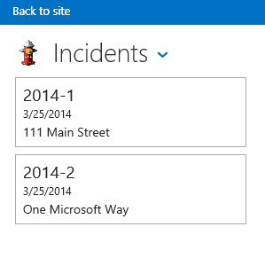

# Incident Manager: A cloud business add-in tutorial

By using the Cloud Business Add-in template in Visual Studio, you can create a SharePoint hosted add-in in which mobile users can view, add, and update data from remote locations by using modern, touch-oriented devices such as phones and tablets. In this tutorial, you'll create an add-in for a fictional Contoso Fire Department to handle on-scene incident management. The walkthrough covers the core concepts of building a cloud business add-in as well as more advanced concepts such as integrating SharePoint lists and document libraries.
 
You can [download the Incident Manager sample application and associated files from the MSDN Samples Gallery](https://code.msdn.microsoft.com/Incident-Manager-A-Cloud-c32d9b04).

## Prerequisites

This walkthrough requires Visual Studio 2013 Update 1 and Microsoft Developer Tools for Visual Studio 2013 - March 2014 Update.

To host the add-in, you'll also need a SharePoint Developer site on Office 365, which you can get from the [Sign up for an Office 365 Developer Site](set-up-a-development-environment-for-sharepoint-add-ins-on-office-365.md#sign-up-for-an-office-365-developer-site).
 
> [!NOTE]
> You can also host a cloud business add-in on a SharePoint site.

<a name="add-in"> </a>
## Create the Incident Manager add-in

The Contoso Fire Department responds to fires, medical aid emergencies, motor vehicle accidents, and other emergencies. Each emergency incident requires considerable paperwork to document the incident. They currently enter information by using paper forms on-scene, and then enter the information into their computer system when they return to the firehouse. They have recently adopted SharePoint for Office 365 for records management, and they have purchased tablets to enable the Incident Commander to enter data on-scene.

You will build the mobile add-in that is used to enter basic information about the incident. Because many incidents also involve medical aid, the add-in also needs to be able to enter data for multiple patients per incident. In this section, you will build the basic application, learning the fundamentals of cloud business add-ins along the way.

### To create a project

1. On the menu bar, select **File** > **New** > **Project**.
    
   The **New Project** dialog box opens.

2. In the list of templates, expand the **Visual Basic** or **Visual C#** node, expand the **Office/SharePoint** node, select the **Add-ins** node, and then select the **Cloud Business Add-in** template, as shown in Figure 1.
    
   *Figure 1. Cloud Business Add-in template*

   

3. In the **Name** box, enter **IncidentManager**, and then select **OK**.
    
   The New Cloud Business Add-in Wizard opens.
    
 
4. In the  **New Cloud Business Add-in** wizard, enter the URL for your Office 365 Developer site, and then select **Finish**.
    
    The URL should take the form https://  _MySite_.sharepoint.com/sites/Developer/.
    
    A  **IncidentManager** solution is added to Solution Explorer with four projects: a top-level **IncidentManager** project, a **IncidentManager.HTMLClient** project, a **IncidentManager.Server** project, and a **IncidentManager.SharePoint** project.
    
    
 

    
    In the next step, you'll add an entity to represent a collection of incidents. The entity creates a SQL Server database table that is intrinsic to the add-in. It will store information about each incident.
    
 

### To add the Incident entity


1. On the  **Start** screen, select the **Create New Table** link.
    
    The entity designer opens.
    
 
2. In the  **Properties** window, in the text box for the **Name** property, enterIncident.
    
 
3. In the entity designer, select the  **<Add Property>** link and enterIncidentNumber.
    
 
4. Select the Enter key, accepting the default **Type**,  **String**, and leaving the  **Required** checkbox selected.
    
 
5. In the  **Properties** window, select the **Include in Unique Index** check box.
    
    The incident number must be unique for each incident.
    
 
6. Select the  **<Add Property>** link and enterIncidentDate, and then select the **Tab** key.
    
 
7. In the  **Type** column, select **Date**, and then select the Tab key twice.
    
 
8. In the  **Name** column enterDispatchTime, and in the  **Type** column select the **DateTime** data type.
    
 
9. In the next row enter IncidentType and select **Integer** as the data type.
    
 
10. In the next row enter IncidentAddress and select **String** as the data type.
    
 
11. In the next row enter ReportingPartyName and select **String** as the data type, and then clear the **Required** check box.
    
    Sometimes incidents are reported anonymously, so you don't want to require a value in this field.
    
 
12. In the next row enter ReportingPhone and select the **PhoneNumber** data type.
    
     **Phone Number** is acustom business type that automatically formats and provides validation for telephone numbers.
    
 
13. In the  **Properties** window, select the **Phone Number Formats** hyperlink.
    
    The  **Phone Number Formats** dialog box opens.
    
 
14. In the  **Phone Number Formats** dialog box, select the appropriate format for your locale, and then select the **Move Up** button to move it to the top of the list.
    
 
15. In the  **Test Phone Number Validation** text box, enter a phone number and verify that it's properly formatted, and then select the **Save** button.
    
    The  **Phone Number** business type handles formatting and validation for you on any screen where it appears.
    
 
16. In the next row enter IncidentCommander and select the **Person** data type.
    
    The  **Person** business type provides a connection to the SharePoint User Profile Service, which pulls user information from Active Directory.
    
    Figure 2 shows the finished entity.
   
    *Figure 2. The Incidents entity*

    
 
    In the next step, you'll add a choice list that allows the user to select from a fixed set of values. In this case, the fire department has a set of common incident types.

### To add a list of choices


1. In the entity designer, select the  **IncidentType** field, and then in the **Properties** window select the **Choice List** hyperlink.
    
    The  **Choice List** dialog box opens.
    
 
2. In the  **Choice List** dialog box, select the **Add Value** link and enter1.
    
 
3. In the  **Display Name** column, enter **Fire - Commercial**.
    
 
4. Enter the following values and display names, and then select the  **OK** button.
    

|**Value**|**Display Name**|
|:-----|:-----|
|2|Fire - Residential|
|3|Fire - Single Engine Response|
|4| Aid - Advanced Life Support|
|5| Aid - Basic Life Support|
|6|Motor Vehicle Collision|
|7|Service Call|
|||

At run time, a list of the display names will be presented to the user. When they make a choice, the corresponding  **Integer** value will be stored in the database.
    
In the next step, you'll add a Patient entity. Many of the fire department's incidents involve medical aid, and a single incident often involves multiple patients.
    
 

### To add the Patient entity


1. In  **Solution Explorer**, open the shortcut menu for the  **Data Sources** node and select **Add Table**.
    
 
2. In the  **Properties** window, in the text box for the **Name** property, enterPatient.
    
 
3. In the entity designer, add the following fields as shown in Figure 3:
    
    *Figure 3. The finished Patient entity*

  
 

    
 

    
    In the next step, you'll define a relationship between the Incident and Patient entities. An incident can have multiple related patients.
    
 

### To define a relationship


1. In  **Solution Explorer**, open the shortcut menu for the  **Incidents.lsml** node and select **Open**.
    
 
2. On the toolbar, select the  **Relationship** button.
    
    The  **Add New Relationship** dialog box appears.
    
 
3. In the  **Add New Relationship** dialog box, in the **To** column of the **Name** row, select **Patient**.
    
 
4. In the  **Multiplicity** row, in the **From** column select **Zero or one**.
    
 
5. In the  **To** column, select **Many**, and then select the  **OK** button.
    
    Figure 4 shows the relationship.
    

    *Figure 4. Incidents and Patients relationship*

  
 

    This creates a zero or one to many relationship between incidents and patients. An incident record doesn't have to have a patient, but every patient has to have a related incident record.
    
    
 

    
    In the next step, you'll add screens to view, add, and edit both Patient and Incident records.
    
 

### To add screens


1. In  **Solution Explorer**, open the shortcut menu for the  **Incidents.lsml** node and select **Open**.
    
 
2. In the screen designer, on the  **Perspective** bar, select the **HTML Client** tab, and then on the toolbar select the **Screen** button.
    
    The  **Add New Screen** dialog box opens.
    
 
3. In the  **Add New Screen** dialog box, in the **Select a screen template** list, select **Common Screen Set**.
    
 
4. In the  **Screen Set Name** text box, enterIncidents.
    
 
5. In the  **Screen Data** list, select **Incidents**.
    
 
6. Select both the  **Incident Details** and **Incident Patients** check boxes, and then select **OK**.
    
    Figure 5 shows the Add New Screen dialog.
    

    *Figure 5. Add New Screen dialog*

  
 

    Browse, View Details, and Add/Edit screens are added to the HTMLClient project. The Browse screen is automatically set as the home screen for the application, and the necessary commands for launching the View and Add/Edit screens are automatically provided.
    
 
7. On the menu bar, select  **Debug**,  **Start Debugging** to run the application. If the **Connect to SharePoint** dialog box appears, enter your user name and password.
    
 
8. If prompted, select the  **Trust It** button. The add-in will open with a blank screen. Notice that the screen title is **IncidentsSet**.
    
 
9. select the  **Add** button.
    
    The  **Incidents** dialog box opens. Notice that while you can enter incident data, there's no provision for adding patients. You'll fix that and other design issues by customizing the screens.
    
    
 

    
    In the next step, you'll customize the Browse screen.
    
 
10. Close the  **Incident** dialog box, and then close the browser window to return to design mode.
    
 

### To customize the browse screen


1. In  **Solution Explorer** screen, open the shortcut menu for the **BrowseIncidentsSet.lsml** node and select **Open**.
    
 
2. In the  **Properties** window, select the **Display Name** property and enterIncidents.
    
 
3. In the screen designer, select the  **Rows Layout | rows** node, and then expand the **Add** list and select **Incident Address**.
    
 
4. select the  **Dispatch Time** node, and then on the toolbar select the **Delete** button.
    
    Figure 6 shows the finished screen layout.
    

    *Figure 6. Browse screen layout*

  
 

    At run time the screen will display a tile for each incident, and each tile will display the incident number, date, and address.
    
    
 

    
    In the next step, you'll customize the Add/Edit screen.
    
 

### To customize the add/edit screen


1. In  **Solution Explorer** screen, open the shortcut menu for the **AddEditIncidents.lsml** node and select **Open**.
    
 
2. select the  **Incident Address**,  **Reporting Party Name**, and  **Reporting Phone** nodes and drag them to the **Rows Layout | left** section, below the **Incident Type** node.
    
 
3. select the  **Dispatch Time** node, and in the **Properties** window clear the **Date Picker Enabled** check box.
    
    The date isn't needed since it will always be the same as the incident date.
    
 
4. In the left pane of the screen designer, select the  **Add Patients** link, as shown in figure 7.
    
    *Figure 7. Add Patients link*

  
 

 

 
5. In the left pane, select the  **Patients** node and drag it under the **Incident Commander** node in the center pane.
    
    Figure 8 shows the finished screen layout.
    

    *Figure 8. The Add/Edit screen layout*

  
 

    
 

    
    In the next step, you'll create a screen to add patient records.
    
 

### To add a Patients screen


1. In  **Solution Explorer** screen, open the shortcut menu for the **AddEditIncidents.lsml** node and select **Open**.
    
 
2. In the screen designer, under the  **Rows Layout | Details (Tab)** node, open the shortcut menu for the **Command Bar** node and select **Add Button**.
    
 
3. In the  **Add Button** dialog box, expand the **showTab** list and in the **Patients** group select **addAndEditNew**, and then select **OK**.
    
    The  **Add New Screen** dialog box opens.
    
 
4. In the  **Add New Screen** dialog box, accept the default values and select **OK**.
    
    The  **AddEditPatient** screen opens in the screen designer.
    
 
5. In the Properties window, select the  **Display Name** property and enterAdd Patient.
    
 
6. In the screen designer, select the  **Incident** node and delete it.
    
    The  **Incidents** field isn't needed since the patient is already associated with an incident.
    
    Figure 9 shows the finished screen layout.
    

    *Figure 9. The Add/Edit screen layout*

  
 

    
 

    
    In the next step, you'll run the add-in and add some data.
    
 

### To test the add-in


1. On the menu bar, select  **Debug**,  **Start Debugging**.
    
 
2. In the running add-in, select the  **Add** button.
    
    The  **Incidents** Popup opens, as shown in figure 10.
    

    *Figure 10. The Incidents Popup*

  
 

 

 
3. In the  **Incident Number** text box, enter2014-1.
    
 
4. In the  **Incident Date** and **Dispatch Time** fields, use the **Date Picker** and **Time Picker** controls to select a date and time.
    
 
5. In the  **Incident Type** list, select **Aid - Basic Life Support**.
    
 
6. In the  **Incident Address** text box, enter a street address in your city.
    
     Don't include city, state, or postal code. It's assumed that the fire department only serves one city.
    
 
7. In the  **Incident Commander** **Person Picker** control, enter the name of a user on your SharePoint site.
    
    Notice that as you type a list of all matching names is displayed.
    
 
8. select the  **Add Patient** button.
    
    The  **Add Patient** Popup opens, as shown in Figure 11.
    

    *Figure 11. The Add Patient Popup*

  
 

 

 
9. Enter information for a patient, and then select the  **Save** button.
    
    The name of the patient that you added is displayed on the  **Incidents** Popup. If you want, you can add more patients.
    
 
10. On the  **Incidents** Popup, select the **Save** button.
    
    If you were following instructions, you will see a validation error message. The  **Reporting Phone** field is a required field. Cloud business add-ins have built-in validation for required fields.
    
 
11. Enter a phone number and then select the  **Save** button again.
    
    A tile is displayed on the home  **Incidents** screen with the incident number, date, and address.
    
 
12. select the tile to open the View screen for the incident.
    
    Notice that the  **Reporting Phone** field is displayed as a hyperlink, providing direct access to your default phone application.
    
 
13. select the  **Edit** button to open the **AddEditIncidents** screen, and the select the **Discard** button to return to the **View** screen.
    
 
14. select the  **Patients** tab to display a list of patients, and then select a patient tile.
    
    Notice that it doesn't open a view screen for the patient. That's because you haven't created one yet.
    
 
15. select the  **Close** button in your browser to return to design mode.
    
    
 

    
    In the next step, you'll add a screen to view patients.
    
 

### To add a view screen


1. In  **Solution Explorer** screen, open the shortcut menu for the **Patients.lsml** node and select **Open**.
    
 
2. In the entity designer, on the  **Perspective** bar, select **HTMLClient**, and then on the toolbar select the  **Screen** button.
    
    The  **Add New Screen** dialog box opens.
    
 
3. In the  **Add New Screen** dialog box, in the **Select a screen template** list, select **View Details Screen**.
    
 
4. In the  **Screen Name** text box, enter **ViewPatient**, select  **Patient** in the **Screen Data** list, and then select **OK**.
    
    The  **ViewPatient** screen opens in the screen designer.
    
 
5. In the screen designer, under the  **Rows Layout | Details (Tab)** node, open the shortcut menu for the **Command Bar** node and select **Add Button**.
    
 
6. In the  **Add Button** dialog box, expand the **showTab** list and in the **Patient** group select **Edit**, and then select the  **OK** button.
    
 
7. Run the application and verify that you can now view and edit patient records.
    
    
 

    
    You have now built a fully functional incident management add-in, but there's much more you can do with cloud business add-ins. In the next section, you'll learn how to utilize resources on the SharePoint site from the incident management add-in.
    
 

## Integrate SharePoint Resources
<a name="integrate"> </a>

The Contoso Fire Department has started using the Incident Manager add-in, and as is typical in software development projects they are now requesting a new feature. In addition to incident and patient information, they also need to manage resources such as fire apparatus and personnel. They already have lists of apparatus and personnel on their SharePoint site, so you will utilize those lists as another data source for the add-in.
 

 
The first step is to add a couple of pre-populated list templates to your developer site.
 

 

### To add list templates


1. On the menu bar, select **Debug**,  **Start Debugging** to run the add-in.
    
 
2. In the running add-in, on the chrome bar, select **Back to site** link to navigate to your SharePoint developer site, as shown in Figure 12.
    
    *Figure 12. The Back to site link*

  
 

 

 
3. On the  **Developer** page, select the **Site Contents** link.
    
 
4. On the  **Site Contents** page, select the **Settings** link, as shown in Figure 13.
    
    *Figure 13. The Settings link*

  
 

 

 
5. On the  **Site Settings** page, in the **Web Designer Galleries** list, select the **List templates** link as shown in Figure 14.
    
    *Figure 14. The List templates link*

  
 

 

 
6. On the  **List Template Gallery** page, select the **FILES** tab, and then on the ribbon select the **Upload Document** button.
    
 
7. In the  **Add a template** dialog box, select the **Browse** button and then navigate to the **Resources** folder for the downloaded Incident Manager sample.
    
 
8. select the  **ContosoApparatus.stp** file and select the **Open** button, and then select **OK**.
    
 
9. In the  **List Template Gallery** dialog box, select the **Save** button.
    
 
10. Repeat the process and upload the  **ContosoPersonnel.stp** file.
    
    *Figure 15. The uploaded files*

  
 

 

 
11. select the  **Site Contents** link, and on the **Site Contents** page select the **add an add-in** tile.
    
 
12. On the  **Site Contents > Your Add-ins** page, select the **Contoso Apparatus** tile.
    
     **Note**  You may need to go to the second page of add-ins to find the  **Contoso Apparatus** tile.
13. In the  **Adding Custom List** dialog box, select the **Name** text box and enterContoso Apparatus, and then select the  **Create** button.
    
 
14. Repeat the process and add the  **Contoso Personnel** list, enteringContoso Personnel as the name.
    
 
15. On the  **Site Contents** page, verify that the **Contoso Apparatus** and **Contoso Personnel** lists now appear.
    
    
 

    
    In the next step, you'll add your SharePoint site as a data source.
    
 

### To add a SharePoint data source


1. In  **Solution Explorer**, open the shortcut menu for the  **Data Sources** node and select **Add Data Source**.
    
    The  **Attach Data Source Wizard** opens.
    
 
2. In the  **Attach Data Source Wizard**, select the  **SharePoint** icon as shown in Figure 16, and then select the **Next** button.
    
    *Figure 16. SharePoint data source*

  
 

 

 
3. On the  **Enter Connection Information** page, verify that the URL for your SharePoint developer site is correct, and then select the **Next** button.
    
 
4. On the  **Choose your SharePoint Items** page, select the check boxes for the **ContosoApparatus** and **ContosoPersonnel** lists as shown in Figure 17, and then select the **Finish** button.
    
    *Figure 17. The selected lists*

  
 

    The entities are added to a new  **Developer Data** node under the **Data Sources** node in **Solution Explorer**, and the  **ContosoApparatus** entity opens in the entity designer.
    
    
     **Note**  You may have noticed that a  **UserInformationLists** entity was also added. This list is used by SharePoint to manage the **CreatedBy** and **ModifiedBy** fields for lists.
5. In the  **Properties** window, select the **Display Name** property and change it toApparatus.
    
    
 

    
    In the next step, you'll define a query to limit the data returned from the  **ApparatusSet** entity. In this case, you only want to see apparatus that are in service.
    
 

### To define the AvailableApparatus query


1. In  **Solution Explorer**, open the shortcut menu for the  **ApparatusSet.lsml** node and select **Add Query**.
    
    The query designer opens.
    
 
2. In the  **Properties** window, select the **Name** property and enterAvailableApparatus.
    
 
3. In the query designer, select the  **Add Filter** link, and in the second drop-down list select **Available**.
    
 
4. In the last text box, change  **False** to **True**.
    
    Figure 18 shows the query.
    

    *Figure 18. The AvailableApparatus query*

  
 

    
 

    
    In the next step, you'll define another query for the  **ContosoPersonnel** entity. In this case, you only want to see personnel that are assigned to the "A" shift.
    
 

### To define the AvailablePersonnel query


1. In  **Solution Explorer**, open the shortcut menu for the  **ContosoPersonnels.lsml** node and select **Add Query**.
    
    The query designer opens.
    
 
2. In the  **Properties** window, select the **Name** property and enterAvailablePersonnel.
    
 
3. In the query designer, select the  **Add Filter** link, and in the second drop-down list select **Shift**.
    
 
4. In the last text box, enter  **A**.
    
    Figure 19 shows the query.
    

    *Figure 19. The AvailablePersonnel query*

  
 

    
 

    
    In the next step, you'll add lists of available apparatus and personnel to the  **ViewIncidents** screen.
    
 

### To add queries to the screen


1. In  **Solution Explorer**, open the shortcut menu for the  **ViewIncidents.lsml** node and select **Open**.
    
 
2. In the screen designer, open the shortcut menu for the  **Tab** node and select **Add Tab**.
    
 
3. In the  **Properties** window, change the **Name** property toResources.
    
 
4. In the screen designer, on the toolbar, select  **Add Data Item**.
    
    The  **Add Data Item** dialog box opens.
    
 
5. In the  **Add Data Item** dialog box, select the **Query** option button.
    
 
6. In the list, select **DeveloperData.AvailableApparatus** as shown in Figure 20, and then select **OK**.
    
    *Figure 20. The AvailableApparatus query*

  
 

    The  **AvailableApparatus** collection is added to the left pane of the screen designer.
    
 
7. Repeat the process to add the  **AvailablePersonnel** query to the screen.
    
 
8. Under the  **Rows Layout | Resources** node, open the **Add** list and select **Available Apparatus**.
    
 
9. select the  **List | Available Apparatus** node, open the **List** list and select **Tile List**.
    
 
10. Delete all of the items under the  **Rows Layout | Contoso Apparatus** node except for **Apparatus Number** and **Apparatus Type**.
    
 
11. Under the  **Rows Layout | Resources** node, open the **Add** list and select **Available Personnel**.
    
 
12. select the  **List | Available Personnel** node, open the **List** list and select **Table**.
    
 
13. Delete all of the items under the  **Table Row | Contoso Personnel** node except for **Name**,  **Rank**, and  **Assignment**.
    
    Figure 21 shows the screen layout.
    

    *Figure 21. The screen layout*

  
 

 

 
14. Run the add-in and observe the changes. select an incident, and then select the  **Resources** tab to see a list of available resources.
    
    
 

    
    The changes are now complete. In the next section, you'll learn how add and associate a SharePoint document library with add-in.
    
 

## Associate a Document Library
<a name="associate"> </a>

On the scene of an incident the Incident Commander has to document many things, some using existing forms and some ad-hoc. The documents created on-scene must be accessible later, and they Must be organized by incident for easy retrieval. For the Incident Manager add-in, you can utilize the custom document library feature in SharePoint to associate documents with each incident.
 

 

### To add a document library to the SharePoint site


1. On the menu bar, select  **Debug**,  **Start Debugging** to run the add-in.
    
 
2. In the running add-in, on the chrome bar, select **Back to site** link as shown in Figure 22 to navigate to your SharePoint developer site.
    
    *Figure 22. The Back to site link*

  
 

 

 
3. On the  **Developer** page, select the **Site Contents** link.
    
 
4. On the  **Site Contents** page, select the **add an add-in** tile.
    
 
5. On the  **Site Contents > Your Add-ins** page, select the **Document Library** tile.
    
 
6. In the  **Adding Document Library** dialog box, in the **Name** text box enterIncident Documents, and then select the  **Create** button.
    
 
7. On the  **Site Contents** page, select the **Incident Documents** tile to open the library, and then select the **LIBRARY** tab.
    
 
8. On the  **Ribbon**, select the  **Create Column** button.
    
 
9. In the  **Create Column** dialog box, in the **Column name** text box enterIncidentNumber, and then select the  **OK** button.
    
    Figure 23 shows the newly added column.
    

    *Figure 23. The Incident Documents document library*

  
 

    In order to associate the document library with your add-in, the document library must contain a custom column that maps to a unique field in your entity. In this case the  **IncidentNumber** column maps to the **IncidentNumber** field in the **Incidents** entity.
    
    
 

    
    In the next step, you'll add the document library to your add-in.
    
 

### To add a document library to a project


1. In  **Solution Explorer**, open the shortcut menu for the  **Developer Data** node and select **Update Data Source**.
    
 
2. On the  **Choose your SharePoint Items** page, in the left pane, select the **Document Libraries** list item, and in the right pane, select the **IncidentDocuments** checkbox as shown in Figure 24, and then select the **Finish** button.
    
    *Figure 24. The IncidentDocuments entity*

  
 

    An  **IncidentDocuments.lsml** node is added to Solution Explorer.
    
    
 

    
    In the next step, you'll create a relationship between the document library and the Incidents entity..
    
 

### To create a relationship across data sources


1. In  **Solution Explorer**, open the shortcut menu for the  **IncidentDocuments.lsml** node and select **Open**.
    
 
2. In the entity designer, on the  **Perspective** bar select **Server**, and then on the toolbar select **Relationship**.
    
 
3. In the  **Add New Relationship** dialog box, in the **To** dropdown list, select **Incident** as shown in Figure 25.
    
    *Figure 25. The Add New Relationship dialog box*

  
 

 

 
4. In the  **Foreign** key dropdown list, select the **IncidentNumber (String)** field from the **IncidentDocuments** entity.
    
 
5. In the  **Primary** key dropdown list, select the **IncidentNumber (String)** field from the **Incidents** entity, and then select **OK**.
    
    Figure 26 shows the Foreign and Primary keys.
    

    *Figure 26. Foreign and primary keys*

  
 

    
 

    
    In the next step, you'll add the document library to the  **ViewIncidents** screen.
    
 

### To add a document library to a screen


1. In  **Solution Explorer**, open the shortcut menu for the  **ViewIncidents.lsml** node and select **Open**.
    
 
2. In the screen designer, open the shortcut menu for the  **Tab** node and select **Add Tab**.
    
 
3. In the  **Properties** window, change the **Name** property toDocuments.
    
 
4. In the screen designer, in the left pane, select the  **Add IncidentDocuments** link.
    
 
5. In the center pane, under the  **Rows Layout | Documents** node, open the **Add** list and select **Incident Documents**.
    
 
6. Under the  **Rows Layout | Documents** node, open the shortcut menu for the **Command Bar** node and select **Add Button**.
    
 
7. In the  **Add Button** dialog box, expand the **showTab** list and in the **IncidentDocuments** group select**createOrUploadDocument** as shown in Figure 27, and then select **OK**.
    
    *Figure 27. The Add Button dialog box*

  
 

 

 
8. In the  **Properties** window, select the **Display Name** property and enterAdd Document.
    
 
9. Expand the  **Icon** property list and select **Attachment**.
    
 
10. On the menu bar, select  **Debug**,  **Start Debugging** to run the add-in.
    
 
11. select an incident, select the  **Documents** tab, and then select the **Add Document** button.
    
    The SharePoint  **Create a new file** dialog box opens, as shown in Figure 28.
    

    *Figure 28. The Create a new file dialog box*

  
 

 

 
12. select the  **UPLOAD EXISTING FILE** link and select any file to upload, and then select the **Open** button.
    
    The file is added to the  **Documents** tab.
    
     **Tip**  If you select an Office document, you can view it in the add-in.
13. select the Add Document button, and in the  **Create a new file** dialog box, select **Word document**.
    
    A new Word document opens in  **Word Online**.
    
 
14. On the title bar, select the  **Document** name field as shown in Figure 29 and enterIncident Report.
    
    *Figure 29. The Document name field*

  
 

    This will be used as the file name for the document.
    
    
     **Note**  If you don't enter a file name, it will be saved with the default name  **Document.docx**. Once saved, the file name can only be changed by accessing it in the document library in SharePoint.
15. select the back button in your browser to return to the add-in. The  **Incident Report** document should appear on the **Documents** tab.
    
 
16. select the  **Close** button in your browser to return to design mode.
    
    
 

    
    In the next section, you'll customize the add-in and add some JavaScript code.
    
 

## Customize the Add-in
<a name="custom"> </a>

The Contoso Fire Department is pleased with the additions to the Incident Manager add-in, but there are few more "fit and finish" items on their list. They want to display their logo on the screens instead of the default icon. They don't like the  **FlipSwitch** control for **Insured** field on the **AddEditPatient** screen and want it replaced with a check box. Finally, since not all incidents have patients, they don't want the **Patients** tab on the **ViewIncidents** screen at appear if there aren't any patients.
 

 

### To display a custom logo


1. In  **Solution Explorer**, in the  **IncidentManager.HtmlClient** project, expand the **Content** and **Images** nodes.
    
 
2. select the  **user-logo.png** and **user-splash-screen.png** files as shown in Figure 30 and delete them.
    
    *Figure 30. The files to delete*

  
 

 

 
3. Open the shortcut menu for the  **Images** node, select **Add**,  **Existing Item**.
    
 
4. In the  **Add Existing Item** dialog box, select the **Browse** button and then navigate to the **Resources** folder for the downloaded Incident Manager sample.
    
 
5. select the  **user-logo.png** and **user-splash-screen.png** files, and then select the **Add** button.
    
    The new images will be displayed on the title bar of the add-in and in the splash screen shown when the add-in is loading.
    
    
 

    
    In the next step, you'll replace the  **FlipSwitch** control with a checkbox.
    
 

### To replace the FlipSwitch control


1. In  **Solution Explorer**, open the shortcut menu for the  **AddEditPatient.lsml** screen node and select **Open**.
    
 
2. In the screen designer, expand the list for the  **Insured** node and select **Custom Control**.
    
 
3. In the  **Properties** window, select the **Edit Render Code** link.
    
 
4. In the Code Editor, add the following code to the  **Insured_render** method:
    
```
  // Create the checkbox and add it to the DOM.
    var checkbox = $("<input type='checkbox'/>")
            .css({
                height: 20,
                width: 20,
                margin: "10px"
            })
            .appendTo($(element));

    // Determine if the change was initiated by the user.
    var changingValue = false;

    checkbox.change(function () {
        changingValue = true;
        contentItem.value = checkbox[0].checked;
        changingValue = false;
    });
    contentItem.dataBind("value", function (newValue) {
        if (!changingValue) {
            checkbox[0].checked = newValue;
        }
    });
```


    This code creates a  **CheckBox** control when the screen is rendered. You'll also need to add code to set an initial value.
    
 
5. In  **Solution Explorer**, open the shortcut menu for the  **Patients.lsml** entity node and select **Open**.
    
 
6. In the entity designer, on the  **Perspective** bar, select the **HTMLClient** tab.
    
 
7. On the toolbar, expand the  **Write Code** list and select **created**.
    
 
8. In the Code Editor, add the following code to the  **created** method:
    
```
  entity.Insured = new Boolean();
    entity.Insured = 'true';
```


    This code sets the initial value of the control to checked (true) when the screen is created.
    
    
 

    
    In the next step, you'll add code to hide the  **Patients** tab if no patients exist.
    
 

### To conditionally hide a tab


1. In  **Solution Explorer**, open the shortcut menu for the  **ViewIncidents.lsml** screen node and select **Open**.
    
 
2. On the toolbar, open the  **Write Code** list and select **created**.
    
 
3. In the Code Editor, add the following code to the  **ViewIncidents_created** method:
    
```
  screen.getPatients().then(function (results) {
        var queryCount = results.count;
        if (queryCount == 0 ) {
            screen.findContentItem("Patients").isVisible = false;
        }
    });
```


    This code runs the  **GetPatients** query to get a count of **Patients**. If the result is zero, the  **findContentItem** method sets the **isVisible** property of the **Patients** tab to false, hiding it.
    
 
4. On the menu bar, select  **Debug**,  **Start Debugging** to run the add-in. Notice that the new logo appears on the screens. Open the first incident that you created earlier and edit a patient. Verify that the Insured field is now a checkbox. Add a new incident without any patients, and verify that the **Patients** tab is hidden on the view screen.
    
    
 

    
    In the final section, you'll publish the finished add-in to SharePoint.
    
 

## Publish to SharePoint
<a name="pub"> </a>

So far you've only run the add-in in Debug mode, which uses SharePoint to provide authentication and redirects to the local computer's instance of IIS Express. Next you'll publish the add-in as an auto-hosted SharePoint add-in, which will automatically provision space in Office 365 for both the add-in and an intrinsic database. Specifically, the add-in will be hosted in Microsoft Azure and the database in SQL Azure. After you publish your add-in, others can start it from SharePoint on their computers and mobile devices.
 

 

### To publish the add-in


1. On the Visual Studio toolbar, open the  **Debug** list and select **Release**.
    
 
2. In  **Solution Explorer**, open the shortcut menu for the  **IncidentManager** node as shown in Figure 31, and then select **Publish**.
    
    *Figure 31. The IncidentManager node*

  
 

    The  **LightSwitch Publish Application Wizard** appears.
    
 
3. On the  **SharePoint** options page, select the **Autohosted** option button as shown in Figure 32, and then select the **Publish** button.
    
    *Figure 32. The Autohosted option*

  
 

    When your add-in is published,  **File Explorer** appears and displays the **Publish** folder for your project.
    
 
4. In the browser, navigate to your SharePoint Developer site
    
 
5. In the  **Add-ins in Testing** list, select the ellipsis (???) link next to **IncidentManager**, and then select the  **Remove** link, as shown in Figure 33.
    
    *Figure 33. The Remove link*

  
 

 

 
6. select the  **new add-in to deploy** link.
    
 
7. In the  **Deploy Add-in** dialog box, select the **upload** link, as shown in Figure 34.
    
    *Figure 34. The upload link*

  
 

    The  **Upload Add-in** dialog box opens.
    
 
8. In the  **Upload Add-in** dialog box, select the **Browse** button and navigate to the **Publish** folder for your add-in and select the **IncidentManager.SharePoint.app** file, select the **Open** button, and then select **OK**.
    
    Once the file has been uploaded, the  **Deploy Add-in** dialog box opens.
    
 
9. In the  **Deploy Add-in** dialog box, select the **Deploy** button.
    
 
10. In the  **Upload Add-in** dialog box, select the **Trust It** button.
    
    The add-in will be installed on your SharePoint site. The process may take a few minutes.
    
    Figure 35 shows the Add-ins in Testing list as the add-in is installing.
    

    *Figure 35. The Add-ins in Testing list*

  
 

 

 
11. select the  **Site Contents** link.
    
    Figure 37 shows the Site Contents list as the add-in is installing.
    

    *Figure 37. The add-in is installing*

  
 

 

 
12. Once the add-in has finished installing, select the  **Incident Manager** tile to run the add-in.
    
    Figure 38 shows the Site Contents list after the add-in is installed.
    

    *Figure 38. The add-in is installed*

  
 

    The add-in opens in the browser and looks exactly the same as when you ran the add-in in Debug mode. Notice that the data you entered during development is gone. When deploying the add-in, the database is deployed but not the data.
    
 
13. Enter some data and verify that everything works as expected.
    
    Figure 39 shows the add-in as displayed in a desktop browser.
    

    *Figure 39. Tile view*

  
 

    You can also verify your add-in on a mobile device. Sign in to your SharePoint site from the web browser on your device, and then start the add-in.
    
    Figure 40 shows the add-in as displayed in a mobile browser.
    

    *Figure 40. List view*

  
 

 

 
Congratulations! You have now finished the tutorial, and you know the basics of a creating a cloud business add-in. Now go and build an add-in of your own - the additional resource below should help you to go further.
 

## Additional resources
<a name="bk_addresources"> </a>

-  [Get started developing cloud business add-ins](get-started-developing-cloud-business-add-ins.md)
-  [Develop cloud business add-ins](develop-cloud-business-add-ins.md)
-  [Publish cloud business add-ins](publish-cloud-business-add-ins.md)
    
