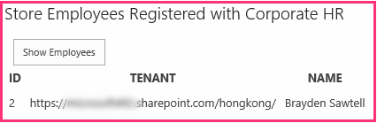

# Include a custom button in the provider-hosted add-in
Learn how to include a custom ribbon button in a provider-hosted SharePoint Add-in.
 

 **Note**  The name "apps for SharePoint" is changing to "SharePoint Add-ins". During the transition, the documentation and the UI of some SharePoint products and Visual Studio tools might still use the term "apps for SharePoint". For details, see  [New name for apps for Office and SharePoint](new-name-for-apps-for-sharepoint#bk_newname).
 

This is the third in a series of articles about the basics of developing provider-hosted SharePoint Add-ins. You should first be familiar with  [SharePoint Add-ins](sharepoint-add-ins) and the previous articles in this series:
 

-  [Get started creating provider-hosted SharePoint Add-ins](get-started-creating-provider-hosted-sharepoint-add-ins)
    
 
-  [Give your provider-hosted add-in the SharePoint look-and-feel](give-your-provider-hosted-add-in-the-sharepoint-look-and-feel)
    
 

 **Note**  If you have been working through this series about provider-hosted add-ins, then you have a Visual Studio solution that you can use to continue with this topic. You can also download the repository at  [SharePoint_Provider-hosted_Add-Ins_Tutorials](https://github.com/OfficeDev/SharePoint_Provider-hosted_Add-ins_Tutorials) and open the BeforeRibbonButton.sln file.
 

A SharePoint Add-in can include custom actions, which is the SharePoint term for a custom menu items or ribbon buttons. In this article you'll learn how to create a custom button that synchronizes a SharePoint list with a remote database.
 

## Create a custom list on the host website

The custom button is going to be on the ribbon of a specific list that records the employees of the local store. In a later article in this series, you'll learn how to programmatically add a custom list to a host website, but for now you'll add one manually. 
 

 

1. From the home page of the Fabrikam Hong Kong Store, navigate to  **Site Contents | add an add-in | Custom List**. 
    
 
2. In the  **Adding Custom List** dialog, specifyLocal Employees as the name and press **Create**. 
    
 
3. On the  **Site Contents** page, open the **Local Employees** list.
    
 
4. Open the  **List** tab on the ribbon, and then click the **List Settings** button.
    
 
5. In the  **Columns** section of the **List Settings** page, click the **Title** column.
    
 
6. In the  **Edit Column** form, change the **Column name** from Title toName; and then click  **OK**.
    
 
7. On the  **Settings** page, click **Create column**.
    
 
8. In the  **Create Column** form, do the following:
    
      1. Enter Added to Corporate DB as the **Column name**.
    
 
  2. Set the type to  **Yes/No (check box)**.
    
 
  3. Set the  **Default value** to **No**.
    
 
  4. Press  **OK**. You are taken back to the  **Settings** page.
    
 
9. Click  **Site Contents** to open the **Site Contents** page. The tile for the new list is there. Open it.
    
 
10. Click  **new item** and on the create item form, enter a name, but do *not*  check **Added to Corporate DB**. Then click  **Save**. The list should look similar to the following:
    
  
 

 

 

## Add the custom button

In this section, you include markup in the add-in that will deploy a button to the list's ribbon. When a user highlights an employee on the list and clicks the button, the employee's name will be added to the corporate database and the  **Added to Corporate DB** field for the employee will be switched from No to Yes.
 

 

1.  *If Visual Studio is open, you have to close it*  and reopen the Chain Store solution so that Visual Studio can discover your new list. (Run Visual Studio as an administrator.)
    
     **Note**   The settings for Startup Projects in Visual Studio tend to revert to defaults whenever the solution is reopened. Always take these steps immediately after reopening the sample solution in this series of articles: Right-click the solution node at the top of **Solution Explorer** and select **Set startup projects**.  Make sure all three projects are set to **Start** in the **Action** column.
2. Right-click the  **ChainStore** project in **Solution Explorer** and choose **Add | New Item**. 
    
 
3. In the  **Add New Item** dialog, select **Ribbon Custom Action**, give it the name AddEmployeeToCorpDB, and then click  **Add**.
    
 
4. The dialog that opens asks three questions. Give the following answers:
    

|**Question**|**Give this answer:**|
|:-----|:-----|
|**Where do you want to expose the custom action?**|Host Web|
|**Where is the custom action scoped to?**|List Instance|
|**Which particular item is the custom action scoped to?**|Local Employees|
5. Click  **Next** and you get three more questions:
    

|**Question**|**Give this answer:**|
|:-----|:-----|
|**Where is the control located?**|Ribbon.ListItem.Actions|
|**What is the label text for the button control?**|Add to Corporate DB|
|**Where does the button control navigate to?**|ChainStoreWeb\Pages\EmployeeAdder.aspx (This is a page whose code behind is going to add the employee to the database.)|
6. Click  **Finish**.
    
    An elements.xml file that defines the custom action is added to the project and opened. For the most part, you can treat this file as a black box, and you won't need to make any changes in it untill a later article in this series. For now, note only the following:
    
      - The  **Location** attribute of the **CommandUIDefinition** element has the value `Ribbon.ListItem.Actions.Controls_children`. The second part of this,  `ListItem`, identifies the tab on the ribbon where the button will be placed (but that may not be the exact display name of the tab) and the third part,  `Actions`, is the name of the section of the ribbon where the button will be placed.
    
 
  - The  **CommandAction** attribute of the **CommandUIHandler** element begins with the placeholder `~remoteAppUrl`. This will be replaced with the URL of the remote web application when the button is deployed.
    
 
  - A few query parameters have been added to the  **CommandAction** value with placeholder values in braces "{ }". These placeholders are resolved at runtime. Note that one of them is the ID of the list item that is selected by the user before she presses the custom button on the ribbon.
    
 
7. In the  **ChainStoreWeb** project, open the **Pages/EmployeeAdder.aspx** file. Notice that it doesn't have any UI. The add-in is going to use this page as a kind of web service. This is possible because the ASP.NET **System.Web.UI.Page** class implements **System.Web.IHttpHandler** and because the **Page\_Load** event runs automatically when the page is requested.
    
 
8. Open the code behind file  **Pages/EmployeeAdder.aspx.cs**. The method that adds the employee to the remote database,  `AddLocalEmployeeToCorpDB`, is already present. It uses the  **SharePointContext** object to get the host web's URL, which the add-in uses as its tenant discriminator. So the first thing the **Page_Load** method needs to do is initialize this object. The object is created and cached in the Session when the add-in's start page loads, so add the following code to the **Page_Load** method. (The **SharePointContext** object is defined in the SharePointContext.cs file that the Office Developer Tools for Visual Studio generate when the add-in solution is created.)
    
```C#
  spContext = Session["SPContext"] as SharePointContext;
```

9. The  `AddLocalEmployeeToCorpDB` method takes the employee's name as a parameter, so add the following line to the **Page_Load** method. You'll create the `GetLocalEmployeeName` method in a later step.
    
```C#
  // Read from SharePoint 
string employeeName = GetLocalEmployeeName();
```

10. Below this line, add the call to the  `AddLocalEmployeeToCorpDB` method.
    
```C#
  // Write to remote database 
AddLocalEmployeeToCorpDB(employeeName);
```

11. Add a  **using** statement to file for the namespace `Microsoft.SharePoint.Client`. (The Office Developer Tools for Visual Studio included the Microsoft.SharePoint.Client assembly in the  **ChainStoreWeb** project when it was created.)
    
 
12. Now add the following method to the  `EmployeeAdder` class. The SharePoint .NET Client-side Object Model (CSOM) is documented in detail elsewhere on MSDN and we encourage you to explore it when you are finished with this series of articles. For this article, note that the **ListItem** class represents an item in a SharePoint list and that the value of a field in the item can be referenced with "indexer" syntax. Notice also, that the code refers to the field as "Title" even though you changed the field name to "Name". This is because fields are always referred to in code by their *internal*  name, not their display name. The internal name of a field is set when the field is created and can never change. You complete the `TODO1` in a later step.
    
```C#
  private string GetLocalEmployeeName()
{
    ListItem localEmployee;

    // TODO1: Initialize the localEmployee object by getting  
    // the item from SharePoint.
 
    return localEmployee["Title"].ToString();
}
```

13. Our code will need the list item's ID before it can retrieve it from SharePoint. Add the following declaration to the  `EmployeeAdder` class just below the declaration for the `spContext` object.
    
```C#
  private int listItemID;
```

14. Now add the following method to the  `EmployeeAdder` class to get the list item's ID from the query parameter.
    
```C#
  private int GetListItemIDFromQueryParameter()
{
    int result;
    Int32.TryParse(Request.QueryString["SPListItemId"], out result);
    return result;
}
```

15. To initialize the  `listItemID` variable, add the following line to the **Page_Load** method just below the line that initializes the `spContext` variable.
    
```C#
  listItemID = GetListItemIDFromQueryParameter();
```

16. In the  `GetLocalEmployeeName`, replace the  `TODO1` with the following code. For the time being, just treat this code as a black box while we concentrate on getting the custom button working. We'll learn more about this code in the next article in this series, which is all about the SharePoint client-side object model.
    
```C#
  using (var clientContext = spContext.CreateUserClientContextForSPHost())
{
    List localEmployeesList = clientContext.Web.Lists.GetByTitle("Local Employees");
    localEmployee = localEmployeesList.GetItemById(listItemID);
    clientContext.Load(localEmployee);
    clientContext.ExecuteQuery();
}

```


    The whole method should now look like the following.
    


```C#
  private string GetLocalEmployeeName()
{
    ListItem localEmployee;

    using (var clientContext = spContext.CreateUserClientContextForSPHost())
    {
        List localEmployeesList = clientContext.Web.Lists.GetByTitle("Local Employees");
        selectedLocalEmployee = localEmployeesList.GetItemById(listItemID);
        clientContext.Load(selectedLocalEmployee);
        clientContext.ExecuteQuery();
    }
    return localEmployee["Title"].ToString();
}
```

17. The EmployeeAdder page should not actually render, so add the following as the last line in the  **Page_Load** method. This will redirect the browser back to the list view page for the **Local Employees** list.
    
```C#
  // Go back to the Local Employees page
Response.Redirect(spContext.SPHostUrl.ToString() + "Lists/LocalEmployees/AllItems.aspx", true);

```


    The whole  **Page_Load** method should now look like the following.
    


```C#
  protected void Page_Load(object sender, EventArgs e)
{
    spContext = Session["SPContext"] as SharePointContext;
    listItemID = GetListItemIDFromQueryParameter();

    // Read from SharePoint
    string employeeName = GetLocalEmployeeName();

    // Write to remote database
    AddLocalEmployeeToCorpDB(employeeName);

    // Go back to the preceding page
    Response.Redirect(spContext.SPHostUrl.ToString() + "Lists/LocalEmployees/AllItems.aspx", true);
}
```


## Request permission to read the host web list

As you have seen, SharePoint prompts you to grant the add-in permissions to the host web when it is installed. You have been re-installing the add-in every time you press F5. So far, the add-in has only needed minimal permissions, but the  `GetLocalEmployeeName` method requires permission to read the lists of the host website. The add-in uses its add-in manifest to tell SharePoint what permissions it needs. Follow these steps.
 

 

1. In  **Solution Explorer**, open the AppManifest.xml file in the  **ChainStore** project. (The file is called AppManifest because add-ins used to be called "apps".) The manifest designer opens.
    
 
2. Open the  **Permissions** tab and click the empty cell under the **Scope** column; and then select **List** from the drop down.
    
 
3. In the  **Permission** field, select **Read** from the drop down.
    
 
4. Leave the  **Properties** field empty and save the file. The **Permission** tab should look similar to the following:
    
  
 

 

 

## Run the add-in and test the button


 

 

1. Use the F5 key to deploy and run your add-in. Visual Studio hosts the remote web application in IIS Express and hosts the SQL database in a SQL Express. It also makes a temporary installation of the add-in on your test SharePoint site and immediately runs the add-in. You are prompted to grant permissions to the add-in before it's start page opens. This time the prompt has a drop down where you select the list that the app needs to read as seen in the following screenshot. 
    
  
 

 

 
2. Choose  **Local Employees** from the list and then click **Trust it**.
    
 
3. When the add-in's start page opens, click  **Back to Site** on the chrome control at the top.
    
 
4. From the website's home page navigate to  **Site Contents | Local Employees**. The list view page opens.
    
 
5. Add a few employees to the list.  *Do not check the  **Added to Corporate DB** checkbox.* 
    
 
6. On the ribbon, open the  **Items** tab. In the **Actions** section of the tab, is the custom button **Add to Corporate DB**.
    
 
7. Select an item on the list. The page and ribbon should look similar to the following:
    
  
 

 

 
8. Press the  **Add to Corporate DB** button. * **An item must be selected first!*** 
    
 
9. The page will seem to reload because the  **Page_Load** method of the EmployeeAdder page redirects back to it.
    
 
10. Use the browser's back button twice to go back to the add-in's start page. 
    
 
11. Click  **Show Employees** and the list of employees will be populated with the employee that you added. It should look similar to the following:
    
  
 

 

 
12. To end the debugging session, close the browser window or stop debugging in Visual Studio. Each time that you press F5, Visual Studio will retract the previous version of the add-in and install the latest one.
    
 
13. You will work with this add-in and Visual Studio solution in other articles, and it's a good practice to retract the add-in one last time when you are done working with it for a while. Right-click the project in  **Solution Explorer** and choose **Retract**.
    
 

## 
<a name="Nextsteps"> </a>

 In the next article, we'll take a brief break from coding for an overview of the SharePoint client-side object model: [Get a quick overview of the SharePoint object model](get-a-quick-overview-of-the-sharepoint-object-model).
 

 

