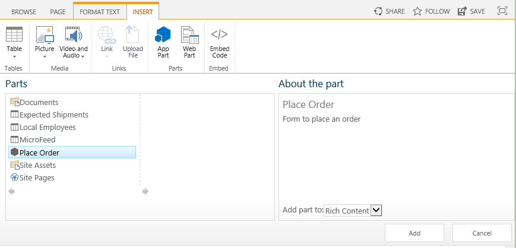
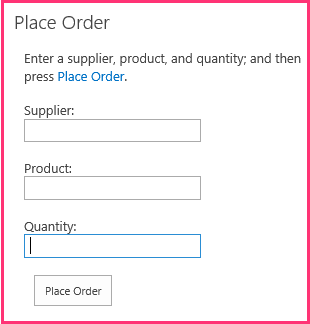

# Include an add-in part in the provider-hosted add-in
Learn how to surface a remote web form in a SharePoint page in a provider-hosted SharePoint Add-in.
 

 **Note**  The name "apps for SharePoint" is changing to "SharePoint Add-ins". During the transition, the documentation and the UI of some SharePoint products and Visual Studio tools might still use the term "apps for SharePoint". For details, see  [New name for apps for Office and SharePoint](new-name-for-apps-for-sharepoint.md#bk_newname).
 

This is the sixth in a series of articles about the basics of developing provider-hosted SharePoint Add-ins. You should first be familiar with  [SharePoint Add-ins](sharepoint-add-ins.md) and the previous articles in this series:
 

-  [Get started creating provider-hosted SharePoint Add-ins](get-started-creating-provider-hosted-sharepoint-add-ins.md)
    
 
-  [Give your provider-hosted add-in the SharePoint look-and-feel](give-your-provider-hosted-add-in-the-sharepoint-look-and-feel.md)
    
 
-  [Include a custom button in the provider-hosted add-in](include-a-custom-button-in-the-provider-hosted-add-in.md)
    
 
-  [Get a quick overview of the SharePoint object model](get-a-quick-overview-of-the-sharepoint-object-model.md)
    
 
-  [Add SharePoint write operations to the provider-hosted add-in](add-sharepoint-write-operations-to-the-provider-hosted-add-in.md)
    
 

 **Note**  If you have been working through this series about provider-hosted add-ins, then you have a Visual Studio solution that you can use to continue with this topic. You can also download the repository at  [SharePoint_Provider-hosted_Add-Ins_Tutorials](https://github.com/OfficeDev/SharePoint_Provider-hosted_Add-ins_Tutorials) and open the BeforeAdd-inPart.sln file.
 

In this article, you add a special kind of Web Part, called an add-in part to the SharePoint Add-in. The add-in part exposes the add-in's order form on a SharePoint page.
 

## Create the add-in part

 

 

 **Note**   The settings for Startup Projects in Visual Studio tend to revert to defaults whenever the solution is reopened. Always take these steps immediately after reopening the sample solution in this series of articles: Right-click the solution node at the top of **Solution Explorer** and select **Set startup projects**.  Make sure all three projects are set to **Start** in the **Action** column.
 

1. In  **Solution Explorer**, right-click the  **ChainStore** project and select **Add | New Item**.
    
 
2. Select  **Client Web Part (Host Web)**, give it the name Place Order, and then press  **Add**. ("Client Web Part" is another name for "add-in part".)
    
 
3. On the next page of the wizard, select the second radio button:  **Select or enter the URL of an existing web page for the client web part content**.
    
 
4. In the drop down list, select the URL for the  **OrderForm.aspx** page, and then press **Finish**.
    
    An elements.xml file that defines the add-in part is added to the project and opened.
    
 
5. In the  **ClientWebPart** element, change the following attributes to these values:
    

|**Attribute**|**Value**|
|:-----|:-----|
|Title|Place Order|
|Description|Form to place an order|
|DefaultHeight|320|

    Leave all the other attributes with their defaults and save the file.
    
 

## Run the add-in and test the add-in part

 

 

1. Use the F5 key to deploy and run your add-in. Visual Studio hosts the remote web application in IIS Express and hosts the SQL database in a SQL Express. It also makes a temporary installation of the add-in on your test SharePoint site and immediately runs the add-in. You are prompted to grant permissions to the add-in before it's start page opens.
    
 
2. When the add-in's start page opens, the add-in has been deployed and the  **Place Order** add-in part is available to for users to add to any Web Part area on any SharePoint page in the Hong Kong store's website. Follow these steps to add it to the home page.
    
      1. Press  **Back to Site** on the chrome control at the top of the start page to open the home page of the Hong Kong store.
    
 
  2. On the ribbon, open the  **Page** tab and press the **Edit** button.
    
 
  3. After the page is in edit mode, open the  **Insert** tab on the ribbon, and the press the **Add-in Part** button. (The button may still be called **App Part**.)
    
 
  4. On the Web Part insertion control that opens, select the  **Place Order** add-in part. The control will look similar to the following.
    
     
 

 

 
  5. Click somewhere in one of the Web Part zones of the form. This is to set the location where the add-in part will go. 
    
 
  6. Click  **Add** on the Web Part insertion control. The **Place Order** add-in part will be added to the Web Part zone.
    
 
  7. On the ribbon press  **Save**.
    
 
3. The order form now appears on the page and it has the look-and-feel of the rest of the page. It should look like the following: 
    
     
 

 

 
4. Enter values for  **Supplier**,  **Product**, and  **Quantity** and press **Place Order**. Nothing will appear to happen, but an order is entered in the corporate database. Optionally, you can empty the fields of the add-in part by refreshing the page.
    
 
5. Use the browser's back button until you are back at the Chain Store add-in's start page; and then press  **Show Orders**. Your new order is listed.
    
 
6. To end the debugging session, close the browser window or stop debugging in Visual Studio. Each time that you press F5, Visual Studio will retract the previous version of the add-in and install the latest one.
    
 
7. You will work with this add-in and Visual Studio solution in other articles, and it's a good practice to retract the add-in one last time when you are done working with it for a while. Right-click the project in  **Solution Explorer** and choose **Retract**.
    
 

## 

 The add-in depends on two lists that you created manually. You don't want your users to have to do that. In the next article you begin the process of automatically creating these lists. The first major step is to create custom handlers for the event of installing an add-in: [Handle add-in events in the provider-hosted add-in](handle-add-in-events-in-the-provider-hosted-add-in.md)
 

 

