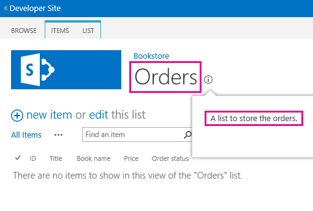
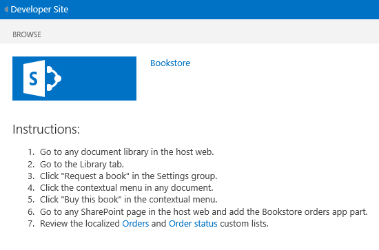
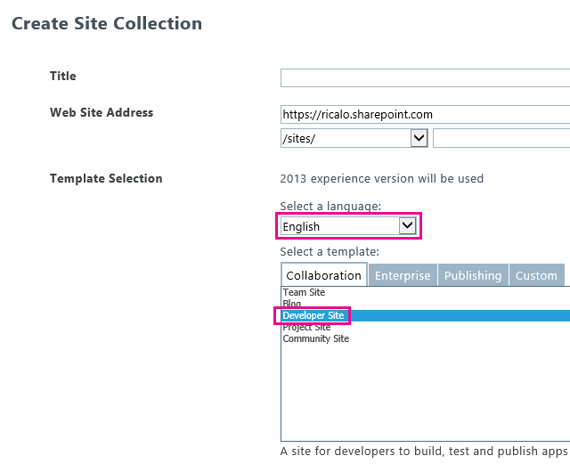

---
title: Localize SharePoint Add-ins
description: Localize a SharePoint Add-in by using resource files, JavaScript resource files, and other techniques.
ms.date: 12/26/2017
ms.prod: sharepoint
---


# Localize SharePoint Add-ins
 
> [!NOTE] 
> This topic assumes that you are familiar with the basic creation of SharePoint Add-ins, and with SharePoint features, the distinction between add-in webs and host webs, [the kind of SharePoint components that can be in an add-in](host-webs-add-in-webs-and-sharepoint-components-in-sharepoint.md#TypesOfSPComponentsInApps), and the basics of localization with .resx files.
 
<a name="Prerequisites"> </a>

## Get ready to localize a SharePoint Add-in

Before you begin, identify the following: 

- The **locales** that your add-in needs to support. SharePoint Online and SharePoint on-premises with Language Packs installed enable users to create websites in a specific language and culture. Decide what localized websites your customers will be using, and determine which of these you want to support with a localized version of your add-in's components.

- The **components** that you need to localize in your add-in.

Also, be aware of the following:

- The procedures in this article assume that you are using the most recent version of [Office Developer Tools for Visual Studio 2013](http://aka.ms/OfficeDevToolsForVS2013), or [Office Developer Tools for Visual Studio 2015](http://aka.ms/OfficeDevToolsForVS2015).
    
    > [!NOTE] 
    > If your test SharePoint website is an on-premises SharePoint farm instead of a Microsoft SharePoint Online Developer Site, you may need to install the language packs for the languages in which you are translating your SharePoint Add-in. For more information, see [Install or uninstall language packs for SharePoint](https://technet.microsoft.com/library/b1926e3b-5263-46e0-ac35-433236dae704(v=office.16).aspx) and [Download language packs for SharePoint Server 2013](https://www.microsoft.com/en-us/download/details.aspx?id=37140).

- The screen shots and code examples in this article reflect the sample [SharePoint-Add-in-Localization](https://github.com/OfficeDev/SharePoint-Add-in-Localization). You can download the sample to see the results of the procedures described in this article.
    
<a name="LocalizingAppWeb"> </a> 

## Localize the add-in web components

An add-in web can contain specific kinds of SP components. For more information about the kinds of SharePoint components that can be in a SharePoint Add-in, see [Types of SharePoint components that can be in a SharePoint Add-in](host-webs-add-in-webs-and-sharepoint-components-in-sharepoint.md#TypesOfSPComponentsInApps). To localize components that are deployed to an add-in web, you add .resx files in modules in the same feature that contains the add-in web component. You reference the resources in the markup of the component. How you do this is explained later in this article. However, custom site pages in a SharePoint Add-in use JavaScript string variable files instead of .resx files, as described later in this section.
 
> [!NOTE] 
> Resource files cannot be shared by multiple add-in web features. For each feature in the .wsp file, you have to create separate sets of resource files.

### To create the add-in web resource files

1. Open the SharePoint Add-in project in Visual Studio. (The sample from which the screenshots in this topic were taken is a provider-hosted add-in with ASP.NET Web Forms as the remote web application part of the project.)

2. In **Solution Explorer**, open the shortcut menu for the feature name, and select **Add Feature Resource**.

3. In the **Add Resource** dialog box, select **Invariant Language (Invariant Country)**, and then select **OK**. A Resources.resx file is added to the feature's folder in **Solution Explorer**, and the file is opened in the Visual Studio **Resource Editor**. 
    
    When edited, this "invariant language" file contains the strings that are used in the **Feature** gallery on all sites in languages for which you are *not* going to be providing a localized version of strings. So the language used for the strings in this file should be the language that is most likely to be a second language of people using SharePoint. Traditionally, English is used for this purpose, but in some scenarios another language might be a better choice. For example, in some regions, French may be a more common second language of the users than English. The continuing example in this topic uses English as the invariant language.
    
    > [!NOTE] 
    > A SharePoint Add-in cannot be installed on a website whose language is not listed in the **Supported Locales** section of the add-in manifest. Keep in mind that when this article discusses languages for which you are *not* going to be providing a localized add-in, you still have to add such languages to the add-in manifest. For more details about supported locales in the add-in manifest, see the procedure [To create resource files for the host web](#to-create-resource-files-for-the-host-web) later in this article.

4. In the **Name** column of the top row in the **Resource Editor**, enter a descriptive name for the string (or other resource)—for example, `OrdersListInstance_Title` and `OrdersListInstance_Description`. These names of localizable resources are not themselves localized. Each resource must have its own name. 
    
5. In the **Value** column, enter an appropriate string (or URL or other resource) in the invariant language—for example,`Orders`, and a list to store the orders.

6. Add additional name and value pairs for all strings and resources that should be localized for use in any components of your feature.

7. Save the file.

8. Add another resource file to the feature as you did before, but select a particular language instead of **Invariant Language (Invariant Country)**. For example, you can choose **Spanish (Spain)**. A Resources.LL-CC.resx file (where  `LL` and `CC` are [Internet Engineering Task Force (IETF)-compliant](https://tools.ietf.org/html/rfc1766) language and culture codes) is added to the Feature's folder in **Solution Explorer**, and the file is opened in the Visual Studio **Resource Editor**. 

9. Using the **Resource Editor**, copy all the rows from Resources.resx, and paste them into the new Resources.LL-CC.resx file. (If **Copy** is not enabled on the context menu of the resource editor, use Ctrl+C to copy the rows into the clipboard.)

10. In the Resources.LL-CC.resx file, replace the **Value** cells with translated versions of the string values. For URLs and other non-string resources, replace the value with a new value that is appropriate for the language and culture.

11. Save the new file.

12. Repeat the last four steps for each foreign language. 
    
    > [!NOTE] 
    > Consider adding a language-specific file for the same language as your invariant language. If you do, you can copy the rows without changing the values of the strings. In many situations, it is not necessary to have a language-specific file for the same language that is used in the resource file for the invariant language, especially when the only resources in the files are strings. But resource files can contain images, icons, files, and other kinds of resources too. Sometimes, you need the invariant language resource file to use an image or other resource that is different from the corresponding resource in *any* of the language-specific files.

13. For each file, verify that the **Build Action** property is set to **Content**.

### To call the localized resources in custom lists

1. To localize the title and description properties of a custom list, open the **Elements.xml** file of the instance of the list. For example, in the sample that accompanies this topic, in **Solution Explorer** go to **BookstoreApp** > **Order Status** > **OrderStatusInstance** > **Elements.xml**.
    
2. In the **Title** attribute, enter $Resources:_StringName_, where _StringName_ is the name, not the value, you gave in the previous procedure to the string that names the custom list—for example, $Resources:OrdersListInstance_Title. Note that, unlike in some contexts where .resx files are used, the resource file name is *not* part of what you enter.

3. Use the **Description** attribute to call the string resource of the list description in the same way—for example,$Resources:OrdersListInstance_Description. The following is the markup that uses the localized strings in the Elements.xml file of the instance of a list.
        
    ```XML
    <?xml version="1.0" encoding="utf-8"?>
    <Elements xmlns="http://schemas.microsoft.com/sharepoint/">
        <ListInstance 
            Title="$Resources:OrdersListInstance_Title" 
            OnQuickLaunch="TRUE" 
            TemplateType="10000" 
            Url="Lists/Orders" 
            Description="$Resources:OrdersListInstance_Description">
        </ListInstance>
    </Elements>
    ```

The following image shows the localized custom list in English.
    
**Localized custom list**



### To localize the column names of a custom list

1. You can't localize the column names of the custom list in the same way that you localize the title and description. To localize the column names, you have to declare the list fields in an **Elements.xml** file, and then set the **DisplayName** attribute value with references in the add-in web resource files. To begin, open the **Schema.xml** file of your custom list. Locate the **Fields** node, and then copy all its **Field** nodes.

2. Open the **Elements.xml** file of your custom list. Make sure that you open the Elements.xml file of the list definition, and not of the instance of the list. Paste the nodes from the previous step as children of the **Elements** node.

3. For every **Field** node, enter a value of **$Resources:_StringName_** in the **DisplayName** attribute where _StringName_ is the name of an entry in the add-in web resource file.

4. In the **Schema.xml** file of your custom list, remove the **DisplayName** attribute of every **Field** node that you previously copied. The following is an example markup that uses the localized strings in the **Elements.xml** file of the list definition.
    
    ```XML
    <?xml version="1.0" encoding="utf-8"?>
        <Elements xmlns="http://schemas.microsoft.com/sharepoint/">
            <ListTemplate
                Name="Orders"
                Type="10000"
                BaseType="0"
                OnQuickLaunch="TRUE"
                SecurityBits="11"
                Sequence="410"
                DisplayName="Orders"
                Description="My List Definition"
                Image="/_layouts/15/images/itgen.png"/>
            <Field
                Name="Bookname"
                ID="{2ef60a05-29b6-41db-9611-c0cf7d8e73c5}"
                DisplayName="$Resources:OrdersListColumn_Bookname"
                Type="Text"
                Required="TRUE" />
            <Field
                Name="Price"
                ID="{7af42815-d69e-426a-a1c8-9da5610e362c}"
                DisplayName="$Resources:OrdersListColumn_Price"
                Type="Currency"
                Required="FALSE" />
            <Field
                Name="Orderstatus"
                ID="{687ee751-2e0a-4099-966e-d2c225d48234}"
                DisplayName="$Resources:OrdersListColumn_Orderstatus"
                Type="Lookup"
                Required="FALSE"
                List="Lists/Order status"
                ShowField="Title" />
        </Elements>
    ```

    <br/>


### To create JavaScript resource files for custom pages


1. Custom site pages in a SharePoint Add-in use JavaScript string variable files instead of .resx files. 
    
    To begin, in **Solution Explorer**, add a folder named **Scripts** to the SharePoint add-in project (not the web application project) if there isn't one there already. Right-click the **Scripts** folder and select **Add** > **New Item** > **Web** > **JavaScript File**. Name the file **Resources._LL-CC_.js** (where _LL_ is a language code and _CC_ is a country/region or culture code); for example, **Resources.en-US.js**.

2. Repeat the preceding step for each foreign language. You should now have blank JavaScript files for every language. Do  *not* create an invariant language file named "Resources.js". The reason is explained in a later procedure.

3. Open the first of the new JavaScript files.

4. For each localizable string in each of your custom pages, declare a variable in the file with a name that identifies the purpose of the string, and assign it a value that is appropriate for the language. The following is the contents of the Resources.en-US.js file.
        
    ```js
        var instructionstitle = "Instructions:";
        var step01 = "Go to any document library in the host web.";
        var step02 = "Go to the Library tab.";
        var step03 = "Click \"Request a book\" in the Settings group.";
        var step04 = "Click the contextual menu in any document.";
        var step05 = "Click \"Buy this book\" in the contextual menu.";
        var step06 = "Go to any SharePoint page in the host web and add the" + " Bookstore orders add-in part.";
        var step07 = "Review the localized <a href=\"../Lists/Orders\">Orders</a>" + " and <a href=\"../Lists/Order status\">Order status</a> custom lists.";
    ```

5. Copy the contents of the file into each of the remaining JavaScript files, and then save all the files.
    
6. In each file, replace the value of each variable with a new value that is appropriate to the language of the file. *Do not change the variable names.* 

### To call the localized variables in custom ASPX pages

1. In **Solution Explorer**, open a custom ASPX page file.

2. Make sure that only one of the localized JavaScript files is loaded when your page loads, and it should be the one that is appropriate for the language of the SharePoint add-in web. To do this, add the following markup to the **asp:content** element of the page that has a `ContentPlaceholderId` with the value `PlaceholderAdditionalPageHead`. *There are no placeholders in the following markup. Enter the markup exactly as it appears here.* 
    
    ```HTML
        <script type="text/javascript" src="../scripts/Resources.<SharePoint:EncodedLiteral runat='server' text='<%$Resources:wss,language_value%>' EncodeMethod='HtmlEncode' />.js"></script>
    ```
    
    This markup loads one of your JavaScript files. It determines which language file to load by reading the SharePoint resource named `language_value`. This resource resolves to a language-culture name in the pattern _LL-CC_ that was described in an earlier procedure. Specifically, it resolves to the language of the add-in web.
    
    > [!NOTE] 
    > The SharePoint resource `language_value` is never null, so a file named "Resources.js" would never be called by this script. That is why you did not make one in the preceding procedure. When the value of `language_value` is a language for which there is no .js file, this script loads nothing. The next step explains how strings get an invariant language value in that situation.

3. For each localizable element and attribute value on the page, give it a default value in the invariant language, but then use JavaScript to assign it the appropriate variable from the Resources._LL-CC_.js file. For example, if the page has a title in an **h2** element, give the element an **id** attribute, and then insert a **script** element below the localized elements to assign localized strings to the **innerText** property of the localized elements. This localization code should only run if a Resources._LL-CC_.js file loaded and declared the variables. So put it in a conditional block that first tests whether one of the variables is defined. If it is not, no resource script loaded, and the default (invariant) values should remain unchanged. The following is an example. 
    
    > [!TIP] 
    > The word "INVARIANT" has been added to the first of the invariant strings. You would not do this in a production add-in, but while you are testing, it is a useful way of seeing at a glance whether invariant language strings are being used or whether the Resources._LL-CC_.js file for the language that happens to be your invariant language was loaded.


    ```HTML
    <h2 id="instructionsheading">INVARIANT Instructions</h2>
        <ol>
            <li id="step01">Go to any document library in the host web.</li>
            <li id="step02">Go to the Library tab.</li>
            <li id="step03">Click "Request a book" in the Settings group.</li>
            <li id="step04">Click the contextual menu in any document.</li>
            <li id="step05">Click "Buy this book" in the contextual menu.</li>
            <li id="step06">Go to any SharePoint page in the host web and add the Bookstore orders add-in part.</li>
            <li id="step07">Review the localized <a href="../Lists/Orders">Orders</a> and <a href="../Lists/Order status">Order status</a> custom lists.</li>
        </ol>

    <!-- Use the localized strings in the resource JavaScript file -->
    <script type="text/javascript">
        window.onload = function () {
            <!-- Test whether a Resources.LL-CC.js loaded.
                If none was, the invariant values remain unchanged. -->
            if (typeof instructionstitle != 'undefined')  
            {
                document.getElementById("instructionsheading").innerText = instructionstitle;
                document.getElementById("step01").innerText = step01;
                document.getElementById("step02").innerText = step02;
                document.getElementById("step03").innerText = step03;
                document.getElementById("step04").innerText = step04;
                document.getElementById("step05").innerText = step05;
                document.getElementById("step06").innerText = step06;
                document.getElementById("step07").innerHTML = step07;
            }
        }
    </script>
    ```

    <br/>

The following image gives a preview of how the English version of the page will look when the add-in is completed. 
    
**Webpage using localized strings from a JavaScript resource file**



<a name="LocalizingHostWeb"> </a> 

## Localize the host web components

You can localize the add-in title, which is specified in the AppManifest.xml file. This is what users see on the **Your Add-ins** page. The host web for a SharePoint Add-in can also include a custom action, an add-in part, or both. These are deployed in a host web feature. Both of these components can have localizable strings.

The essential method for localizing host web components is the same as for localizing add-in web components: localized resources are itemized in a .resx file and are called from the markup files. However, Visual Studio does not have as much tooling support for the process as it applies to host web features. There is a manual process involved that is explained later in this section.

### To create resource files for the host web

1. In **Solution Explorer**, choose the AppManifest.xml file to open the add-in manifest designer tool.

2. Open the **Supported Locales** tab.

3. In the top blank cell of the **Locales** column, open the drop-down list and choose the first locale that you want to support. Two files are created and added to the SharePoint Add-in project: Resources.resx, which is the invariant language resource file, and Resources._LL-CC_.resx, which will contain the localized resources. *Don't change the names of these files.* 

4. Repeat the previous step for each locale you want to support with a localized version of the add-in. An additional Resources._LL-CC_.resx file is created for each locale.
    
    > [!NOTE] 
    > The **Build Action** property of each of these files is set to **Content**, not **Resource**. *Don't change this setting.* 

5. Also add locale entries for every locale where you want your add-in to be installable, but where it should use the invariant language; that is, locales for which you will *not* be providing a localized version of the add-in. *Delete the .resx files that are created for these locales.* 
 
6. Open the Resources.resx file and add resource names and values to the file just as you did for the add-in web resource files. At a minimum, you should have a resource for the add-in title. The host web feature does not appear in the SharePoint UI anywhere, so you do not need localized strings for the host web feature title or description. If the feature has a custom action, you need a resource for the **Title** attribute of the **CustomAction** element, and possibly other strings in the custom action markup. If there is an add-in part, you need resources for the **Title** and **Description** attributes of the **ClientWebPart** element. If the add-in part has custom properties, each **Property** has attributes that should be localized as well. For each of these, you need a row in the resources file.

7. Copy the contents of the Resources.resx file into each of the Resources._LL-CC_.resx files.

8. Localize each resource in each Resources._LL-CC_.resx file just as you did for the add-in web resource files.

### To call the localized resources in the add-in manifest, and other XML files

1. Open the AppManifest.xml file and replace the **Title** element value with a call to the appropriate resource string. For example, if you named the string **Addin_Title**, the **Title** element should look like the following:
    
    ```XML
        <Title>$Resources:Addin_Title;</Title>
    ```

    > [!WARNING] 
    > The value of **Title** can contain *only* the call to the resource. There can be no other text, symbols, or white space.

2. To call localized resources in other XML files, such as Elements.xml for add-in parts and custom actions, you use the same format that you used in the add-in manifest file.
    
<a name="LocalizingAutohosted"> </a> 

## Localize remote components in a SharePoint Add-in

If the remote components are PHP or other non-Microsoft formats, see the localization guidance for the appropriate platform. When the remote componets are ASP.NET, you localize them just as you would any other ASP.NET application. For more information, see [ASP.NET Globalization and Localization](https://msdn.microsoft.com/library/8ef3838e-9d05-4236-9dd0-ceecff9df80d.aspx).

Override the page language and the thread language to match the language of the host web. You do this by overriding the inherited **InitializeCulture** method in the code-behind of your ASP.NET pages. To identify the host web's language, use the **SPLanguage** query parameter that SharePoint passes to the remote page. The following code shows how to do this in ASP.NET. You should do something parallel in a PHP web application or other platform.

```C#
    protected override void InitializeCulture()
    {
        if (Request.QueryString["SPLanguage"] != null)
        {
            string selectedLanguage = Request.QueryString["SPLanguage"];
            
            // Override the page language.
            UICulture = selectedLanguage;
            Culture = selectedLanguage;

            // Reset the thread language.
            Thread.CurrentThread.CurrentCulture =
                CultureInfo.CreateSpecificCulture(selectedLanguage);
            Thread.CurrentThread.CurrentUICulture = new
                CultureInfo(selectedLanguage);
        }
        base.InitializeCulture();
    }
```

<br/>

<a name="JSandChrome"> </a>

## Localize remote JavaScript and the SharePoint chrome control

If there are localizable string values in your web application's JavaScript, you can localize them using JavaScript resource files. An especially important example of localizable JavaScript is the [SharePoint chrome control](use-the-client-chrome-control-in-sharepoint-add-ins.md), which can be used to give remote pages the appearance of SharePoint pages. We'll use the localization of the chrome control as an example in this section.
 
> [!NOTE] 
> This section only discusses string localization. For more powerful localization needs, such as localization of date or currency formatting, consider using a localization or globalization library, such as the [Globalize add-on for jQuery](https://github.com/globalizejs/globalize).

### To localize the chrome control

1. After you have the chrome control working, return to the `renderChrome` method where you set the chrome options.
        
    ```js
        function renderChrome() {
            var options = {
                "appIconUrl": "siteicon.png",
                "appTitle": "My SharePoint add-in", // Localizable string
                "appHelpPageUrl": "Help.html?"
                    + document.URL.split("?")[1],
                "onCssLoaded": "chromeLoaded()",
                "settingsLinks": [
                    {
                        "linkUrl": "Account.html?"
                            + document.URL.split("?")[1],
                        "displayName": "Account settings" // Localizable string
                    },
                    {
                        "linkUrl": "Contact.html?"
                            + document.URL.split("?")[1],
                        "displayName": "Contact us" // Localizable string
                    }
                ]
            };
    ```

    <br/>

2. As noted in the comments, there are at least three localizable strings. Replace each of these with a variable name that you declare in a later step. 
    
    ```js
        function renderChrome() {
            var options = {
                "appIconUrl": "siteicon.png",
                "appTitle": chromeAppTitle, // Localized value
                "appHelpPageUrl": "Help.html?"
                    + document.URL.split("?")[1],
                "onCssLoaded": "chromeLoaded()",
                "settingsLinks": [
                    {
                        "linkUrl": "Account.html?"
                            + document.URL.split("?")[1],
                        "displayName": chromeAccountLinkName // Localized value
                    },
                    {
                        "linkUrl": "Contact.html?"
                            + document.URL.split("?")[1],
                        "displayName": chromeContactUsLinkName // Localized value
                    }
                ]
            };
    ```

    <br/>

3. Add a JavaScript file named ChromeStrings.js to the web application project. It should declare the variables you used in the preceding step and assign them each a value in the invariant language. 
    
    ```js
    var chromeAppTitle = "My SharePoint add-in";
    var chromeAccountLinkName = "Account settings";
    var chromeContactUsLinkName = "Contact us";

    ```

4. For each language for which you are localizing the add-in, add another JavaScript file with the name ChromeStrings._LL-CC_.js, where _LL-CC_ is the language ID. *The base of the file name, in this case "ChromeStrings," must be exactly the same as you used for the invariant language file.*  Copy the contents of the invariant language file into each of the localized files, and replace the values with translated versions.
    
    ```js
    var chromeAppTitle = "Mi aplicación SharePoint";
    var chromeAccountLinkName = "Preferencias";
    var chromeContactUsLinkName = "Contacto";

    ```

5. In any page file where the script SP.UI.controls.js is called, add a call to the ChromeStrings.js above it. For example, if the call to SP.UI.controls.js is loaded in an intermediate file called ChromeLoader.js, the markup in the page at this point should look similar to the following.
    
    ```js
    <Scripts>
        <asp:ScriptReference Path="Scripts/ChromeStrings.js" />
        <asp:ScriptReference Path="Scripts/ChromeLoader.js" />
    </Scripts>
    ```

6. Add a **ResourceUICultures** attribute to the **ScriptReference** element that calls your strings. Its value is a comma-delimited list of the languages that you are supporting.
    
    ```js
    <Scripts>
        <asp:ScriptReference Path="Scripts/ChromeStrings.js" ResourceUICultures="en-US,es-ES" />
        <asp:ScriptReference Path="Scripts/ChromeLoader.js" />
    </Scripts>
    ```

    The effect of the **ResourceUICultures** attribute is that ASP.NET looks for a file with the name ChromeStrings._LL-CC_.js, where _LL-CC_ is the language of the page, and loads it. If it doesn't find such a file, it loads the ChromeStrings.js file.

<a name="TestingLocalizedApps"> </a>

## Test your localized SharePoint Add-in

Test your add-in by deploying it to a SharePoint website that is provisioned in one of the languages your add-in supports. You can test your add-in on a SharePoint Online website or an on-premises website.

### To test your add-in on a SharePoint Online website

1. Go to your Office 365 admin center.

2. Select **service settings** on the navigation menu, and then select **sites**.

3. Under site collections, select **Create site collection**.

4. Under **select a language**, select the language in which you want to test your add-in.

5. Under **select a template**, select **Developer Site**.

6. In your SharePoint Add-in project, update the **SiteUrl** property with the URL of the new site collection.

7. Select F5 to run the add-in.

<br/>

**Create site collection page**


 

### To test your add-in on an on-premises website

1. Install the language pack in which you want to test your add-in. For more information, see [Install or uninstall language packs for SharePoint](http://technet.microsoft.com/library/cc262108.aspx) and [Download language packs for SharePoint Server 2013](https://www.microsoft.com/en-us/download/details.aspx?id=37140).

2. Open Central Administration for the farm.

3. Under **Application Management**, select **Create site collections**.

4. Under **select a language**, select the language in which you want to test your add-in.

5. Under **select a template**, select **Developer Site**.

6. In your SharePoint Add-in project, update the **SiteUrl** to the URL of the recently created site collection.

7. Select F5 to run the add-in.

## See also
<a name="SP15Localizeapp_addlresources"> </a>


-  [Localization for Office Add-ins](https://docs.microsoft.com/en-us/office/dev/add-ins/develop/localization)
-  [ASP.NET Globalization and Localization](https://msdn.microsoft.com/library/8ef3838e-9d05-4236-9dd0-ceecff9df80d.aspx)
-  [Develop SharePoint Add-ins](develop-sharepoint-add-ins.md)
    
 

