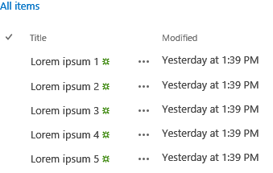

# Office Web Widgets - Experimental overview

> [!WARNING] 
> The Office Web Widgets - Experimental are only provided for research and feedback purposes. Do not use in production scenarios. The Office Web Widgets behavior may change significantly in future releases. Read and review the [Office Web Widgets - Experimental License Terms](office-web-widgetsexperimental-license-terms.md).

Client controls, such as the Office Web Widgets - Experimental, can greatly reduce the amount of time required to build add-ins, and at the same time, increase the quality of the add-ins. For this to be true, we have to be sure the widgets meet certain criteria.
 
Widgets must:

- Be designed to be used on any webpage, even if the page is not hosted on SharePoint.

- Work within the Office controls runtime. This lets us provide a common set of requirements and a consistent syntax to use the widgets.

- Communicate back to SharePoint using the cross-domain library. Widgets don't have a dependency on a particular server-side platform or technology, so you can use the widgets regardless of your choice of server technology.

- Coexist with other elements on the page. The inclusion of the widget on a page should not modify other elements in it.

- Play nice with existing frameworks. We want to be sure you can still use the tools and technologies that you are used to.

 

**An add-in using Office Web Widgets - Experimental**

 
You can use the widgets by installing the **Office Web Widgets - Experimental** NuGet package from Visual Studio. For more information, see [NuGet Package Manager UI](https://docs.microsoft.com/en-us/nuget/tools/package-manager-ui). You can also browse the [NuGet gallery page](https://www.nuget.org/packages/Microsoft.Office.WebWidgets.Experimental/).
 
Your feedback and comments helped us decide which widgets to provide. As you can see in the previous figure, the (1) People Picker and (2) Desktop List View widgets are ready for you to try. Please keep the feedback coming at the [Office Developer Platform UserVoice site](http://officespdev.uservoice.com/)
 
You can also see the widgets in action in the [Office Web Widgets - Experimental Demo](https://code.msdn.microsoft.com/office/SharePoint-2013-Office-Web-6d44aa9e) code sample.
 

## People Picker widget

You can use the experimental People Picker widget in add-ins to help your users find and select people and groups in a tenant. Users can start typing in the text box and the widget retrieves the people whose name or e-mail matches the text.

 

**People Picker widget solving a query**

 
You can declare the widget in the HTML markup or programmatically by using JavaScript. In either case, you use a **div** element as a placeholder for the widget. You can also set properties and event handlers for the People Picker widget. The following table shows the available properties and events in the People Picker widget.

 

|**Property/Event**|**Type**|**Description**|
|:-----|:-----|:-----|
|**objectType**|JSON Object (list of strings)| Type of items the widget will resolve. Options: User Group Default to user only.|
|**allowMultipleSelections**|Boolean|True/False. If False, the widget should allow selecting only one item at a time. Default=False.|
|**rootGroupName**|String|If provided, the widget limits the selection to items in this group. If not provided, the widget queries objects from the whole tenancy.|
|**selectedItems**|JSON array|List of items selected. Each item returns an object representing a user or group.|
|**onAdded**|Function|Event that fires when a new object is added to the selection. The handler function received the object added.|
|**onRemoved**|Function|Event that fires when a new object is removed from the selection. The handler function received the object removed.|
|**onChange**|Function|Either adding or removing objects triggers this event. No parameters are passed to the handler function.|
|**validationErrors**|Array| Array of possible validation errors: empty, unresolvedItem, tooManyItems|
|**autoShowValidationMessage**|Boolean|True=Show False=Don't show|
|**hasErrors**|Boolean|True= There are 1 or more validation errors False=There are no validation errors|
|**errors**|Array| Array of possible validation errors: empty, unresolvedItem, tooManyItems|
|**displayErrors**|Boolean|True=Display the errors False=Don't display the errors|

 

The CSS classes for the People Picker widget are defined in the **Office.Controls.css** style sheet. You can override the classes and style the widget for your add-in.
 
For more information, see  [Use the experimental People Picker widget in SharePoint Add-ins](use-the-experimental-people-picker-widget-in-sharepoint-add-ins.md) and [Use the People Picker experimental widget in an add-in](https://code.msdn.microsoft.com/office/SharePoint-2013-Use-the-57859f85) code sample.
 

## Desktop List View widget

Your users can benefit from the List View widget and display the data in a list just like the regular List View widget, but you can use it in your add-ins that are not necessarily hosted in SharePoint.

**Desktop List View widget displaying the data in a list**

 
You can specify an existing view on the list; the widget renders the fields in the order that they appear in the view.

> [!NOTE] 
> At this moment, the Desktop List View widget only displays the data. It doesn't offer editing capabilities.
 
You can provide a placeholder for the widget using a **div** element. You can programmatically or declaratively use the widget.

You also can set properties or event handlers for the Desktop List View widget. The following table shows the available properties and events in the Desktop List View widget.

 

|**Property/Event**|**Type**|**Description**|
|:-----|:-----|:-----|
|**listUrl**|URL|URL of the list view to draw items from. It can be a relative URL, in which case it is assumed to be located on the add-in web itself or an absolute URL.|
|**viewName**|String|Name of the view to show. This is the programmatic name of the view (not its display name).|
|**onItemSelected**|Function|Event that fires when an item is selected on the list.|
|**onItemAdded**|Function|Event that fires when a new item is added to the list.|
|**onItemRemoved**|Function|Event that fires when an item is removed from the list.|
|**selectedItems**|Array|List of selected items in JSON format.|

 

The widget requires the SharePoint website style sheet. You can reference the SharePoint style sheet directly or use the chrome widget. For more information about the style sheet, see  [Use a SharePoint website's style sheet in SharePoint Add-ins](use-a-sharepoint-website-s-style-sheet-in-sharepoint-add-ins.md) and [Use the client chrome control in SharePoint Add-ins](use-the-client-chrome-control-in-sharepoint-add-ins.md). 
 
To see the List View widget in action, see the [Use the Desktop List View experimental widget in an add-in](https://code.msdn.microsoft.com/office/sharepoint-2013-use-the-c3edb076) code sample. Also see [Use the experimental Desktop List View widget in SharePoint Add-ins](use-the-experimental-desktop-list-view-widget-in-sharepoint-add-ins.md).

Widgets can help to speed up the development process and reduce the cost and time-to-market of your add-ins. Office Web Widgets - Experimental provide widgets that you can use in your non-production add-ins. Your feedback and comments are welcome at the [Office Developer Platform UserVoice site](http://officespdev.uservoice.com/).

## See also

-  [Create UX components in SharePoint](create-ux-components-in-sharepoint.md)