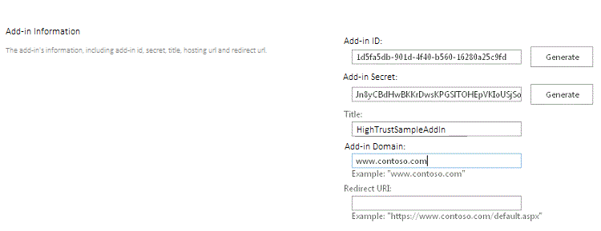
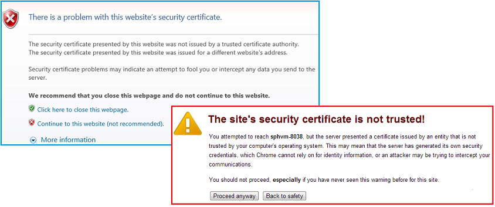

# Package and publish high-trust SharePoint Add-ins

<a name="Prereqs"> </a>

## Prerequisites 

You need the following:

- An on-premises SharePoint development environment. See [Set up an on-premises development environment for SharePoint Add-ins](set-up-an-on-premises-development-environment-for-sharepoint-add-ins.md) for the setup instructions.

- An IIS web server to host the remote web application. IIS Manager should be installed.    
 
- Visual Studio installed either remotely or on the computer where you have installed SharePoint.
     
- Microsoft Office Developer Tools for Visual Studio.    
 
- [Web Deploy](https://www.iis.net/downloads/microsoft/web-deploy) installed on the Visual Studio computer, and the same version of **Web Deploy** installed on the remote web application server.    
 
Table 1 lists some useful articles that can help you to understand the concepts involved in creating SharePoint Add-ins.

**Table 1. Core concepts for publishing high-trust add-ins**

|**Article Title**|**Description**|
|:-----|:-----|
| [Get started creating provider-hosted SharePoint Add-ins](get-started-creating-provider-hosted-sharepoint-add-ins.md)|Learn how to create a basic provider-hosted SharePoint Add-in with the Office Developer Tools for Visual Studio.|
| [Create high-trust SharePoint Add-ins](create-high-trust-sharepoint-add-ins.md)|Learn how to create a basic high-trust SharePoint Add-in with the Office Developer Tools for Visual Studio by using a self-signed certificate and an associated issuer ID.|
| [Web Deploy](https://www.iis.net/downloads/microsoft/web-deploy)|Web Deploy simplifies deployment of web applications and websites to IIS servers.|
| [Digital Certificates](https://msdn.microsoft.com/library/e523b335-0156-4f47-b55c-b80495587c4f.aspx) and<br/>[Working with Certificates](https://docs.microsoft.com/en-us/dotnet/framework/wcf/feature-details/working-with-certificates)|Learn the basic ideas behind digital certificates.|

> [!NOTE] 
> High-trust SharePoint Add-ins can only be installed to an on-premises SharePoint, not to SharePoint Online, and they are primarily intended for use with an on-premises, rather than cloud-based, web application. This article explains how to publish the add-in in that scenario. Also, in this article, 'customer' refers to the business that installs the SharePoint Add-in and hosts the remote components of the add-in.
 
<a name="Register"> </a>

## Register the high-trust add-in

Before you can publish the add-in, it has to be registered with the SharePoint farm's add-in management service. High-trust SharePoint Add-ins are always registered on the SharePoint farm on which the add-in is to be installed. (They cannot be sold through the Office Store.) Registration is done on the page `http://SharePoint_website/_layouts/15/appregnew.aspx` as described in the following procedure.

### To register the add-in

1. Go to the `http://SharePoint_website/_layouts/15/appregnew.aspx` page. 

2. Select the **Generate** buttons to generate values for the add-in ID and secret. (The secret is not actually used in high-trust SharePoint Add-ins, but the form requires one.) 

3. Provide the base URL of the domain where the remote web application of the add-in will run. Do not include the protocol (HTTPS) in the domain, but you have to include the port that the remote components will use for HTTPS requests if it is not 443 (for example,`www.contoso.com:5555 orMyAppServer:4444`).
    
4. If you need a redirect URI, enter a value for that also. For an explanation of how the redirect URI can be used, see [Authorization Code OAuth flow for SharePoint Add-ins](authorization-code-oauth-flow-for-sharepoint-add-ins.md).
    
    The form on the page should look similar to the following figure. In this example, the remote web application server is listening for HTTPS requests on the default port 443, so it's not necessary to specify the port in the add-in domain.

    

5. Select **Create**. The information that you entered for the add-in will be displayed on the next page. Be sure to keep this information available because you will need it when you use the Visual Studio publishing tools. Consider taking a quick screenshot of the page.
    
<a name="Certificate"> </a> 

## Choose a strategy for obtaining, maintaining and deploying certificates for high-trust SharePoint Add-ins

When a developer is using **F5** in Visual Studio to develop and debug a high-trust SharePoint Add-in, the developer can use a self-signed certificate, as described in [Create high-trust SharePoint Add-ins](create-high-trust-sharepoint-add-ins.md). However, when the add-in is *published*, using a self-signed certificate causes the browser to display a warning page before it opens the remote web application's start page. The user has to choose whether to proceed. The following figure shows examples of such warnings.

**Warnings for self-signed certificates**


 
This annoyance might be acceptable for a developer, but it would be unacceptable for customers. So before final publication to a production environment, the customer has to get a certificate that is signed by a trusted third party. The third party can be a commercial Certificate Authority (CA) or an on-premises CA. In regard to commercial CAs, note that the industry is phasing out "intranet-only" certificates for web servers; all such certificates expired in November 2016. It is not necessary to have this kind of certificate for a high-trust SharePoint Add-in, because certificates that can be used for Internet-facing web servers can also be used for intranet web servers, but the latter generally cost more. 

The certificate should be in two formats, Personal Information Exchange (pfx) and Security Certificate (cer). If it is not in either of these formats when originally obtained, the customer can convert it by using a utility. Also, after a pfx format version has been obtained, the pfx file can be imported into IIS, and then the cer version exported as described later in this article.

If the certificate is originally obtained is a cer format, it contains both the private and public keys. As a general practice, the .cer file that is used by SharePoint should not contain the private key. Consider importing the original certificate to IIS and then exporting a new cer version that does not include the private key as described later. For more information about .pfx and .cer files, see [Software Publisher Certificate](https://docs.microsoft.com/en-us/windows-hardware/drivers/install/software-publisher-certificate).

In addition, the customer has to consider whether to use a single certificate for all high-trust SharePoint Add-ins or separate certificates for each. For more information about this decision, see [Deciding between using one certificate or many for high-trust SharePoint Add-ins](creating-sharepoint-add-ins-that-use-high-trust-authorization.md#Deciding).
 

<a name="ConfigureRemote"> </a> 

## Configure the remote web server with the certificate

The following procedures are performed on the remote web server hosting the remote web application.

### To configure the remote web server and pfx certificate

1. Give the .pfx certificate a strong password. For more information, see [Guidelines for creating strong passwords](https://msdn.microsoft.com/en-us/library/bb416446.aspx) and [Strong passwords](https://docs.microsoft.com/en-us/sql/relational-databases/security/strong-passwords).

2. Import the certificate into IIS on the remote web server with these steps:
    
    1. In IIS Manager, select the _ServerName_ node in the tree view on the left.
        
    2. Double-click the **Server Certificates** icon.
        
    3. Select **Import** in the **Actions** pane on the right.
        
    4. In the **Import Certificate** dialog, use the **Browse** button to browse to the .pfx file, and then enter the password of the certificate.
        
    5. If you are using IIS Manager 8, there is a **Select Certificate Store** list. Select **Personal**. (This refers to the "personal" certificate storage of the computer, not the user.)
        
    6. If you don't already have a cer version, or you do but it includes the private key, enable **Allow this certificate to be exported**.
        
    7. Select **OK**.
    
 
### To open the Windows Certificate Store

1. On the same server, open the **Microsoft Management Console** as described in [Open MMC 3.0](https://technet.microsoft.com/en-us/library/cc766121.aspx).    
 
2. Add the **Certificates** snap-in for the computer account as described in [Add the Certificates Snap-in to an MMC](https://technet.microsoft.com/en-us/library/cc754431.aspx). Be sure to use the procedure for the *computer*, not a user or service. Select the *local*  computer, not "another" computer, when prompted.
    
Skip the next procedure if you are using ISS Manager 8.

### Additional steps for ISS Manager 7 to get the certificate into the Windows Certificate Store

1. Create a folder on the server file system to be used as a very temporary storage place for the certificate.    
 
2. In IIS Manager, select the _ServerName_ node in the tree view on the left.    
 
3. Double-click the **Server Certificates** icon.    
 
4. In the **Server Certificates** list, right-click the certificate, and then select **Export**.
    
    

5. Export the file to the folder that you created, and enter its password.

6. In the **Microsoft Management Console**, import the certificate as described in [Import a Certificate](https://technet.microsoft.com/en-us/library/cc754489.aspx). Be sure to specify the **Personal** store.

7. Leave the console open for the next procedure.

8. Delete the folder that you created in the first step and the certificate file in it. The security advantages of keeping the certificate in the certificate store are defeated if it is also on the file system.

The next procedure applies to both IIS Manager 7 and 8.


### To get the serial number of the certificate

1. In the **Microsoft Management Console**, navigate to the **Certificates** folder under the **Personal** folder of the **Certificates (Local Computer)** snap-in, if it is not already open.    
 
2. Double-click the certificate for your SharePoint Add-in to open it, and then open the **Details** tab.   
 
3. Select the **Serial Number** field to make the entire serial number visible in the box.    
 
4. Copy the serial number, *without the spaces*, to a text file, and give it to the developer of the SharePoint Add-in.
    
    > [!TIP] 
    > Some developer blog posts and forum questions report that copying the serial number directly into the clipboard creates a string with hidden characters that makes the serial number unrecognizable to code in the SharePoint Add-in. Consider manually typing the number instead of copying it.

Next you create a cer version of the certificate. This contains the public key of the remote web server and is used by SharePoint to unencrypt requests from the remote web application and validate the access tokens in those requests. It is created on the remote web server and then moved to the SharePoint farm.

### To create the cer certificate

1. In IIS manager, select the _ServerName_ node in the tree view on the left.    
 
2. Double-click **Server Certificates**.    
 
3. In **Server Certificates** view, double-click the certificate to display the certificate details.   
 
4. On the **Details** tab, select **Copy to File** to launch the **Certificate Export Wizard**, and then select **Next**.  
5. Use the default value **No, do not export the private key**, and then select **Next**.    
 
6. Use the default values on the next page, and then select **Next**.   
 
7. Select **Browse** and browse to any folder. (The cer file is going to be moved off of this computer anyway.) Give the file the same name as the pfx file, and then select **Save**. The certificate is saved as a .cer file.   
 
8. Select **Next**.   
 
9. Select **Finish**.
    

<a name="ConfigureSP"> </a>

## Configure SharePoint to use the certificate

The procedures in this section can be performed on any SharePoint server on which the **SharePoint Management Shell** is installed.

### To distribute the cer file to SharePoint

1. Create a folder and ensure that the add-in pool identities for the following IIS add-in pools have Read rights:
    
    - **SecurityTokenServiceApplicationPool**
        
    - The add-in pool that serves the IIS web site that hosts the parent SharePoint web application for your test SharePoint website. For the **SharePoint - 80** IIS website, the pool is called **OServerPortalAppPool**.
     
2. *Move* (don't merely copy) the .cer file from the remote web server to the folder you just created on the SharePoint server. The file will be in this folder only temporarily.    
 
The following procedure configures the certificate as a trusted token issuer in SharePoint. It is performed just once (for each high-trust SharePoint Add-in).

### To configure the certificate

1. If you have not done so already, create the high-trust configuration Windows PowerShell script or scripts that you need, as described in [High-trust configuration scripts for SharePoint](high-trust-configuration-scripts-for-sharepoint.md).
    
2. Copy the scripts to the SharePoint server.
 
3. Open the **SharePoint Management Shell** as an administrator and run the appropriate scripts.    
 
4. One of the scripts is intended for use when the customer is sharing a single certificate among multiple SharePoint Add-ins. That script outputs a file that contains the GUID for the token issuer. If you use that script, give the file that it outputs to the developer of the high-trust SharePoint Add-in.    
 
5. Delete the cer file from the file system of the SharePoint server. 
    
    > [!NOTE] 
    > The registration of the certificate as a token issuer is not effective immediately, and the add-in will not work until it is. It may take as long as 24 hours before all the SharePoint servers recognize the new token issuer. Running an iisreset on all the SharePoint servers, if you can do that without disturbing SharePoint users, would cause them to immediately recognize the issuer.

<a name="WebConfig"> </a>

## Modify the web.config file

> [!TIP] 
> For a code sample that includes a modified web.config, see [PnP/Samples/Core.OnPrem.S2S.WindowsCertStore](https://github.com/SharePoint/PnP/tree/dev/Samples/Core.OnPrem.S2S.WindowsCertStore).
 
Edit the web.config file so that it contains new values for the following keys in the `appSettings` node:

    - **ClientID:** This is the web application's client ID (GUID) that was generated on appregnew.aspx.

    - **ClientSigningCertificateSerialNumber:** *(You will need to add this key, if the Microsoft Office Developer Tools for Visual Studio did not add it.)*  This is the serial number of the certificate. There should be no spaces or hyphens in the value.

    - **IssuerId:** This is the GUID of token issuer (*which must be lowercase*). Its value depends on the certificate strategy of the customer:
        
        - If the high-trust SharePoint Add-in has its own certificate that it is not sharing with other SharePoint Add-ins, the  `IssuerId` is the same as the `ClientId`.
            
        - If the SharePoint Add-in is sharing the same certificate that other SharePoint Add-ins are using, the `IssuerId` is an arbitrary GUID. The script for this scenario that you can find in [High-trust configuration scripts for SharePoint](high-trust-configuration-scripts-for-sharepoint.md) generates a text file with this GUID in it. The IT staff can pass the outputted file to the add-in developer for insertion as the `IssuerId` in the web.config file.
    
> [!NOTE] 
> The Office Developer Tools for Visual Studio may have added add-in setting keys for **ClientSigningCertificatePath** and **ClientSigningCertificatePassword**. These are not used in a production add-in and should be deleted.
 

The following is an example. Note that there is no **ClientSecret** key for a high-trust SharePoint Add-in.

```XML
<appSettings>
  <add key="ClientID" value="c1c12d4c-4900-43c2-8b89-c05725e0ba30" />
  <add key="ClientSigningCertificateSerialNumber" value="556a1c9c5a5415994941abd0ef2f947b" />
  <add key="IssuerId" value="f94591d5-89e3-47cd-972d-f1895cc158c6" />
</appSettings>

```

<a name="WebConfig"> </a>

## Modify the TokenHelper file

The TokenHelper.cs (or .vb) file generated by Office Developer Tools for Visual Studio needs to be modified to work with the certificate stored in the Windows Certificate Store and to retrieve it by its serial number. The following example shows one way. The example uses C#.
 
> [!TIP] 
> For a code sample that includes a modified tokenhelper.cs, see [PnP/Samples/Core.OnPrem.S2S.WindowsCertStore](https://github.com/SharePoint/PnP/tree/dev/Samples/Core.OnPrem.S2S.WindowsCertStore).
 

### To modify the TokenHelper

1. Near the bottom of the `#region private fields` part of the file are declarations for `ClientSigningCertificatePath`,  `ClientSigningCertificatePassword`, and  `ClientCertificate`. Remove all three.   
 
2. In their place, add the following line:
    
    ```csharp
    private static readonly string ClientSigningCertificateSerialNumber 
        = WebConfigurationManager.AppSettings.Get("ClientSigningCertificateSerialNumber");
    ```

3. Find the line that declares the `SigningCredentials` field. Replace it with the following line:
    
    ```csharp
    private static readonly X509SigningCredentials SigningCredentials 
        = GetSigningCredentials(GetCertificateFromStore());
    ```

4. Go to the `#region private methods` part of the file and add the following two methods:
    
    ```csharp
    private static X509SigningCredentials GetSigningCredentials(X509Certificate2 cert)
    {
        return (cert == null) ? null 
                            : new X509SigningCredentials(cert, 
                                                        SecurityAlgorithms.RsaSha256Signature, 
                                                        SecurityAlgorithms.Sha256Digest);
    }

    private static X509Certificate2 GetCertificateFromStore()
    {
        if (string.IsNullOrEmpty(ClientSigningCertificateSerialNumber))
        {
            return null;
        }  

        // Get the machine's personal store
        X509Certificate2 storedCert;
        X509Store store = new X509Store(StoreName.My, StoreLocation.LocalMachine); 

        try
        {
            // Open for read-only access                 
            store.Open(OpenFlags.ReadOnly);

            // Find the cert
            storedCert = store.Certificates.Find(X509FindType.FindBySerialNumber, 
                                                ClientSigningCertificateSerialNumber, 
                                                true)
                        .OfType<X509Certificate2>().SingleOrDefault();
        }
        finally
        {
            store.Close();
        }

        return storedCert;
    }
    ```

<br/>

<a name="Package"> </a>

## Use the Visual Studio wizards to package your remote web application and SharePoint Add-in for publishing

> [!TIP] 
> Microsoft updates Visual Studio and Office Developer Tools for Visual Studio on a much more frequent schedule than in the past, and documentation cannot always be updated to keep up with the changes. This section was written using the version of Visual Studio released in October 2013, and the version of Office Developer Tools for Visual Studio that was included in it. If you are working with an earlier or later version of either Visual Studio or the tools, you may need to consult Visual Studio help and blog posts to find the equivalent ways of carrying out the steps in these procedures.

### To package the remote web application

1. In **Solution Explorer**, right-click the web application project (not the SharePoint Add-in project), and select **Publish**.     
 
2. On the **Profile** tab, select **New Profile** on the drop-down list.    
 
3. When prompted, give the profile an appropriate name. For example, **Payroll SP add-in - Remote Web Application**.    
 
4. On the **Connection** tab, select **Web Deploy Package** in the **Publish method** list.    
 
5. For **Package location**, use any folder. To simplify later procedures, this should be an empty folder. The subfolder of the bin folder of the project is typically used.   
 
6. For the site name, enter the name of the IIS website that will host the web application. Do not include protocol or port or slashes in the name; for example **PayrollSite**. If you want the web application to be a child of the Default Web Site, use `Default Web Site/<website name>`; for example, **Default Web Site/PayrollSite**. (If the IIS website does not already exist, it is created when you execute the Web Deploy package in a later procedure.)   
 
7. Select **Next**.    
 
8. On the **Settings** tab, select either **Release** or **Debug** in the **Configuration** list.    
 
9. Select **Next** > **Publish**. A zip file and various other files that are used to install the web application in a later procedure are created in the package location.    
 

### To create a SharePoint Add-in package

1. Right-click the SharePoint Add-in project in your solution, and then select **Publish**.
    
2. In the **Current profile** list, select the profile that you created in the last procedure.    
 
3. If a small yellow warning symbol appears next to the **Edit** button, select **Edit**. A form opens asking for the same information that you included in the web.config file. This information is not required because you are using the **Web Deploy Package** publishing method, but you cannot leave the form blank. Enter any characters in the four text boxes, and select **Finish**.    
 
4. Select the **Package the add-in** button. (Do not select **Deploy your web project**. This button simply repeats what you did in the final step of the last procedure.) A **Package the add-in** form opens.    
 
5. In the **Where is your website hosted?** box, enter the URL of the domain of the remote web application. You must include the protocol, HTTPS, and if the port that the web application listens for HTTPS requests is not 443, you must include the port as well; for example, https://MyServer:4444. (This is the value that Office Developer Tools for Visual Studio uses to replace the ~remoteAppUrl token in the add-in manifest for the SharePoint Add-in.)    
 
6. In the **What is the add-in's Client ID?** box, enter the client ID that was generated on the appregnew.aspx page, and which you also entered in the web.config file.    
 
7. Select **Finish**. Your add-in package is created.
   
<a name="PublishRemote"> </a> 

## Publish the remote web application and install the SharePoint Add-in

### To publish the web application

1. Navigate to the folder that you used as the **Package location** when you packaged the remote web application, and then copy all the files in it to a folder on the remote server.    
 
2. In this folder, open the _project_name_.deploy-readme.txt file (where _project_name_ is the name of the Visual Studio web application project), and follow the instructions in the file to install the web application by using the _project_name_.deploy.cmd file.    
 

### To configure protocol binding for the web application

1. In IIS Manager, select the new website in the **Connections** pane. (If the new web application is a child of the **Default Web Site**, select the **Default Web Site** and carry out this procedure for the **Default Web Site**.)    
 
2. Select **Bindings** in the **Actions** pane.    
 
3. Select **Add** in the **Site Bindings** dialog. In the **Add Site Binding** dialog that opens, take the following steps:
    
    1. Select **HTTPS** in the **Type** list.
        
    2. Select **All Unassigned** in the **IP address** list.
        
    3. Enter the port in the **Port** box. If you specified a port in the add-in domain when you registered the SharePoint Add-in on appregnew.aspx (as described in [Register the high-trust add-in](#Register)), you have to use the same number here. If you did not specify a port on appregnew, use 443 here.
        
    4. In the **SSL certificate** list, select the certificate that you used to configure the server in [Configure the remote web server with the certificate](#ConfigureRemote) earlier.
        
    5. Select **OK**.
    
4. Select **Close**.
    
 
### To configure authentication for the web application

1. When a new web application is installed in IIS, it is initially configured for anonymous access, but almost all high-trust SharePoint Add-in are designed to require authentication of users, so you need to change it. In IIS Manager, select the web application in the **Connections** pane. It is either a peer website of the Default Web Site or a child of the Default Web Site.    
 
2. Double-click the **Authentication** icon in the center pane to open the **Authentication** pane.    
 
3. Select **Anonymous Authentication**, and then select **Disable** in the **Actions** pane.    
 
4. Select the authentication system that the web application is designed to use, and select **Enable** in the **Actions** pane.
    
    If the web application's code uses the generated code in the TokenHelper and SharePointContext files without modifications to the user authentication parts of the files, the web application is using **Windows Authentication**, so that is the option you should enable.
     
5. If you are using the generated code files without modifications to the user authentication parts of the files, you also need to configure the authentication provider with the following steps:
    
    1. Select **Windows Authentication** in the **Authentication** pane.
        
    2. Select **Providers**.
        
    3. In the **Providers** dialog, ensure that **NTLM** is listed *above* **Negotiate**.
        
    4. Select **OK**.
    
 

### To upload and install the SharePoint Add-in

1. Upload the *.app package file of the SharePoint Add-in to the organization add-in catalog. (High-trust SharePoint Add-ins cannot be distributed through the Office Store.) For details, see [Add add-ins to the Add-in Catalog](http://technet.microsoft.com/en-us/library/fp161234.aspx#AddApps).
    
2. Install the add-in on any website within the same parent SharePoint web application that contains the add-in catalog. For details about uploading and installing the SharePoint Add-in, see [Add SharePoint Add-ins to a SharePoint site](http://technet.microsoft.com/en-us/library/fp161231).
    
 

## See also

- [Publish SharePoint Add-ins by using Visual Studio](publish-sharepoint-add-ins-by-using-visual-studio.md)
- [Register SharePoint Add-ins](register-sharepoint-add-ins.md)
- [Creating SharePoint Add-ins that use high-trust authorization](creating-sharepoint-add-ins-that-use-high-trust-authorization.md)
- [Authorization and authentication of SharePoint Add-ins](authorization-and-authentication-of-sharepoint-add-ins.md)
    
 

