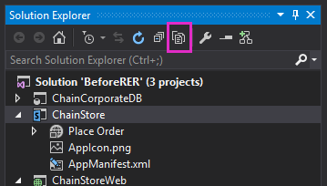

# Programmatically deploy a custom button in the provider-hosted add-in

This is the ninth in a series of articles about the basics of developing provider-hosted SharePoint Add-ins. You should first be familiar with [SharePoint Add-ins](sharepoint-add-ins.md) and the previous articles in this series, which you can find at [Get started creating provider-hosted SharePoint Add-ins](get-started-creating-provider-hosted-sharepoint-add-ins.md#SP15createprovider_nextsteps). 

> [!NOTE]
> If you have been working through this series about provider-hosted add-ins, you have a Visual Studio solution that you can use to continue with this topic. You can also download the repository at [SharePoint_Provider-hosted_Add-Ins_Tutorials](https://github.com/OfficeDev/SharePoint_Provider-hosted_Add-ins_Tutorials) and open the BeforeProgrammaticButton.sln file.

In this article, you learn how to include a custom ribbon button in a SharePoint Add-in when the list whose ribbon gets the button is itself being programmatically deployed in the very same add-in.

## Re-add the custom button to the project

> [!NOTE]
> The settings for Startup Projects in Visual Studio tend to revert to defaults whenever the solution is reopened. Always take these steps immediately after reopening the sample solution in this series of articles: 
> 1. Right-click the solution node at the top of **Solution Explorer**, and then select **Set startup projects**.  
> 2. Ensure that all three projects are set to **Start** in the **Action** column.

In the previous article, you removed the custom **AddEmployeeToCorpDB** ribbon button from the project. Add it back in with the following steps.

1. On the toolbar at the top of **Solution Explorer**, select the **Show All Files** button.

   *Figure 1. Solution Explorer toolbar*

   

2. In the **ChainStore** project, right-click **AddEmployeeToCorpDB**, and then select **Include in Project**.

3. Select the **Show All Files** button again.

4. In the **ChainStore** project, expand **AddEmployeeToCorpDB**, and then open the elements.xml file.

## Understand a dilemma and its solution

In the elements.xml file, the **RegistrationId** attribute of the **CustomAction** element identifies the list on whose ribbon the button is added: `{$ListId:Lists/Local Employees;}`. This worked fine when the list had already been added to the host web manually. But now that we are deploying the list programmatically in first-run logic, the list doesn't exist when SharePoint installs the add-in and tries to deploy the button. The installation of the add-in would throw an exception and fail.

Deploying the list in the installation event handler, instead of first-run logic, won't solve the dilemma because SharePoint deploys custom descriptively-defined components, such as the custom button (and the **Place Order** add-in part), *before* it runs the custom handler, so the list won't exist when SharePoint tries to deploy the button.

Creating a custom button entirely programmatically is not practical for reasons that are too advanced to discuss here. Fortunately, it is not necessary. There is a relatively painless way to semi-programmatically create a custom button and assign it to a custom list. 

The following are the basic steps:

1. Keep the descriptively defined button in the project, but assign it to the ribbon of something that always exists on SharePoint sites, instead of to a list that's programmatically deployed with the same add-in. 

2. In the first-run logic, after the list is programmatically created, programmatically add an undefined button to the ribbon of the list.

3. Initialize the properties of the new button with the values of the original button. At this point there are two identical buttons. The second is assigned to the ribbon of the **Local Employees** list.

4. Programmatically delete the original button.

## Programmatically register the custom button

The following procedure shows how to implement this strategy.

1. In the **ChainStore** project, expand **AddEmployeeToCorpDB**, open the elements.xml file, and then change the value of the **RegistrationId** attribute of the **CustomAction** element to "100". This is the ID of a type of list. Even if there are no instances of lists of this type on the website, the list *type* is on every SharePoint website. The attribute should now look like the following.
    
    ```XML
      RegistrationId="100"
    ```

2. In the file SharePointComponentDeployer.cs, add the following line to the **DeployChainStoreComponentsToHostWeb** method, just under the line that calls `CreateLocalEmployeesList` (you create this method in the next step).
    
    ```csharp
      ChangeCustomActionRegistration();
    ```

3. Add the following method to the `SharePointComponentDeployer` class. 

    ```csharp
	  private static void ChangeCustomActionRegistration()
	{
	    using (var clientContext = sPContext.CreateUserClientContextForSPHost())
	    {
		 var query = from action in clientContext.Web.UserCustomActions
			     where action.Name == "{button_GUID} .AddEmployeeToCorpDB"
			     select action;
		  IEnumerable<UserCustomAction> matchingActions = clientContext.LoadQuery(query);	       
			 clientContext.ExecuteQuery();

		  UserCustomAction webScopedEmployeeAction = matchingActions.Single();

		 // TODO8: Get a reference to the (empty) collection of custom actions 
		 // that are registered with the custom list.

		 // TODO9: Add a blank custom action to the list's collection.

		 // TODO10: Copy property values from the descriptively deployed
		 // custom action to the new custom action

		// TODO11: Delete the original custom action.         

		  clientContext.ExecuteQuery();
	    }
	}
    ```

   Note the following about this code:
    
   - Because the custom action, that is, the custom button, was registered with the ribbon of a list *type*, it is scoped to the entire website and is in the website's collection of custom actions. So the code retrieves it from that collection.
    
   - The value of the `action.Name` comes from the **ID** attribute of the **CustomAction** element in the element.xml file in **AddEmployeeToCorpDB**.
    
   > [!IMPORTANT]
   > **You must change the `action.Name` value in the code to match the value in your elements.xml file.** The GUID part of the name will be different. Note that there is a `"."` character between the GUID and the rest of the name. The following is an example of the line: 
   > 
   > `where action.Name == "4a926a42-3577-4e02-9d06-fef78586b1bc.AddEmployeeToCorpDB"`

4. Replace `TODO8` with the following code. Note that when you retract an add-in, components created by the add-in are not removed. After your first-run logic executes, there will be a custom action in the list's **UserCustomActions** collection, and it will not be retracted the next time you select F5. To avoid confusion, the last line in this code `listActions.Clear();` empties the collection.

    ```csharp
	var queryForList = from list in clientContext.Web.Lists
			   where list.Title == "Local Employees"
			   select list;
	IEnumerable<List> matchingLists = clientContext.LoadQuery(queryForList);
	clientContext.ExecuteQuery();

	List employeeList = matchingLists.First();
	var listActions = employeeList.UserCustomActions;
	clientContext.Load(listActions);
	listActions.Clear();
    ```

5. Replace `TODO9` with the following line, which adds an undefined custom action to the **Local Employees** list.
    
    ```csharp
      var listScopedEmployeeAction = listActions.Add();
    ```

6. Replace `TODO10` with the following code. 

    ```csharp
	listScopedEmployeeAction.Title = webScopedEmployeeAction.Title;
	listScopedEmployeeAction.Location = webScopedEmployeeAction.Location;
	listScopedEmployeeAction.Sequence = webScopedEmployeeAction.Sequence;
	listScopedEmployeeAction.CommandUIExtension = webScopedEmployeeAction.CommandUIExtension;
	listScopedEmployeeAction.Update();
    ```

   Note the following about this code:
    
   - It assigns the property values of the web-scoped button (that was deployed with descriptive markup) to the corresponding properties of the list-scoped button, so the two buttons are identical except in scope.
    
   - The **Sequence** property specifies the relative order that the button will appear in its area of the ribbon. In this case, the button is on the **Actions** section of the **Items** tab of the ribbon. In the descriptive markup, this value was set to 10001, which is high enough to ensure that it will appear after (that is, to the right of) any in-the-box buttons that SharePoint itself puts in the **Actions** section of the ribbon.

7. Replace `TODO11` with the following line, which deletes the original descriptively-defined button. If we did not have this line, every list on the website that uses list template "100" would have the custom button on it. Because the button's functionality is closely tied to the **Local Employees** list, it would make no sense to have the button on any other list. Also, without this line, the button would appear *twice*  on the **Local Employees** list, because that list uses template "100".
    
    ```csharp
      webScopedEmployeeAction.DeleteObject();
    ```
    
8. The entire method should now look like the following (except there should be a GUID in place of the placeholder).
    
    ```csharp
	  private static void ChangeCustomActionRegistration()
	{
	    using (var clientContext = SPContext.CreateUserClientContextForSPHost())
	    {
		 var query = from action in clientContext.Web.UserCustomActions
			     where action.Name == "{button_GUID} .AddEmployeeToCorpDB"
			     select action;
		  IEnumerable<UserCustomAction> matchingActions = clientContext.LoadQuery(query);	       
			 clientContext.ExecuteQuery();

		  UserCustomAction webScopedEmployeeAction = matchingActions.Single();

		 var queryForList = from list in clientContext.Web.Lists
				    where list.Title == "Local Employees"
				    select list;
		 IEnumerable<List> matchingLists = clientContext.LoadQuery(queryForList);
		 clientContext.ExecuteQuery();

		List employeeList = matchingLists.First();
		var listActions = employeeList.UserCustomActions;
		clientContext.Load(listActions);
		listActions.Clear();

		var listScopedEmployeeAction = listActions.Add();

		listScopedEmployeeAction.Title = webScopedEmployeeAction.Title;
		listScopedEmployeeAction.Location = webScopedEmployeeAction.Location;
		listScopedEmployeeAction.Sequence = webScopedEmployeeAction.Sequence;
		listScopedEmployeeAction.CommandUIExtension = webScopedEmployeeAction.CommandUIExtension;
		listScopedEmployeeAction.Update();

		webScopedEmployeeAction.DeleteObject();         

		clientContext.ExecuteQuery();
	    }
	}
    ```


## Request full control of the host web

Because the add-in now adds and deletes web-scoped custom actions, we need to escalate the permissions that the add-in requests from Manage to Full Control:

1. In **Solution Explorer**, open the AppManifest.xml file in the **ChainStore** project.

2. Open the **Permissions** tab. Leave the **Scope** value at **Web**, but in the **Permission** field, select **Full Control** from the drop-down.

3. Save the file.

## Run the add-in and test the button deployment

1. Open the **Site Contents** page of the Hong Kong store's website and remove the **Local Employees** list. 
    
   > [!NOTE]
   > Retracting an add-in in Visual Studio does not remove lists that are created by the add-in, so you need to manually delete it any time you are testing code that creates it.

2. Use the F5 key to deploy and run your add-in. Visual Studio hosts the remote web application in IIS Express and hosts the SQL database in SQL Express. It also makes a temporary installation of the add-in on your test SharePoint site and immediately runs the add-in. You are prompted to grant permissions to the add-in before its start page opens.

3. When the add-in's start page opens, select the **Back to Site** link on the chrome control at the top.

4. Go to the **Site Contents** page. The **Local Employees** list is present because your first-run logic added it.
    
   > [!NOTE]
   > If the list is not there or you have other indications that the first-run code is not executing, it may be that the **Tenants** table is not being reverted to an empty state when you select F5. The most common cause of this is that the **ChainCorporateDB** project is no longer set as a startup project in Visual Studio. See the [note near the top of this article](#re-add-the-custom-button-to-the-project) for how to fix this. Also be sure that you've configured the database to be rebuilt as described in [Configure Visual Studio to rebuild the corporate database with each debugging session](give-your-provider-hosted-add-in-the-sharepoint-look-and-feel.md#Rebuild).

5. Open the list and add an item.

6. In the list view, select the item, and then open the **Item** tab on the ribbon. 

7. On the **Item** tab, select the **Add to Corporate DB** button. The employee is added to the corporate database, and the **Added to Corporate DB** field is changed to **Yes**.

8. Go back to the **Site Contents** page and select **Add an add-in**.

9. Add a new **Custom List**. By default it will be "Generic" type (Generic is list type 100). After the list is created, open the **Item** tab on the ribbon. Notice that the **Add to Corporate DB** button is *not*  on the ribbon. This is because your code deleted the web-scoped button.

10. To end the debugging session, close the browser window or stop debugging in Visual Studio. Each time that you select F5, Visual Studio retracts the previous version of the add-in and installs the latest one.

11. You will work with this add-in and Visual Studio solution in other articles, and it's a good practice to retract the add-in one last time when you are done working with it for a while. Right-click the project in **Solution Explorer** and select **Retract**.

## Next steps
<a name="Nextsteps"> </a>

Events on lists and list items can also have custom handlers in SharePoint. You will learn how to create one and deploy it in your first-run logic in [Handle list item events in the provider-hosted add-in](handle-list-item-events-in-the-provider-hosted-add-in.md).
 

 

