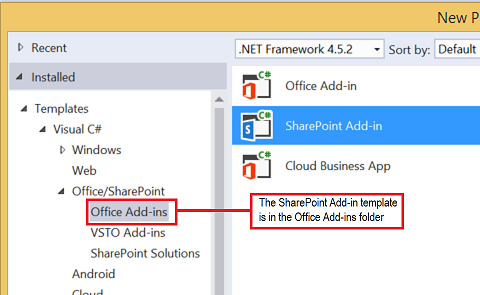

# Query a remote service using the web proxy in SharePoint 2013
Learn how to access data in a remote domain from a page that is hosted in SharePoint 2013 by using the web proxy.
 

 **Note**  The name "apps for SharePoint" is changing to "SharePoint Add-ins". During the transition, the documentation and the UI of some SharePoint products and Visual Studio tools might still use the term "apps for SharePoint". For details, see  [New name for apps for Office and SharePoint](new-name-for-apps-for-sharepoint.md#bk_newname).
 

When you are building SharePoint Add-ins, you usually have to incorporate data from various sources. For security reasons, there are blocking mechanisms that prevent cross-domain communication. When you use the web proxy, the webpages in your add-in can access data in your remote domain and the SharePoint domain.
 

As a developer, you can use the web proxy exposed in client APIs, such as the JavaScript and .NET client object models. When you use the web proxy, you issue the initial request to SharePoint. In turn, SharePoint requests the data to the specified endpoint and forwards the response back to your page. Use the web proxy when you want the communication to occur at the server level. For more information, see  [Secure data access and client object models for SharePoint Add-ins](secure-data-access-and-client-object-models-for-sharepoint-add-ins.md).
 


**SharePoint Web Proxy is middle man between your code and external data source**

 

 

 

 

 

## Prerequisites for using the examples in this article
<a name="SP15Queryremoteservice_Prereq"> </a>

To follow the steps in this example, you need the following:
 

 

-  [Visual Studio 2015 and the latest Microsoft Office Developer Tools](https://www.visualstudio.com/features/office-tools-vs.aspx)
    
 
- A SharePoint 2013 development environment (add-in isolation required for on-premises scenarios)
    
 

### Core concepts to know before using the web proxy

The following table lists some useful articles that can help you understand the concepts involved in a cross-domain scenario in SharePoint Add-ins.
 

 

**Table 1. Core concepts for the web proxy**


|**Article title**|**Description**|
|:-----|:-----|
| [SharePoint Add-ins](sharepoint-add-ins.md)|Learn about the new add-in model in SharePoint 2013 that enables you to create add-ins, which are small, easy-to-use solutions for end users.|
| [Secure data access and client object models for SharePoint Add-ins](secure-data-access-and-client-object-models-for-sharepoint-add-ins.md)|Learn about data access options in SharePoint Add-ins. This article provides guidance on the high-level alternatives you have to choose from when working with data in your add-in.|
| [Host webs, add-in webs, and SharePoint components in SharePoint 2013](host-webs-add-in-webs-and-sharepoint-components-in-sharepoint-2013.md)|Learn about the difference between host webs and add-in webs. Find out which SharePoint 2013 components can be included in a SharePoint Add-in, which components are deployed to the host web, which components are deployed to the add-in web, and how the add-in web is deployed in an isolated domain.|
| [Client-side Cross-domain Security](http://msdn.microsoft.com/en-us/library/cc709423%28v=vs.85%29.aspx)|Explore cross-domain threats and use cases, security principles for cross-origin requests, and weigh the risks for developers to enhance cross-domain access from web applications that run in the browser.|

## Code example: Access data in a remote service using the web proxy
<a name="SP15Queryremoteservice_Codeexample"> </a>

To read data from a remote service, you must do the following: 
 

 

1. Create a SharePoint Add-in project.
    
 
2. Modify the  **Default.aspx** page to use the web proxy to query the remote service.
    
 
3. Modify the add-in manifest to allow communication to the remote domain.
    
 
Figure 1 shows the browser window with data from the remote service in a SharePoint webpage.
 

 

**Figure 1. SharePoint webpage with data from the remote service**

 

 

 

### To create the SharePoint Add-in project


1. Open 2015 as administrator. (To do this, right-click the 2015 icon in the  **Start** menu, and choose **Run as administrator**.)
    
 
2. Create a new project using the  **SharePoint Add-in** template
    
    Figure 2 shows the location of the  **SharePoint Add-in** template in 2015, under **Templates**,  **Visual C#**,  **Office/SharePoint**,  **Office Add-ins**.
    

    **Figure 2. SharePoint Add-in Visual Studio template**

 

  
 

 

 
3. Provide the URL of the SharePoint website that you want to use for debugging.
    
 
4. Select  **SharePoint-hosted** as the hosting option for your add-in.
    
 

### To modify the Default.aspx page to use the web proxy by using the JavaScript object model


1. Double-click the  **Default.aspx** page in the **Pages** folder.
    
 
2. Copy the following markup and paste it in the  **PlaceHolderMain** content tag of the page. The markup performs the following tasks:
    
      - Provides a placeholder for the remote data.
    
 
  - References the SharePoint JavaScript files.
    
 
  - Prepares the request with a  **WebRequestInfo** object.
    
 
  - Prepares the request  **Accept** header to specify the response in the JavaScript Object Notation (JSON) format.
    
 
  - Issues a call to the remote endpoint.
    
 
  - Handles successful completion, rendering the remote data in the SharePoint webpage.
    
 
  - Handles any errors, rendering the error message in the SharePoint webpage.
    
 

```
  Categories from the Northwind database exposed as an OData service: 
    
<!-- Placeholder for the remote content -->
<span id="categories"></span>

<!-- Add references to the JavaScript libraries. -->
<script 
    type="text/javascript" 
    src="../_layouts/15/SP.Runtime.js">
</script>
<script 
    type="text/javascript" 
    src="../_layouts/15/SP.js">
</script>
<script type="text/javascript">
(function () {
    "use strict";

    // Prepare the request to an OData source
    // using the GET verb.
    var context = SP.ClientContext.get_current();
    var request = new SP.WebRequestInfo();
    request.set_url(
        "http://services.odata.org/Northwind/Northwind.svc/Categories"
        );
    request.set_method("GET");

    // We need the response formatted as JSON.
    request.set_headers({ "Accept": "application/json;odata=verbose" });
    var response = SP.WebProxy.invoke(context, request);

    // Let users know that there is some
    // processing going on.
    document.getElementById("categories").innerHTML =
                "<P>Loading categories...</P>";

    // Set the event handlers and invoke the request.
    context.executeQueryAsync(successHandler, errorHandler);

    // Event handler for the success event.
    // Get the totalResults node in the response.
    // Render the value in the placeholder.
    function successHandler() {

        // Check for status code == 200
        // Some other status codes, such as 302 redirect
        // do not trigger the errorHandler. 
        if (response.get_statusCode() == 200) {
            var categories;
            var output;

            // Load the OData source from the response.
            categories = JSON.parse(response.get_body());

            // Extract the CategoryName and Description
            // from each result in the response.
            // Build the output as a list.
            output = "<UL>";
            for (var i = 0; i < categories.d.results.length; i++) {
                var categoryName;
                var description;
                categoryName = categories.d.results[i].CategoryName;
                description = categories.d.results[i].Description;
                output += "<LI>" + categoryName + ":&amp;nbsp;" +
                    description + "</LI>";
            }
            output += "</UL>";

            document.getElementById("categories").innerHTML = output;
        }
        else {
            var errordesc;

            errordesc = "<P>Status code: " +
                response.get_statusCode() + "<br/>";
            errordesc += response.get_body();
            document.getElementById("categories").innerHTML = errordesc;
        }
    }

    // Event handler for the error event.
    // Render the response body in the placeholder.
    // The body includes the error message.
    function errorHandler() {
        document.getElementById("categories").innerHTML =
            response.get_body();
    }
})();
</script>
```


### (Optional) To modify the Default.aspx page to use the web proxy by using the REST endpoint


1. Double-click the  **Default.aspx** page in the **Pages** folder.
    
 
2. Copy the following markup and paste it in the  **PlaceHolderMain** content tag of the page. The markup performs the following tasks:
    
      - Provides a placeholder for the remote data.
    
 
  - References the jQuery library.
    
 
  - Prepares the request to the  **SP.WebRequest.Invoke** endpoint.
    
 
  - Prepares the body of the request with a  **SP.WebrequestInfo** object. The object includes an **Accept** header to specify the response in the JavaScript Object Notation (JSON) format.
    
 
  - Issues a call to the remote endpoint.
    
 
  - Handles successful completion, rendering the remote data in the SharePoint webpage.
    
 
  - Handles any errors, rendering the error message in the SharePoint webpage.
    
 

```
  Categories from the Northwind database exposed as an OData service: 
    
<!-- Placeholder for the remote content -->
<span id="categories"></span>

<script 
    type="text/javascript" 
    src="//ajax.aspnetcdn.com/ajax/jQuery/jquery-1.8.0.min.js">
</script>

<script type="text/javascript">
(function () {
    "use strict";

    // The Northwind categories endpoint.
    var url =
        "http://services.odata.org/Northwind/Northwind.svc/Categories";

    // Let users know that there is some
    // processing going on.
    document.getElementById("categories").innerHTML =
                "<P>Loading categories...</P>";

    // Issue a POST request to the SP.WebProxy.Invoke endpoint.
    // The body has the information to issue a GET request
    // to the Northwind service.
    $.ajax({
        url: "../_api/SP.WebProxy.invoke",
        type: "POST",
        data: JSON.stringify(
            {
                "requestInfo": {
                    "__metadata": { "type": "SP.WebRequestInfo" },
                    "Url": url,
                    "Method": "GET",
                    "Headers": {
                        "results": [{
                            "__metadata": { "type": "SP.KeyValue" },
                            "Key": "Accept",
                            "Value": "application/json;odata=verbose",
                            "ValueType": "Edm.String"
                        }]
                    }
                }
            }),
        headers: {
            "Accept": "application/json;odata=verbose",
            "Content-Type": "application/json;odata=verbose",
            "X-RequestDigest": $("#__REQUESTDIGEST").val()
        },
        success: successHandler,
        error: errorHandler
    });

    // Event handler for the success event.
    // Get the totalResults node in the response.
    // Render the value in the placeholder.
    function successHandler(data) {
        // Check for status code == 200
        // Some other status codes, such as 302 redirect,
        // do not trigger the errorHandler. 
        if (data.d.Invoke.StatusCode == 200) {
            var categories;
            var output;

            // Load the OData source from the response.
            categories = JSON.parse(data.d.Invoke.Body);

            // Extract the CategoryName and Description
            // from each result in the response.
            // Build the output as a list
            output = "<UL>";
            for (var i = 0; i < categories.d.results.length; i++) {
                var categoryName;
                var description;
                categoryName = categories.d.results[i].CategoryName;
                description = categories.d.results[i].Description;
                output += "<LI>" + categoryName + ":&amp;nbsp;" +
                    description + "</LI>";
            }
            output += "</UL>";

            document.getElementById("categories").innerHTML = output;
        }
        else {
            var errordesc;

            errordesc = "<P>Status code: " +
                data.d.Invoke.StatusCode + "<br/>";
            errordesc += response.get_body();
            document.getElementById("categories").innerHTML = errordesc;
        }
    }

    // Event handler for the error event.
    // Render the response body in the placeholder.
    // The 2nd argument includes the error message.
    function errorHandler() {
        document.getElementById("categories").innerHTML =
            arguments[2];
    }
})();
</script>

```


### To edit the add-in manifest file


1. In  **Solution Explorer**, open the shortcut menu for the  **AppManifest.xml** file, and choose **View code**.
    
 
2. Copy the following  **RemoteEndPoints** definition as a child of the **App** node.
    
```XML
  <RemoteEndpoints>
    <RemoteEndpoint Url=" http://services.odata.org" />
</RemoteEndpoints>
```


    The  **RemoteEndpoint** element is used to specify the remote domain. The web proxy validates that the requests issued to remote domains are declared in the add-in manifest. You can create up to 20 entries in the **RemoteEndpoints** element. Only the authority part is considered; `http://domain:port` and `http://domain:port/website` are considered the same endpoint. You can issue calls to many different endpoints within the same domain with just one **RemoteEndpoint** definition.
    
 

### To build and run the solution


1. Press the F5 key.
    
     **Note**  When you press F5, Visual Studio builds the solution, deploys the add-in, and opens the permissions page for the add-in.
2. Choose the  **Trust It** button.
    
 
3. Click the add-in icon in the Site Contents page.
    
    Figure 3 shows the remote data in the SharePoint webpage.
    

    **Figure 3. Remote data in the SharePoint webpage**

 

  
 

 

 

**Table 2. Troubleshooting the solution**


|**Problem**|**Solution**|
|:-----|:-----|
|Visual Studio does not open the browser after you press the F5 key.|Set the SharePoint Add-in project as the startup project.|
|The scheme-port combination is not supported.|The call schema-port combination must fall within the following criteria:|**Scheme**|**Port**|
|:-----|:-----|
|http|80|
|https|443|
|http or https|7000-10000|

 **Important**  The outbound ports are subject to host firewall availability. In particular, only http-80 and https-443 are available on SharePoint Online.
 

|
|Unhandled exception  **SP is undefined**.|Make sure you can access the SP.RequestExecutor.js file in a browser window.If you are using your local server as your development environment, you must disable IIS loopback check. Run the following command from a Windows PowerShell command prompt.```New-ItemProperty HKLM:\System\CurrentControlSet\Control\Lsa -Name "DisableLoopbackCheck" -value "1" -PropertyType dword``` **Caution**  Disabling the IIS loopback check is not recommended in a production environment. |
|The size of the response from the remote endpoint exceeds the configured limit.|The response's size of web proxy requests must not be larger than 200 KB.|

## Next steps
<a name="SP15Queryremoteservice_Next"> </a>

This article demonstrated how to read data in a remote service from a SharePoint webpage. As a next step, you can learn about other data access options that are available in SharePoint Add-ins. To learn more, see the following:
 

 

-  [Code sample: Get data from a remote service using the web proxy](http://code.msdn.microsoft.com/SharePoint-2013-Get-data-705bdcd5)
    
 
-  [Create a custom proxy page for the cross-domain library in SharePoint 2013](create-a-custom-proxy-page-for-the-cross-domain-library-in-sharepoint-2013.md)
    
 
-  [Access SharePoint 2013 data from add-ins using the cross-domain library](access-sharepoint-2013-data-from-add-ins-using-the-cross-domain-library.md)
    
 
-  [How to: Access external data with REST in SharePoint 2013](http://msdn.microsoft.com/library/0663cc8c-a736-434d-9858-6ce12ce7f748%28Office.15%29.aspx)
    
 

## Additional resources
<a name="SP15Queryremoteservice_Addresources"> </a>


-  [Set up an on-premises development environment for SharePoint Add-ins](set-up-an-on-premises-development-environment-for-sharepoint-add-ins.md)
    
 
-  [Work with external data in SharePoint 2013](work-with-external-data-in-sharepoint-2013.md)
    
 
-  [Secure data access and client object models for SharePoint Add-ins](secure-data-access-and-client-object-models-for-sharepoint-add-ins.md)
    
 
-  [Authorization and authentication of SharePoint Add-ins](authorization-and-authentication-of-sharepoint-add-ins.md)
    
 
-  [Use OData query operations in SharePoint REST requests](use-odata-query-operations-in-sharepoint-rest-requests.md)
    
 
-  [Three ways to think about design options for SharePoint Add-ins](three-ways-to-think-about-design-options-for-sharepoint-add-ins.md)
    
 
-  [Important aspects of the SharePoint Add-in architecture and development landscape](important-aspects-of-the-sharepoint-add-in-architecture-and-development-landscape.md)
    
 
-  [Data storage in SharePoint Add-ins](important-aspects-of-the-sharepoint-add-in-architecture-and-development-landscape.md#Data)
    
 
