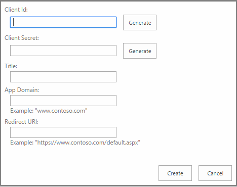

# Register SharePoint Add-ins 2013
Register your SharePoint Add-ins in Azure ACS by using Visual Studio, the Seller Dashboard, or an AppRegNew.aspx page, and retrieve registration information.
 

 **Note**  The name "apps for SharePoint" is changing to "SharePoint Add-ins". During the transition, the documentation and the UI of some SharePoint products and Visual Studio tools might still use the term "apps for SharePoint". For details, see  [New name for apps for Office and SharePoint](new-name-for-apps-for-sharepoint#bk_newname).
 

For the remote components of a provider-hosted SharePoint Add-in to interact with SharePoint using OAuth, the add-in must first register with the  [Azure ACS](https://msdn.microsoft.com/en-us/library/azure/gg429788.aspx) cloud-based service and the SharePoint App Management Service of the tenancy or farm. (It is called "App Management Service" because SharePoint Add-ins were originally called "apps for SharePoint".)
 

 **Note**  This is not required for SharePoint-hosted add-ins.
 

To register your add-in with Azure ACS, you specify the following information:
 

- A GUID for the add-in, called a client ID.
    
 
- A password for the add-in, called a client secret.
    
 
- A display name of the add-in that is used on the consent page where the user is prompted to trust the add-in.
    
 
- A URL for the domain where the remote add-in is hosted.
    
 
- A redirect URL.
    
 
After you register your add-in, it has an add-in identity and is a  *security principal*  , referred to as anadd-in principal. When you install your add-in, SharePoint administrators can retrieve information about that particular add-in principal.
 
When a user first grants an add-in permissions to access SharePoint resources (which can happen either at installation or runtime, depending on the design of the app), SharePoint gets information about the add-in from Azure ACS. SharePoint then stores this information in the App Management Service database of the SharePoint tenancy or farm. The client secret is stored only with Azure ACS. SharePoint never knows the add-in's secret. The content database service and other components, such as the user profile service, can get the display name and other basic information about the add-in directly from the app management shared service. For more information, see  [Retrieve add-in registration and add-in principal information ](register-sharepoint-add-ins-2013#Retrieve) in this article.
 

 **Note**  This article assumes that you are familiar with the basic concepts and principles behind the OAuth 2.0 Framework. For more information, see  [OAuth.net](http://oauth.net/) and [Web Authorization Protocol (oauth)](http://datatracker.ietf.org/doc/active/).
 


## Register your SharePoint Add-in in Azure ACS

You can register your add-in in one of three ways, depending on where you are in the add-in development life cycle, the architecture of your add-in, and how you plan to market it.
 

 


|**Registration method**|**Details**|
|:-----|:-----|
|Use Visual Studio and Microsoft Office Developer Tools for Visual Studio to create a temporary add-in identity.|The Office Developer Tools for Visual Studio wizard creates a temporary registration for your add-in with ACS and the App Management Service of your SharePoint test website. When you run the add-in from Visual Studio (F5), this identity is used. The tools also insert the client ID and secret in the web.config and AppManifest.xml files.When you're ready to publish your add-in, you can use the Visual Studio publish wizard to go to the Seller Dashboard to register it. If you are not marketing your SharePoint Add-in in the Office Store, use AppRegNew.aspx to register it. (Exact steps are below.) **Note**  If your add-in requests permission to access SharePoint resources dynamically at run time, instead of on add-in installation, you cannot use Visual Studio to create add-in identities. |
|Register the add-in through the Seller Dashboard.|If you're going to use your add-in in more than one SharePoint tenant or farm, use the Seller Dashboard to register your add-in, regardless of whether you will market it in the Office Store or make it available via the add-in catalog. When you register in the Seller Dashboard, you can design your add-in with a multitenant architecture without requiring tenant or farm administrators to register it separately. Also, if you plan to publish your add-in in the Office Store, you have to use the Seller Dashboard to register your add-in. You don't have to use the store to publish an add-in that is registered with the Seller Dashboard.For more information, see  [Create or update client IDs and secrets in the Seller Dashboard](http://msdn.microsoft.com/library/create-or-update-client-ids-and-secrets-in-the-seller-dashboard%28Office.15%29.aspx).|
|Use the AppRegNew.aspx page.|Use the AppRegNew form to register your SharePoint Add-in if you are going to use the add-in only in one tenant or farm. For example, if you're creating add-ins for a single organization and you're going to distribute them via the organization add-in catalog, you can use the AppRegNew.aspx page of any website in a tenancy or farm to register the add-in.You cannot publish an add-in that is registered with AppRegNew.aspx to the Office Store. For add-ins that are published to the Office Store, you must get an identity from the Seller Dashboard.|

### To register by using AppRegNew.aspx


1.  Navigate to `http://` *<SharePointWebsite>*  `/_layouts/15/AppRegNew.aspx` on the tenancy or farm.
    
    **AppRegNew page form**

 

  
 

 

 
2. Enter values for the follow form fields:
    
      -  **Add-in ID** - Also known as client ID, is a GUID that can be generated (when you choose **Generate**) or pasted into AppRegNew.aspx. The value must be unique for each add-in, and  *must be lower case*  .
    
 
  -  **Add-in Secret** - Also known as the client secret, an opaque string. It is generated on the AppRegNew.aspx page by using the **Generate** button. The following is an example of an add-in secret: **xvVpG0AgVIJfch6ldu4dLUlcZyysmGqBRbpFDu6AfJw=**.
    
     **Important**  Add-in secrets expire. If you register the add-in on the Seller Dashboard, you can set the expiration for up to three years. In the dashboard, you can also add new secrets when the old ones reach their expiration date. The new secret will be enabled in all instances of the add-in. If you register the add-in with AppRegNew.aspx, the secret expires in one year. For details, see  [Replace an expiring client secret in a SharePoint Add-in](replace-an-expiring-client-secret-in-a-sharepoint-add-in).
  -  **Title** - A user-friendly title; for example,Contoso photo printing add-in. Users are prompted to grant or deny the add-in the permissions that the add-in is requesting. This title appears as the name of the add-in on the consent prompt. 
    
 
  -  **Add-in Domain** - The host name of the remote component of the SharePoint Add-in. If the remote application isn't using port 443, the add-in domain must also include the port number. The add-in domain must match the URL bindings you use for your web application. Do not include protocol ("https:") or "/" characters in this value. If your web application host is using a DNS CNAME alias, use the alias. Some examples:
    
      - www.contoso.com:3333
    
 
  - www.fabrikam.com
    
 
  -  **Redirect URI:** - The endpoint in your remote application or service to which ACS sends an authentication code. Strictly speaking, SharePoint Add-ins don't use this value. The redirect URI is required for web applications that are launched outside of SharePoint and that use the [Authentication Code flow](creating-sharepoint-add-ins-that-use-low-trust-authorization#Flows) to get authorized access to SharePoint data. The Redirect URI is ignored for true SharePoint Add-ins (which are launched from SharePoint and use the [Context Token flow](creating-sharepoint-add-ins-that-use-low-trust-authorization#Flows)). The Redirect URI is usually the same page, controller method, web service method that requested the authentication code from ACS, but it can be a different endpoint. The endpoint must have logic that gets the authorization code from the HTTP Response that is sent by ACS and then uses that code to request an access and refresh token. For more information, see  [Authorization Code OAuth flow for SharePoint Add-ins](authorization-code-oauth-flow-for-sharepoint-add-ins). The form requires that you enter a valid value even for true SharePoint Add-ins, although it is not used.
    
    The value must be a complete endpoint URL including the protocol,  *which must be HTTPS*  . For example:
    
      - https://www.contoso.com/Default.aspx
    
 
  - https://www.fabrikam.com/RedirectAccept.aspx
    
 
  - https://www.northwindtraders.com/home/index
    
 
  - https://adventureworks.com/vacationdata.svc
    
 
3. Choose  **Create** on the form. The page will reload and show a confirmation of the values you entered. Make a record of these values in a form that is eay to copy and paste. You will need to enter the values in web.config and AppManifest.xml files or in the Visual Studio **Publish** wizard.
    
 
Regardless of how you register your SharePoint Add-in, when you are ready to deploy the add-in to staging or production, you'll need to  [Enter the registration values into the web.config and AppManifest.xml files](#EditConfigFiles). If you are using Visual Studio, the Microsoft Office Developer Tools for Visual Studio do this configuration for you.
 

 

## Enter the registration values into the web.config and AppManifest.xml files
<a name="EditConfigFiles"> </a>

Before you package the SharePoint Add-in and before you deploy its remote components, enter some of the registration values in the AppManifest.xml and the web.config file.
 

 

 **Tip**  If you publish your SharePoint Add-in by using the Visual Studio publish wizard, Visual Studio will prompt you for a client ID and client secret during the publishing process, and it will put the information in the correct places for you.
 


1. In the Web.config file in your Visual Studio project, enter the add-in ID value as the  **ClientId** value (replacing the temporary value that the tools entered).
    
     **Important**  All the letters in the client ID GUID must be lowercase.

    The following is an example.
    


```XML
  <appSettings>
  <add key="ClientId" value="a044e184-7de2-4d05-aacf-52118008c44e " />
   .  .  .
</appSettings>
```

2. Enter the add-in secret value as the  **ClientSecret** value (replacing the temporary value that the tools entered).
    
    The following is an example of how the values are used in the Web.config file of a web application.
    


```XML
  <appSettings>
  <add key="ClientId" value="a044e184-7de2-4d05-aacf-52118008c44e " />
  <add key="ClientSecret" value="l0z/8TzWN0yQBzMBSEZtYts2Vt3Eo/oE3rfCdPaogKQ= " />
</appSettings>
```

3. In the AppManifest.xml file in your Visual Studio project, enter the add-in ID value as the  **ClientId** value, *with lower case letters*  .
    
     **Note**  The add-in manifest does not apply to web applications that request permission to access SharePoint resources on the fly. These are not really "SharePoint Add-ins". They are not installed on SharePoint and do not have an add-in manifest. For more information, see  [Authorization Code OAuth flow for SharePoint Add-ins](authorization-code-oauth-flow-for-sharepoint-add-ins).

    The following example shows how the  **ClientId** value is used in the AppManifest.xml file.
    


```XML
  <AppPrincipal>
  <RemoteWebApplication ClientId="a044e184-7de2-4d05-aacf-52118008c44e "/>
</AppPrincipal>
```

4. The Office Developer Tools for Visual Studio use the token  `~remoteAppUrl` in **StartPage** element. (For example, `<StartPage>~remoteAppUrl/Pages/Default.aspx?{StandardTokens}</StartPage>`.) This token resolves to the URL of the remote component if you are using the  **Publish** wizard in Visual Studio. If you don't use the wizard (or if you do but you are publishing the remote component to Azure), you have to manually replace the token with the **Add-in Domain** value that you used when registering the add-in. It must be *exactly*  the same value, including port number, if any, except that you include the HTTPS protocol as well. The following is an example.
    
```XML
  <StartPage>https://www.contoso.com/Pages/Default.aspx?{StandardTokens}</StartPage>
```

5. Consider using the same value for the  **Title** element in the AppManifest.xml file that you used for the **Title** field in AppRegNew.aspx. The **Title** element value is the name of the add-in that users see after it is installed. It might be confusing to users for the add-in to have a different name in the consent dialog than it has in the SharePoint UI.
    
    The following example shows these values in the add-in manifest.
    


```XML
  <Properties>
  <Title>Contoso photo printing app</Title>
  <StartPage>https://www.contoso.com/Pages/Default.aspx?{StandardTokens}</StartPage>
</Properties>
```


## Use the redirect URL in an add-in that asks for permissions on the fly
<a name="UseRedirectUrl"> </a>

If your web application is launched from outside SharePoint (and is, thus, not a true SharePoint Add-in), then it has to be designed to ask for permissions from SharePoint at runtime. It has to have code that uses the redirect URI, along with other information, to obtain an access token from ACS. Find the place where this URI is set and use the  *exact*  value that you used for the **Redirect URI** field on AppRegNew.aspx or in the Seller Dashboard. This might be in a code file or a configuration file.
 

 

## Retrieve add-in registration and add-in principal information
<a name="Retrieve"> </a>

You can retrieve add-in registration information and add-in principal information for the add-ins you've installed or registered on SharePoint. 
 

 
To look up registration information for an add-in that you have registered, go to  `http://` *<SharePointWebsite>*  `/_layouts/15/AppInv.aspx`.
 

 
To do a lookup, you have to remember the client ID (also known as the add-in ID) that was used to register the add-in. The lookup returns the following information for a particular client ID:
 

 

- Title
    
 
- Add-in domain
    
 
- Redirect URL (this is the same as the redirect URI.)
    
 
The lookup does not return the add-in secret value.
 

 
To see a list of registered add-in principals, go to:
 

 
 `http://` *<SharePointWebsite>*  `/_layouts/15/AppPrincipals.aspx`
 

 

## Additional resources
<a name="AR"> </a>


-  [Authorization and authentication of SharePoint Add-ins](authorization-and-authentication-of-sharepoint-add-ins)
    
 
-  [Three authorization systems for SharePoint Add-ins](three-authorization-systems-for-sharepoint-add-ins)
    
 
-  [Get started creating provider-hosted SharePoint Add-ins](get-started-creating-provider-hosted-sharepoint-add-ins)
    
 
