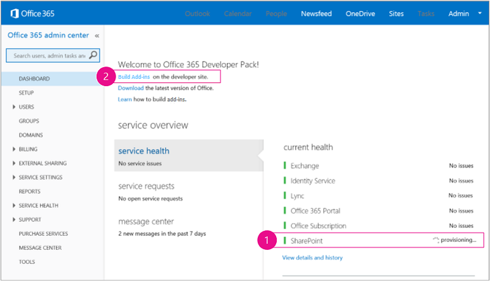
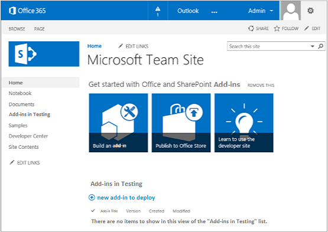

# Set up a development environment for SharePoint Add-ins on Office 365
Set up a development environment for SharePoint Add-ins on an Office 365 Developer Site.
 

 **Note**  The name "apps for SharePoint" is changing to "SharePoint Add-ins". During the transition, the documentation and the UI of some SharePoint products and Visual Studio tools might still use the term "apps for SharePoint". For details, see  [New name for apps for Office and SharePoint](new-name-for-apps-for-sharepoint.md#bk_newname).
 

Please read  [Tools and environments for developing SharePoint Add-ins](tools-and-environments-for-developing-sharepoint-add-ins.md) to get an understanding of your options before you carry out any procedures in this article. See [SharePoint Add-ins](sharepoint-add-ins.md) if you are not sure what kinds of SharePoint Add-ins you want to create.
 

## Install Visual Studio and tools on your computer

- If you don't already have  **Visual Studio** 2013 or later installed, install it with the instructions at [Install Visual Studio](http://msdn.microsoft.com/library/da049020-cfda-40d7-8ff4-7492772b620f.aspx). We recommend using the  [latest version from the Microsoft Download Center](https://www.visualstudio.com/downloads/download-visual-studio-vs).
    
 
- Visual Studio includes the  **Microsoft Office Developer Tools for Visual Studio**, but sometimes a version of the tools is released between updates of Visual Studio. To be sure that you have the latest version of the tools use run the [installer for Office Developer Tools for Visual Studio 2013](http://aka.ms/OfficeDevToolsForVS2013), or  [installer for Office Developer Tools for Visual Studio 2015](http://aka.ms/OfficeDevToolsForVS2015). 
    
 

### Verbose logging in Visual Studio

Follow these steps if you want to turn on verbose logging:
 

 

1. Open the registry, and navigate to  **HKEY_CURRENT_USER\Software\Microsoft\VisualStudio\ _nn.n_\SharePointTools**, where _nn.n_ is the version of Visual Studio, such as 12.0 or 14.0.
    
 
2. Add a DWORD key named  **EnableDiagnostics**.
    
 
3. Give the key the value  **1**.
    
 
The registry path will change in future versions of Visual Studio.
 

 

## Sign up for an Office 365 Developer Site

 **Note**   You might already have access to an Office 365 Developer Site: **Are you an MSDN subscriber?** Visual Studio Enterprise with MSDN subscribers receive an Office 365 Developer Subscription as a benefit. [Redeem your benefit today.](https://msdn.microsoft.com/subscriptions/manage/default.aspx) **Do you have one of the following Office 365 subscription plans?** **If so, an administrator of the Office 365 subscription can create a Developer Site** by using the [Office 365 admin center](https://portal.microsoftonline.com/admin/default.aspx). For more information, see  [Create a developer site on an existing Office 365 subscription](create-a-developer-site-on-an-existing-office-365-subscription.md). 
 

Three ways to get an Office 365 plan. 
 

 

- Sign up for a free, one year Office 365 developer account through the Office 365 Developer Program.  [Get more information](http://dev.office.com/devprogram), or go straight to  [the sign-up form](https://profile.microsoft.com/RegSysProfileCenter/wizardnp.aspx?wizid=14b845d0-938c-45af-b061-f798fbb4d170). You'll get an e-mail after you sign up for the developer program with a link to sign up for the developer account. Use the instructions below.
    
 
- Start with a  [free 30-day trial](https://portal.microsoftonline.com/Signup/MainSignUp.aspx?OfferId=6881A1CB-F4EB-4db3-9F18-388898DAF510&amp;DL=DEVELOPERPACK) with one user license.
    
 
- Buy an  [Office 365 developer subscription](https://portal.microsoftonline.com/Signup/MainSignUp.aspx?OfferId=C69E7747-2566-4897-8CBA-B998ED3BAB88&amp;DL=DEVELOPERPACK). 
    
 

 **Tip**  Open these links in another window or tab in order to keep the following instructions handy.
 

**Figure 1. Office 365 Developer Site domain name**

 

 

 

 

 

 

1. The first page (not shown) of the signup form is self-explanatory. Just supply the information about yourself that is requested and choose  **Next**.
    
 
2. On the second page, shown in Figure 1, specify a user ID for the administrator of the subscription.
    
 
3. Create a subdomain of  **.onmicrosoft.com**. 
    
    After signup, you have to use the resulting credentials (in the format  _UserID_@ _yourdomain_.onmicrosoft.com) to sign in to your Office 365 portal site where you administer your account. Your SharePoint Online Developer Site is provisioned at your new domain:  **http:// _yourdomain_.sharepoint.com**.
    
 
4. Choose  **Next** and fill out the final page of the form. If you choose to provide a telephone number to obtain a confirmation code, you can provide a mobile or land line telephone number, but *not*  a VoIP (Voice over Internet Protocol) number.
    
 

    
 **Note**  If you're logged on to another Microsoft account when you try to sign up for a developer account, you might get this message: "Sorry, that user ID you entered didn't work. It looks like it's not valid. Be sure you enter the user ID that your organization assigned to you. Your user ID usually looks like  *someone@example.com*  or *someone@example.onmicrosoft.com*  ."If you see this message, log out of the Microsoft account you were using and try again. If you still get the message, clear your browser cache or switch to  **InPrivate Browsing** and then fill out the form.
 

After you finish the signup process, your browser will opens the Office 365 installation page. Choose the Admin icon to open the admin center page.
 

 

**Figure 2. Office 365 admin center page**

 

 

 

 

1. You'll have to wait for your Developer Site to finish provisioning. After provisioning is complete, refresh the admin center page in your browser.
    
 
2. Then, choose the  **Build Add-ins** link in the upper left corner of the page to open your Developer Site. You should see a site that looks like the one in Figure 3. There is an **Add-ins in Testing** list on the page. This confirms that the website was made with SharePoint's Developer Site template. If you see a regular team site instead, wait a few minutes and launch your site again.
    
 
3. Make a note of the URL of the site. It is used when you create SharePoint Add-ins projects in Visual Studio.
    
 

**Figure 3. Your Developer Site home page with the Add-ins in Testing list**

 

 

 

 

 

## Additional resources

-  [SharePoint Add-ins](sharepoint-add-ins.md)
    
 
-  [Get started creating provider-hosted SharePoint Add-ins](get-started-creating-provider-hosted-sharepoint-add-ins.md)
    
 
-  [Get started creating SharePoint-hosted SharePoint Add-ins](get-started-creating-sharepoint-hosted-sharepoint-add-ins.md)
    
 

 

 

