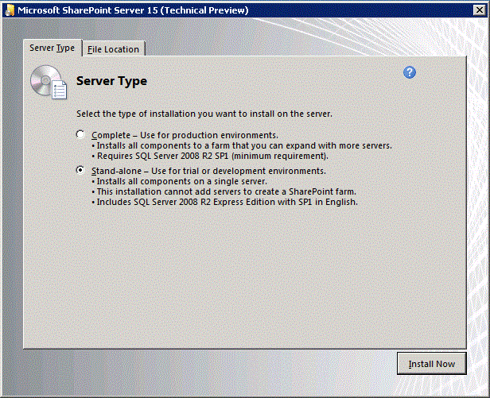
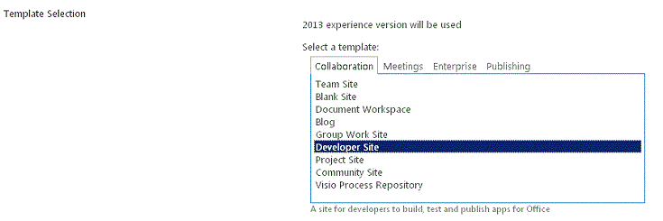

# Set up an on-premises development environment for SharePoint Add-ins

The requirements for a development environment are less stringent and costly than the requirements for a production environment, and the guidelines described here do not support a production environment installation. 

For the instructions to set up a production environment installation of SharePoint, see:

- [Overview of SharePoint installation and configuration](http://technet.microsoft.com/en-us/library/ee667264%28v=office.15%29)
- [Hardware and software requirements for SharePoint](http://technet.microsoft.com/en-us/library/cc262485%28v=office.15%29)
- [Configure an environment for SharePoint Add-ins](http://technet.microsoft.com/en-us/library/fp161236%28office.15%29.aspx) 

<a name="bk_installOS"> </a>
## Install the operating system for your development environment for SharePoint Add-ins

In any development environment, you should use a computer with an x64-capable CPU, and at least 16 GB of RAM to install and run SharePoint; 24 GB of RAM is preferable.

Depending on your specific requirements and budget, you can choose from the following options:

- Install SharePoint on Windows Server 2008 R2 Service Pack 1 x64 or Windows Server 2012.
 
- Use Microsoft Hyper-V and install SharePoint on a virtual machine running a Windows Server 2008 R2 Service Pack 1 x64 or a Windows Server 2012 guest operating system. For guidance on setting up a Microsoft Hyper-V virtual machine for SharePoint, see [Use best practice configurations for the SharePoint virtual machines and Hyper-V environment](http://technet.microsoft.com/en-US/library/ff621103%28v=office.15%29.aspx). 
    
> [!NOTE]
> Installation of SharePoint is supported only on Windows Server 2008 R2 Service Pack 1 x64 or Windows Server 2012. If you want to develop SharePoint Add-ins for SharePoint on Windows 7 or Windows 8, you can sign up for an Office 365 developer site and develop add-ins remotely. 

<a name="bk_prereqsOS"> </a>
## Install the prerequisites for the operating system and SharePoint

1. Run the PrerequisiteInstaller.exe tool that is included with your installation files.

2. Run the Setup.exe tool that is included with your installation files.

3. Accept the Microsoft Software License Terms.

4. On the **Choose the installation you want** page, select **Stand-alone**.
    
   *Figure 1. Installation type choice*

   

5. If any errors occur in the installation, review the log file. To find the log file, open a Command Prompt window, and then type the following commands at the command prompt. A link to the log file also appears when the installation is complete.
    
   ```
     cd %temp%
   dir /od *.log
   ```

6. After the installation is complete, you're prompted to start the SharePoint Products and Technologies Configuration Wizard.
    
   > [!NOTE]
   > The SharePoint Products and Technologies Configuration Wizard may fail if you're using a computer that is joined to a domain but that is not connected to a domain controller. If you see this failure, connect to a domain controller either directly or through a Virtual Private Network (VPN) connection, or sign in with a local account that has administrative privileges on the computer.

7. After the configuration wizard is complete, you see the **Template Selection** page of the new SharePoint site. On this page, select the **Developer Site** template. You can only deploy SharePoint Add-ins from Visual Studio to a developer site.
    
   *Figure 2. Select the site template page*

   

<a name="Servertoserver"> </a>
## Configure services in SharePoint for server-to-server add-in use

In this step, you configure services in SharePoint for server-to-server add-in use. These steps ensure that you will be able to create high trust provider-hosted add-ins with your installation. For more information about creating this kind of add-in, see [Create high-trust SharePoint Add-ins](create-high-trust-sharepoint-add-ins.md).

Ensure that the App Management Service and user profile application are configured (it is called "App Management Service" because SharePoint Add-ins were originally named "apps for SharePoint"). The steps are as follows:
    
1. In **Central Administration**, under **Application Management**, select **Manage service applications**.
   
2. On the **Service Applications** page, ensure that the following services are started:
   
   - User profile service application
   - App Management Service
    
3. Under **Application Management**, select **Manage services on server**. 
   
4. On the **Services on Server** page, ensure that the following services are started:
    
   - User profile service 

Ensure that at least one profile is created in the **User profile service application**. The steps are as follows:
    
1. In **Central Administration**, under **Application Management**, select **Manage service applications**.
    
2. Next, select **User Profile Service Application**.
    
3. On the **Manage Profile Service: User Profile Service Application** page, under **People**, select **Manage User Profiles**.
    
4. On the **Manage User Profiles** page, select **New Profiles**.
    
5. On the **Add User Profile** page, type your account name and email address.
    
6. Select **Save and Close**.
    
   > [!NOTE]
   > If you get a message saying that the profile you are trying to create already exists, select **Cancel and Go Back**.

7. Back on the **Manage User Profiles** page, you should see **Total number of profiles: 1**.
    

<a name="SP15Appdevonprem_bk_installVS"> </a> 
## Install Visual Studio and Office Developer Tools for Visual Studio

- If you don't already have **Visual Studio** 2013 or later installed, install it with the instructions at [Install Visual Studio](https://docs.microsoft.com/en-us/visualstudio/install/install-visual-studio). We recommend using the [latest version from the Microsoft Download Center](https://www.visualstudio.com/downloads/download-visual-studio-vs).

- Visual Studio includes the **Microsoft Office Developer Tools for Visual Studio**, but sometimes a version of the tools is released between updates of Visual Studio. To be sure that you have the latest version of the tools, run the [installer for Office Developer Tools for Visual Studio 2013](http://aka.ms/OfficeDevToolsForVS2013) or the [installer for Office Developer Tools for Visual Studio 2015](http://aka.ms/OfficeDevToolsForVS2015).

### Verbose logging in Visual Studio

Follow these steps if you want to turn on verbose logging:

1. Open the registry, and go to **HKEY_CURRENT_USER\Software\Microsoft\VisualStudio\ _nn.n_\SharePointTools**, where _nn.n_ is the version of Visual Studio, such as 12.0 or 14.0.

2. Add a DWORD key named **EnableDiagnostics**.

3. Give the key the value **1**.

The registry path will change in future versions of Visual Studio.

<a name="SP15appdevonprem_bk_configure"> </a>
## Configure an isolated add-in domain in SharePoint

Before you carry out any procedures in this section, read [Host webs, add-in webs, and the isolated domain](host-webs-add-in-webs-and-sharepoint-components-in-sharepoint.md#IsolatedDomain).

You must create an isolated domain in your test SharePoint farm. Also, your SharePoint installation needs a general wildcard host header domain where it can provision SharePoint-hosted add-ins.

For development purposes, you can modify your hosts file as you need to route your development computer to a test instance of a SharePoint Add-in. Visual Studio modifies your hosts file automatically when you build and deploy the add-in. 
 
> [!NOTE]
> For production farms, you would have to create a DNS routing strategy within your intranet and optionally configure your firewall. For more information about how to create and configure a production environment for SharePoint Add-ins, see [Install and Manage SharePoint Add-ins](http://technet.microsoft.com/en-us/library/fp161232%28v=office.15%29).

Perform the steps in the following procedure to create an isolated add-in domain.
 
> [!NOTE]
> You must perform all the steps in the following procedure while signed in as the farm administrator, and you must run the command prompt and the SharePoint Management Shell as an administrator.

### Create an isolated add-in domain on your development computer

1. Ensure that the spadmin and sptimer services are running by opening a command prompt and entering the following commands:
    
    ```
      net start spadminv4
      net start sptimerv4
    ```

2. Create your isolated add-in domain by running the SharePoint Management Shell as an administrator and entering the following command.

   Replace the  _contosoaddins.com_ with your add-in domain. It should *not* be a subdomain of the host SharePoint domain. Doing so largely defeats the security advantages of having isolated add-in domains. For example, if the host domain is contoso.com, do not use addins.contoso.com as the add-in domain.
    
    ```
      Set-SPAppDomain "contosoaddins.com"
    ```

3. Ensure that the SPSubscriptionSettingsService and AppManagementServiceInstance services are running by entering the following command in the SharePoint Management Shell:
    
    ```
      Get-SPServiceInstance | where{$_.GetType().Name -eq "AppManagementServiceInstance" -or $_.GetType().Name -eq "SPSubscriptionSettingsServiceInstance"} | Start-SPServiceInstance
    ```

4. Verify that the SPSubscriptionSettingsService and AppManagementServiceInstance services are running by entering the following command in the SharePoint Management Shell. The output will indicate whether each service is online.
    
    ```
      Get-SPServiceInstance | where{$_.GetType().Name -eq "AppManagementServiceInstance" -or $_.GetType().Name -eq "SPSubscriptionSettingsServiceInstance"}
    ```

5. You must specify an account under which the SPSubscriptionService and AppManagementServiceInstance service instances will run. This account must be an SPManagedAccount. You can create an SPManagedAccount by entering the following command in the SharePoint Management Shell (you'll be prompted for the account domain\user and password):
    
    ```
      $account = New-SPManagedAccount
    ```

6. Specify an account, application pool, and database settings for the SPSubscriptionService and AppManagementServiceInstance services by typing the following code in the SharePoint Management Shell. If you created a SPManagedAccount in the preceding step, use that account name here.
    
    ```
     $account = Get-SPManagedAccount "domain\user" 
     $appPoolSubSvc = New-SPServiceApplicationPool -Name SettingsServiceAppPool -Account $account
     $appPoolAppSvc = New-SPServiceApplicationPool -Name AppServiceAppPool -Account $account
     $appSubSvc = New-SPSubscriptionSettingsServiceApplication -ApplicationPool $appPoolSubSvc -Name SettingsServiceApp -DatabaseName SettingsServiceDB 
     $proxySubSvc = New-SPSubscriptionSettingsServiceApplicationProxy -ServiceApplication $appSubSvc
     $appAppSvc = New-SPAppManagementServiceApplication -ApplicationPool $appPoolAppSvc -Name AppServiceApp -DatabaseName AppServiceDB
     $proxyAppSvc = New-SPAppManagementServiceApplicationProxy -ServiceApplication $appAppSvc

    ```

7. Specify your add-in prefix (see [Host webs, add-in webs, and the isolated domain](host-webs-add-in-webs-and-sharepoint-components-in-sharepoint.md#IsolatedDomain)) by typing the following code in the SharePoint Management Shell:
    
    ```
      Set-SPAppSiteSubscriptionName -Name "add-in" -Confirm:$false
    ```

**Carry out the following procedure only if your environment uses a proxy server.** After you create your isolated add-in domain, perform the steps in the following procedure to add that domain to your bypass list in Internet Explorer. This ensures that you can navigate to this domain after you deploy a SharePoint-hosted add-in or a provider-hosted add-in that includes an add-in web.

### Add your isolated add-in domain to your bypass list in Internet Explorer

1. In Internet Explorer, go to **Tools**.

2. Select **Internet options**.

3. On the **Connections** tab, select the **LAN Settings** button.

4. Clear the **Automatically detect settings** check box.

5. Select the **Use a proxy server for your LAN** check box.

6. Select the **Advanced** button, and then add \*.YourAddinsDomain.com to the **Exceptions** list.

7. Select **OK**.

8. Select **OK** to close the **Local Area Network (LAN) Settings** dialog box.

9. Select **OK** to close the **Internet Options** dialog box.
    
For information about your options for deploying your add-ins, see [Deploying and installing SharePoint Add-ins: methods and options](deploying-and-installing-sharepoint-add-ins-methods-and-options.md).
 
> [!TIP]
> After you deploy a SharePoint-hosted add-in to your installation, you may be prompted to sign in with your credentials when you try to launch it. You need to disable the loopback check to get rid of these prompts. For instructions about how to disable the loopback check, see [You receive error 401.1 when you browse a website that uses Integrated Authentication and is hosted on IIS 5.1 or a later version](http://support.microsoft.com/kb/896861).
 

## See also
<a name="SP15SetupSPO365_bk_addlresources"> </a>

- [SharePoint Add-ins](sharepoint-add-ins.md)
- [Get started creating provider-hosted SharePoint Add-ins](get-started-creating-provider-hosted-sharepoint-add-ins.md)
- [Get started creating SharePoint-hosted SharePoint Add-ins](get-started-creating-sharepoint-hosted-sharepoint-add-ins.md)
- [Install earlier versions of Visual Studio](http://msdn.microsoft.com/library/da049020-cfda-40d7-8ff4-7492772b620f.aspx)
- [Visual Studio documentation](https://docs.microsoft.com/en-us/visualstudio/)    
 
