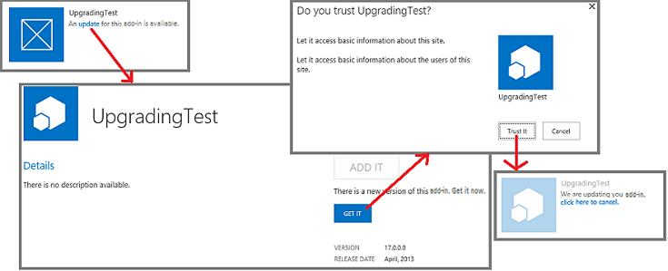

# SharePoint Add-ins update process

Learn about the process for updating SharePoint Add-ins.
 
> [!NOTE]
> The name "apps for SharePoint" is changing to "SharePoint Add-ins." During the transition, the documentation and the UI of some SharePoint products and Visual Studio tools might still use the term "apps for SharePoint." For details, see [New name for apps for SharePoint](new-name-for-apps-for-sharepoint.md).

You have to update a SharePoint Add-in if you add functionality, fix a bug, or make a security update. An update to an add-in is deployed in a SharePoint Add-in package in the same way that the first version of the add-in is deployed. The SharePoint Add-in update process ensures that the add-in's data is preserved if the update fails for any reason.
 
> [!IMPORTANT]
> You cannot change the *add-in type* by using the update system. For example, you cannot change an add-in from SharePoint-hosted to provider-hosted with an update. To make a change of type, you need to [migrate from an old add-in to a new one](#Major). In particular, because [the preview program for autohosted add-ins has been closed](http://blogs.office.com/2014/05/16/update-on-autohosted-apps-preview-program/), you should be aware that you cannot update an autohosted add-in to a provider-hosted add-in. You have to convert the add-in as explained in [Convert an autohosted SharePoint Add-in to a provider-hosted add-in](convert-an-autohosted-sharepoint-add-in-to-a-provider-hosted-add-in.md).

## Update process for a SharePoint Add-in

For an update, you use the same product ID in the add-in manifest that you used for the original version. The version number in the add-in manifest should be greater than the version number of the original add-in or the most recent update.

Within 24 hours after you upload your update to an organization's add-in catalog, and within a week of uploading it to the Office Store, an indication that an update is available appears next to the add-in's listing on the **Site Contents** page of every website where it is installed. Users can click a link to update the add-in as shown in Figure 1. Available updates are also exposed in the tenant management UI.

*Figure 1. Add-in for SharePoint upgrade process*

> [!TIP]
> When you are developing an update, you don't want to wait 24 hours every time you upload a new version to your test SharePoint add-in catalog. For information about how to immediately update an add-in, see [Update an add-in without waiting 24 hours ](update-sharepoint-add-ins.md#ImmediateUpdateNotice). 

> By default, SharePoint checks every 24 hours for updates to installed add-ins. A farm administrator can set this to another value by using the following SharePoint Management Shell command, where `n` is the number of hours between checks: 

> `Set-SPInternalAppStateUpdateInterval -AppStateSyncHours n` 

> If the value is set to 0, the check is made every time the built-in timer job **Internal Add-in State Update** executes, which by default is every hour. Farm administrators can use Central Admin to change the frequency of the timer job or run it immediately.

SharePoint will do the following when a user installs an update to a SharePoint Add-in. These events do not necessarily occur in exactly this order, and some of them may occur in parallel. Also, if an update fails, there is a complete rollback.

- SharePoint prompts the user to approve permissions requested by the add-in.

- SharePoint makes the add-in unavailable to users temporarily.

- If the add-in contains a SharePoint solution package (.wsp), and the contents of the solution package have changed in any way, SharePoint does the following:
    
   - Makes a backup of the add-in web (but, in SharePoint Online and in on-premises SharePoint 2016 and later, the actual data in SharePoint lists is backed up only if the update is making a change in the list's schema).

   - Tests the update of the backup.

   - If the test succeeds, updates the original add-in web. Note that the new .wsp file in the add-in package is used to update the Features and other elements in the add-in web (the update parts of the Feature schema have been expanded in SharePoint).

- SharePoint executes the **UpgradedEventEndpoint** web service, if any is registered in the add-in manifest.
    
   > [!NOTE]
   > If the add-in is provider-hosted, you provide the update logic for all the non-SharePoint components of the add-in. For the most part, you update these components separately from the update of the SharePoint Add-in itself, just as you installed these components separately from the installation of the add-in. But there may be some changes that should only happen when a user is updating the SharePoint Add-in. This logic can go in an **UpgradedEventEndpoint** web service or in first-run-after-update logic of the add-in itself.

- SharePoint makes the add-in and its components available again.

> [!NOTE]
> If the schema of any list in the add-in web is being changed, the list is backed up along with the rest of the add-in web. This can take some time if there is a lot of data in the list. If the update process cannot complete in one hour, it stops and the update is rolled back.

## Migrating from an old add-in to a new one

In some scenarios you may want to produce an entirely new add-in to replace an old one, rather than update the original one. The new add-in can have the same friendly name as the old, but it must be given a new product ID in the add-in manifest, and it appears in the public Office Store and on the **Add an Add-in** page of SharePoint websites as a distinct item from the original version.
 
> [!NOTE]
> Items in an organization's add-in catalog are distinguished by the *file name* of the add-in package, not the product ID or the name of the add-in. If the new add-in has the same package file name as the old, it replaces the old one in the add-in catalog, and the old add-in no longer appears on the **Add an Add-in** page. If you enable versioning on the add-in package when you upload it to the catalog, the old version of the file (which is the old app) is still available in the item's history. You can download the old add-in package or revert to it, but there is no way to have both the old and new add-ins as separate items in the catalog or on the **Add an Add-in** page, unless they have distinct file names.

In some cases, you might need to migrate data. For example, the new add-in might use a Microsoft Azure SQL Database that has a different schema from the old add-in. Or the new add-in might use a different data storage mechanism; for example, an external database instead of SharePoint lists. You must provide the code for data migration.

If your old data is somewhere that can be accessed by a remote event handler, you can implement migration logic in an **InstalledEventEndpoint** web service of the new add-in. Alternatively, if the new add-in has access to the old data, you can put the migration logic in code that runs the first time that a user starts the new add-in. If the old data cannot be accessed by either the remote handlers or the new add-in, you can create an update of the old add-in that adds a data export capability and a UI for the capability. Users would first update the old add-in, and then use it to export the data to a location where the new add-in can access it. You include the capability and UI to import data in the new add-in.

In principle, you can reuse an external data source, compute component, or other external component in the new add-in that was used in the old add-in. Consider, however, that when a SharePoint Add-in is uninstalled, the SharePoint infrastructure will uninstall everything that it installed. Accordingly, it is generally a good practice for a SharePoint Add-in to depend on only components that it installed or external components that were not installed by the SharePoint infrastructure.
 
> [!NOTE]
> We recommend that if you implement an **InstalledEventEndpoint** or an **UpgradedEventEndpoint** that installs components, you should also implement an **UninstallingEventEndpoint** that uninstalls those same components. Doing so conforms to the design principles that add-ins should be self-contained and uninstall cleanly. However, data that would still be useful to users after the add-in is uninstalled should not be deleted. Websites created by an add-in, other than the add-in web, should usually be considered data.

If the old and new add-ins each contain an add-in web, consider that a new add-in web is created when your new add-in is installed. For this reason, you should not use the update-related XML markup in the SharePoint Feature schema. Such markup does not work because you are not updating existing SharePoint components; you are replacing an old add-in with a new one.

## Additional resources

-  [Update SharePoint Add-ins](update-sharepoint-add-ins.md)
-  [Update add-in web components in SharePoint](update-add-in-web-components-in-sharepoint.md)
-  [Update host web components in SharePoint](update-host-web-components-in-sharepoint.md)
-  [Create a handler for the update event in SharePoint Add-ins](create-a-handler-for-the-update-event-in-sharepoint-add-ins.md)
-  [Update remote components in SharePoint Add-ins](update-remote-components-in-sharepoint-add-ins.md)
-  [Publish SharePoint Add-ins](publish-sharepoint-add-ins.md)
-  [Important aspects of the SharePoint Add-in architecture and development landscape](important-aspects-of-the-sharepoint-add-in-architecture-and-development-landscap.md)
-  [Deploying and installing SharePoint Add-ins: methods and options](deploying-and-installing-sharepoint-add-ins-methods-and-options.md)

