# SharePoint Add-ins UX design guidelines
Learn about general user experience (UX) design guidelines for add-ins in SharePoint 2013, including choosing the chrome, using CSS, managing user licenses, and other design tasks.
 

 **Note**  The name "apps for SharePoint" is changing to "SharePoint Add-ins". During the transition, the documentation and the UI of some SharePoint products and Visual Studio tools might still use the term "apps for SharePoint". For details, see  [New name for apps for Office and SharePoint](new-name-for-apps-for-sharepoint.md#bk_newname).
 

Add-ins are a new concept for SharePoint 2013, empowering end users to add new functionality to their sites while still ensuring reliability for the SharePoint site itself. Creating a good add-in requires not only making great functionality (although that's obviously important), but also ensuring that the add-in looks right and fits seamlessly into the site where it's installed.
 

## Choosing the chrome for your add-in
<a name="UXGuide_AppChrome"> </a>

The first thing you have to determine when you are building an add-in is how much or how little you want to brand your pages and where you want them to be hosted. Depending on those choices, which technology you use to power your chrome will be relatively obvious:
 

 

-  **ASPX pages hosted in SharePoint:** Use the add-in template.
    
 
-  **HTML pages hosted in SharePoint or any pages outside SharePoint:** Use the chrome control.
    
 
-  **Custom branded pages:** Use your own chrome.
    
 

### Using the add-in template for SharePoint-hosted pages
<a name="UXGuide_AppTemplate"> </a>

The add-in template can be used only for SharePoint-hosted ASPX pages. The template includes the  **app.master** master page (which contains chrome appropriate for an add-in and is designed to theme with the host site), and it hides some SharePoint functionality that either wouldn't work or doesn't make sense inside of an add-in web. Figure 1 shows a SharePoint-hosted page that uses the add-in template.
 

 

**Figure 1. SharePoint-hosted page using the add-in template**

 

 
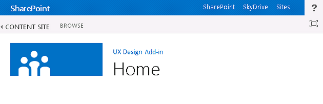
 
The add-in template is the default in Visual Studio when you create an add-in web and pages within that web.
 

 

### Using the chrome control in SharePoint Add-ins
<a name="UXGuide_ChromeControl"> </a>

If you're not building SharePoint-hosted ASPX pages, but you still want your add-in to fit in naturally with the host site that it is used from, the chrome control is the right choice. Figure 2 shows the chrome control.
 

 

**Figure 2. Chrome control in a webpage**

 

 

 

 

 

**Watch the video: SharePoint 2013 chrome control**

 

 

 

 

 

 

 

### To use the chrome control


1. Add a reference to the controls library. There are two ways to do this:
    
      - Point to the library at the root of the layouts folder, as shown in the following example.
    
  ```
  <script 
    type="text/javascript" 
    src="http://{server URL}/_layouts/15/sp.ui.controls.js">
</script>
  ```

  - Copy the library to your own website, and reference it from there.
    
     **Caution**  If you opt for this alternative your add-in will not benefit from updates to the control.
2. Add the placeholder DOM element where the control will be rendered, as shown in this example.
    
  ```
  <div id='chromeControlContainer'></div>
  ```

3. Instantiate the control.
    
  ```
  function addchromecontrol(){
    var options = {};
    options.siteTitle ="{host site title}";
    options.siteUrl = "{host URL}";
    options.appHelpPageUrl = "{help page URL}";
    options.appIconUrl = "{app icon URL}";
    options.appTitle = "add-in Title";
    nav = new SP.UI.Controls.Navigation("chromeControlContainer", options);
    nav.setVisible(true);
}
  ```

4. (Optional) If you don't want to have the title area on your page, you can remove it by running the following JavaScript code.
    
  ```
  nav.setBottomHeaderVisible(false);
  ```

The chrome control provides for two optional add-in icons: one on the top navigation bar and one in the title area. The add-in icon on the top navigation bar is 24 x 24 pixels (px), and the icon in the title area is the same size as SharePoint site icons—up to 64 px high by up to 180 px long. We recommend you use a PNG image that you have tested on white, black, gray, bright, and muted backgrounds because users and admins can change the site theme. For more information about using the chrome control, see  [Use the client chrome control in SharePoint Add-ins](use-the-client-chrome-control-in-sharepoint-add-ins.md).
 

 

### Creating a custom branded UI in SharePoint Add-ins
<a name="UXGuide_CustomUI"> </a>

If, instead of aligning to the host site's theme and fitting into the SharePoint site where your add-in is installed, you want to use your own brand inside your add-in, you will have to build your chrome from scratch. However, you should still have a "back to site" link in the upper-left corner of the page (upper-right in right-to-left [RTL] languages) that redirects the user back to the site where the add-in is installed.
 

 

## Using the host web CSS in SharePoint Add-ins
<a name="UXGuide_CSS"> </a>

By using the same styles that are used on the host web, you can ensure that your add-ins will remain consistent with the SharePoint site that they came from. The actual styles may change based on the design of the site, but by referencing the CSS file of the host web, you will know that your add-in will fit in no matter where it's installed.
 

 
To get the CSS styles from the host web, you have to reference its CSS file. You can do this in several different ways.
 

 

### To reference the host web's CSS file


1. If you're using the add-in template or add-in chrome control, this is automatically taken care of for you.
    
 
2. If you're inside the add-in web, you can use the  **CssRegistration** and **CssLink** controls to reference the CSS file by putting the following code on either your master page or ASPX page:
    
  ```HTML
  <SharePoint:CssRegistration runat="server" name="default" />
<SharePoint:CssLink runat="server />

  ```

3. You can use a <link> element to reference the CSS file by building a URL off of the host web's URL, as shown in this example.
    
  ```HTML
  <link rel="stylesheet" href="{host web URL}/_layouts/15/defaultcss.ashx" />
  ```


    If you use this approach, you have to run JavaScript in the page to get the host web's URL off the query string. Then you can insert the host web's URL into the  **link** element before you write the element to the page's DOM.
    
 
The first thing to do when you are styling your add-in is to use semantic HTML as much as possible. That means using  **H1**,  **H2**,  **H3**, and so on, for the various headings, and input tags for buttons. You should also try to use SharePoint core styles as much as possible so that when the theme of the host site changes, your add-in picks up those changes seamlessly and automatically. The following tables show how styles are used in the default theme.
 

 

**Table 1. Body text styles**


|**Example**|**Used for**|**Style**|
|:-----|:-----|:-----|
|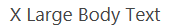|Extra large body text|.ms-textXLarge|
|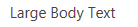|Large body text|.ms-textLarge|
|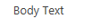|Normal body text|Inherited automatically|
||Small body text|.ms-textSmall|
||Metadata text|.ms-metadata|

**Table 2. Title and header styles**


|**Example**|**Used for**|**Style**|
|:-----|:-----|:-----|
||Main title on the page|.ms-core-pageTitle|
|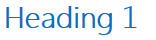|Title for dialog boxes, forms, blogs, and discussion posts. It's an alternative "primary" title for special content types or add-ins that take up the entire pagethat you want to be different from a regular wiki or Web Parts page.|H1|
||Secondary heading in relation to H1. For example, Communities uses H1 Accent for the title of a post, and H2 Accent for the best "response" to the post.|H2|
|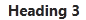|Generally a subheading under H2.|H3|
||Subheadings under H3.|H4|
|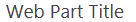|Title of the main/primary Web Part on a page, or for main section headers.|.ms-webpart-titleText|
|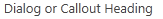|Title for headings within dialog boxes or callouts.|.ms-dlg-heading|

**Table 3. Navigation styles**


|**Example**|**Used for**|**Style**|
|:-----|:-----|:-----|
||Heading of the left navigation bar.|.ms-core-listMenu-verticalBox > .ms-core-listMenu-root > li > .ms-core-listMenu-item|
||Link in the left navigation bar.|.ms-core-listMenu-verticalBox|
||Selected item in the left navigation bar.|.ms-core-listMenu-verticalBox + .ms-accentText|
|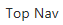|Item in the top navigation bar.||
|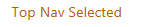|Selected item in the top navigation bar.||

**Table 4. Command styles**


|**Example**|**Used for**|**Style**|
|:-----|:-----|:-----|
|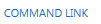|Primary action links you expect the user to take within a given container or page. For example, this would be used to style the commands underneath a callout. This will always be the same color for visited and non-visited commands.|.ms-commandLink|
|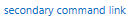|Also used to style action links, but for actions that are secondary to the content. This style is used for these secondary actions, so they don't compete with content for attention.|.ms-secondaryCommandLink|
||Links in the callout.|.ms-calloutLink|

**Table 5. Modifier styles**


|**Example**|**Used for**|**Style**|
|:-----|:-----|:-----|
||Helper class that will provide the accent color from the current theme for text.|.ms-accentText|
|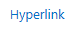|Links in the content should inherit from default hyperlink styling and behavior. Hyperlink styling applies a color and a hover effect to indicate that it's a link instead of normal text.|Inherited from using <a>.|
|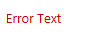|Error messages that occur in forms.|.ms-error|
||Helper class that provides a softened gray for text that should be less emphasized than normal body text.|.ms-soften|
|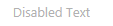|Helper class that applies the "disabled" color to text, which is used for denoting disabled states.|.ms-disabled|
||Helper class that transforms the text to all caps.|.ms-uppercase|
||Helper class to style text like forms.|.ms-helper|
||Dashed line divider that is used to divide sections in the Quick Launch and in menus.|HR|

**Table 6. Part user interface styles**


|**Example**|**Used for**|**Style**|
|:-----|:-----|:-----|
|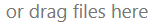|Main inline text at the top of a part.|.ms-textXLarge + .ms-soften|
|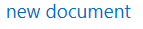|Commands in the top line of a part; at most there should be only one or two of these per part.|.ms-heroCommandLink|
||Text shown to entice the user to interact with the part when it doesn't contain data.|.ms-attractMode|
|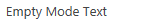|Text shown to the user when there is no data available.|.ms-emptyMode|
|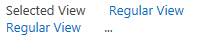|View controls, such as a pivot.|.ms-pivot-link|
|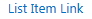|List items that are also links.|.ms-listLink|

**Table 7. Background and border styles**


|**Example**|**Used for**|**Style**|
|:-----|:-----|:-----|
||To style a rectangle that should be heavily emphasized on the page.|.ms-emphasis|
|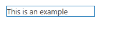|Border of an emphasized element.|.ms-emphasisBorder|
||A more subtle emphasis of an element.|.ms-subtleEmphasis|
||Commands in an element styled with ms-subtleEmphasis.|.ms-subtleEmphasisCommand|
||Disabled command in an element styled with ms-subtleEmphasis.|.ms-subtleEmphasisCommand-disabled|
|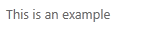|Side navigation elements.|.ms-sideNav|
||To style the selected side navigation element.|.ms-sideNav-selected|
||To emphasize an element using a border.|.ms-lines|
|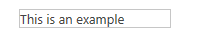|To emphasize an element using a subtle border.|.ms-subtleLines|
|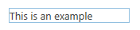|To emphasize an element using a strong or colored border.|.ms-strongLines|
|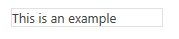|To emphasize a disabled element using a border.|.ms-disabledLines|
|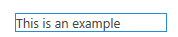|To emphasize an element using an accent border.|.ms-accentLines|
|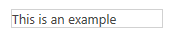|To contain pop-up windows.|.ms-popupBorder|
|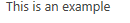|To apply an overlay on the background element.|.ms-bgOverlay|
|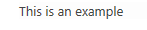|To make the background of an element appear disabled.|.ms-bgDisabled|
|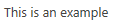|To apply the header background color.|.ms-bgHeader|
||To apply the footer background color.|.ms-bgFooter|
|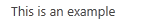|Elements that should have a highlighted color on hover. The example shows the element when the mouse is not hovering over it.|.ms-bgHoverable|
||Elements that should have a highlighted color on hover. The example shows the element when the mouse is hovering over it.|.ms-bgHoverable|
|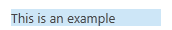|To show selection on an element.|.ms-bgSelected|
|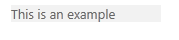|Elements in the top bar of the page.|.ms-topBar|
For more information, see  [Use a SharePoint website's style sheet in SharePoint Add-ins](use-a-sharepoint-website-s-style-sheet-in-sharepoint-add-ins.md).
 

 

## Styling common items consistently in SharePoint Add-ins
<a name="UXGuide_Styling"> </a>

To help users learn skills that translate between SharePoint and add-ins, you should style several common elements consistently.
 

 

### Internal navigation

To provide navigation within your add-in, there are two main patterns to follow: left navigation and top navigation. Which option you use depends somewhat on what the content is in the rest of your add-in. In general, left navigation will be the correct choice, particularly if you're switching between different lists, or the focus of your add-in is a master-detail view. On the other hand, if your navigation mainly switches between what could be considered different views of the same list, you could choose to use top navigation instead.
 

 
Both left navigation and top navigation have object model representations that will be styled correctly when they are set in SharePoint. Outside of SharePoint pages, you'll have to do a bit more work to create the markup for the top or left navigation yourself, and then add the appropriate CSS classes so that it's styled correctly.
 

 

### Toolbars

In many cases, you will have a small number of commands that you want to surface quickly to the user. If you are using the ribbon on your page already, the best choice is to add those commands to logical locations within the existing ribbon. However, in the case where you don't already have a ribbon on the page, it probably doesn't make sense to add one for a handful of commands. In that case, we recommend that you add a toolbar contextual to the item where the commands will apply. You should use either glyph, text styled with ms-commandLink, or both, to represent your commands on the toolbar, which should have the same background color as the rest of the page.
 

 

### Lists

Lists are a common way to represent data to users. If your add-in is using SharePoint pages, you could use the List View Web Part to represent the data to users and get the styling and interaction that comes with it. However, if you have your pages elsewhere, or you want more control over the interaction that users have with your list, you should mimic the styling of lists in SharePoint while providing your own rendering and interaction. The following are some style issues to keep in mind when you are using lists in your add-in:
 

 

-  **Views:** When representing multiple views on a single list, you should use a pivot at the top of the list, just as regular SharePoint lists do. You should never use pivots as a way of representing master-detail data.
    
 
-  **Filters:** When providing a filter on an existing list or a master-detail arrangement, you should use a sidebar that is flush with the left side of the content area and that is at least 300-pixels wide. You should also copy the SharePoint selection styling to indicate to the user which filters or items are selected.
    
 
-  **Forms:** When a user is viewing or editing a single item, you should either use the built-in SharePoint forms or mimic their styling for a consistent experience.
    
 

### Forms, dialog boxes, and callouts

There are three distinct patterns for providing the user with more information about an object, or for providing a user interface (UI) for user input: full-page forms, dialog boxes, and callouts. Whichever one you use depends on the user intent and how much information will be shown or requested.
 

 

-  **Full-page forms:** This is the best choice when you want users to enter several different pieces of information, or you want to show them a lot of structured information at one time. Full-page forms also make the most sense in scenarios where more complex interaction models, such as the ribbon, are required. In this case, you would point the user to the form page when necessary. You should make sure that there is a clear way to save or cancel their changes, by using either buttons or the ribbon. In very long forms that might require scrolling, it's a good idea to place the **Save** and **Cancel** options at both the top and bottom of the form.
    
 
-  **Dialog boxes:** These are modal UI containers that are typically used to show more information or actions in a contextual manner. They are also used for shorter forms or user input. In general, the UI that is hosted within a dialog box should be simple and well suited for a smaller rendering surface. Longer forms or more complex interaction models, such as the ribbon, are better served by full-page forms instead.
    
 
-  **Callouts:** These provide relevant contextual information and actions around a particular item. Callouts are generally used to show the user more information or actions about an item in a lightweight UI. If scrollbars or user input are necessary, the callout is probably not a good choice.
    
 

### Animation

Although animation can lead to a more vibrant and engaging experience, you should be careful to not overuse it in your UI. Animation that is done well will be hardly noticeable by the user, but it will give the impression of faster, better-performing UI. When using animation, you should make sure to respect concepts like physics and inertia and provide UI that seems natural and graceful. We strongly recommend against exaggerated animations like excessive bouncing or elasticity, or having objects fly around the screen at the slightest user action. Objects should generally take a direct path to their destination, and often will only need the first or last 10 percent of the actual change to be animated in order to give the user the sense that it has moved.
 

 

### Tabs and pivots

In SharePoint, the only place where you should use tabs is on the ribbon. Everywhere else in SharePoint should use pivots to express the concept of changing the content area.
 

 

## Office UI Fabric with SharePoint Add-ins FAQ
<a name="Fabric"> </a>

Use this FAQ to understand how to use Office UI Fabric and make your SharePoint Add-in look and feel like the rest of the Office 365.
 

 
 **1. What is Office UI Fabric?**
 

 
Office UI Fabric is a responsive, mobile-first, front-end framework that enables you to create web experiences by using the Office Design Language. It is implemented with a set of fonts and with CSS classes that provide UI components, icons, animation, and the official Office color palette. For details, see  [Office UI Fabric](https://github.com/OfficeDev/Office-UI-Fabric).
 

 
 **2. Can I use Office UI Fabric in my SharePoint Add-ins?**
 

 
Yes. Your add-in pages can reference the Office UI Fabric files in the same way that other CSS frameworks, like bootstrap, are referenced.
 

 
 **3. When should I use Office UI Fabric with SharePoint Add-ins?**
 

 
Use it when you want your add-in to have the look and feel of Office 365. It is an alternative to using the CSS file of the SharePoint host web.
 

 
 **4. How can Office UI Fabric be used in SharePoint Add-ins?**
 

 
Just add the Office UI Fabric files to your development project, and include a reference to the fabric.css library to your HTML or ASPX page. For details, see  [Getting started](https://github.com/OfficeDev/Office-UI-Fabric#get-started).
 

 
 **5. How can Office UI Fabric Components be used in SharePoint Add-ins?**
 

 
Just add a reference to the fabric.components.css library to your HTML or ASPX page. For details, see  [Getting started](https://github.com/OfficeDev/Office-UI-Fabric/blob/master/ghdocs/GETTINGSTARTED.md).
 

 
 **6. Can I use Office UI Fabric along with a SharePoint Add-in's host web CSS?**
 

 
Currently, we recommend against mixing Office UI Fabric with host web CSS. This is to prevent class name collisions and style mismatches.
 

 
 **7. Does Office UI Fabric support SharePoint themes?**
 

 
No. Office UI Fabric does not support SharePoint themes. However, applying Office UI Fabric theming will not conflict with SharePoint themes.
 

 

## Extending SharePoint UI in add-ins
<a name="UXGuide_Extending"> </a>

SharePoint allows add-ins to extend some of the existing UI, which enables you to make your add-in available in the places where users might need it. You can extend the host web's UI by using the following methods:
 

 

-  **Add-in parts:** Enable you to surface an **iframe** element to contain content from your add-in.
    
 
-  **Custom actions:** You can extend the ribbon or contextual menu through custom actions. Custom actions make your add-in available on list items or documents, or anywhere else the ribbon is shown.
    
 

### Adding add-in parts to the host web

Parts are a way for your add-in to surface some information or a small interaction point in the host web where the add-in is installed. End users can embed those parts in their pages by using the Web Part framework in SharePoint. Figure 3 shows the tag cloud part as an example of a part.
 

 

**Figure 3. Tag cloud part**

 

 

 
In Figure 3, the  **Tag Cloud from UX Design add-in** is the title of the part. The tag cloud itself is served from the add-in content, and it is hosted in an **iframe** element and fully isolated from the hosting page. Because the add-in content is using the host web's CSS file, it fits in seamlessly with the host page.
 

 
Some kinds of UI lend themselves well to being exposed through part UI. For example, you might want to provide a set of shortcuts into different experiences of your add-in, or even a single launch point that users can embed on other pages. Another use might be to show a small subset of the data in the add-in, or show the most recent changes to something. You might want to provide a small interactive zone for performing quick actions with the add-in without having to open it to do so. What type of part you provide will be driven by the scenarios your add-in supports. You should keep in mind that not all add-ins will have parts, you should only provide them if they make sense for the user experience.
 

 
The page you display inside the part will be hosted in an  **iframe**, so you should make sure that any JavaScript you write is aware of that and is smart about accessing things like the window object. Even if the rest of your add-in is heavily branded, you should consider adopting the host web's styling for your part, because it will be embedded within the host web's pages and will look jarring and unappealing if it doesn't fit in. In order to use the host web's styling, you'll have to build the link to the default CSS file manually. For more information, see  [How to: Reference the host web's CSS file](sharepoint-add-ins-ux-design-guidelines.md#UXGuide_CSSHowto) in this article. There also should not be any chrome on the page, because it will be embedded on a page that already has chrome itself.
 

 
The page has to work nicely in an  **iframe** across different domains, so you'll have to make sure that you do not specify same-origin only for X-Framing-Options of this page. By default, SharePoint pages do specify that they should only be in an **iframe** within the same domain. So for pages that are hosted in SharePoint, you'll have to opt out of that behavior for the pages you want to show in parts by adding the **AllowFraming** Web Part somewhere on the page, as shown in the following example.
 

 


```
<WebPartPages:AllowFraming ID="AllowFraming1" runat="server" />
```

Because you cannot enforce which domains your pages are iframed into, the pages you host in add-in parts are vulnerable to a clickjacking security attack. In clickjacking attacks, pages can be in an iframe on a malicious page, and users could be tricked into choosing buttons to take actions they're not aware of. When designing your page, you should be aware of this and make sure you're not exposing any functionality in the page for the part that would be dangerous if surfaced in a malicious page.
 

 
Although users can manually set a different size on your part, you are able to set a particular size for the part in the part definition. You also have the ability to request that your part is resized dynamically through  **postmessages**. By default, we recommend that your part choose sizes in increments of 30px (for example, 150px or 210px) so that when parts from different add-ins are mixed on the same page, the user can still get a sense that each of the parts was built to work in the same space. If your part is meant to mimic a tile from the getting started experience, it should have a height and width of 150px. If the part is meant to display in a side column to show details, it should have a width of 300px.
 

 
If your part displays dynamic content, it's a good idea to request a resize to reduce having scrollbars embedded within a page. The following example shows you how to use  **postmessages** to resize the part:
 

 


```
window.parent.postMessage('<message senderId={your ID}>resize(120, 300)</message>', {hostweburl});
```

In the example above, the  **senderId** value will be set on the query string of the page automatically by the add-in part code when the page is rendered. Your page would just need to read the **SenderId** value off of the query string and use it when requesting a resize. You can retrieve the host web URL from the query string by appending the **StandardTokens** or **HostUrl** tokens to the **Src** attribute in your add-in part definition.
 

 
To specify a part for the host web, you must specify a client Web Part in the feature file in the add-in package (not the feature file in the WSP in the package). You can create a part that could be configurable by the end user, such as by specifying a ZIP or postal code. The following markup specifies an add-in part, and the  **Properties** element is optional:
 

 


```XML
<ClientWebPart 
    Name="Sample Add-in Part" 
    DefaultWidth="600" 
    DefaultHeight="300" 
    Title="Sample Add-in Part" 
    Description="This is a sample part with properties.">
    <Content Type="html" Src="~appWebUrl/Pages/Part.aspx?Property1=_prop1_&amp;amp;Property2=_prop2_&amp;amp;Property3=_prop3_&amp;amp;Property4=_prop4_" />
    <Properties>
        <Property 
            Name="prop1" 
            Type="string" 
            WebBrowsable="true" 
            WebDisplayName="First Property" 
            WebDescription="Description 1" 
            WebCategory="Custom Properties" 
            DefaultValue="String Property" 
            RequiresDesignerPermission="true" />
        <Property 
            Name="prop2" 
            Type="boolean" 
            WebBrowsable="true" 
            WebDisplayName="Second Property" 
            WebDescription="Description 2" 
            WebCategory="Custom Properties" 
            DefaultValue="TRUE" 
            RequiresDesignerPermission="true" />
        <Property 
            Name="prop3" 
            Type="int" 
            WebBrowsable="true" 
            WebDisplayName="Third Property" 
            WebDescription="Description 3" 
            WebCategory="Custom Properties" 
            DefaultValue="1" 
            RequiresDesignerPermission="true" />
        <Property 
            Name="prop4" 
            Type="enum" 
            WebBrowsable="true" 
            WebDisplayName="Fourth Property" 
            WebDescription="Description 4" 
            WebCategory="Custom Properties" 
            DefaultValue="one" 
            RequiresDesignerPermission="true" >
            <EnumItems>
                <EnumItem Value="one" WebDisplayName="One" />
                <EnumItem Value="two" WebDisplayName="Two" />
                <EnumItem Value="three" WebDisplayName="Three" />
            </EnumItems>
        </Property>
    </Properties>
</ClientWebPart>
```

In your  **ClientWebPart** element, you'll want to specify the following things:
 

 

 

-  **Name:** An internal name that is used to identify the add-in; must be unique.
    
 
-  **DefaultWidth/DefaultHeight:** The default size of the Web Part. If necessary, you can resize the page inside the part.
    
 
-  **Title:** The name that is displayed to end users when they add your part to a page through the Web Part adder.
    
 
-  **Description:** The description that is shown to end users when they add your part to a page through the Web Part adder.
    
 
You can specify part properties of type  **string**,  **enum**,  **int**, and  **Boolean**. You can specify the  **toolpart** category that you want your properties to appear in by using the **WebCategory** attribute. The attributes on the **Property** element that you want to specify are as follows:
 

 

 

-  **Name:** The name used to match this property with a token on the query string to replace.
    
 
-  **WebDisplayName:** The name used in the tool part.
    
 
-  **WebCategory:** The tool part in the toolpane to add this property to.
    
 
-  **Type:** The input data type that is expected from the user. Type can be **string**,  **enum**,  **int**, or  **Boolean**.
    
 
-  **DefaultValue:** The default value for your property.
    
 
When the part is added to the page, any strings in the query string that match the pattern _propertyName_ are automatically replaced with the value of the property with that Name on the Web Part instance, or the default value if the user hasn't set it. You would then run code inside the page to parse through the query string and pull out the properties to use them in rendering and interaction on your page.
 

 
You can also choose to have the Web Part ID sent on the query string by using the _wpid_ string to represent where you want it to be replaced on the query string. This can be helpful in differentiating different part instances if you want to be able to store information about user choices or interactions on a per-instance basis. For more information, see  [Create add-in parts to install with your SharePoint Add-in](create-add-in-parts-to-install-with-your-sharepoint-add-in.md).
 

 

### Adding custom actions to the host web

If you have functionality that would make sense to surface in the context of list items or documents, or on particular ribbon tabs in the host web, you can add those to the context menu or the ribbon by using custom actions. To surface custom actions in the host web, you'll need to define them in the same kind of loose feature file in the add-in package as the one that contains  **ClientWebPart** definitions.
 

 

**Figure 4. A custom action in the contextual menu**

 

 
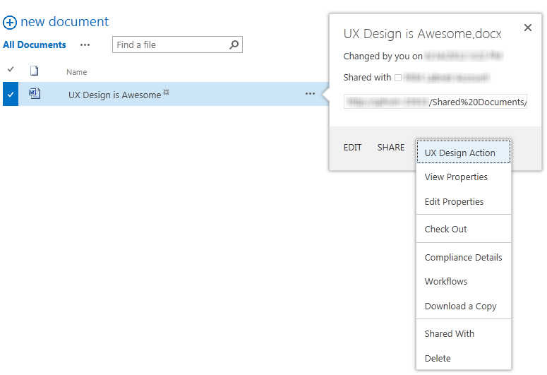
 
The code for custom actions that are surfaced in the host web is the same as in previous versions of SharePoint, with the following restrictions:
 

 

 

- The  **Location** attribute must be either **CommandUI.Ribbon** or **EditControlBlock**.
    
 
-  **CustomAction** cannot contain JavaScript:
    
      - Any  **UrlActions** or **CommandActions** must be a URL to navigate to. The URL can be parameterized with normal custom actions tokens in addition to the app-specific tokens.
    
 
  -  **EnabledScript** is not allowed in ribbon customizations.
    
 
Normally when a user chooses a custom action, it will navigate them to the URL you have specified with any tokens resolved based on their selections. However, there are some cases where you might want the user to stay in context on the page, such as for quick actions on a particular document. If you want to have your custom action open a dialog box instead of navigating, you should add the following attributes to the  **CustomAction** element.
 

 


```
HostWebDialog="TRUE"
HostWebDialogHeight="500" 
HostWebDialogWidth="500"
```

The  **HostWebDialogHeight** attribute and the **HostWebDialogWidth** attribute are optional. If the attributes are not specified, the default size for a dialog box in SharePoint will be used. In general, though, you should specify the size of your dialog box so that it looks right and doesn't use scrollbars when it is displayed to the user.
 

 
The dialog box always includes a  **Close** button in the dialog box chrome. You can also include buttons on your page that will close the dialog box and tell the originating page whether it needs to refresh. If you've done something that could be reflected in the view the user is looking at (for example: updating properties on a document), you should refresh the page. On the other hand, if you didn't update anything (for example: a "cancel" action or sending a file to an archive without updating any properties), you can tell the page that no refresh is necessary. The following examples show you how to send POST messages to close the dialog box.
 

 


```
window.parent.postMessage('CloseCustomActionDialogRefresh', '*');
window.parent.postMessage('CloseCustomActionDialogNoRefresh', '*');
```

Depending on whether you use  **CloseCustomActionDialogRefresh** or **CloseCustomActionDialogNoRefresh**, the dialog box closes, and it either refreshes the page behind it or it does not.
 

 
You cannot add a custom tab to the ribbon of the host web from your add-in. You can only add custom groups or individual controls. You should not override any of the default SharePoint ribbon controls. You should have your controls exist side-by-side with the SharePoint controls.
 

 
If you have a few controls that are related to each other, or that the user will likely associate with using your add-in, you should group them in their own custom group so that the user is more likely to find them. If, on the other hand, the functionality you're adding is more likely to be something the user considers part of the core experience of their site, you should try to fit that control into a logical spot in the existing ribbon locations. For more information, see  [Create custom actions to deploy with SharePoint Add-ins](create-custom-actions-to-deploy-with-sharepoint-add-ins.md).
 

 

## Providing a settings page for add-in configuration
<a name="UXGuide_Settings"> </a>

In many cases, it makes sense for your add-in to have some configuration information that the user can change, and to expose this information through the use of a settings page. Ideally, you can choose reasonable defaults for those settings, and users can choose to go to the settings UI only if they need to modify those defaults. In some cases, the add-in will require certain information or choices to be provided before the add-in can function. When your add-in requires information before it can function, you should provide a user experience that guides the user to the settings page to update the configuration.
 

 
You should add the settings page URL to the app's top-right menu if appropriate so that users can find it easily. If your add-in has a getting started experience or other settings, you can add those also. For more information, see  [Use the client chrome control in SharePoint Add-ins](use-the-client-chrome-control-in-sharepoint-add-ins.md).
 

 
You should also keep in mind that the user who is currently visiting the add-in might not be able to configure it. Your UI should also not assume that the current user is able to complete the configuration. Your add-in should guide the user to find the right person if they cannot configure it.
 

 

## Managing user licenses in add-ins
<a name="UXGuide_License"> </a>

If your add-in is not free, you should find a good balance between the features that are available or restricted in the trial or unlicensed modes versus the fully paid version.
 

 
If you provide a time-limited trial, the trial version should act just like the paid version during the trial period. Give users a realistic expectation of what they will get when they pay for the add-in. If you choose to restrict anything during the trial period, be very clear about how the user can get more when they pay. For unlimited trials, you should expose as much functionality as you think is needed for the user to get a good sense of the value of your add-in. Make it clear what extra benefits they would get by paying for it.
 

 
When people first see your add-in, they may not have a license for it. For example, one user might add your add-in to a team site, but forget to license anyone else. Other users on the team site would be using your add-in without a license until the license manager fixes the situation. You should make sure they get a good impression so they will be more likely to demand or buy a license. It is a good idea to always let users view and navigate through the data in your add-in. Be clear about how having a license will enable more features, but don't remind them more than once per session.
 

 
If your app's core value is in displaying data (and you don't want to give that away for free), you should show a limited subset of the data, or show the data without any interactivity. You should not block unlicensed users from viewing your add-in. Unlicensed users should get a taste of what your add-in can do for them so that they are more likely to buy it.
 

 

### Encouraging users to get a license

In the case where an unlicensed or trial license user is using your add-in, you should encourage them to get a full license. There are two ways to encourage users to get a full license:
 

 

- With a status bar at the top of the page that indicates their license state.
    
 
- In context when the user tries to access content or functionality that requires a license.
    
 
You should be very careful about overusing the second case of license warnings. It is a better experience for the user when you use the top-level status message and disable any unlicensed functionality than to let the user be unpleasantly surprised by an inability to do something. In either case, your message should be friendly and encouraging rather than stern. You should give the user a link to the storefront add-in details page for your add-in, where they can get a license.
 

 

### Licensing status bar

SharePoint has a built-in status bar that you can use on SharePoint pages by calling the JavaScript API. You can also copy the styling of the built-in status bar. You should use the yellow "warning"" color, with a message appropriate to the situation the user is in, for example:
 

 

- For users of an  **unlimited trial**: This is a trial version of _<app name>_. Go here to purchase the full version and unlock  _<paid functionality>_.
    
 
- For users of an  **unexpired time-limited trial**: There [is|are] _<amount of time, expressed in a human-readable metric like "3 days" not "73:42:12">_ left in this trial of _<app name>_. Go here to purchase the full version and ensure you don't miss a moment of full functionality.
    
 
- For users of an  **expired time-limited trial**: Unfortunately, there is no more time left in this trial of _<app name>_. Go here to purchase the full version and return to full functionality.
    
 
- For users  **without any license**: Unfortunately, you don't have a license for _<app name>_. Go here to purchase the full version and enable  _<paid functionality>_.
    
 

## Other design considerations for SharePoint Add-ins
<a name="UXGuide_Other"> </a>

In addition to what has already been explored, you should keep these things in mind when you are creating your SharePoint Add-in.
 

 

### Persisting necessary information in cookies

There will be a lot of information that your add-in will need to be able to interact with SharePoint, such as the URL of the host site or the POST message with SharePoint credentials. Persisting information in a client cookie means that your add-in doesn't have to keep requesting the information from SharePoint, which leads to a smoother, better-performing experience for the end user.
 

 

### Requesting a new OAuth token

If your add-in doesn't have credentials, you can request a new one by redirecting the user to the redirect page with your add-in ID and the URL that the user is trying to go to. The URL must be under the domain of the redirect URL that is registered for the OAuth add-in ID that you are using. The following URL is an example of how to redirect your add-in users. (Placeholders are in braces.)
 

 
 `{hostWebURL}/_layouts/15/appredirect.aspx?client_id={OAuth_app_ID}&amp;redirect_uri={redirectUrl}`
 

 

### Checking for read-only mode on SharePoint sites

Due to upgrades or site maintenance, there might be times when SharePoint is in read-only mode at the moment the user accesses your add-in. If you're going to allow the user to manipulate SharePoint data, you should make sure you don't let the user make changes that can't be saved back to the server. Disable the editing UI when in read-only mode. To check if the site is in read-only mode, you can call this API:
 

 
 `{hostWebUrl}/_api/site/ReadOnly`
 

 

## Additional resources
<a name="bk_addresources"> </a>


-  [UX design for SharePoint Add-ins](ux-design-for-sharepoint-add-ins.md)
    
 
-  [Create UX components in SharePoint 2013](create-ux-components-in-sharepoint-2013.md)
    
 
-  [Use a SharePoint website's style sheet in SharePoint Add-ins](use-a-sharepoint-website-s-style-sheet-in-sharepoint-add-ins.md)
    
 
-  [Use the client chrome control in SharePoint Add-ins](use-the-client-chrome-control-in-sharepoint-add-ins.md)
    
 
-  [Create add-in parts to install with your SharePoint Add-in](create-add-in-parts-to-install-with-your-sharepoint-add-in.md)
    
 
-  [Create custom actions to deploy with SharePoint Add-ins](create-custom-actions-to-deploy-with-sharepoint-add-ins.md)
    
 
-  [Customize a list view in SharePoint Add-ins using client-side rendering](customize-a-list-view-in-sharepoint-add-ins-using-client-side-rendering.md)
    
 

 

 

