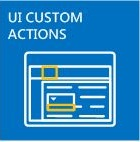

# SharePoint Add-ins

There are two basic kinds of SharePoint Add-ins: SharePoint-hosted and provider-hosted. To make the best decision about the right kind to develop for your scenario, start by learning what both types of SharePoint Add-ins have in common.

> [!NOTE]
> A device app, such as mobile app, isn't really a "SharePoint Add-in" even when it accesses SharePoint. The same is true of a web application that is launched from outside of SharePoint. If you want to develop any of these kinds of apps, see [Access SharePoint from mobile and native device apps](http://msdn.microsoft.com/library/42014171-5ee5-421d-9cde-413efc3aecef%28Office.15%29.aspx).

- **A SharePoint Add-in is a self-contained piece of functionality** that extends the capabilities of SharePoint websites to solve a well-defined business problem.

- **Add-ins don't have custom code that runs on SharePoint servers**. Instead, all custom logic moves "up" to the cloud, or "down" to client computers, or "over" to an on-premises server that is outside the SharePoint farm or SharePoint Online subscription. Keeping custom code off SharePoint servers provides reassurance to SharePoint administrators that the add-in can't harm their servers or reduce the performance of their SharePoint Online websites.

- **Business logic in a SharePoint Add-in can access SharePoint data through one of the several client APIs included in SharePoint**. Which API you use for your add-in depends on certain other design decisions you make.    
 
- **Almost all major types of SharePoint components can be part of a SharePoint Add-in**, including pages, lists, workflows, custom content types, list templates, web parts, and more.
    
- **The SharePoint websites where SharePoint Add-ins are installed, and from which users launch them, are called host webs.** The SharePoint components, however, are generally in a special child web of the host web called the add-in web.   
 
- **SharePoint Add-ins can fit into a SharePoint website in several ways**:
    
   |||
   |:-----|:-----|
   ||**As an immersive full-page experience** that can have the look and feel of a SharePoint page.|
   ||**As part of a webpage, using a special kind of control called an add-in part**, to surface an iframe element that contains the add-in.|
   ||**As UI commands that extend ribbons and menus** for lists, documents, and more.|

-  **All SharePoint Add-ins that users install get a tile on the Site Contents page of the SharePoint website.** Clicking the tile runs the add-in.

- **A SharePoint Add-in is configured using an _add-in manifest_**—an XML file that declares the add-in's basic properties, where it runs, and what SharePoint should do when the add-in starts. Among other things, the manifest can specify what languages the add-in supports, what SharePoint services and functionality it depends on, and the permissions to the host web that the add-in needs. (SharePoint Add-ins have full control of their own add-in web.)   
 
- **You distribute SharePoint Add-ins in add-in packages** that always include at least the add-in manifest. (If there are no SharePoint components, the add-in manifest may be the only thing in the add-in package.) If the add-in has SharePoint components in an add-in web, these are included in the package as a set of XML files. Remote components that are hosted outside of SharePoint, such as a remote web application or database, are not included in the package and are deployed separately from the add-in package. (However, the add-in manifest does specify the URLs of the remote components.)
 
- **Add-in packages can also include Office Add-ins.** When the SharePoint Add-in is installed, the Office Add-in is added to an Office Add-ins catalog in SharePoint. Users can install it from the catalog into Office applications such as Word or Excel.

> [!TIP]
> **Take a look at a few SharePoint Add-ins in the** [Office Store](https://store.office.com/appshome.aspx?productgroup=SharePoint) to get a sense of what you can develop. Or open a SharePoint website and install some of the free SharePoint Add-ins. Just navigate to **Site Contents \| add an add-in \| SharePoint Store**.

## A few points for veteran SharePoint developers

We've deprecated sandboxed solutions that contain custom server-side code. We still support "No code" sandboxed solutions and sandboxed solutions that contain only JavaScript.

SharePoint Add-ins don't use the server-side SharePoint object model. The client-side object models are greatly expanded in SharePoint. Although some APIs in the SharePoint server object model aren't available in the client object models, these are almost entirely administrative and security-related classes. Custom SharePoint logic that addresses these areas is more appropriate for a Windows PowerShell script or classic SharePoint farm solution. To learn how to choose among SharePoint Add-ins, classic SharePoint farm solutions, and sandboxed solutions, see [SharePoint Add-ins compared with SharePoint solutions](http://msdn.microsoft.com/library/0e9efadb-aaf2-4c0d-afd5-d6cf25c4e7a8%28Office.15%29.aspx).

## Two ways to distribute or sell an add-in package

You can distribute an add-in package in two ways:

- **To an organization's add-in catalog**, which is a dedicated SharePoint site collection in the SharePoint Online subscription or on-premises farm. This method is used when the add-in is custom-made for a particular organization. 
 
- **To the [Office Store](https://store.office.com/appshome.aspx?productgroup=SharePoint)**. The store handles the marketing process for you, from discovery to purchase to updates. Microsoft has a **Seller Dashboard** to help you sell add-ins through the Office Store.
    
After you deploy the add-in in either way, it's available for installation on the **add an add-in** page of SharePoint websites. If the add-in needs permissions to the host web or its parent subscription, SharePoint prompts the user who installs the add-in to grant those permissions.

When you need to update an add-in to fix a bug or to add functionality, make the changes and raise the add-in's version number in the add-in manifest. Then redeploy the add-in package to the store or add-in catalog. Within 24 hours, users get a notice in the SharePoint UI that an update is available. They can install the update with a single click. 

## Two types of SharePoint Add-ins: SharePoint-hosted and provider-hosted

 

### SharePoint-hosted SharePoint Add-ins

SharePoint-hosted add-ins consist almost entirely of SharePoint components in an add-in web. They are sometimes said to have their center in SharePoint.

Like all SharePoint Add-ins, a user can run a SharePoint-hosted add-in from a tile on the **Site Contents** page of the SharePoint website to which it's installed. Optionally, it can also have two other kinds of UI components in the host web: add-in parts and custom actions (that is, custom ribbon buttons or menu items). **Everything else in a SharePoint-hosted add-in is deployed to the add-in web.** These components are defined declaratively using XML files, and they can include, among others:

||||
|:-----|:-----|:-----|
|Custom pages| Workflows|Modules (sets of files)|
|List templates|List and library instances|Custom list forms and views|
|Custom content types|Web templates|Built-in columns (not custom columns)|
|Built-in web parts (not custom web parts)|JavaScript files|Custom buttons and menu items for the add-in web|

All business logic in a SharePoint-hosted add-in uses JavaScript, either directly on a custom page or in a JavaScript file that is referenced from a custom page. A JavaScript version of the SharePoint object model (JSOM) is available to make it simple for the add-in to perform CRUD (create, read, update, and delete) operations on SharePoint data.
 
Custom pages in a SharePoint-hosted add-in are generally ASP.NET pages (ASPX), and they can declaratively reference ASP.NET and in-the-box SharePoint controls, but there can be no code behind. However, you can customize the SharePoint controls by using a client-side rendering option and custom JavaScript.

The JavaScript in SharePoint-hosted add-ins can access data and resources that are outside of the add-in web by using either of two techniques for safely working around the browser's same origin policy: a special JavaScript cross-domain library or a specific JavaScript WebProxy class. Using these techniques, a SharePoint-hosted add-in can work with data on the host web, its parent subscription, or anywhere on the Internet.

### Provider-hosted SharePoint Add-ins

Any SharePoint component that can be in a SharePoint-hosted add-in can also be in a provider-hosted add-in. But provider-hosted add-ins are distinguished from SharePoint-hosted add-ins because they include at least one remote component, such as a web application, service, or database, that is hosted externally from the SharePoint farm or SharePoint Online subscription. This could be a server in the same corporate network as a SharePoint farm or a cloud service. The external components can be hosted on any web hosting stack, including the Linux, Apache, MySQL, and PHP (LAMP) stack. 

> [!NOTE]
> **The "provider" is whoever owns the server or cloud account.** It can be the same company or organization that owns the SharePoint farm or SharePoint Online tenancy where the add-in is to be installed. But the developer of the add-in can also be the provider. Typically, when an add-in is created for an organization, the organization provides the hosting. However, when an add-in is created for multiple organizations, it's more likely that the developer hosts the remote components. Developer-hosting is mandatory if the SharePoint Add-in is being marketed through the Office Store, because the developer doesn't have any contact information for the add-in purchasers. In this scenario, the various instances of the add-in know the URI of the remote component because it is specified in the add-in manifest.
 
You have complete flexibility for the hosting framework that you use for the remote components. You don't have to use a Microsoft stack. Any web hosting framework can be used, including LAMP (Linux, Apache server, MySQL, PHP), MEAN (MongoDB, ExpressJS, AngularJS, Nodejs), Java, Python, and others, and you are welcome to use non-Microsoft development tools. In addition, the remote components can be hosted in non-Microsoft cloud services.

**You can give remote pages in the add-in the look and feel of SharePoint pages** by using a special chrome control.

**Remote data can be blobs, caches, message queues, content delivery networks (CDN), and databases**, among others. And databases can be any type including relational and object-oriented. The remote data can be accessed in a variety of ways. For example, you can use Business Connectivity Services (BCS) to surface the data in a SharePoint list. Another option is to expose data in a grid on a page of a remote web application.

**SharePoint Add-ins use SharePoint APIs to connect and integrate with SharePoint** features—search, workflow, social networking, taxonomy, user profiles, BCS, and more. This lets them read documents, do searches, connect people, and perform CRUD operations. There is more than one set of the APIs:

- When the remote components are implemented with .NET, the managed code **SharePoint Client-Side Object Model (CSOM)** library is available.

- For remote components that are not based on .NET, a set of **REST/OData APIs** can be used to access SharePoint data. These can also be used from a .NET client if you prefer working with an OData interface.

- The **JSOM library**, mentioned earlier, cannot be used on a remote page, but provider-hosted add-ins can have custom SharePoint pages in an add-in web, and JavaScript on these pages can use the JSOM library.

**Provider-hosted add-ins that access SharePoint are security principals just as users and groups are**. The add-in principal has to be authenticated and authorized, just as the user does. The add-in needs permissions to perform operations on SharePoint data in the host web. In most scenarios, the effective permissions of a user working with SharePoint through a SharePoint Add-in are the intersection of the user's and the add-in's permissions, although there are some scenarios in which a user can do things with an add-in that she wouldn't otherwise have permission to do.

**Provider-hosted add-ins can connect to any internal or public web service** and, unlike SharePoint-hosted add-ins, they can **handle SharePoint list and list item events**, such as adding an item to a document library.

## Choose your SharePoint development path

Ready to get started?

- **If you are an experienced SharePoint developer, we recommend that you start with SharePoint-hosted add-ins.** They're the most similar to the kinds of SharePoint extensions that you have made in the past.
    
    [Get started creating SharePoint-hosted SharePoint Add-ins](get-started-creating-sharepoint-hosted-sharepoint-add-ins.md)
     
- **If you are an experienced ASP.NET web application developer, we recommend that you start with provider-hosted add-ins.** They're built around web applications.
    
    [Get started creating provider-hosted SharePoint Add-ins](get-started-creating-provider-hosted-sharepoint-add-ins.md)
    
- **If you want to develop a provider-hosted add-in on a non-Microsoft stack, here's how to get started:**
    
   -  Install tools that are appropriate for your stack, if you don't already have them.
 
   - Get a developer account on Office 365 for testing and debugging purposes. For details, go to  [Set up a development environment for SharePoint Add-ins on Office 365](set-up-a-development-environment-for-sharepoint-add-ins-on-office-365.md), or if you already have an Office 365 subscription, you just need to  [create a Developer Site on it](create-a-developer-site-on-an-existing-office-365-subscription.md).
    
   - Your add-in will use SharePoint's REST/OData APIs to perform CRUD operations on SharePoint data:
    
     - Find our explanatory documentation in the article [Get to know the SharePoint REST service](get-to-know-the-sharepoint-rest-service.md) and other articles to which it links.
     - Find reference documentation at [REST API reference for SharePoint](http://msdn.microsoft.com/library/3514e753-19f9-4b41-a1ae-f35c5ffc17d2%28Office.15%29.aspx).
 
   - If you are not using Visual Studio, you have to create the add-in manifest file and the add-in package. For information, see [Explore the app manifest structure and the package of a SharePoint Add-in](explore-the-app-manifest-structure-and-the-package-of-a-sharepoint-add-in.md). There are a lot of time-saving advantages to using Visual Studio and Microsoft Office Developer Tools for Visual Studio to make your manifest and package. We recommend that you consider them, even if you use another tool to create the remote web application itself. The [Community edition of Visual Studio](https://www.visualstudio.com/news/vs2013-community-vs.aspx) is free.

   - There are sample provider-hosted add-ins for some non-Microsoft languages and platforms in the [OfficeDev section of GitHub](https://github.com/OfficeDev); for example, [PHP-App-for-SharePoint](https://github.com/OfficeDev/PHP-App-for-SharePoint).

> [!NOTE]
> If you're a beginner at both SharePoint and web development, you'd benefit most by starting with the free course at Microsoft's Virtual Academy, or working through a book about SharePoint development.

## See also

- [Developing Microsoft SharePoint Server 2013 Core Solutions Jump Start](http://www.microsoftvirtualacademy.com/training-courses/developing-microsoft-sharepoint-server-core-solutions-jump-start)
- [SharePoint glossary](../general-development/sharepoint-glossary.md) 
