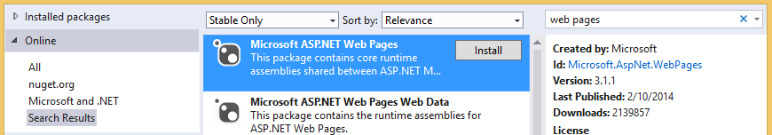

# Troubleshooting document libraries
In this topic, you can learn about problems that may occur when you access a SharePoint document library from a cloud business add-in and the techniques that you can use to resolve those problems.
 

 **Note**  The name "apps for SharePoint" is changing to "SharePoint Add-ins". During the transition, the documentation and the UI of some SharePoint products and Visual Studio tools might still use the term "apps for SharePoint". For details, see  [New name for apps for Office and SharePoint](new-name-for-apps-for-sharepoint#bk_newname).
 

 

## Error: This add-in does not support uploading documents from your current browser

When attempting to upload a document to an associated document library in a cloud business add-in, the upload fails with the error message "This add-in does not support uploading documents from your current browser. Please use the latest version". This issue only occurs on certain older browsers that don't support the HTML5 FileReader API. It can be fixed by adding a NuGet package to your project and redeploying the add-in.
 

 

### To prevent the error

1. In  **Solution Explorer**, open the shortcut menu for the  **Server** project and choose **Manage NuGet Packages**.
    
 
2. In the  **Manage NuGet Packages** dialog box, expand the **Online** node, and then in the **Search Online** box enter web pages, as shown in Figure 1.
    
    **Figure 1. Selections in the Manage NuGet Packages dialog box**

 

  
 

 

 
3. In the list of results, choose  **Microsoft ASP.NET Web Pages**, and then choose the  **Install** button.
    
    The  **License Acceptance** dialog box opens.
    
 
4. In the  **License Acceptance** dialog box, review the license terms, and if you agree to the terms choose the **I Accept** button.
    
 
5. When the package finishes installing, choose the  **Close** button.
    
 
6. Publish the updated add-in to your SharePoint site.
    
 

## Additional resources

-  [Associate a document library with an entity](associate-a-document-library-with-an-entity)
    
 

