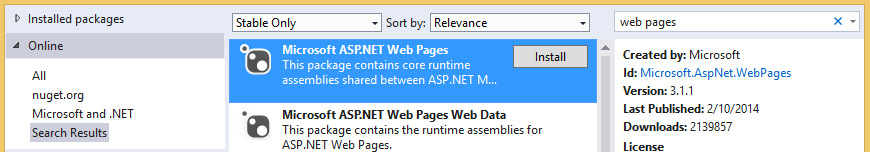

# Troubleshooting document libraries

In this topic, you can learn about problems that may occur when you access a SharePoint document library from a cloud business add-in and the techniques that you can use to resolve those problems.

## Error: This add-in does not support uploading documents from your current browser

When attempting to upload a document to an associated document library in a cloud business add-in, the upload fails with the following error message:

*"This add-in does not support uploading documents from your current browser. Please use the latest version."* 

This issue only occurs on certain older browsers that don't support the HTML5 FileReader API. It can be fixed by adding a NuGet package to your project and redeploying the add-in.

### To prevent the error

1. In **Solution Explorer**, open the shortcut menu for the **Server** project, and select **Manage NuGet Packages**.

2. In the **Manage NuGet Packages** dialog box, expand the **Online** node, and then in the **Search Online** box, enter **web pages**, as shown in Figure 1.
    
   *Figure 1. Selections in the Manage NuGet Packages dialog box*

   

3. In the list of results, select **Microsoft ASP.NET Web Pages**, and then select **Install**.

4. In the **License Acceptance** dialog box, review the license terms, and if you agree to the terms, select **I Accept**.

5. When the package finishes installing, select **Close**.

6. Publish the updated add-in to your SharePoint site.

## Additional resources

- [Associate a document library with an entity](associate-a-document-library-with-an-entity.md)
- [Develop cloud business add-ins](develop-cloud-business-add-ins.md) 
    
 

