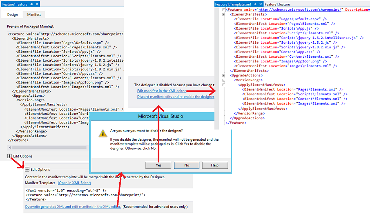

# Update add-in web components in SharePoint

Prerequisites for updating the add-in web components:

- Be familiar with [Update SharePoint Add-ins](update-sharepoint-add-ins.md) and the prerequisites and core concepts included in it.

- You have developed and tested the latest version of the add-in as described in the [Create and debug the new version as if it were a brand new add-in](update-sharepoint-add-ins.md#DebugFirst).

<a name="UpdatingAppWeb"> </a>
## Update SharePoint components in the add-in web

All of the SharePoint components that are deployed to the add-in web are contained in **Web**-scoped Features in the add-in package. For that reason, updating these components is a matter of updating one or more of the Features. This process has not changed since SharePoint 2010 and is documented in [Add Elements to an Existing Feature](http://msdn.microsoft.com/library/b007f419-e0d6-4e3a-a3ae-b8e448656d02%28Office.15%29.aspx) in the SharePoint 2010 SDK. 

Other articles in the [Upgrading Features](http://msdn.microsoft.com/library/e917f709-6491-4d50-adbe-2ab8f35da990%28Office.15%29.aspx) node may be helpful also, but consider that add-ins must not include custom code on the SharePoint server, so some aspects of Feature upgrading in SharePoint 2010 are not relevant to updating add-ins. For example, you can't use the [CustomUpgradeAction](http://msdn.microsoft.com/library/16a2182e-80aa-4184-8071-8f717ee5c572%28Office.15%29.aspx) element when you upgrade the Feature of a SharePoint Add-in.

### What can and cannot be done declaratively

With a SharePoint-hosted add-in, you can only use XML markup to update an add-in, and there are some limits on how you can declaratively change an add-in in an update. In a provider-hosted add-in, you can implement an [UpdatedEventEndpoint handler](create-a-handler-for-the-update-event-in-sharepoint-add-ins.md) to do things that can't be done declaratively.

Adding components to an add-in is easy. Any component that is eligible to be included in an add-in can also be added in an update (for details, see [Types of SharePoint components that can be in a SharePoint Add-in](host-webs-add-in-webs-and-sharepoint-components-in-sharepoint.md#TypesOfSPComponentsInApps)). But when you want to modify an existing component declaratively, consider the following points. 

- The data type of a list or content type field (column) cannot be changed after its initial deployment in any circumstance. In particular, do not change the data type of a field as part of an add-in update (*not even programmatically*). As an alternative, you can add a new field. If the add-in includes custom item create, edit, or view forms, be sure to make corresponding changes in these forms. For example, add UI for the new field and remove UI for the old one. (In a provider-hosted add-in, you can programmatically move data from the old field to the new one and then delete the old.)

- Lists, list instances, content types, or fields cannot be deleted in the update markup.

- Files cannot be deleted from the add-in web in update markup. However, you can change the contents of any file.

- The **CustomUpgradeAction** and **MapFile** elements cannot be used when updating a SharePoint Add-in, although they may appear available in Visual Studio intellisense.

### Update the add-in web for the first time

The procedures in this section explain how to add or update content types, lists, files, and other SharePoint components in the add-in web. For simplicity, we assume that all the components are part of a single Feature in the add-in web, but add-in webs can have multiple Features and you can update more than one in the same update.

The Microsoft Office Developer Tools for Visual Studio are oriented to creating new add-ins, and the default behavior of the tools is sometimes not optimal when you are updating an add-in. To get more control over the process, you should begin by disabling the Feature Designer by using the following procedure so that you can directly edit the raw feature XML. 

#### To edit the Feature XML

1. In **Solution Explorer**, open the _{FeatureName}_.features file. It opens in the Feature designer.

2. Open the **Manifest** tab and expand **Edit Options**.

3. Select **Overwrite generated XML and edit manifest in the XML editor**.

4. Select **Yes** to the prompt to disable the designer.

5. On the view that opens, select **Edit manifest in the XML editor**. The _{FeatureName}_.Template.xml file opens. 

*Figure 1. Opening the Feature XML editor*



> [!CAUTION]
> Do not add `"<!-- -->"` comments to the _{FeatureName}_.features file. Comments are not supported by the upgrade infrastructure, and the upgrade fails if comments are in the file. They are used in the markup examples of this article only to indicate to you where your markup should go.

#### To update the add-in web Feature the first time

1. Increment the **Version** attribute of the [Feature](http://msdn.microsoft.com/library/265cd648-1a7e-410f-a1d7-0da8c64b4006%28Office.15%29.aspx) element, if the Office Developer Tools for Visual Studio did not already do so when you incremented the version number in the add-in manifest (the tools don't do this in every scenario, so you need to verify). 

   You should use the same version number that you use for the add-in. You should even consider raising the Feature version when other components of the add-in are being updated, but not the add-in web Feature itself. The logic of the [VersionRange](http://msdn.microsoft.com/library/cd715e38-6ec3-43b2-8007-6d0ed8865d91%28Office.15%29.aspx) element (which is discussed in the section [Subsequent updates of the add-in web](#SubsequentUpgrades)) is easier to manage when the add-in version and the Feature version are always the same. 

2. Don't delete anything in the [ElementManifests](http://msdn.microsoft.com/library/d8d4db7e-2bc2-40c6-958b-d5683bdee87a%28Office.15%29.aspx) section of the file. Nothing is ever deleted from this section.

3. If they are not already present, add the following elements to the file: 
    
   - An [UpgradeActions](http://msdn.microsoft.com/library/5af24ac1-a290-454d-b32b-bc7f7a4634f0%28Office.15%29.aspx) child element in the **Feature** element. Do *not* add **ReceiverAssembly** or **ReceiverClass** attributes to the element. These have no use when you are updating a SharePoint Add-in. (These attributes refer to a custom assembly, which is not supported in SharePoint Add-ins. If you include a custom assembly in an add-in, SharePoint will not install the add-in.)

   - A **VersionRange** child element in the **UpgradedActions** element. Do not add **BeginVersion** or **EndVersion** attributes to the element. These serve no purpose when an add-in is being updated for the first time. Their use is discussed in the section [Subsequent updates of the add-in web](#SubsequentUpgrades).

   - An [ApplyElementManifests](http://msdn.microsoft.com/library/c087a0c3-1e27-4034-b4da-e025991454d6%28Office.15%29.aspx) child element in the **VersionRange** element.

At this point the file should resemble the following example.
    
> [!IMPORTANT]
> The Office Developer Tools for Visual Studio may have already added the above markup and copied some elements from the **ElementManifests** section to the **ApplyElementManifests** section as an illustration. *Delete these.* Although you may end up putting some of them back in later steps, it is easier and safer to start with an empty **ApplyElementManifests** section. Redundant entries for components that have not changed can have bad consequences, including possibly lengthening the update process enough that it times-out and fails.

```XML
 <Feature <!-- Some attributes omitted --> 
                Version="2.0.0.0">
   <ElementManifests>
     <!-- ElementManifest elements omitted -->
   </ElementManifests>
   <UpgradeActions>
    <VersionRange>
      <ApplyElementManifests>

      </ApplyElementManifests>
    </VersionRange>
   </UpgradeActions>
 </Feature>
```

#### To add components to the add-in

1. Add any new components to the Feature exactly as you would if you were creating a new SharePoint Add-in project.

2. When you add a component of a type that wasn't in the previous verison of the add-in, such as adding a list to an add-in that did not previously have a list, the Office Developer Tools for Visual Studio adds an elements.xml file to the project. This is the elements manifest for the component. You should add the new version number of the add-in to this file (for example, elements.2.0.0.0.xml). This can be helpful in troubleshooting. Be sure to make the change in **Solution Explorer** to ensure that references to the file, such as in the csproj file and the feature XML, are changed accordingly.

3. For each new element manifest, add an [ElementManifest](http://msdn.microsoft.com/library/5a6a2865-5d31-45a2-a402-6da6e0f5567a%28Office.15%29.aspx) element as a child to both the **ElementManifests** and the **ApplyElementManifests** elements of the feature xml (the exact same **ElementManifest** element in both places). The **Location** attribute of the element should point to the relative path of the elements.2.0.0.0.xml file. For example, if you added a list named MyCustomList, the **ElementManifest** element would look like the following:
    
    ```XML
      <ElementManifest Location="MyCustomList\elements.2.0.0.0.xml" />
    ```

4. Some kinds of components add files to the project. For example, a schema.xml file is created when you add a list; when you add a page, a page file is created. For each such file, add an [ElementFile](http://msdn.microsoft.com/library/bd43638e-8f18-4a0d-b122-1c055f97aa71%28Office.15%29.aspx) element as a child to the **ElementManifests** element (do not add it to the **ApplyElementManifests** element). The **Location** attribute should point to the relative path of the file. For example, if you added a list, the **ElementFile** element for the schema.xml would look like the following:
    
    ```XML
      <ElementFile Location="MyCustomList\Schema.xml" />
    ```

5. When you add another item of a type that was already in the previous version of the add-in, the Office Developer Tools for Visual Studio may add a reference to the new item to an existing elements manifest instead of creating a new one. For example, the standard way to add a page to an add-in web is to right-click the **Pages** node in **Solution Explorer** and then go to **Add** > **New Item** > **Page** > **Add**. The Office Developer Tools for Visual Studio will add a new **File** element to the **Pages** module in the existing elements manifest file (usually called elements.xml) rather than create a new element manifest.
    
    This is not desirable. The best practice is to avoid, when possible, editing any existing element manifest files when updating an add-in (that is, any element manifests from previous versions of the add-in). In general, new items should be in new element manifest files (which are themselves referenced in the **ApplyElementManifests** element of the Feature XML). (A few of exceptions to this practice are described later.) For example, to add a new page, take these steps:
    
   1. Create a new module named **Pages.2.0.0.0**.

   2. Remove the sample.txt file from it that the Office Developer Tools for Visual Studio added automatically.

   3. Rename the elements manifest in the new module to **elements.2.0.0.0.xml**.

   4. Right-click the **Pages.2.0.0.0** module and then go to **Add** > **New Item** > **Page** > **Add**. The new page is created, and it is referenced in the elements manifest for **Pages.2.0.0.0** instead of **Pages**.

   5. Ensure that there is an **ElementsFile** element for the new page in the **ElementManifests** element of the feature XML, and ensure that there is an **ElementManifest** element for the elements.2.0.0.0.xml file in both the **ElementManifests** and **ApplyElementManifests** sections.
    
      Another option in any situation in which Office Developer Tools for Visual Studio has changed an existing elements manifest, is to manually create a new elements.2.0.0.0.xml file and move the markup that was added to the old manifest to your new one (you can put the new one in the same **Solution Explorer** node as the old one if you want).

6. If you add a field to a content type in the Feature, add an [AddContentTypeField](http://msdn.microsoft.com/library/cb04a3ac-f41a-4ffe-aaa1-d4bf3fb6347d%28Office.15%29.aspx) element to the **VersionRange** section. Be sure to assign the correct values to the **ContentTypeId** and **FieldId** attributes. Optionally, use the **PushDown** attribute to specify whether the new field should be added to any derived content types. The following is an example.
    
    ```XML
     <VersionRange>
       <AddContentTypeField 
         ContentTypeId="0x0101000728167cd9c94899925ba69c4af6743e"
         FieldId="{CCDD361F-A3FB-40D8-A272-3A3C858F4116}"
         PushDown="TRUE" />
       <!-- Other child elements of VersionRange -->
     </VersionRange>
    ```

#### To modify existing components of the add-in

If you have changed a file that is referenced in an elements manifest file, such as a Default.aspx file, you do not have to change the **ElementFile** element for the file at all. But you do have to tell the update infrastructure to replace the old version of the file with the new one. You do this by adding an **ElementManifest** element for the module to the **ApplyElementManifests** section. 

Because there is already such an element in the **ElementManifests** section, simply copying (not moving) it to the **ApplyElementManifests** is sometimes an option, but this is only advisable if every file that is referenced in the manifest has been changed. As a general practice, you shouldn't replace an unchanged file with a copy of itself. In some scenarios this can have bad effects. For example, if the page has been configured to allow users to customize it, replacing it can cause the customizations to be removed. (If you had changed the page, you'd have to accept this consequence, but you don't want to impose this inconvenience on your customers pointlessly.)
    
1. To ensure that only the changed files in the module are replaced, create a second element manifest for the module that only references the changed files, and apply the second manifest in the **ApplyElementManifests** by following these steps:
    
   1. Right-click the module's node in **Solution Explorer** and add an XML file (not a page) named **elements.2.0.0.0.xml**.

   2.  Select the new file in **Solution Explorer** to make its property pane visible, and change the **Deployment Type** property to **ElementManifest**. This is important to ensure that the Office Developer Tools for Visual Studio handles the file properly.

   3. Copy the contents of the original manifest to the new one, and then delete from the new manifest all the [File](http://msdn.microsoft.com/library/c270e4ce-8110-4da7-b0e7-c223604bfce7%28Office.15%29.aspx) elements that correspond to files that have **not** changed.

   4. Add an **ElementManifest** element to the **ApplyElementManifests** section that references the new manifest file such as in this example.
    
       ```XML
             <ElementManifest Location="Pages\elements.2.0.0.0.xml" />
       ```

      > [!NOTE]
      > Do not delete the original manifest. The Feature XML is using both of the old and new ones. Do not copy any **ElementFile** elements from the **ElementManifests** section to the **ApplyElementManifests** section even if the file that is referenced in the **ElementFile** has been changed.
      
2. Open every element manifest file that is referenced in the **ApplyElementManifests** section and ensure that any [File](http://msdn.microsoft.com/library/c270e4ce-8110-4da7-b0e7-c223604bfce7%28Office.15%29.aspx) elements have a **ReplaceContents** attribute that is set to **TRUE**. 

   The following is an example. The Office Developer Tools for Visual Studio may have done this already, but you should verify it. Do this even for the element manifests from previous versions of the add-in. This is one of the few ways in which it is a good practice to edit an existing element manifest file.
    
    ```XML
     <Module Name="Pages">
       <File Path="Pages\Default.aspx" Url="Pages/Default.aspx" ReplaceContent="TRUE" />
     </Module>
    ```

3. Pages can have web parts embedded in them as explained in [Include a web part in a webpage on the add-in web](include-a-web-part-in-a-webpage-on-the-add-in-web.md). If you change a page that has a web part on it (or change the properties of the web part), there is an additional step: you have to add the following markup to the page to prevent SharePoint from adding a second copy of the web part onto the page. The markup should be added to the **asp:Content** element with the ID `PlaceHolderAdditionalPageHead`. (The Office Developer Tools for Visual Studio may have already added it when the page was first created, but you should verify that it is there.)
    
    ```XML
      <meta name="WebPartPageExpansion" content="full" />
    ```

   > [!NOTE]
   > If the page was configured to allow users to customize it, this markup has the side effect of removing those customizations. Users have to repeat them. If the web part was added to the page following the guidance in [Include a web part in a webpage on the add-in web](include-a-web-part-in-a-webpage-on-the-add-in-web.md), the web part markup is in the elements manifest, so changing the web part's properties is an exception to the general rule that you should not edit an element manifest file as part of an add-in update. 

4. As an alternative to changing a page, you also have the option of using redirection to a new page by using the following steps: 
    
   1. Create the new page and configure its update markup as described in the earlier procedure **To add components to the add-in**.

   2. Open the old page and remove all markup from the **asp:Content** element with the ID `PlaceHolderAdditionalPageHead`. 

   3. Add the following markup to the **asp:Content** element, and then replace _{RelativePathToNewPageFile}_ with the new path and file name. This script redirects the browser to the new page and includes the query parameters. It also keeps the old page out of the browser history.
    
       ```html
        <script type="text/javascript">
              var queryString = window.location.search.substring(1);
              window.location.replace("{RelativePathToNewPageFile}" + "?" + queryString);
        </script>
       ```

   4. Delete any other **asp:Content** elements on the page.
  
   5. If the page you are replacing is the start page for the add-in, change the **StartPage** element in the add-in manifest to point to the new page.

5. If the add-in web of the add-in contains a **CustomAction** or a **ClientWebPart**, and you modify it as part of an update, you must modify the element manifest because that is where these components are defined. (This is an exception to the general practice that you should not edit an element manifest from a previous version of the add-in when updating the add-in.) You also have to copy (not move) the **ElementManifest** element from the **ElementManifests** section to the **ApplyElementManifests** section.

#### Example of Feature XML for upgrading an add-in the first time

The following is an example of a complete _{FeatureName}_.Template.xml file for a first-time update of an add-in. The updated add-in in this example includes a modified Default.aspx file that is referenced in the `Pages\Elements.xml` file, and it deploys three new jQuery files, each of which is referenced in the `Scripts\Elements.xml` file. Note that all instances of **ElementFile** go in the **ElementManifests** section, and note how `<ElementManifest Location="Pages\Elements.xml" />` has been copied (not moved) from the **ElementManifests** section to the **ApplyElementManifests** section.

```XML
 <Feature xmlns="http://schemas.microsoft.com/sharepoint/" Title="MyApp Feature1" 
       Description="SharePoint Add-in Feature" Id="85d309a8-107e-4a7d-b3a2-51341d3b11ff" 
       Scope="Web" Version="2.0.0.0">
   <ElementManifests>
     <ElementFile Location="Pages\Default.aspx" />
     <ElementManifest Location="Pages\Elements.xml" />
     <ElementFile Location="Content\App.css" />
     <ElementManifest Location="Content\Elements.xml" />
     <ElementFile Location="Images\AppIcon.png" />
     <ElementManifest Location="Images\Elements.xml" />
     <ElementFile Location="Scripts\jquery-3.0.0.intellisense.js" />
     <ElementFile Location="Scripts\jquery-3.0.0.js" />
     <ElementFile Location="Scripts\jquery-3.0.0.min.js" />
   </ElementManifests> 
   <UpgradeActions>
       <VersionRange>      
         <ApplyElementManifests>
           <ElementManifest Location="Pages\Elements.xml" />
           <ElementManifest Location="Scripts\elements.2.0.0.0.xml" />
         </ApplyElementManifests>
       </VersionRange>
   </UpgradeActions>
 </Feature>

```

<a name="SubsequentUpgrades"> </a>
### Subsequent updates of the add-in web

When you update a SharePoint Add-in for the second (or third, and so on) time, you have to consider that some of your customers may not have made the previous updates. So if a user responds to the "update is available" prompt after your latest update is deployed to the organization's add-in catalog or to the Office Store, their instance of the add-in may be updated through multiple versions in a single update process. 

For the most part, this is exactly what should occur: you want every earlier version of the add-in updated to the latest version. But you do not always want every update action for the add-in web Feature to reoccur for every instance of the add-in. There are some update actions that should not occur multiple times on a given add-in instance. For example, if you add a field to a content type in one update, you do not want that field added again in the next update. The following procedure shows how to use the **VersionRange** element to control which update actions occur based on the version of the Feature that is being updated.

#### To change the add-in web Feature on later updates

1. Open the _FeatureName_.Template.xml file for editing as described in the procedure **To edit the Feature XML** earlier in this article, and increment the **Version** attribute of the [Feature](http://msdn.microsoft.com/library/265cd648-1a7e-410f-a1d7-0da8c64b4006%28Office.15%29.aspx) element. You should use the same version number for the Feature as you used for the add-in.
    
   For purposes of a continuing example, let's suppose that you previously updated the add-in from version 1.0.0.0 to version 2.0.0.0, and now you are updating it to version 3.0.0.0, so set the **Version** attribute to 3.0.0.0.    
 
2. Add a new **VersionRange** element under all existing **VersionRange** elements. Do *not* add a **BeginVersion** or **EndVersion** attribute to this element.    
 
3. Populate the **VersionRange** element as described in the procedure **To update the add-in web Feature the first time** earlier in this article to account for the changes that you have made in this updated version of the Feature. Whenever that procedure refers to the **ApplyElementManifests** section, treat this as referring to the **ApplyElementManifests** element that is a child of the **VersionRange** element that you just added; that is, the *lowest* one in the Feature XML file.
    
4. Go to the previous **VersionRange** element (the one you added the last time you updated the add-in—from 1.0.0.0 to 2.0.0.0 in the continuing example), and add an **EndVersion** attribute to it. You want the upgrade actions in this **VersionRange** to be applied to any versions of the add-in to which they haven't already been applied (version 1.0.0.0), but you don't want them to be reapplied to versions to which they were already applied (version 2.0.0.0). The **EndVersion** value is *exclusive*, so you set it to the lowest version to which you do *not* want the upgrade actions applied. In the continuing example, you set it to 2.0.0.0. Your file should now resemble the following.
    
     ```XML
     <Feature <!-- Some attributes omitted --> 
                    Version="3.0.0.0">
       <ElementManifests>
         <!-- ElementManifest elements omitted -->
       </ElementManifests>
       <UpgradeActions>
         <VersionRange EndVersion="2.0.0.0">
           <!--  Child elements for upgrade from 1.0.0.0 to 2.0.0.0 go here. -->
         </VersionRange>
         <VersionRange>
           <!--  Child elements for upgrade from 2.0.0.0 to 3.0.0.0 go here. -->
         </VersionRange>
       </UpgradeActions>
     </Feature>
     ```

   Each time that you upgrade the Feature, follow the same pattern. Add a new **VersionRange** for the latest update actions. Add an **EndVersion** element to the _previous_ **VersionRange** element and set it to the previous version number. In the continuing example, the file would resemble the following for the update from 3.0.0.0 to 4.0.0.0.

    ```XML
    <Feature <!-- Some attributes omitted --> 
                    Version="4.0.0.0">
      <ElementManifests>
        <!-- Child elements omitted -->
      </ElementManifests>
      <UpgradeActions>
        <VersionRange EndVersion="2.0.0.0">
            <!-- Child elements for upgrade from 1.0.0.0 to 2.0.0.0 go here. -->
        </VersionRange>
        <VersionRange EndVersion="3.0.0.0">
            <!-- Child elements for upgrade from 2.0.0.0 to 3.0.0.0 go here. -->
        </VersionRange>
        <VersionRange>
            <!-- Child elements for upgrade from 3.0.0.0 to 4.0.0.0 go here. -->
        </VersionRange>
      </UpgradeActions>
    </Feature>
    ```

   Notice that the most recent **VersionRange** element has no **BeginVersion** or **EndVersion** attributes. This ensures that the upgrade actions that go into this **VersionRange** element are applied to all previous versions of the Feature, which is what you want because all the latest changes are referenced in this **VersionRange**, and none of them have already occurred for any instance of the Feature.
    
   Notice also that the **BeginVersion** attribute is not used in any of the instances of **VersionRange**. This is because the default value for the **BeginVersion** attribute is 0.0.0.0, and that is the value that you want because you want all upgrade actions applied to every instance of the add-in that is earlier than the version that is specified in the **EndVersion** attribute.
    
   > [!IMPORTANT]
   > The **VersionRange** element determines only which versions of the Feature the upgrades are applied to. It does not determine which versions of the add-in get a notification that an update is available (the notification is triggered only by the add-in version number). Within 24 hours of a new version of the add-in being available in the organization's add-in catalog or the Office Store, every installed instance of the add-in, regardless of version, has the notification that an update is available appear on its tile in the **Site Contents** page. The **VersionRange** does not affect the new version number of the newly upgraded Feature or the newly updated add-in. Those two numbers are always changed to the latest version number, regardless of what version range the Feature was in before the upgrade. 

   > This provides another good reason to avoid using a **BeginVersion** attribute. The **BeginVersion** attribute can be used to block some upgrade actions from ever occurring on some add-in instances. But it cannot block the Feature or add-in versions from being raised to the latest version. So the use of a **BeginVersion** attribute could create a situation in which two instances of your add-in could have the same add-in version number and the same add-in web Feature version number, but have different components in their add-in webs.

<a name="VerifyDeployAppWebComp"> </a>
## Verify deployment of add-in web components

Follow these steps to verify the deployment of the add-in web Feature and its components.

### To verify the provisioning of the add-in web

1. Open the **Site Settings** page of the host web. In the **Site Collection Administration** section, select the **Site hierarchy** link.

2. On the **Site Hierarchy** page, you see your add-in web listed by its URL. Do not start it. Instead, copy the URL, and use the URL in the remaining steps.

3. Go to _URL_of_app_web_/\_layouts/15/ManageFeatures.aspx and, on the **Site Features** page that opens, verify that the Feature is a member of the alphabetical list of Features and that its status is **Active**. 

4. If your add-in web Feature includes custom site columns, open _URL_of_app_web_/\_layouts/15/mngfield.aspx and, on the **Site Columns** page that opens, verify that your new custom site columns are listed.

5. If your add-in web Feature includes any custom content types, open _URL_of_app_web_/\_layouts/15/mngctype.aspx and, on the **Site Content Types** page that opens, verify that your new content types are listed.

6. For each custom content type, and each content type to which you have added a column, select the link to the content type. On the **Site Content Type** page that opens, verify that the content type has the site columns it should have.

7. If your add-in web Feature includes any list instances, open _URL_of_app_web_/\_layouts/15/mcontent.aspx and, on the **Site Libraries and Lists** page that opens, verify that there is a **Customize "name_of_list"** link for each custom list instance.

8. For each of these custom list instances, select the **Customize "name_of_list "** link, and verify on the list settings page that the list has the expected content types and columns.
    
   > [!NOTE]
   > If there is no **Content Types** section on the page, you must enable management of content types. Select the **Advanced Settings** link and, on the Advanced Settings page, enable management of content types, and then select **OK**. You are returned to the previous page, and there is now a list of **Content Types** section.

9. Near the top of the page is the **web address** of the list. If you included sample items in your list instance definition, copy the address and paste it into the address bar of your browser, and then go to the list. Verify that the list has the sample items that you created.

## Next steps
<a name="Next"> </a>

Return to [Major steps in updating an add-in](update-sharepoint-add-ins.md#MajorAppUpgradeSteps), or go directly to one of the following articles to learn how to update the next major component of your SharePoint Add-in.

-  [Update host web components in SharePoint](update-host-web-components-in-sharepoint.md)
-  [Create a handler for the update event in SharePoint Add-ins](create-a-handler-for-the-update-event-in-sharepoint-add-ins.md)
-  [Update remote components in SharePoint Add-ins](update-remote-components-in-sharepoint-add-ins.md)

## See also
<a name="bk_addresources"> </a>

-  [Update SharePoint Add-ins](update-sharepoint-add-ins.md)
-  [Add Elements to an Existing Feature](http://msdn.microsoft.com/library/b007f419-e0d6-4e3a-a3ae-b8e448656d02%28Office.15%29.aspx) in the Microsoft SharePoint 2010 Software Development Kit (SDK).
-  [Upgrading Features](http://msdn.microsoft.com/library/e917f709-6491-4d50-adbe-2ab8f35da990%28Office.15%29.aspx) in the Microsoft SharePoint 2010 Software Development Kit (SDK).

